

# Учет агрегатного ремонта

<table><tr><td><b>Время чтения:</b> 12 мин.</td><td><b>Обновлено:</b> 21.06.2022</td></tr></table>

Источник: https://www.5systems.ru/help/uchet-agregatnogo-remonta

## Содержание

- [Введение](#введение)
- [Предварительные настройки](#предварительные-настройки)
- [Отражение агрегатного ремонта в Заказ-наряде](#отражение-агрегатного-ремонта-в-заказ-наряде)
  - [Заполнение параметров](#заполнение-параметров)
  - [Подбор связанных деталей для агрегатов](#подбор-связанных-деталей-для-агрегатов)
  - [Поиск товаров для заказ-наряда через АРМ «Корзина»](#поиск-товаров-для-заказ-наряда-через-арм-корзина)
- [Поиск заказ-нарядов по характеристике агрегата](#поиск-заказ-нарядов-по-характеристике-агрегата)
- [Использование механизма Применяемости при работе с ремонтом агрегатов](#использование-механизма-применяемости-при-работе-с-ремонтом-агрегатов)
  - [Настройка применяемости](#настройка-применяемости)
  - [Работа с применяемостью в ремонте агрегатов](#работа-с-применяемостью-в-ремонте-агрегатов)

## Введение

В программе предусмотрена возможность вести **учет ремонтных работ агрегатов** автомобиля: двигатель, коробка передач, рулевой механизм, генератор легковой и т. д.

## Предварительные настройки

Для того, чтобы вести агрегатный ремонт, необходимо:

1. Создать [вид ремонта](../../Виды%20ремонта/vidy-remonta.md) (*Администрирование → Компания → Автосервис → Виды ремонта*) с признаком *«Ремонт агрегатов»:*

   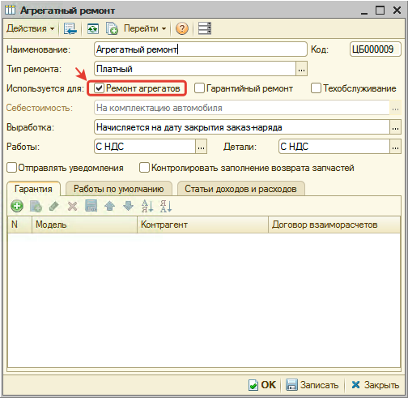

2. Создать тип(-ы) номенклатуры вида «Номерные агрегаты» и включить использование характеристик для учета серийного номера и других характеристик конкретного ремонтируемого агрегата:

   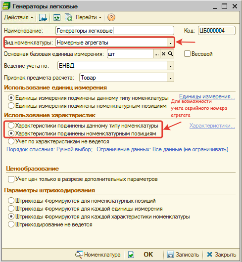

## Отражение агрегатного ремонта в Заказ-наряде

### Заполнение параметров

Для учета агрегатного ремонта в [Заказ-наряде](../../Работа%20с%20Заказ-нарядами/Заказ-наряды/zakaz-naryady.md) выберите вид ремонта с признаком «Ремонт агрегата» и в появившемся поле «Агрегат» укажите агрегат (номенклатура вида «Номерной агрегат»), ремонт которого планируется сделать.

Если у выбранного агрегата указан номер по каталогу, то он отобразится справа от поля «Агрегат».

Если у выбранного типа агрегата используются характеристики, то отобразится поле выбора характеристики агрегата, а при выборе характеристики будет виден серийный номер агрегата.

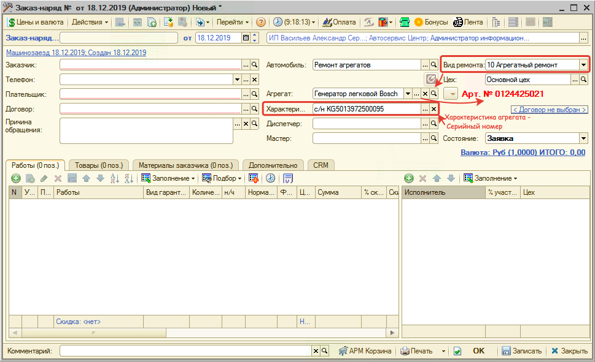

Таким образом оформляются ремонтные работы агрегата.

Если по агрегату введен серийный номер, то он отобразится в печатной форме заказ-наряда:

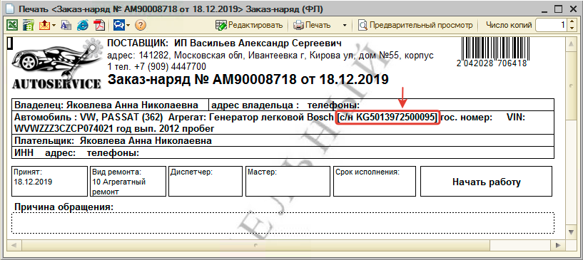

### Подбор связанных деталей для агрегатов

По выбранному агрегату можно сделать подбор связанных деталей, если эти связи уже есть. Для этого перейдите к подбору деталей агрегата:

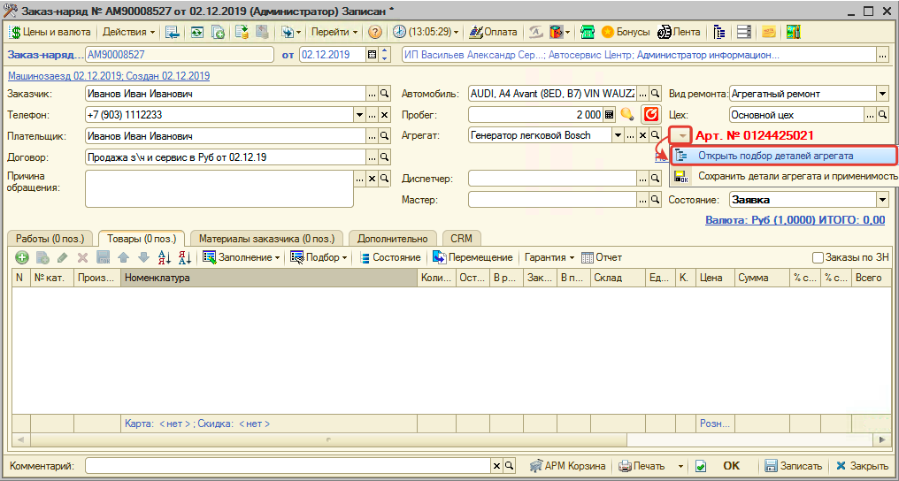

Если связи с агрегатом установлены, то откроется окно «Выбор связанной номенклатуры»:

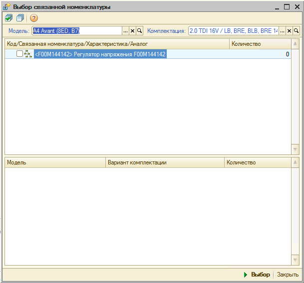

Если среди связей есть подходящие товары, то установите флажок возле них, укажите количество и нажмите кнопку «Выбрать».

В результате номенклатура отобразится в Заказ-наряде на вкладке «Товары».

Если среди связанной номенклатуры нет подходящей, то для начала необходимо [*найти товары через АРМ «Корзина»*](https://youtu.be/or6DhLIpfqU) или добавить номенклатуру вручную в Заказ-наряд.

После того, как товары добавлены в Заказ-наряд, можно привязать их к агрегату, чтобы в дальнейшем использовать для подбора. Для этого перейдите к сохранению деталей агрегата:

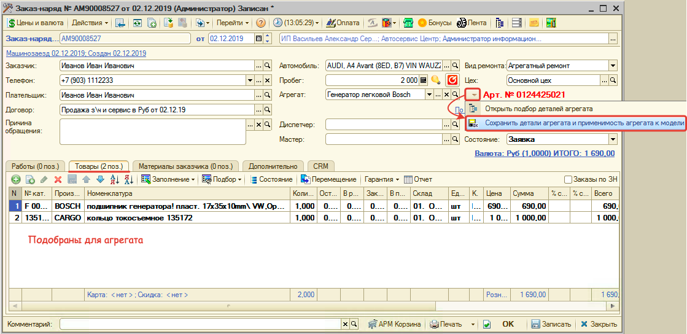

В результате вся номенклатура вкладки «Товары» Заказ-наряда привяжется к агрегату. Связи будут видны в окне подбора деталей для агрегата и в карточке агрегата:

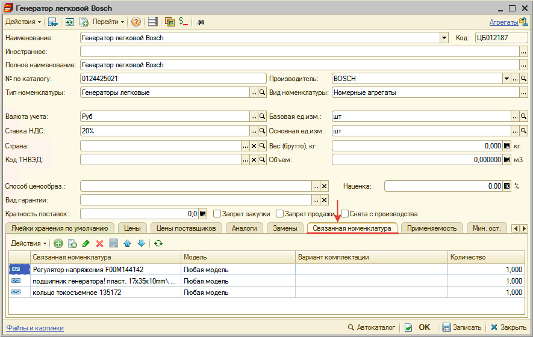

В карточке агрегата кроме просмотра связанной номенклатуры, можно отредактировать связи: добавить, изменить или удалить номенклатуру. Например, если помимо деталей агрегата в связанную номенклатуру перенесен сопутствующий товар из Заказ-наряда, то перейдите в карточку агрегата и удалите данную связь.

### Поиск товаров для заказ-наряда через АРМ «Корзина»

Перейдите в АРМ «Корзина» из Заказ-наряда:

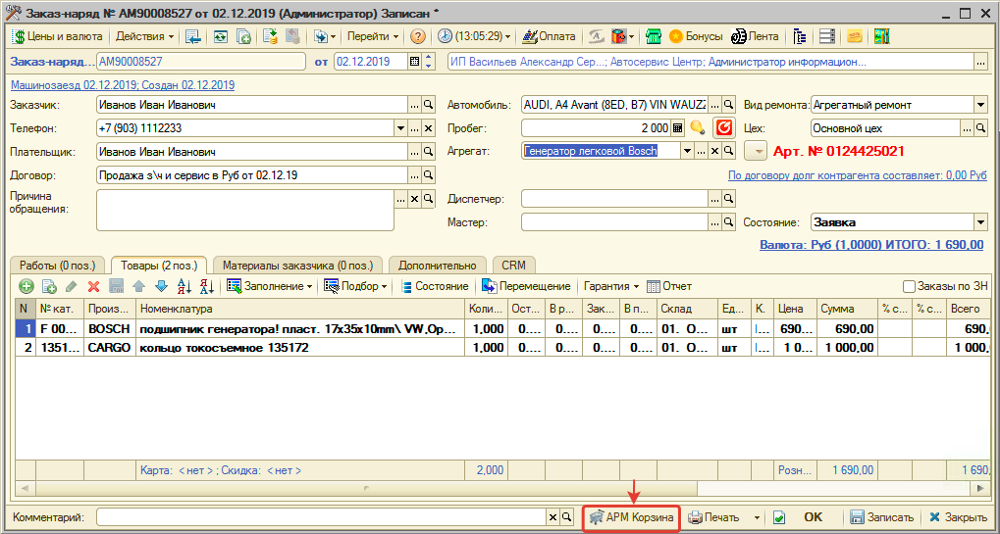

В АРМ «Корзина» автоматически будет выбран агрегат. Перейдите на вкладку *Подбор «Рабочий лист»:*

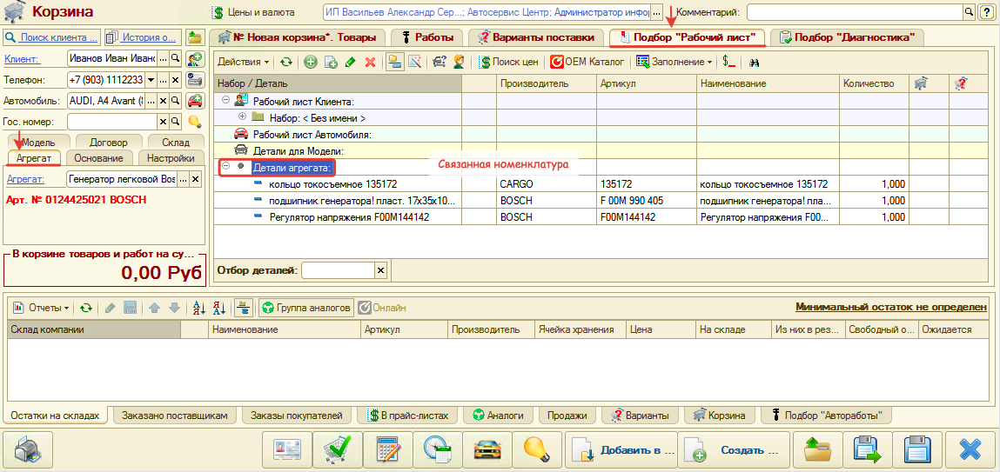

Если есть номенклатура, связанная с агрегатом, то она отобразится в рабочем листе «Детали агрегата». По связанной номенклатуре можно подобрать варианты поставки и добавить их в Корзину. Как это сделать см. [*Работа в АРМ Корзина → Добавление товаров в Корзину из Рабочего листа*](../../../Проценка%20запчастей%20и%20работ/Работа%20в%20АРМ%20Корзина/rabota-v-arm-korzina.md#добавление-товаров-в-корзину-из-рабочего-листа).

Если нет связанной с агрегатом номенклатуры, то добавьте товары в Корзину одним из способов, перечисленных в статье [*Работа в АРМ Корзина → Страница Товары*](../../../Проценка%20запчастей%20и%20работ/Работа%20в%20АРМ%20Корзина/rabota-v-arm-korzina.md#страница-товары).

Добавленные товары из Корзины перенесите в Заказ-наряд:

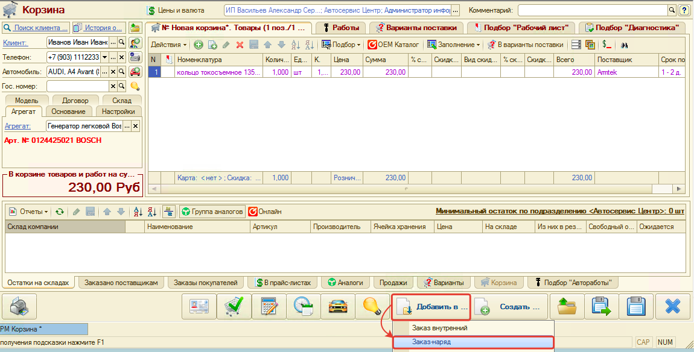

В итоге в Заказ-наряде отобразятся подобранные через Корзину товары.

## Поиск заказ-нарядов по характеристике агрегата

В списке заказ-нарядов есть возможность найти заказ-наряд по характеристике агрегата. Для этого:

1. Выберите поиск по «По характеристике агрегата».
2. В поле ввода характеристики агрегата введите серийный номер или часть серийного номера.
3. Нажмите кнопку поиска.

В результате будет предложено выбрать соответствующий поиску заказ-наряд.

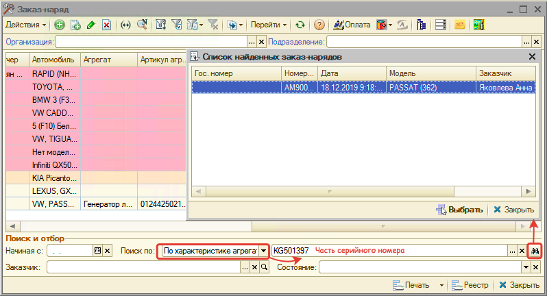

## Использование механизма Применяемости при работе с ремонтом агрегатов

*Подробно см. в статье [Применяемость для агрегатов](https://5systems.ru/help/primenyaemost-dlya-agregatov).*

Работа с механизмом осуществляется в Корзине:

- В случае создания Корзины при обращении клиента требуется выбрать агрегат.
- В случае перехода в Корзину из Заказ-наряда во вкладку «Агрегат» подтягивается значение из Заказ-наряда.

### Настройка применяемости

Для создания применяемости требуется:

1. нажать кнопку  во вкладке «Подбор “Рабочий лист”»
2. ввести артикул детали:

   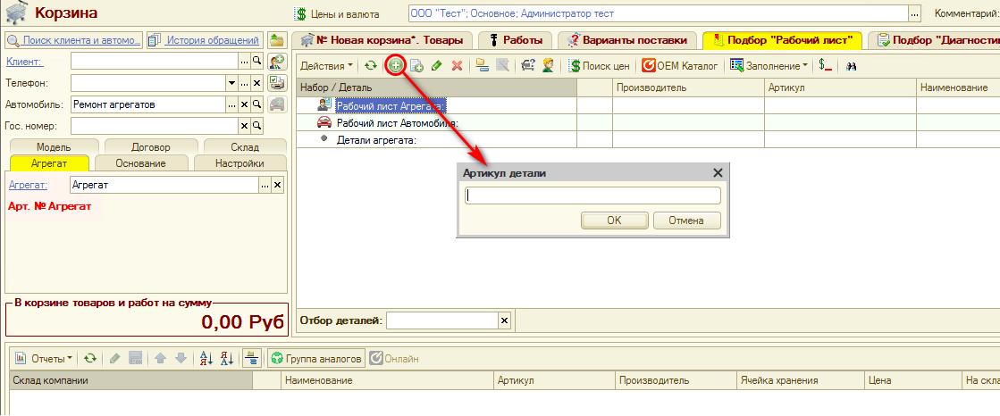

3. выбрать производителя:

   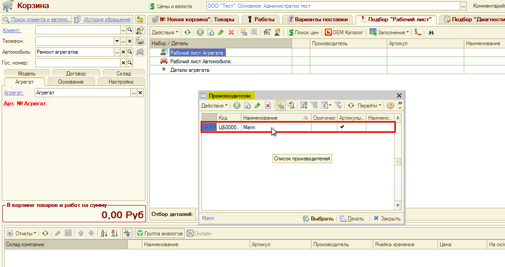

4. в справочнике «Детали применяемости» выбрать деталь или создать:

   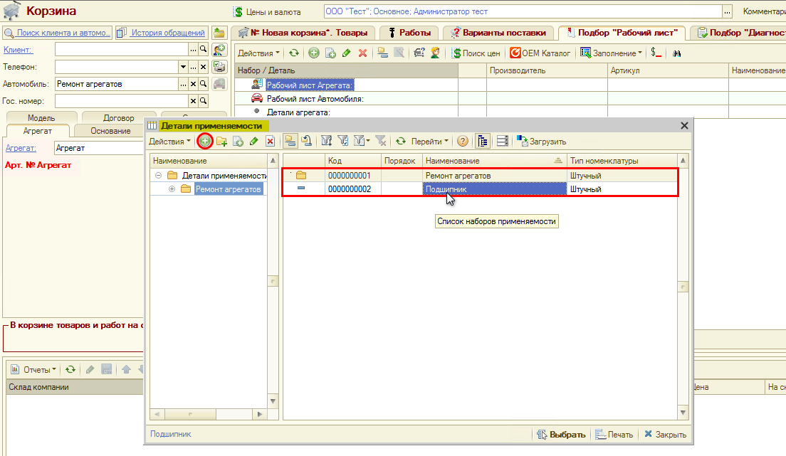

5. выбрать сторону установки детали (при необходимости):

   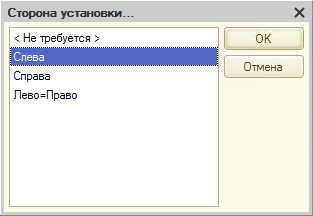

6. Открывается окно «Добавление записи»: уточнить параметры применяемости и сохранить.

   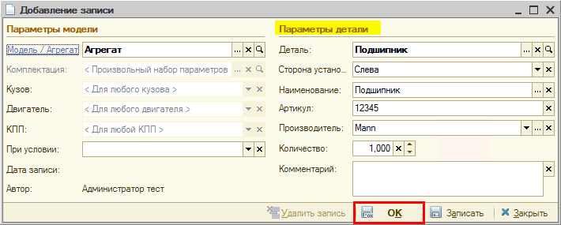

### Работа с применяемостью в ремонте агрегатов

Во вкладке Корзины «Подбор “Рабочий лист”» в дереве открывается список «Рабочий лист агрегата». В нем будут выводиться применяемые детали.

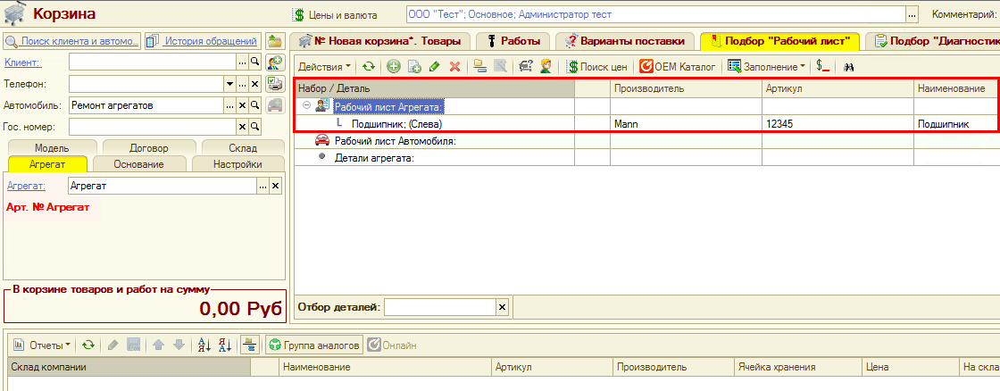

##### Остатки на складах

Если эта деталь есть в наличии на складе, то она отобразится во вкладке «Остатки на складах»:

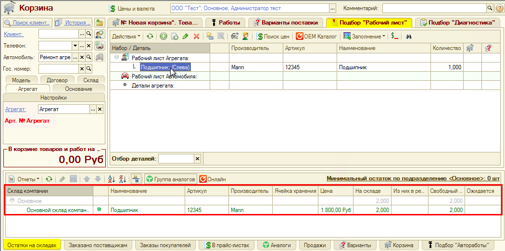

Если детали нет в наличии, то она здесь не отображается.

##### Вывод связанных работ для агрегата

Если к агрегату привязаны [автоработы](../../Автоработы/avtoraboty.md), то они отобразятся во вкладке «Подбор “Автоработы”»

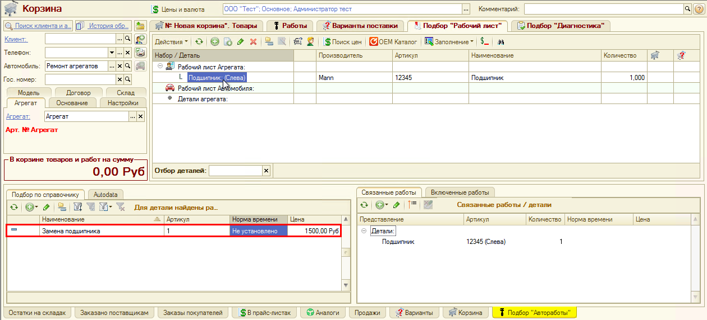

При необходимости можно создать связь детали с автоработой:

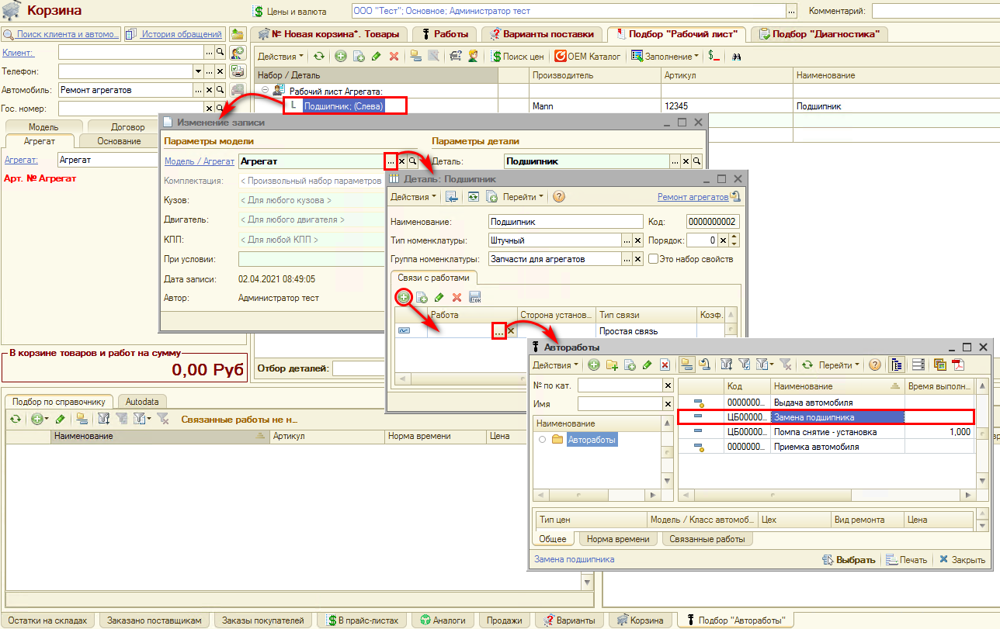

Далее можно собирать рабочий лист: выбранные детали добавятся во вкладку Корзины «Новая корзина. Товары», выбранные работы — во вкладку «Работы» соответственно.

В дальнейшем, начиная работу по данному агрегату, мы сразу будем знать, что при его ремонте может быть использована запчасть с определенным артикулом определенного производителя: ее не нужно будет заново искать.

Таким образом, данный функционал упрощает работу для поиска деталей применяемости при ремонте агрегатов.

---

**Теги:** ремонт агрегатов, номерные агрегаты, заказ-наряд, корзина, применяемость, серийный номер

