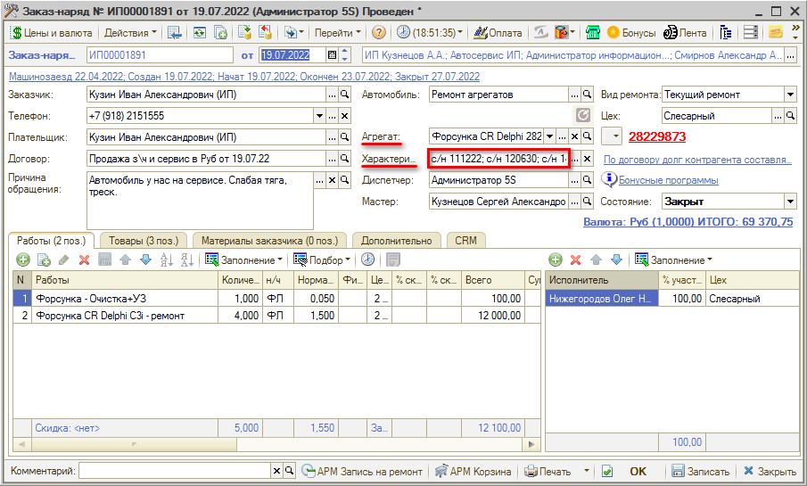
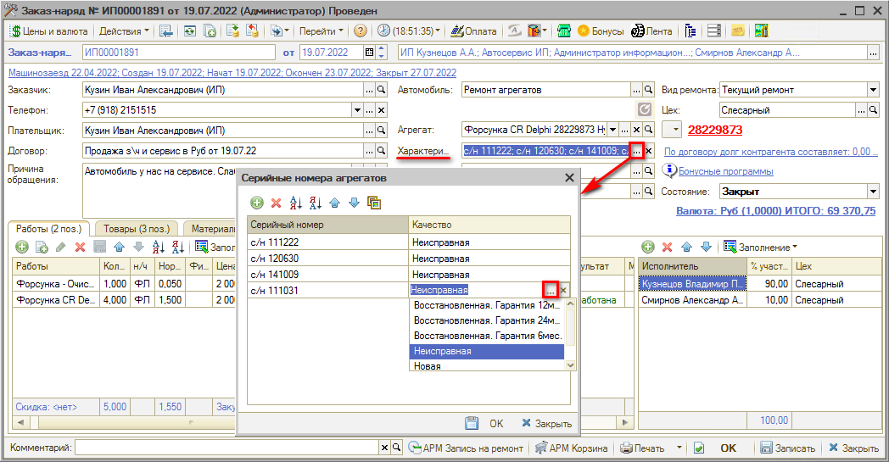
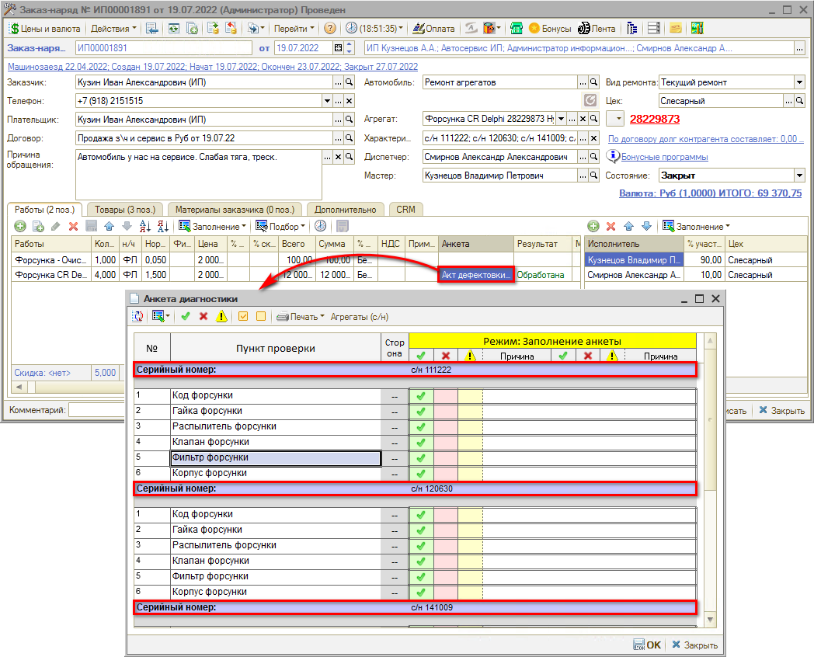
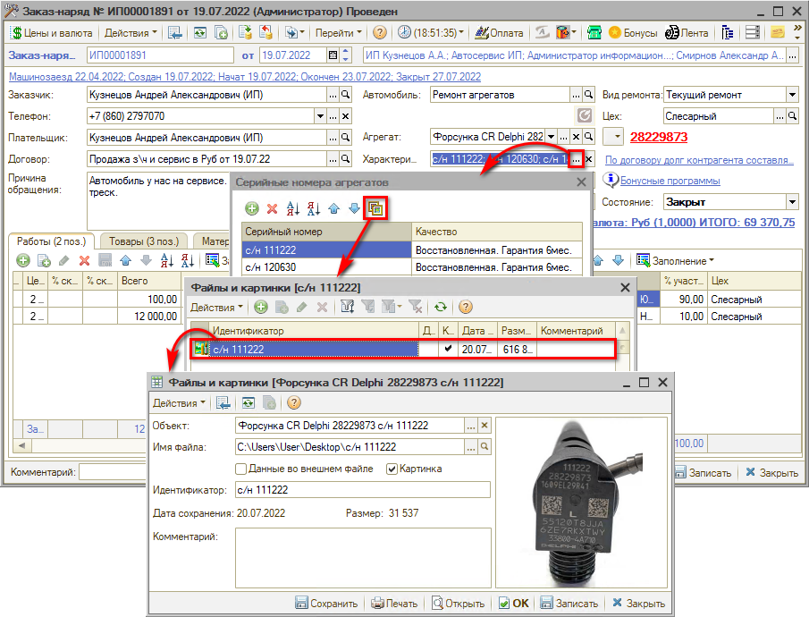

# Учет серийных номеров агрегатов

<table><tr><td><b>Время чтения:</b> 9 мин.</td><td><b>Обновлено:</b> 03.08.2022</td></tr></table>

Источник: https://www.5systems.ru/help/uchet-seriynykh-nomerov-agregatov

## Содержание

- [Введение](#введение)
- [Интерфейс для заполнения серийных номеров агрегатов](#интерфейс-для-заполнения-серийных-номеров-агрегатов)
- [Печать серийного номера в диагностической анкете](#печать-серийного-номера-в-диагностической-анкете)
- [Привязка фотографии к серийному номеру агрегата](#привязка-фотографии-к-серийному-номеру-агрегата)

## Введение

Если при ведении агрегатного ремонта ведется учет по серийным номерам, требуется в параметрах типа номенклатуры вида «Номерные агрегаты» включить использование характеристик для учета серийного номера (см. статью *«[Учет агрегатного ремонта](../Учет%20агрегатного%20ремонта/uchet-agregatnogo-remonta.md)» → Предварительные настройки → п. 2*). После включения данного параметра в Заказ-наряде отображается поле «Характеристика агрегата». В нем может быть указано несколько *серийных номеров* — если клиент принес не один, а два или несколько агрегатов (например, актуально для форсунок):

## Интерфейс для заполнения серийных номеров агрегатов

Нажатием на кнопку «Выбор»  в поле «Характеристика агрегата» открывается список серийных номеров агрегатов, которые требуется отремонтировать:

Новые элементы добавляются нажатием на кнопку «Добавить», указывается серийный номер детали, а также качество: *Неисправная*, *Восстановленная* или *Новая*.

## Печать серийного номера в диагностической анкете

При выводе на печать *Акта дефектовки* — диагностической анкеты агрегата — серийные номера выводятся в шапке анкеты, и состав диагностической анкеты дублируется для каждого серийного номера:

Подробнее см. статью *«[Диагностические анкеты для агрегатов](https://5systems.ru/help/diagnosticheskie-ankety-dlya-agregatov)»*.

## Привязка фотографии к серийному номеру агрегата

В момент, когда происходит прием агрегатов, их можно сфотографировать и привязать эти фотографии к характеристике.

Чтобы добавить фото к агрегату, следует при вводе серийных номеров в заказ-наряд нажать кнопку «Картинки и файлы» — в открывшийся список картинок и файлов, привязанный к данному серийному номеру, нажатием на кнопку «Добавить» загрузить нужное изображение:

---

**Теги:** серийный номер, агрегат, характеристика агрегата, диагностическая анкета, качество детали

