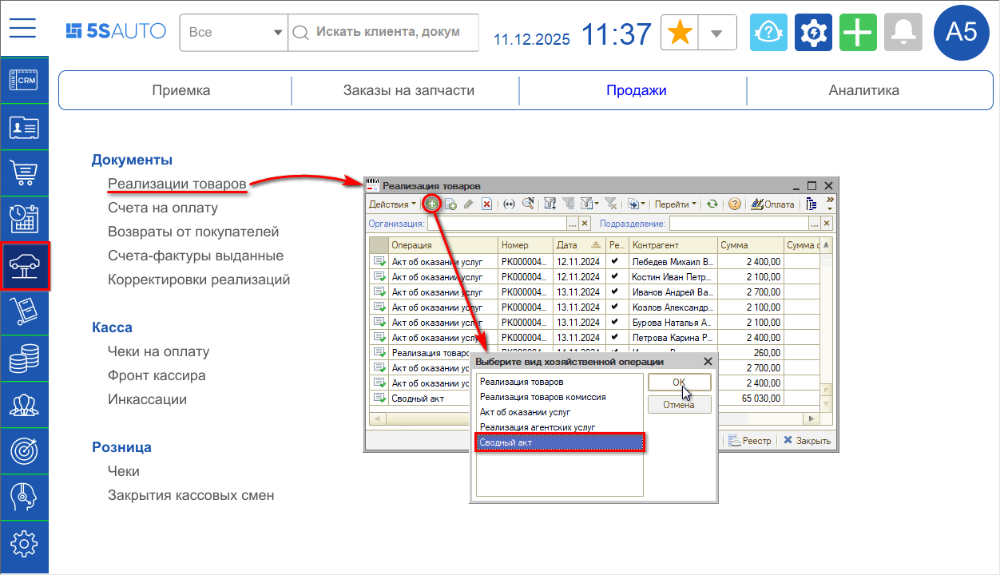
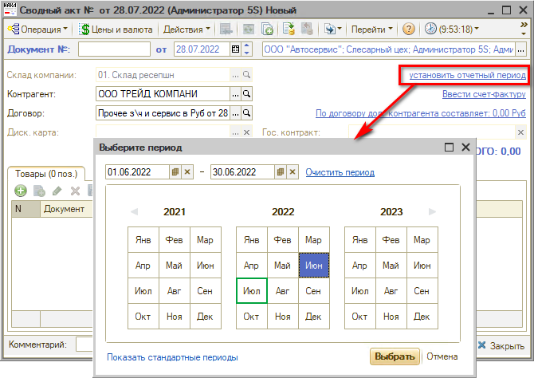
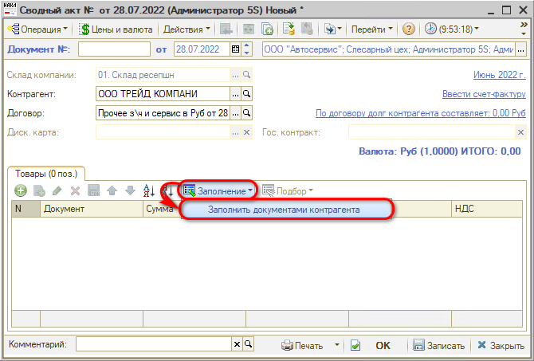
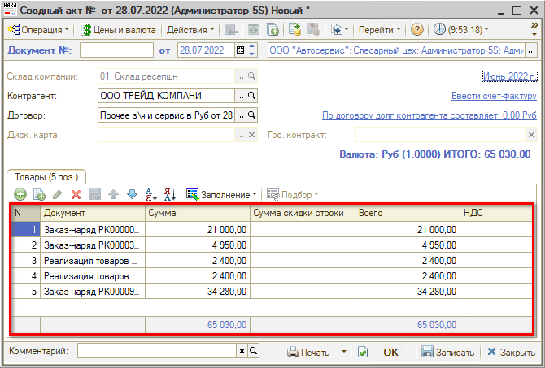
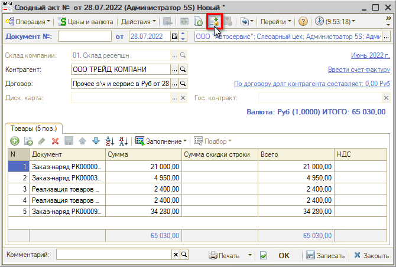
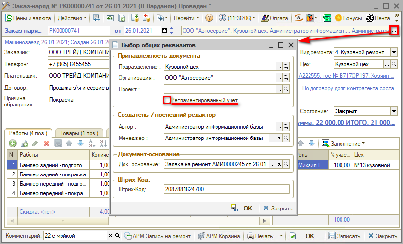
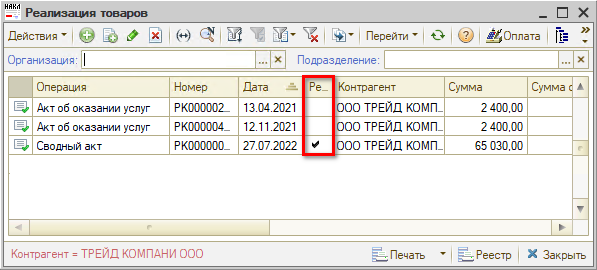
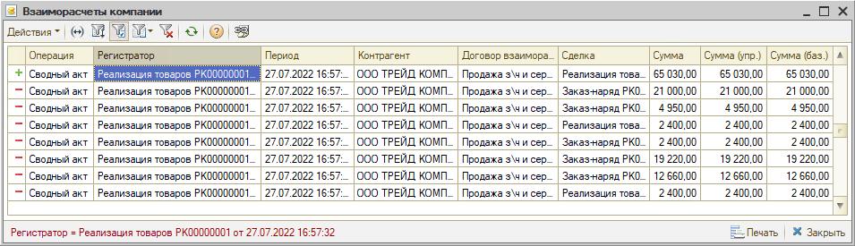
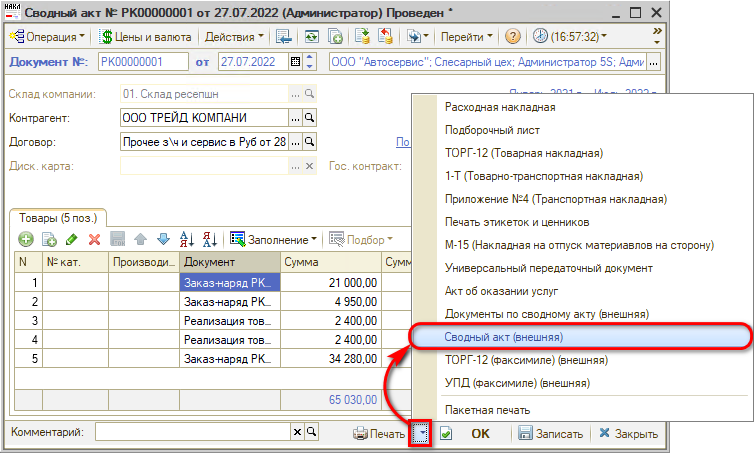
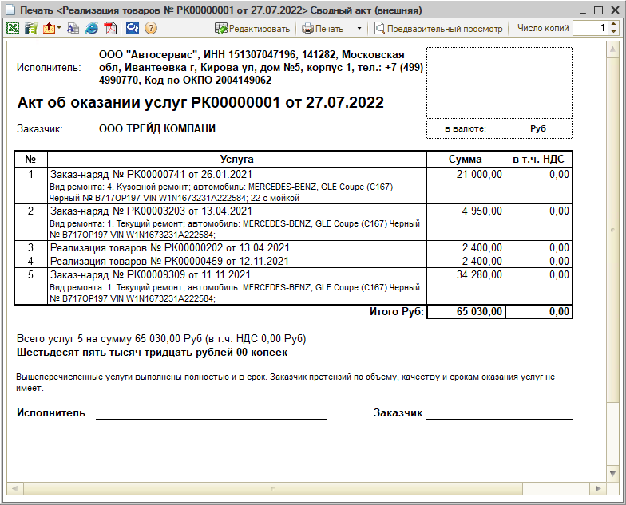

# Сводный акт

<table><tr><td><b>Время чтения:</b> 10 мин.</td><td><b>Обновлено:</b> 12.12.2025</td></tr></table>

Источник: https://www.5systems.ru/help/svodnyy-akt

## Содержание

- [Введение](#введение)
- [Создание документа](#создание-документа)
- [Печать сводного акта](#печать-сводного-акта)

## Введение

Документ **«Сводный акт»** используется для удобства ведения взаиморасчетов с корпоративными заказчиками.

Например, клиентом является парк такси: с целью сокращения документооборота вместо всех созданных за период (например, за месяц) *заказ-нарядов* и *реализаций товаров* клиенту передается один документ — Сводный акт.

## Создание документа

Для создания нового Сводного акта требуется перейти в реестр документов «Реализация товаров» через меню *Автосервис → Продажи → Документы → Реализации товаров.*

В реестре документов следует создать новый элемент нажатием на кнопку «Добавить» и выбрать вид хозяйственной операции «Сводный акт»:

В создаваемом документе следует выбрать контрагента и установить *отчетный период* — например, месяц:

В течение данного периода при работе с заказчиком создавались *реализации товаров* и *заказ-наряды* — ими необходимо заполнить создаваемый сводный акт, используя кнопку автозаполнения:

Заполнение производится по иерархии подразделений документа, таблица сводного акта заполняется заказ-нарядами и реализациями товаров:

Созданный акт необходимо провести:

После проведения сводного акта со всех документов, входящих в его состав, снимается признак «Регламентированный учет»:

Таким образом, данные документы будут отражены только в управленческом учете и не будут задействованы в обмене с «1С-Бухгалтерией» — в бухгалтерский учет должен попасть только Сводный акт:

После проведения сводного акта остатки взаиморасчетов переносятся с документов, которые вошли в состав акта, на новый созданный документ. То есть, происходит перенос долга контрагента с документов на Сводный акт, который должен будет оплатить контрагент.

## Печать сводного акта

Чтобы распечатать сводный акт, следует нажать стрелку рядом с кнопкой «Печать» и выбрать в выпадающем меню «Сводный акт (внешняя)» — внешнюю печатную форму:

В печатную форму документа выводятся реализации товаров и заказ-наряды с расшифровкой:

---

**Теги:** сводный акт, взаиморасчеты, реализация товаров, заказ-наряд, регламентированный учет

