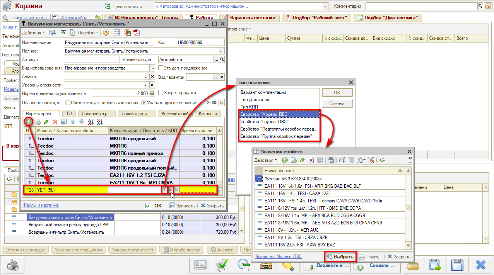
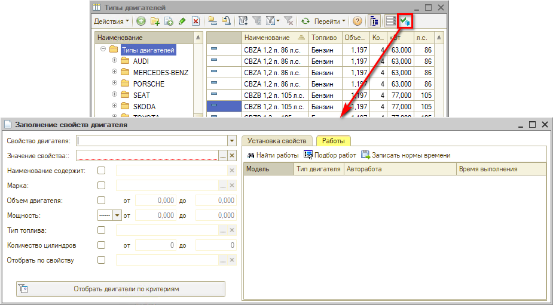
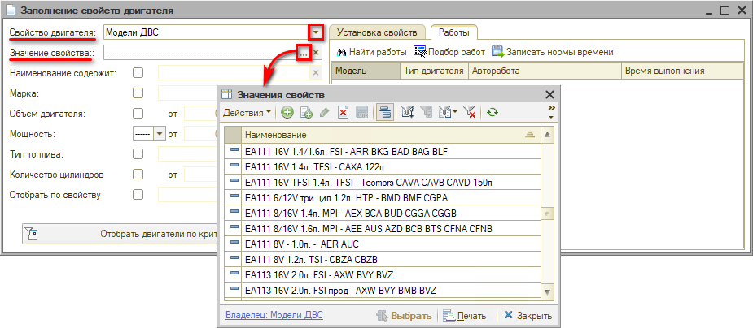
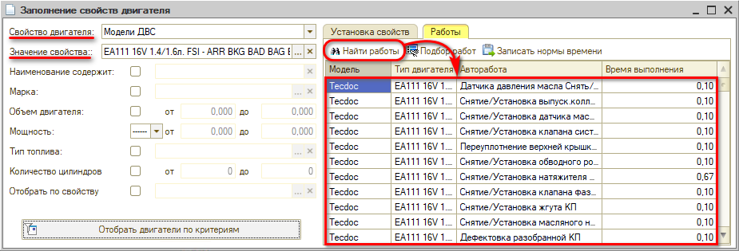
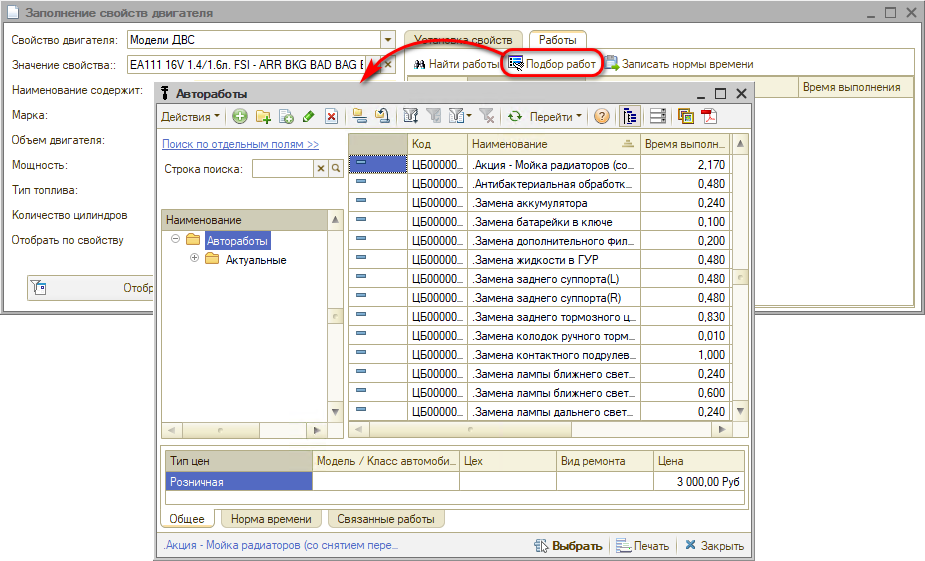
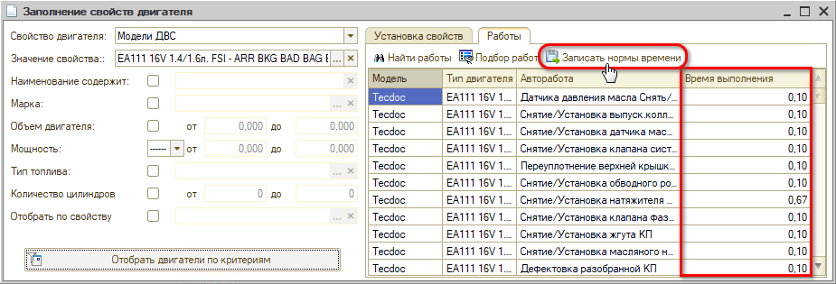
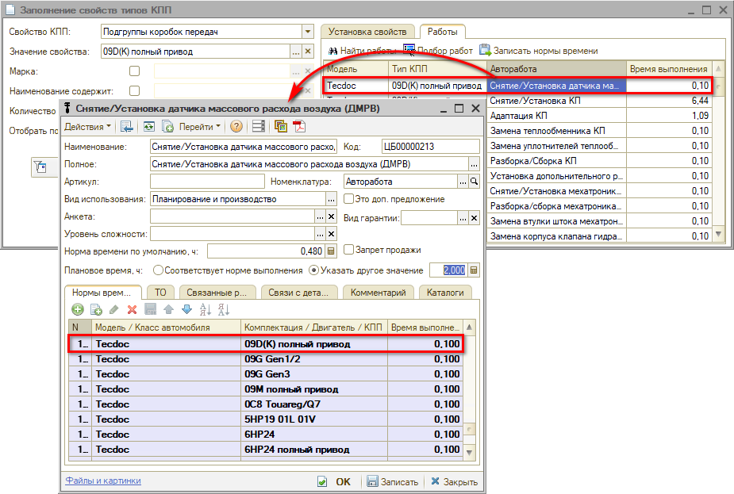
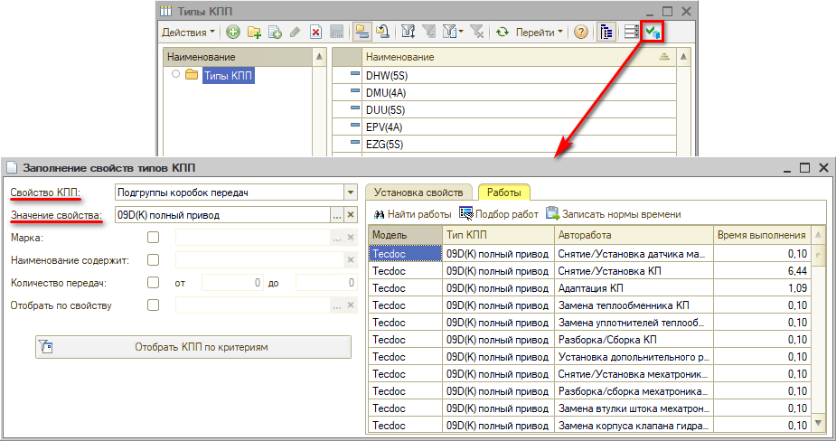

# Установка норм времени по моделям двигателей и КПП

<table><tr><td><b>Время чтения:</b> 8 мин.</td><td><b>Обновлено:</b> 12.12.2025</td></tr></table>

Источник: https://www.5systems.ru/help/ustanovka-norm-vremeni-po-modelyam-dvigateley-i-kpp

*Функционал доступен с релиза 2.3.1.1.*

## Содержание

- [Введение](#введение)
- [Установка норм времени по свойствам](#установка-норм-времени-по-свойствам)
- [Групповая установка норм времени](#групповая-установка-норм-времени)
- [Установка норм времени по типу КПП](#установка-норм-времени-по-типу-кпп)

## Введение

При установке норм времени выполнения авторабот есть возможность выбрать в качестве критерия не конкретный *тип двигателя* или *тип КПП*, а *модель* или *группу двигателей* или *КПП*. Объединение типов двигателей и КПП в модели и группы бывает целесообразным при работе с некоторыми марками автомобилей, когда разные марки имеют одинаковые двигатели, и им подходят одни и те же детали и работы (например, KIA и Hyundai, Citroën и Peugeot, ŠKODA и Volkswagen).

*Модели ДВС*, *Группы моделей ДВС*, *Модели КПП* и *Группы моделей КПП* — это свойства объектов «Тип двигателя» и «Тип КПП». Процесс *установки моделей двигателей и КПП как свойств* объектов описан в статье [*Модели двигателей и КПП*](../Модели%20двигателей%20и%20КПП/modeli-dvigateley-i-kpp.md).

## Установка норм времени по свойствам

Для того, чтобы установить норму времени по моделям и группам моделей ДВС и КПП необходимо:

1. В карточке автоработы на вкладке «Нормы времени» добавить новую строку, выбрать «Модель/Класс автомобиля»;
2. В столбце «Комплектация/Двигатель/КПП нажать кнопку «Очистить»  и «Выбрать»  — откроется окно выбора типа значения;
3. Выбрать нужное свойство, например, «Модель ДВС»;
4. В открывшемся окне выбрать нужное значение свойства:

Чтобы назначать нормы времени по свойствам, необходимо предварительно задать данные свойства: см. [*Модели двигателей и КПП*](../Модели%20двигателей%20и%20КПП/modeli-dvigateley-i-kpp.md).

## Групповая установка норм времени

Для установки норм времени по свойствам объекта *Тип двигателя* необходимо в справочнике «Типы двигателей» нажать кнопку *«Установить свойства»* и в открывшемся окне «Заполнение свойств двигателя» перейти на вкладку «Работы»:

Далее следует заполнить поля:

- *Свойство двигателя* — выбрать значение «Модель двигателя» или «Группа моделей двигателя»;
- *Значение свойства* — выбрать значение из заранее заполненного справочника:

После выбора параметров отбора следует нажать кнопку *«Найти работы»:*

Таблица будет заполнена ранее подобранными автоработами.

Также можно воспользоваться кнопкой *«Подбор работ»* — будет открыт справочник «Автоработы», где можно вручную найти и выбрать нужные автоработы, дважды кликая на каждую из них:

После автоматического или ручного заполнения таблицы автоработами следует заполнить или изменить значения в столбце *«Время выполнения»* и нажать кнопку *«Записать нормы времени»:*

В карточке каждой автоработы будет установлена новая норма времени:

## Установка норм времени по типу КПП

Нормы времени по типу КПП устанавливается аналогично, переход осуществляется через справочник «Типы КПП»:

---

**Теги:** нормы времени, модель двигателя, группа моделей двигателя, модель кпп, автоработы, свойства

