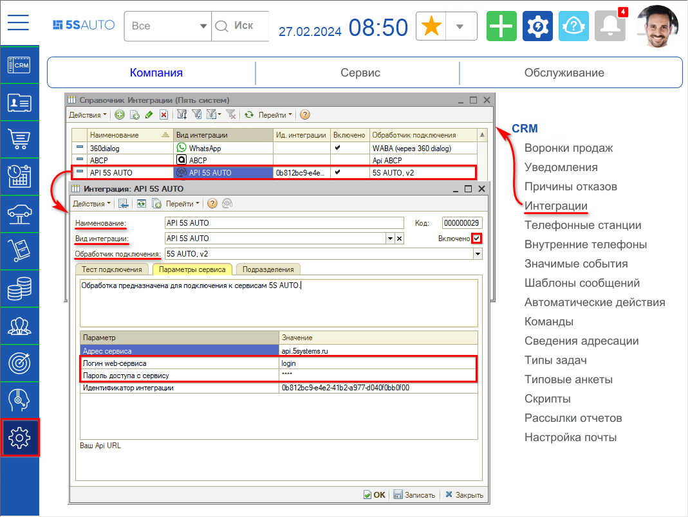
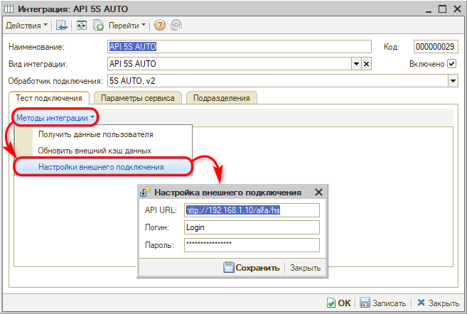
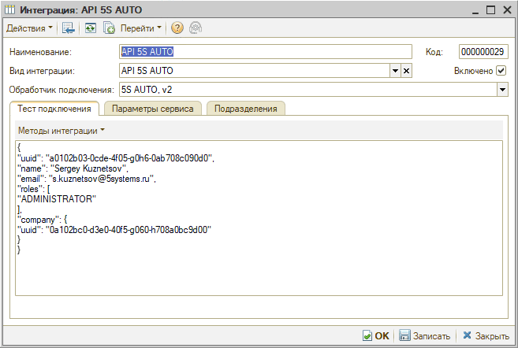
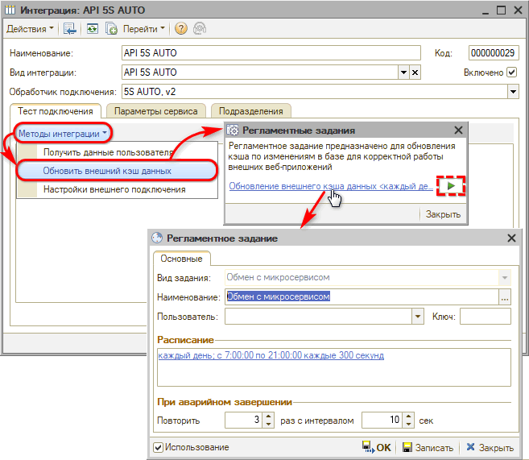
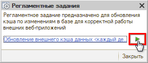

# API 5S AUTO

<table><tr><td><b>Время чтения:</b> 8 мин.</td><td><b>Обновлено:</b> 11.08.2026</td></tr></table>

Источник: https://www.5systems.ru/help/api-5s-auto

>  **Статья для технических специалистов!**

> *Актуально начиная с версии релиза 5S AUTO **2.8.4** (доступно начиная с версии **2.8.1**).*

## Содержание

1. [Введение](#введение)
2. [Шлюзы API 5S AUTO](#шлюзы-api-5s-auto)
3. [Настройка](#настройка)
   - [1. Создание интеграции](#1-создание-интеграции)
   - [2. Настройка внешнего подключения](#2-настройка-внешнего-подключения)
      - [IP-адреса компании 5SYSTEMS](#ip-адреса-компании-5systems)
   - [3. Тест подключения](#3-тест-подключения)
   - [4. Обновление внешнего кэша данных](#4-обновление-внешнего-кэша-данных)

## Введение

***API 5S AUTO** (application programming interface)* – это набор функций, через которые программа может обмениваться данными с внешними сервисами. 
Обмен данными выполняется посредством http-запросов.

Работа с API происходит как со стороны базы 1С, так и со стороны внешних систем. Например, для расшифровки VIN или гос. номера а/м программа обращается к API 5S AUTO, получает ответ и затем обрабатывает его внутри программы. Также обратно: например, сервер Telegram при получении сообщения передает данные на API 5S AUTO, и сообщение доставляется в базу 1С.

API 5S AUTO представляет собой набор шлюзов, работающих на серверах компании 5SYSTEMS. Работа каждого из них описана в формате Swagger, например, см. описание шлюза Export по ссылкам в таблице в разделе *[ниже](#шлюзы-api-5s-auto).*

Для работы с API 5S AUTO необходимо иметь активную подписку для коробочной версии программы либо действующий тариф облачной версии.

Для настройки интеграции с API требуются *логин и пароль* служебного пользователя – их необходимо запросить в техподдержке 5SYSTEMS.

## Шлюзы API 5S AUTO

В состав API 5S AUTO входят более 50 специализированных шлюзов. С некоторыми из них можно взаимодействовать напрямую пользователям:

<table><tr><td><b>Шлюз</b></td><td><b>Документация</b></td><td><b>Swagger</b>  (для тестирования)</td></tr><tr><td>Export API</td><td><a href="https://api.5systems.ru/export/v1/doc">Doc</a></td><td><a href="https://api.5systems.ru/export/v1/swagger/index.html">Swagger</a></td></tr><tr><td>Auth API</td><td><a href="https://api.5systems.ru/auth/v1/doc#tag/OpenID-Connect/paths/~1oidc~1login/post">Doc</a></td><td><a href="https://api.5systems.ru/auth/v1/swagger/index.html">Swagger</a></td></tr><tr><td>5S Dataset Api</td><td><a href="https://api.5systems.ru/Dataset/v1/doc">Doc</a></td><td><a href="https://api.5systems.ru/dataset/v1/swagger/index.html">Swagger</a></td></tr></table>

## Настройка

### 1. Создание интеграции

API 5S AUTO используется в работе многих инструментов программы:

- [загрузка накладных поставщиков](../../Склад%20и%20запчасти/Загрузка%20накладных%20поставщиков/zagruzka-nakladnykh-postavschikov.md) – для загрузки обработчиков из общего хранилища;
- расшифровка автомобилей по гос. номеру в базе [ГИБДД](../../Автосервис/Интеграция%20с%20базой%20ГИБДД/integraciya-s-bazoy-gibdd.md);
- прием онлайн-оплаты через [СБП](../../Банки%20и%20платежные%20системы/Система%20быстрых%20платежей/Работа%20с%20СБП/rabota-s-sbp.md);
- интеграция с [Telegram](../../Сообщения/Интеграция%20с%20Telegram/integraciya-s-telegram.md) (версия 3);
- интеграция с [web-приложением 5S LINK](../../Приложение%205S%20LINK/Настройка%20приложения%205S%20LINK%20v2/nastroyka-prilozheniya-5s-link-v2.md);
- распознавание товаров при [сканировании штрихкодов](../../Склад%20и%20запчасти/Штрихкодирование%20номенклатуры/Сканирование%20штрихкодов/skanirovanie-shtrikhkodov-tovarov.md);
- [подтверждение списания бонусов](../../Бонусная%20система/Подтверждение%20списания%20бонусов/podtverzhdenie-spisaniya-bonusov.md) по QR-коду клиента; 
  и др.

Для взаимодействия с API 5S AUTO необходимо создать и настроить интеграцию с данным сервисом в системе.

Сначала следует создать новый элемент справочника “Интеграции”:

На форме создания новой интеграции требуется:

1. Выбрать *вид интеграции* “API 5S AUTO”.
2. Выбрать *обработчик подключения* “5S AUTO”.
3. На вкладке *“Параметры сервиса”* необходимо ввести регистрационные данные – *логин и пароль* служебного пользователя, под которым будет происходить работа. Логин и пароль следует запросить в техподдержке 5SYSTEMS. *Параметры доступа служебного пользователя необходимо хранить в надежном месте,* т.к. под его правами можно выполнять широкий набор действий.
4. Установить галочку *“Включено”.*
5. Записать.

### 2. Настройка внешнего подключения

Суть данной настройки заключается в том, что в ней указываются параметры доступа к базе 1С с серверов API 5S AUTO.

Перейти к *настройкам внешнего подключения* следует через кнопку "Методы интеграции" на вкладке "Тест подключения".

В данном окне должны быть заполнены параметры:

- *API URL* – адрес web-сервера, на котором [опубликованы](https://infostart.ru/1c/articles/646384/) http-сервисы базы 1С. Должны быть предоставлены разрешения на подключение к этому URL-адресу с серверов компании 5SYSTEMS (IP-адреса см. *[ниже](#ip-адреса-компании-5systems)).*
- *Логин и Пароль* – авторизационные данные пользователя базы 1С, под которым будет выполняться внешнее подключение.

Адрес для подключения следует получить:

- для пользователей облачной версии – у специалистов техподдержки 5SYSTEMS;
- для пользователей коробочной версии – у штатного системного администратора.

Для проверки корректности URL-адреса следует скопировать его и открыть через адресную строку браузера – браузер запросит логин и пароль. Необходимо их ввести для проверки отсутствия ошибки входа.

#### IP-адреса компании 5SYSTEMS

IP-адреса серверов компании 5SYSTEMS:

- 178.69.191.141
- 77.93.122.98

### 3. Тест подключения

После настройки необходимо сделать *тест подключения –* на вкладке “Тест подключения” нажать кнопку *“Методы интеграции → Получить параметры пользователя”.* При успешном подключении будет выведена информация с данными пользователя:

### 4. Обновление внешнего кэша данных

Для ускорения работы некоторые данные кэшируются на серверах 5SYSTEMS. В программе реализован механизм синхронизации данных между базой 1С и внешними web-приложениями в случае их изменения на стороне программы.

Автоматическое обновление данных происходит по заданному расписанию при срабатывании *регламентного задания “Обмен с микросервисом”.* Рекомендуется запускать регламентное задание не реже 1 раза в 5 минут. Для проверки активности регламентного задания следует на вкладке "Тест подключения" перейти в *“Методы интеграции → Обновить внешний кэш данных”:*

Есть возможность запустить регламентное задание вручную – для того, чтобы обновился кэш, и внесенные настройки сразу отобразились в приложении. Для этого нужно нажать кнопку запуска:

При успешном обновлении появится служебное сообщение системы об очистке кэша.

---

**Теги:** администрирование, api, интеграция, http-сервис, ключ доступа
