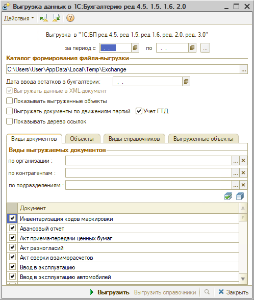
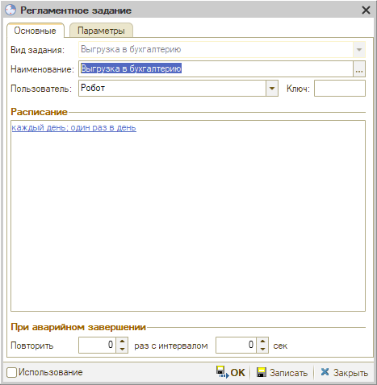
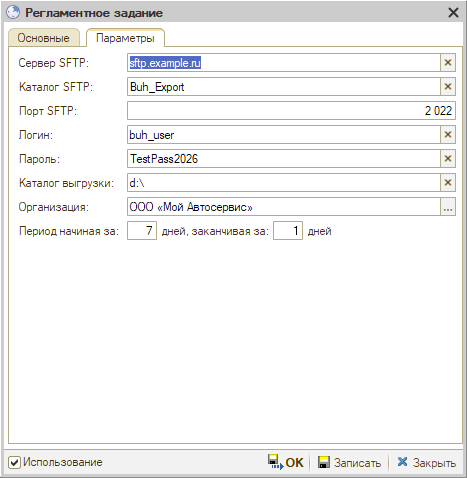

# Автоматическая выгрузка данных в 1С:Бухгалтерию

<table><tr><td><b>Время чтения:</b> 4 мин.</td><td><b>Обновлено:</b> 06.10.2026</td></tr></table>

> *Актуально начиная с версии релиза 5S AUTO **2.8.5**.*

## Содержание

- [Введение](#введение)
- [Обработка «Выгрузка данных в 1С:Бухгалтерию»](#обработка-выгрузка-данных-в-1сбухгалтерию)
  - [Параметры выгрузки](#параметры-выгрузки)
  - [Вкладки обработки](#вкладки-обработки)
- [Регламентное задание](#регламентное-задание)

## Введение

Данные из 5S AUTO можно выгружать в 1С:Бухгалтерию предприятия вручную – обработкой ***«Выгрузка данных в 1С:Бухгалтерию»*** – или автоматически, по расписанию. Для автоматической выгрузки в программе есть ***регламентное задание:*** оно выполняет ту же выгрузку, что и обработка, и сохраняет файл выгрузки на сервер ***SFTP***.

## Обработка «Выгрузка данных в 1С:Бухгалтерию»

Обработка выгружает документы для последующей загрузки в 1С:Бухгалтерию предприятия версий 4.5, 1.5, 1.6 и 2.0. Вместе с документами выгружаются справочники, которые в них указаны.

### Параметры выгрузки

- ***Период*** – за какой период выгружаются документы. Если период не задан, выгружаются документы за все время работы базы.
- ***Каталог формирования файла-выгрузки*** – папка, в которую сохраняется файл выгрузки.
- ***Дата ввода остатков в бухгалтерии*** – заполняется, если обмен с бухгалтерией начат не с начала работы, а с ввода остатков (например, на начало года). Партии, образованные раньше этой даты, не выгружаются – так остатки в бухгалтерии не задвоятся. Если ввод остатков в бухгалтерии не использовался, поле не заполняйте.
- ***«Выгружать данные в XML-документ»*** – установлен по умолчанию; выгрузка в текстовый формат не поддерживается.
- ***«Показывать выгруженные объекты»*** – после выгрузки на вкладке *«Выгруженные объекты»* выводится дерево выгруженных документов и справочников.
- ***«Выгружать документы по движениям партий»*** – вместе с выгружаемыми документами выгружаются документы, участвующие в движениях их партий, независимо от периода, организации и видов документов. Нужен при загрузке в 1С:Бухгалтерию предприятия 1.6 и 2.0 с включенным списанием с учетом партий (обработка загрузки – версии не ниже 1.2.2).
- ***«Учет ГТД»*** – документы выгружаются с номерами ГТД.
- ***«Показывать дерево ссылок»*** – показывает, где впервые встретилась ссылка на выгруженный справочник или документ: помогает понять, почему выгружен тот или иной объект.
### Вкладки обработки

- ***Виды документов*** – виды документов для выгрузки. Документы можно отобрать по организации, контрагентам и подразделениям; если отбор не задан, выгружаются документы всех организаций и всех контрагентов. Документы без реквизита *«Контрагент»* выгружаются по остальным настройкам формы.
- ***Объекты*** – отдельные документы или элементы справочников для выгрузки.
- ***Виды справочников*** – справочники для выгрузки: *«Банки»*, *«Банковские счета»*, *«Валюты»*, *«Контрагенты»*, *«Статьи ДДС»*, *«Номенклатура»*, *«Договоры взаиморасчетов»*, *«Сотрудники»*. Можно выгрузить информацию по конкретной организации – она выбирается в графе *«Организация»*. *«Банковские счета»* выгружаются только вместе с *«Банками»* и *«Валютами»*, *«Договоры взаиморасчетов»* – только вместе с *«Контрагентами»* и *«Валютами»*. Если не выбран ни один справочник, выгрузка останавливается с сообщением об ошибке. Дополнительно:
  - ***«Выгружать справочники для нахождения соответствия»*** – выгрузка для проверки, есть ли справочники в таблице соответствий при загрузке в 1С:Бухгалтерию предприятия 1.6 и 2.0;
  - ***«Выгружать справочники по ссылкам»*** – вместе с выбранными справочниками выгружаются связанные с ними.
- ***Выгруженные объекты*** – выгруженные документы и элементы справочников.

Чтобы выгрузить данные, нажмите ***«Выгрузить»***.

## Регламентное задание

Регламентное задание ***«Выгрузка в бухгалтерию»*** по расписанию выгружает данные так же, как обработка, и сохраняет файл выгрузки на сервер SFTP. Настроек видов документов, справочников и флажков, как в обработке, у задания нет – выгружаются все данные.

Регламентное задание открывается только в АРМ ***«Администратор»*** – в списке фоновых заданий. Перейти к нему можно:

**1.** Через меню интерфейса: *Администрирование → Обслуживание → Регламентные операции → Фоновые задания*. 
**2.** Через верхнее меню: *Сервис → Установка прав и настроек*, вкладка *«Фоновые задания»*.

В списке найдите и откройте задание ***«Выгрузка в бухгалтерию»***. Пример перехода к фоновым заданиям – в статье «[Настройка полнотекстового поиска](https://kb.5systems.ru/articles/5s-auto/administrirovanie-i-nastroyka-sistemy/nastroyka-polnotekstovogo-poiska)».

> 🛠 Комментарий для черновика: *скриншоты регламентного задания сделаны в базе Юрия, в latest на 06.10.2026 его нет.*

На вкладке ***«Основные»*** задается ***расписание*** (по ссылке в блоке *«Расписание»*, например *«каждый день; один раз в день»*), пользователь, от имени которого выполняется задание (*«Робот»*), и сколько раз повторить запуск при аварийном завершении.

На вкладке ***«Параметры»*** задаются параметры выгрузки:

- ***Сервер SFTP***, ***Порт SFTP*** – адрес сервера и порт подключения;
- ***Каталог SFTP*** – папка на сервере, в которую сохраняется файл выгрузки;
- ***Логин***, ***Пароль*** – учетные данные для подключения к серверу SFTP;
- ***Каталог выгрузки*** – папка на сервере 1С, в которой сохраняются файлы выгрузки, – так выгрузку можно контролировать. Если каталог не указан, файлы формируются во временном каталоге и удаляются после завершения регламентного задания;
- ***Организация*** – организации, по которым выгружаются данные;
- ***Период начиная за … дней, заканчивая за … дней*** – за какой период выгружаются данные при каждом запуске, в днях от текущей даты: выгрузка начинается с начала дня N дней назад и заканчивается в конце дня M дней назад (0 – текущий день). Например, при значениях 7 и 1 выгружаются данные за 7 предыдущих дней без текущего, при значениях 0 и 0 – только за текущий день.

Чтобы включить автоматическую выгрузку, установите флажок ***«Использование»*** и сохраните настройки кнопкой ***«ОК»*** или ***«Записать»***.

Подробнее об обмене с бухгалтерией – в методическом пособии на странице «[Материалы для обмена с 1С Бухгалтерия](https://kb.5systems.ru/articles/5s-auto/prochee/materialy-dlya-obmena-s-1s-bukhgalteriya)».

---

**Теги:** 1С:Бухгалтерия, выгрузка в бухгалтерию, обмен с бухгалтерией, регламентное задание, SFTP, автоматическая выгрузка, XML, ГТД, партии
