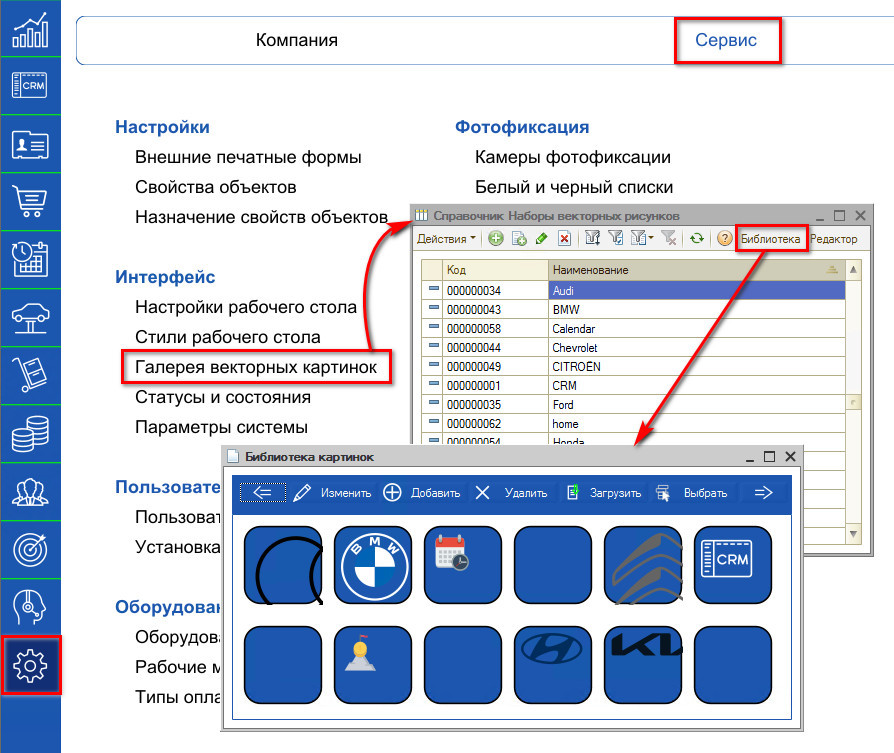
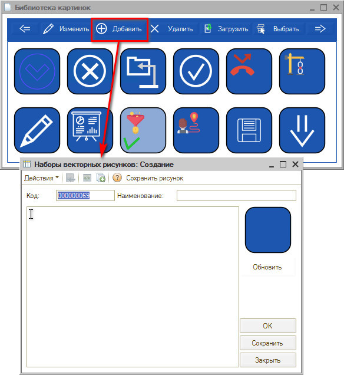
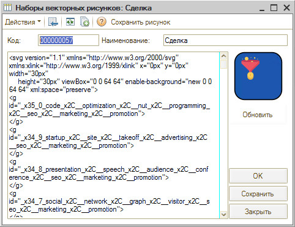
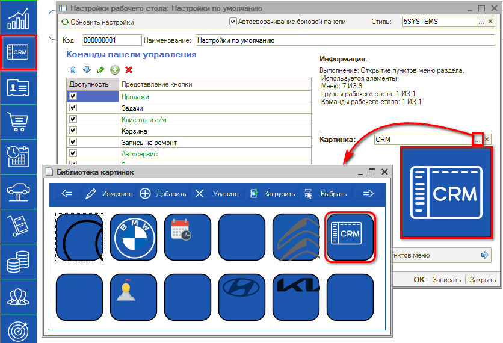
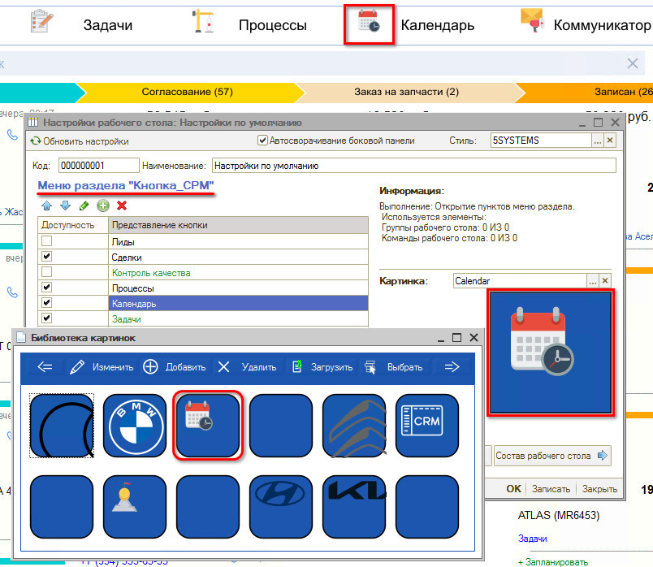
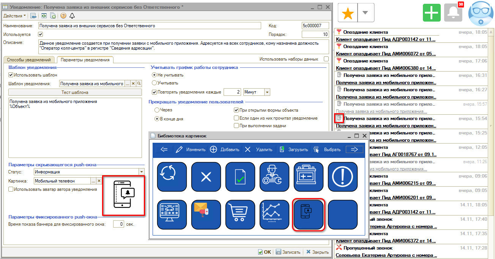
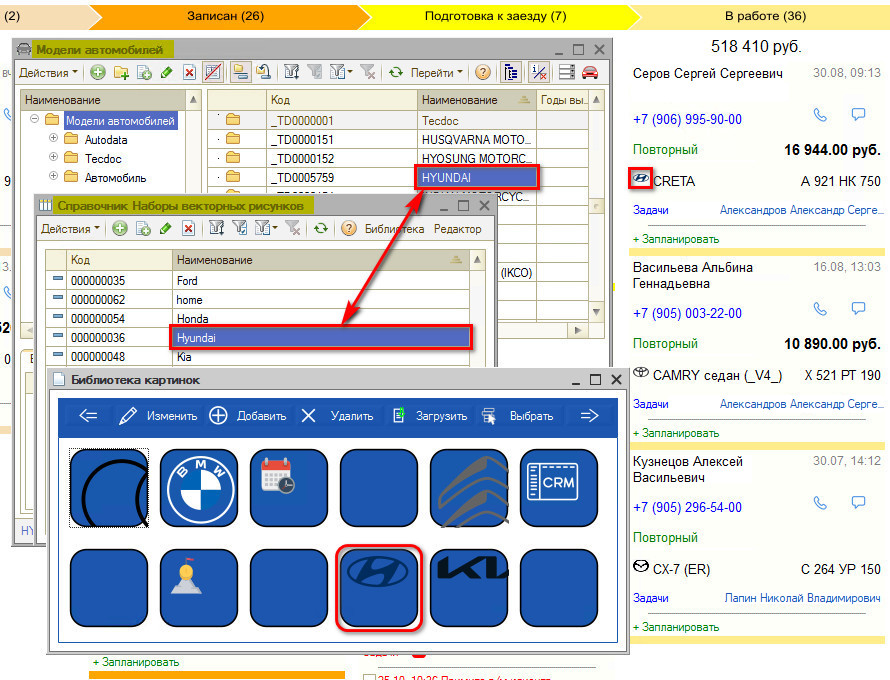

# Библиотека картинок

<table><tr><td><b>Время чтения:</b> 6 мин.</td><td><b>Обновлено:</b> 14.01.2026</td></tr></table>

Источник: https://www.5systems.ru/help/biblioteka-kartinok

> *Актуально начиная с версии релиза 2.001.001*

## Содержание

1. [Добавление картинок](#добавление-картинок)
2. [Использование векторных рисунков](#использование-векторных-рисунков)
   - [1. Боковое меню](#1-боковое-меню)
   - [2. Разделы интерфейса](#2-разделы-интерфейса)
   - [3. Уведомления](#3-уведомления)
   - [4. Модели автомобилей](#4-модели-автомобилей)

## Добавление картинок

В программе есть возможность загружать векторные картинки в формате svg, чтобы пользователю было проще ориентироваться в [интерфейсе](../../CRM/Структура%20интерфейса%205S%20AUTO/struktura-interfeysa-5s-auto.md).

Для добавления новых картинок используется справочник “Наборы векторных рисунков”. Путь: *Администрирование → вкладка Сервис → раздел Интерфейс → Галерея векторных картинок.*

Загружать картинки можно через справочник либо через *Библиотеку картинок*.

Чтобы добавить новую картинку, требуется нажать кнопку “Добавить”: открывается окно создания нового элемента.

Требуется ввести наименование картинки и вставить скопированный код svg-изображения.

Чтобы проверить изображение, нужно нажать кнопку “Обновить”. Загруженный рисунок сохранить и закрыть.

## Использование векторных рисунков

Места использования картинок в программе:

### 1. Боковое меню

Картинки с символическим изображением разделов меню отображаются на боковой панели интерфейса. При сворачивании меню остается узкая панель с картинками разделов.

Подробнее см.: [статья "Настройка рабочего стола"](../Настройка%20рабочего%20стола/nastroyka-rabochego-stola.md).

### 2. Разделы интерфейса

К разделам меню также можно загрузить картинки: разделы с картинками более понятны сотрудникам и упрощают навигацию.

Подробнее см.: [*настройка разделов меню*](../Настройка%20рабочего%20стола/nastroyka-rabochego-stola.md).

### 3. Уведомления

Картинки выводятся рядом с [*уведомлениями*](../../CRM/Работа%20с%20уведомлениями/rabota-s-uvedomleniyami.md), чтобы пользователь, получающий уведомление, с одного взгляда мог определить его вид: упоминание в сделке, пропущенный звонок, заявка из мобильного приложения и др.

Подробнее о настройке уведомлений см. [*в статье*](../../CRM/Настройка%20параметров%20уведомлений/nastroyka-parametrov-uvedomleniy.md).

Настройка картинок уведомлений производится через справочник “Уведомления”: в карточке элемента на вкладке “Параметры уведомления” подвязывается картинка из библиотеки.

### 4. Модели автомобилей

Значки марок автомобилей отображаются в карточках сделок на [канбан-доске](../../CRM/Канбан%20сделок/kanban-sdelok.md) и в [форме сделки](../../CRM/Работа%20со%20сделкой/rabota-so-sdelkoy.md) в разделе “Автомобиль”.

Чтобы привязать картинку к марке автомобиля, требуется загрузить в справочник картинку с наименованием, совпадающим с наименованием папки в справочнике “[Модели автомобилей](../../Автосервис/Модели%20автомобилей%20и%20другие%20справочники/modeli-avtomobiley-i-drugie-spravochniki.md)”.

---

**Теги:** администрирование, библиотека картинок, изображения, справочник, номенклатура

