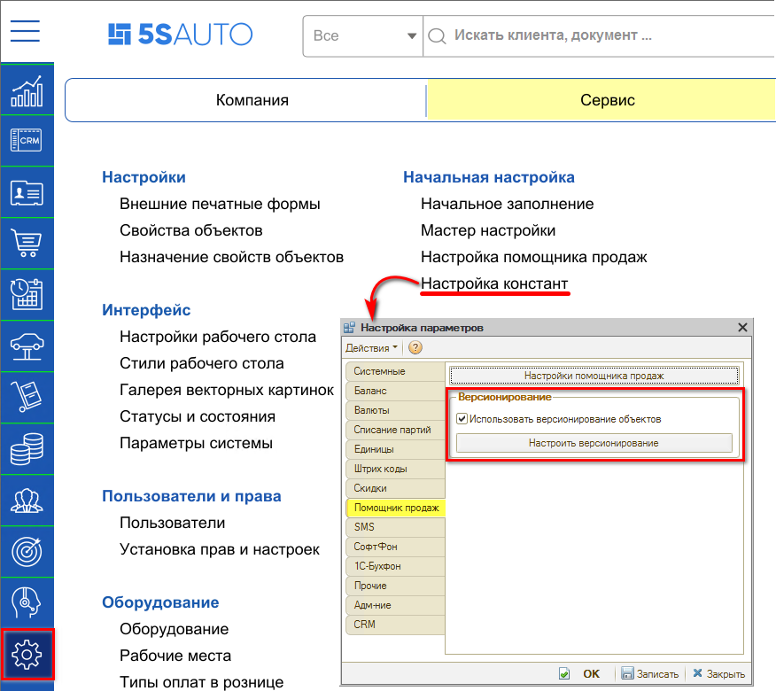
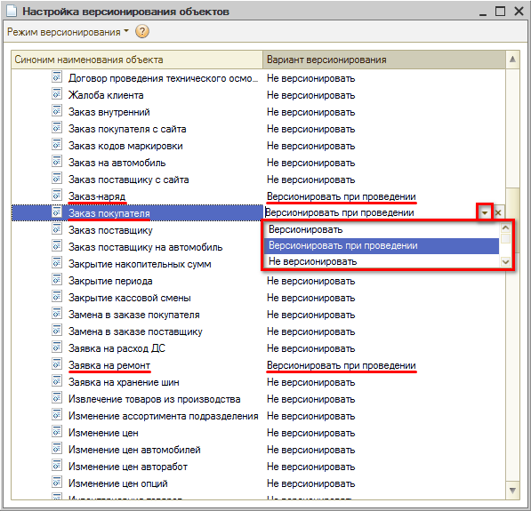
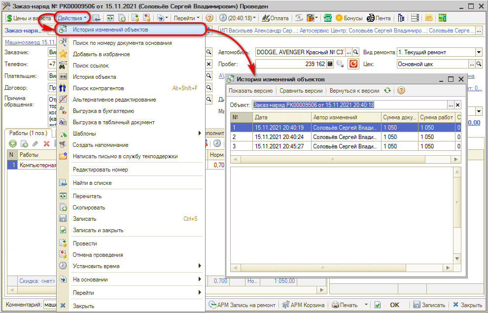
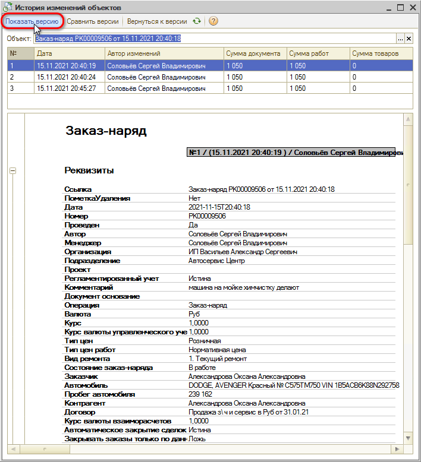
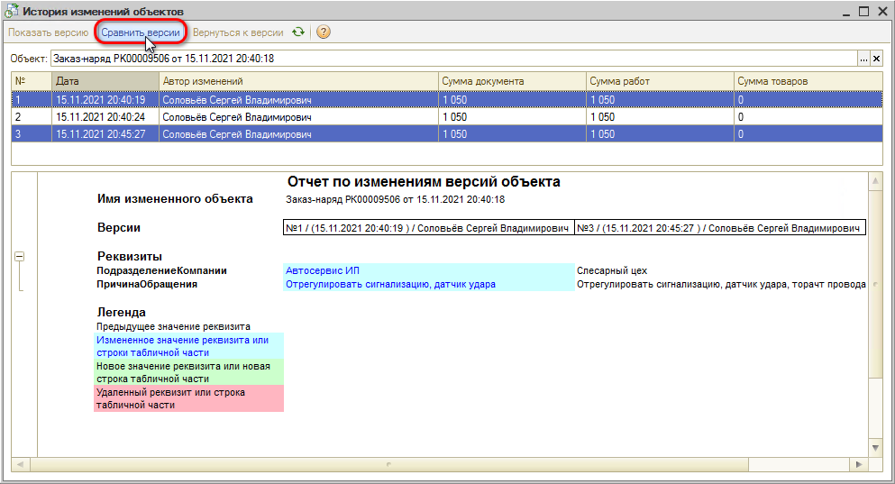
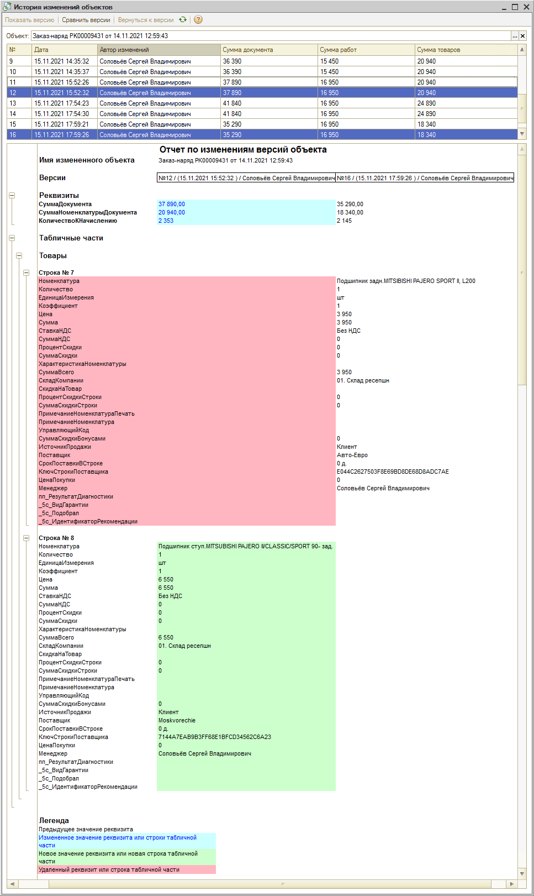
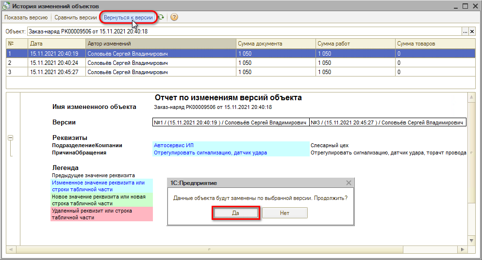

# Версионирование

<table><tr><td><b>Время чтения:</b> 8 мин.</td><td><b>Обновлено:</b> 14.01.2026</td></tr></table>

Источник: https://www.5systems.ru/help/versionirovanie

> *Актуально начиная с версии релиза 5S AUTO **2.001.001**.*

## Содержание

1. [Введение](#введение)
2. [Настройка версионирования](#настройка-версионирования)
   - [Режимы версионирования](#режимы-версионирования)
3. [Использование версионирования](#использование-версионирования)
   - [Показать версию](#показать-версию)
   - [Сравнить версии](#сравнить-версии)
   - [Вернуться к версии](#вернуться-к-версии)

## Введение

Функционал **версионирования** предусмотрен для того, чтобы можно было сравнивать версии документов и элементов справочников и, при необходимости, восстанавливать предыдущую версию.

## Настройка версионирования

Расположение в меню интерфейса: *Администрирование → Сервис → Начальная настройка → Настройка констант →* Вкладка *“Помощник продаж” →* поле *“Версионирование”*

Для работы функционала должна стоять галочка “Использовать версионирование объектов”. Нажатием на кнопку *“Настроить версионирование”* открывается форма “Настройка версионирования объектов”.

### Режимы версионирования

Для каждого справочника или документа можно выбрать режим версионирования.

Рекомендуется устанавливать настройку только на основные документы и справочники – Заказ-наряды, Заявки на ремонт, Заказы покупателя, Номенклатура и пр.

Крайне не рекомендуется указывать “Версионировать всегда” и “Версионировать при проведении”, потому что чем больше выбрано справочников и реестров документов, тем больше нагрузка на базу.

Чтобы включить версионирование, требуется выбрать нужный реестр документов, кликнуть два раза и выбрать вариант: “Версионировать” или “Версионировать при проведении”.

Режим “Версионировать при проведении” может быть установлен только для документов, которые могут быть проведены.

## Использование версионирования

Рассмотрим на примере документа "Заказ-наряд".

Нажатием на кнопку *“Действия” → "История изменений объектов"* открывается окно *“История изменений объектов”* в контексте документа, из которого был осуществлен переход.

История содержит список всех версий объектов, представленный в виде таблицы. Отображаются значения: Дата, Автор изменений, Сумма документа, Сумма работ, Сумма товаров.

### Показать версию

Нажатием на кнопку “Показать версию” выводятся все реквизиты выбранной версии документа.

### Сравнить версии

Если нужно сравнить две версии документа, требуется выбрать необходимые версии (при помощи удерживания клавиши [Ctrl]) и нажать кнопку “Сравнить версии”.

Выводится “Отчет по изменениям версий объекта”, в котором отображаются все изменения и удаления реквизитов с использованием цветовой индикации.

*Пример 1:*

*Пример 2:*

### Вернуться к версии

Если требуется восстановить предыдущую версию и откатить изменения, требуется выбрать нужную версию и нажать кнопку “Вернуться к версии”.

---

**Теги:** администрирование, версионирование, история изменений, документы, справочники

