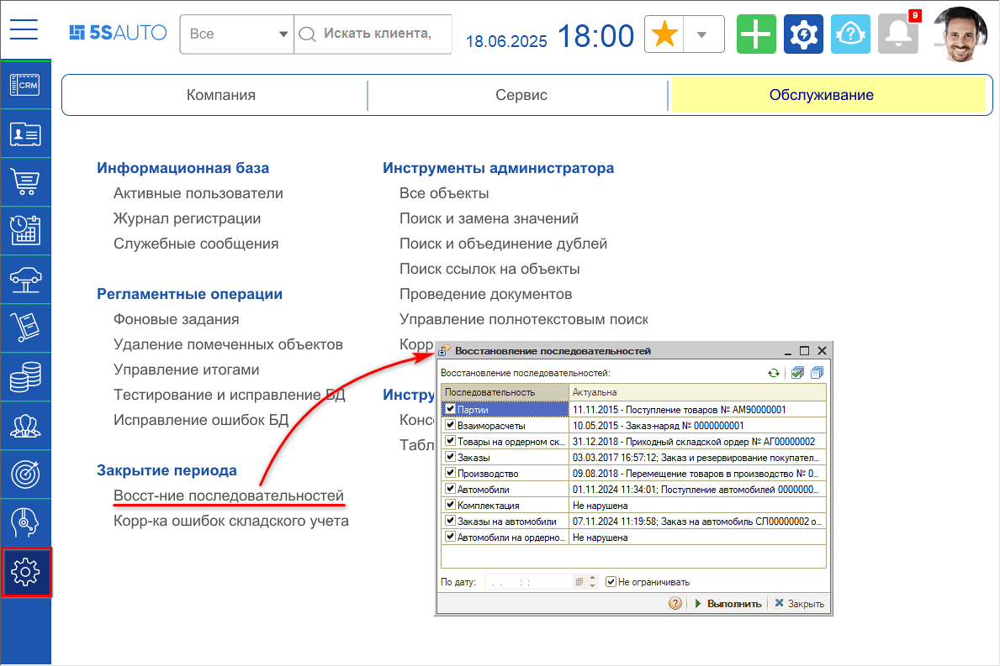
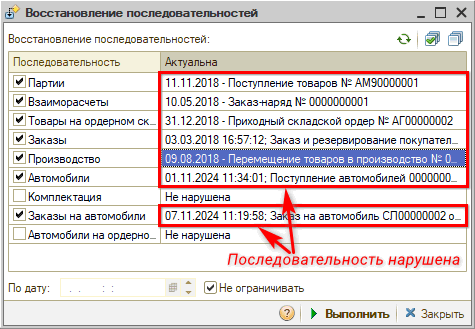
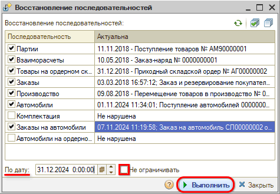
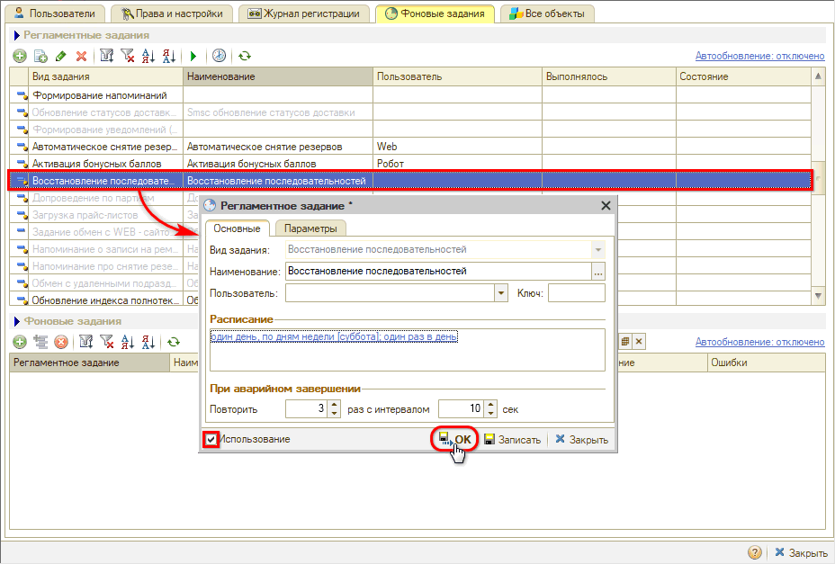
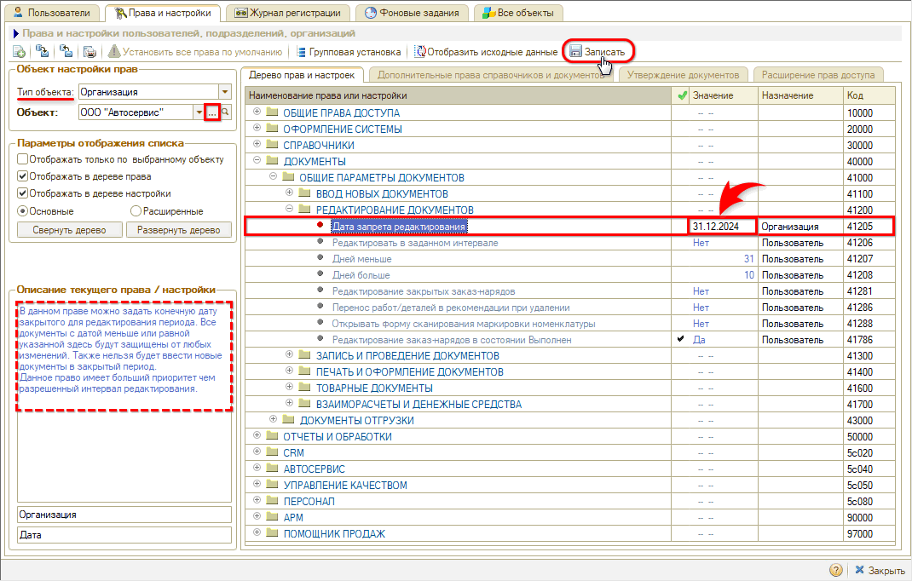
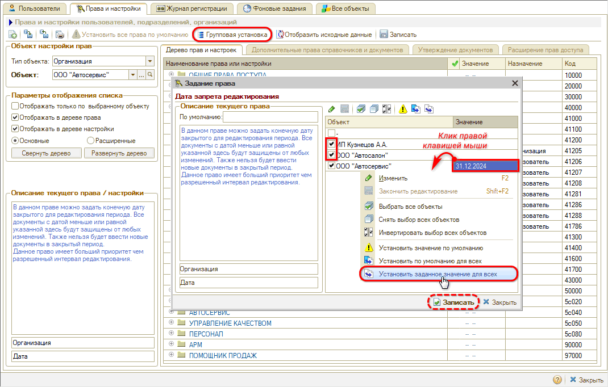

# Восстановление последовательностей документов

<table><tr><td><b>Время чтения:</b> 13 мин.</td><td><b>Обновлено:</b> 18.06.2025</td></tr></table>

Источник: https://www.5systems.ru/help/vosstanovlenie-posledovatelnostey-dokumentov

## Содержание

1. [Введение](#введение)
2. [Процесс восстановления последовательностей](#процесс-восстановления-последовательностей)
3. [Запуск регламентной операции "Восстановление последовательностей"](#запуск-регламентной-операции-восстановление-последовательностей)
4. [Настройка фонового задания для выполнения восстановления последовательностей](#настройка-фонового-задания-для-выполнения-восстановления-последовательностей)
5. [Закрытие периода после восстановления последовательности](#закрытие-периода-после-восстановления-последовательности)

## Введение

***Последовательность документов*** предполагает проведение документов в хронологическом порядке. Поскольку программа позволяет проводить документы задним числом, то последовательность нарушается, что приводит к нарушению актуальности итоговых данных: количество, сумма, себестоимость.

На этот случай в программе предусмотрена регламентная операция ***восстановления последовательностей**:* партии, взаиморасчеты, заказы, производство и т.п. В ходе исполнения восстановления последовательности перепроводятся документы в хронологическом порядке.

## Процесс восстановления последовательностей

Для восстановления последовательностей есть два способа:

1. Запустить *[регламентную операцию](#запуск-регламентной-операции-восстановление-последовательностей) по восстановлению* вручную.
2. Настроить *[фоновое задание](#настройка-фонового-задания-для-выполнения-восстановления-последовательностей) для периодического восстановления*.

При восстановлении последовательностей могут возникнуть ошибки. Например, при восстановлении последовательности партии может обнаружиться, что для проведения последнего документа типа "Реализация товаров" не хватает нужного количества товара. Тогда процесс восстановления приостановится до выявления администратором причин возникшей ошибки. После устранения ошибки необходимо снова запустить процесс восстановления последовательности.

Процесс восстановления рекомендуется запускать перед наступлением отчетного периода, перед проведением межфирменных продаж, перед выгрузкой в 1С Бухгалтерия, перед запуском процесса [Контроля неликвидов](https://5systems.ru/taxonomy/term/227). После восстановления последовательности рекомендуется *закрывать восстановленный период* для редактирования (см. [ниже](#закрытие-периода-после-восстановления-последовательности)).

## Запуск регламентной операции "Восстановление последовательностей"

Перед запуском восстановления последовательностей необходимо отключить [значимые события](../../Сообщения/Преднастроенные%20значимые%20события/prednastroennye-znachimye-sobytiya.md), если они используются.

Для запуска восстановления последовательностей:

1. Перейдите к обработке через меню программы *Администрирование → Обслуживание → Закрытие периода → Восстановление последовательностей:*  
   
2. На форме обработки просмотрите последовательности с нарушениями и отметьте флажками те последовательности, которые планируете восстановить, либо все последовательности[\*](#snoska):  
     
   \**Примечание:* Рекомендуется в процесс восстановления включать все последовательности, даже если они не нарушены, т.к. при исправлении одной последовательности посредством проведения документов могут быть нарушены другие последовательности, которые не включены в список исправляемых, что приведет к необходимости повторного исправления последовательностей и перепроведения документов.
3. При необходимости установите дату, до которой требуется произвести восстановление (для этого следует снять галочку "Не ограничивать") и запустите процесс:  
   

## Настройка фонового задания для выполнения восстановления последовательностей

Есть возможность настроить фоновое задание для восстановления последовательностей через установку настроек и прав:

## Закрытие периода после восстановления последовательности

Закрытие периода производится путем установки даты, после которой недоступно редактирование документов, и отключения пользователям прав на редактирование документов в закрытом периоде. Для этого:

1. Перейдите в установку [настроек и прав](../../Пользователи%20и%20права/Установка%20прав%20и%20настроек%20пользователя/ustanovka-prav-i-nastroek-polzovatelya.md), выберите тип объекта "Организация", в качестве объекта выберите организацию, для которой будет установлен запрет редактирования документов.
2. Перейдите в группу прав: ДОКУМЕНТЫ → ОБЩИЕ ПАРАМЕТРЫ ДОКУМЕНТОВ → РЕДАКТИРОВАНИЕ ДОКУМЕНТОВ.
3. Установите дату запрета редактирования и сохраните изменения.

Если организаций несколько, то выполните запрет для остальных организаций таким же способом, изменив значение в поле "Объект", либо через [групповую установку прав](../../Пользователи%20и%20права/Установка%20прав%20и%20настроек%20пользователя/ustanovka-prav-i-nastroek-polzovatelya.md#групповая-установка-прав):

Вместе с установкой даты закрытия периода *необходимо запретить пользователям редактирование документов в закрытом периоде:* для этого требуется установить право *“Редактирование документов в закрытом периоде”* в значение *"Нет".* Данное право относится к *расширенному* списку прав (см. в [статье](../../Пользователи%20и%20права/Установка%20прав%20и%20настроек%20пользователя/ustanovka-prav-i-nastroek-polzovatelya.md#основные-и-расширенные-права)).

*Примечание:* Для отдельных пользователей – руководителей, бухгалтеров и других ответственных сотрудников может потребоваться снятие этого запрета. Для них право “Редактирование документов в закрытом периоде” может быть установлено в значение "Да", но при этом необходимо понимать последствия внесения изменений в документы в закрытом периоде. Также для данного права есть возможность использовать расширение прав доступа – добавить исключения по отдельным типам документов. Подробнее см. в статье *"[Права на редактирование документов](../Права%20на%20редактирование%20документов/prava-na-redaktirovanie-dokumentov.md)".*

---

**Теги:** администрирование, последовательности документов, восстановление, партии, себестоимость

