

# Доступ к данным по подразделениям (RLS)

<table><tr><td><b>Время чтения:</b> 22 мин.</td><td><b>Обновлено:</b> 28.02.2025</td></tr></table>

Источник: https://www.5systems.ru/help/dostup-k-dannym-po-podrazdeleniyam-rls

> *Актуально начиная с версии релиза 5S AUTO **2.8.1**.*

## Содержание

1. [Введение](#введение)
2. [Примеры ограничений прав доступа](#примеры-ограничений-прав-доступа)
   - [Лиды и Сделки](#лиды-и-сделки)
   - [Документы](#документы)
   - [Карточка контрагента](#карточка-контрагента)
   - [АРМ Клиенты и автомобили](#арм-клиенты-и-автомобили)
   - [Отчеты](#отчеты)
3. [Настройка](#настройка)
   - [1. Настройка в карточке пользователя](#настройка-в-карточке-пользователя)
      - [1) Роль “Пользователь RLS”](#роль-пользователь-rls)
      - [2) Настройка доступа к подразделениям](#настройка-доступа-к-подразделениям)
   - [2. Настройка справочника “Доступ по подразделениям”](#настройка-справочника-доступ-по-подразделениям)

## Введение

Функционал ***Доступ к данным по подразделениям*** используется в случае необходимости *закрыть отдельным пользователям возможность просмотра и редактирования информации*, которая не относится к их подразделению.

Работа механизма основана на технологии *RLS (Record Level Security) платформы 1С:Предприятие* – см. [описание на сайте](https://its.1c.ru/db/metod8dev/content/4349/hdoc).

Программа позволяет ограничить доступ пользователя к различным документам и без использования RLS при помощи [Прав и настроек](../../Пользователи%20и%20права/Установка%20прав%20и%20настроек%20пользователя/ustanovka-prav-i-nastroek-polzovatelya.md) – в том числе установкой отбора на списках документов. Но пользователь тем не менее сможет получить доступ к скрытым документам через отчеты или обработки. RLS гарантирует, что пользователь никаким способом не сможет преодолеть ограничения.

*Логика ограничений RLS в программе:*

<table><tr><td><b>Модули программы</b></td><td><b>Логика ограничений RLS</b></td></tr><tr><td><i>Документы</i></td><td>Ограничения по RLS действуют на <i>все основные</i> документы программы, в том числе: <ul><li>Заказ-наряд;</li><li>Заказ покупателя;</li><li>Заказ поставщику;</li><li>Реализация товаров;</li><li>Поступление товаров;</li><li>Банковская выписка;</li><li>Счет на оплату;</li><li>Чек;</li><li>Начисление заработной платы <i>(начиная с релиза 2.8.2);</i></li><li>Отражение затрат на маркетинг <i>(начиная с релиза 2.8.2)</i></li></ul> и прочие. Под действие RLS не попадает документ “Корректировка бонусов”, т.к. логика бонусной системы предполагает доступ к информации о бонусах клиента без ограничений по подразделениям.</td></tr><tr><td><i>CRM</i></td><td>Действие RLS распространяется на модули: <ul><li>Лиды;</li><li>Сделки;</li><li>Процессы.</li></ul>Под ограничения RLS не попадают: <ul><li>Задачи*;</li><li>Звонки;</li><li>Чаты;</li><li>Бонусы – логика бонусной системы предполагает, что пользователям должна быть доступна полная информация по бонусам независимо от подразделений.</li></ul><i>\</i>Примечание:* Доступ к задачам регулируется через регистр “<a href="../../Задачи/Адресация%20задач%20в%20CRM%20по%20исполнителям/adresaciya-zadach-v-crm-po-ispolnitelyam.md">Сведения адресации</a>”.</td></tr><tr><td><i>Справочники</i></td><td>Справочники программы не ограничиваются механизмом RLS. <i>Примечание:</i> Доступ пользователей к справочникам при необходимости регулируется <a href="../../Пользователи%20и%20права/Установка%20прав%20и%20настроек%20пользователя/ustanovka-prav-i-nastroek-polzovatelya.md">Правами и настройками</a>.</td></tr><tr><td><i>Регистры накопления</i></td><td>Ограничения RLS действуют на <i>все</i> основные регистры накопления в программе. Не попадают под ограничения следующие регистры: <ul><li>Бонусы – т.к. информация о бонусах должна быть доступна пользователям независимо от подразделений;</li><li>Остатки и обороты товаров*;</li><li>Обращения.</li></ul><i>\</i>Примечание:* Для настройки доступа к просмотру остатков используется отдельный механизм ограничения видимости остатков по складам – см. в статье "<a href="../Настройка%20видимости%20складов/nastroyka-vidimosti-skladov.md#1-ограничение-видимости-остатков">Настройка видимости складов</a>".</td></tr><tr><td><i>Регистры сведений</i></td><td>Под ограничения RLS попадают регистры: <ul><li>Корзина;</li><li>Табель.</li></ul>На все остальные регистры сведений ограничения RLS не распространяются, в том числе на: <ul><li>Цены;</li><li>Скидки</li></ul>&nbsp;&nbsp;&nbsp;&nbsp;&nbsp;&nbsp;&nbsp;&nbsp;и прочие.</td></tr></table>

*Примечание:* Ограничение распространяется не на все модули программы, т.е. пользователям с включенным RLS будет доступна, например, вся информация по справочнику “Контрагенты” или все чаты клиента, даже если он обслуживался по подразделениям, к которым у пользователя закрыт доступ.

## Примеры ограничений прав доступа

### Лиды и Сделки

#### 1. Канбан / Список

При включенном RLS лиды и сделки на канбане или в списке отображаются только по тем подразделениям, к которым пользователь имеет доступ.

*Например:*

1) для пользователя с неограниченным доступом на канбане отображаются все сделки по всем подразделениям:

   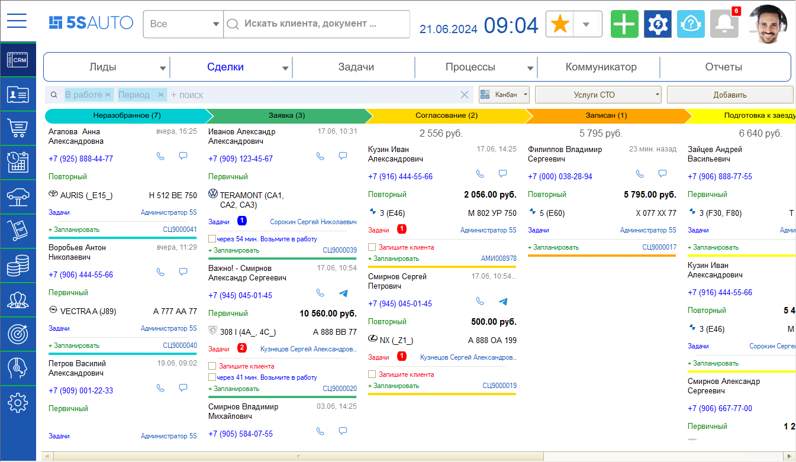

2) при использовании RLS у пользователя отображаются сделки только по доступным ему подразделениям:

   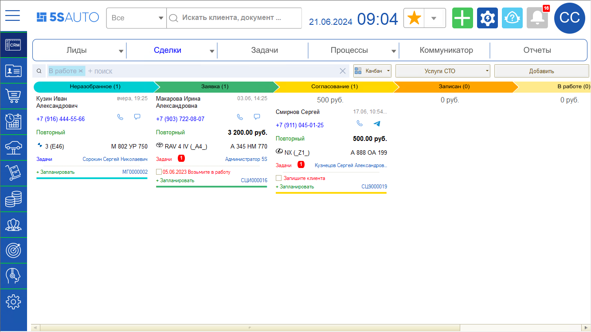

*Примечание:* Право “Фильтровать сделки по подразделению пользователя” также позволяет настроить отображение сделок на канбане или в списке только по тому подразделению, в котором работает пользователь. Но данный фильтр можно снять, а при использовании RLS пользовать не сможет получить доступ к сделкам по другим подразделениям никаким способом.

#### 2. Форма лида / сделки

На форме сделки информация по клиенту — Портрет клиента, Корзины, Заказы, Заявки, Документы продажи — отображается только по обслуживанию в доступных подразделениях, и никакой информации по обслуживанию в подразделениях, к которым у пользователя нет доступа. 
К *событиям сделки* по другим подразделениям у пользователя RLS также нет доступа. 
Изменять подразделение в сделке пользователь RLS может только на те подразделения, к которым у него настроен доступ.

*Пример:*

1) информация в Сделке у пользователя с неограниченным доступом:

   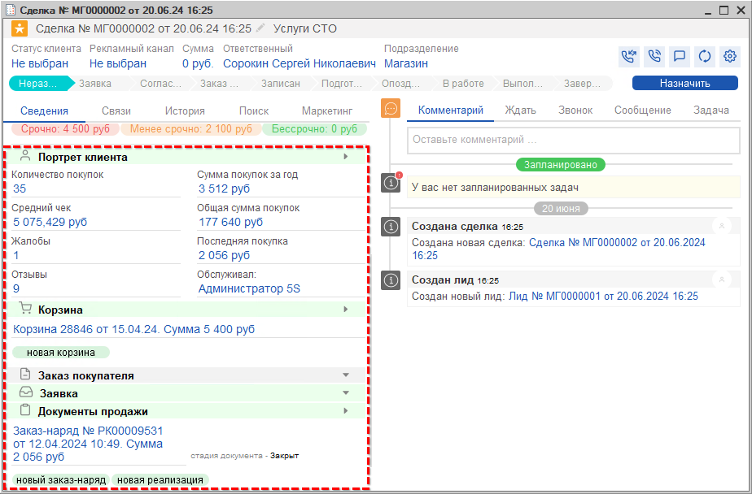

2) информация в той же самой сделке у пользователя с настроенным RLS:

   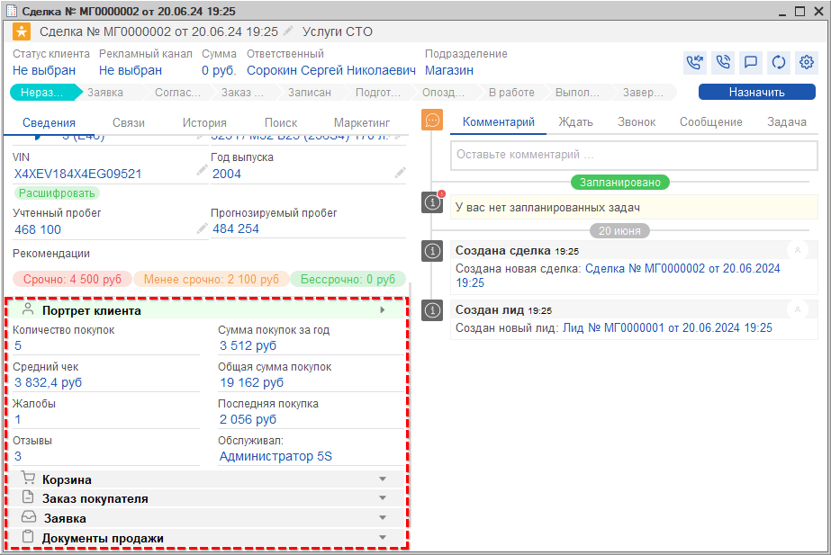

Во втором варианте в блоке “Портрет клиента” отображается статистика только по обслуживанию в доступных подразделениях. Открытых Корзин, заказов, заявок и документов продажи по доступным подразделениям нет – поэтому в данных блоках у пользователя RLS нет информации.

В блоке “История обслуживания” у пользователя RLS отображаются все автомобили клиента и список заказ-нарядов по каждому из них. Но по подразделениям, к которым у пользователя RLS нет доступа, заказ-наряды открываются в *упрощенной форме* – пользователь имеет возможность просматривать информацию, но не может редактировать и перезаписывать документ:

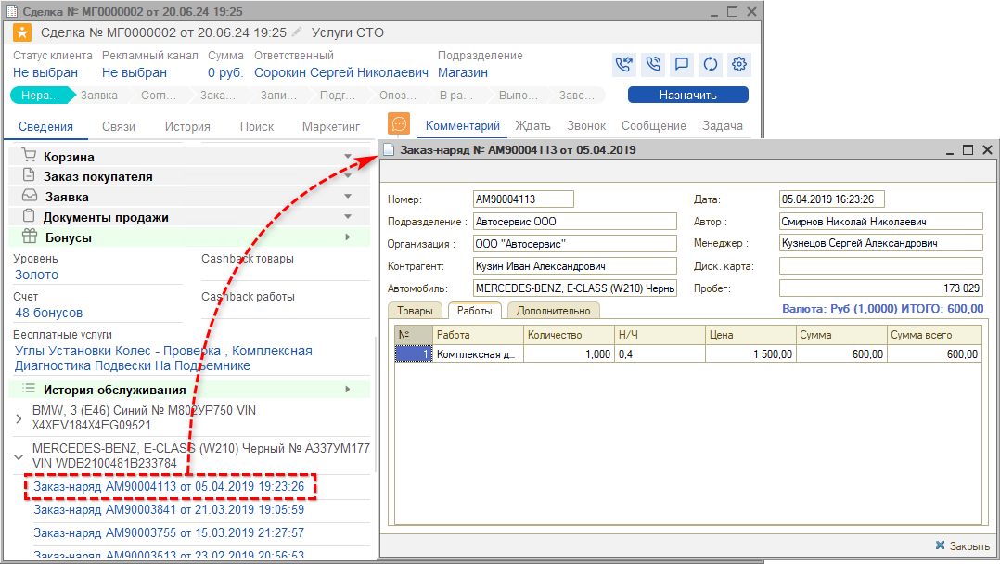

### Документы

Под ограничения RLS попадают все основные документы в программе, связанные с финансами, активами и товарами. В реестрах, отчетах, сделках и т.д. отображаются документы только по подразделениям, к которым у данного пользователя настроен доступ.

*Пример ограничения по документам:*

1) список документов “Заказ-наряд” для пользователя с неограниченным доступом:

   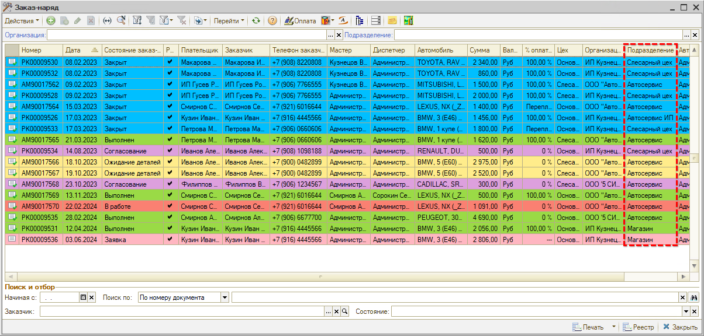

2) тот же список документов для пользователя с настроенным RLS:

   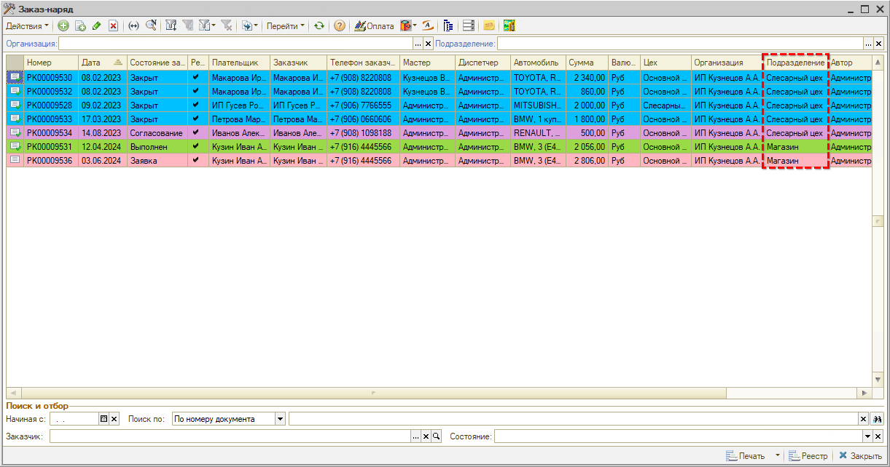

### Карточка контрагента

В *карточке контрагента* отображается список всех документов пользователя, но по подразделениям, к которым у пользователя RLS нет доступа, документы открываются в упрощенной форме – пользователь может просматривать информацию в них, но не может редактировать и перезаписывать документ:

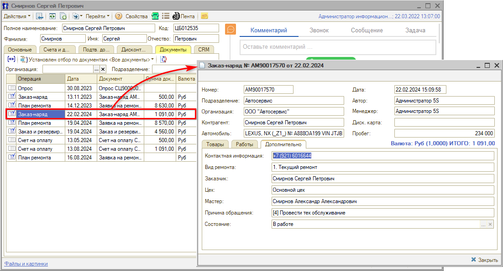

### АРМ Клиенты и автомобили

> *Начиная с релиза **2.8.2** (ранее у пользователя RLS не отображались заказ-наряды по недоступным подразделениям).*

В АРМ "Клиенты и автомобили" на вкладке "История автомобиля" отображается список всех документов пользователя по всем подразделениям. Документы по подразделениям, к которым у пользователя RLS нет доступа, открываются в упрощенной форме – пользователь может просматривать информацию в них, но не может редактировать и перезаписывать документ:

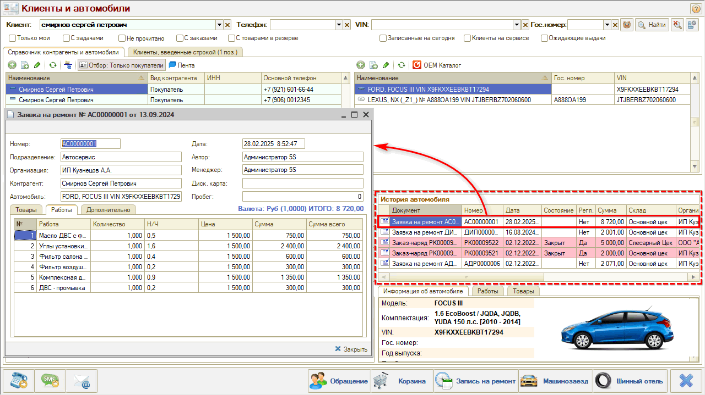

### Отчеты

#### Финансовые отчеты

Действие механизма RLS настроено также на регистры накопления, чтобы данные по подразделениям, к которым у пользователя нет доступа, не попадали в отчеты.

*Пример:*

Отчет по взаиморасчетам с контрагентом, сформированный пользователем с неограниченным доступом:

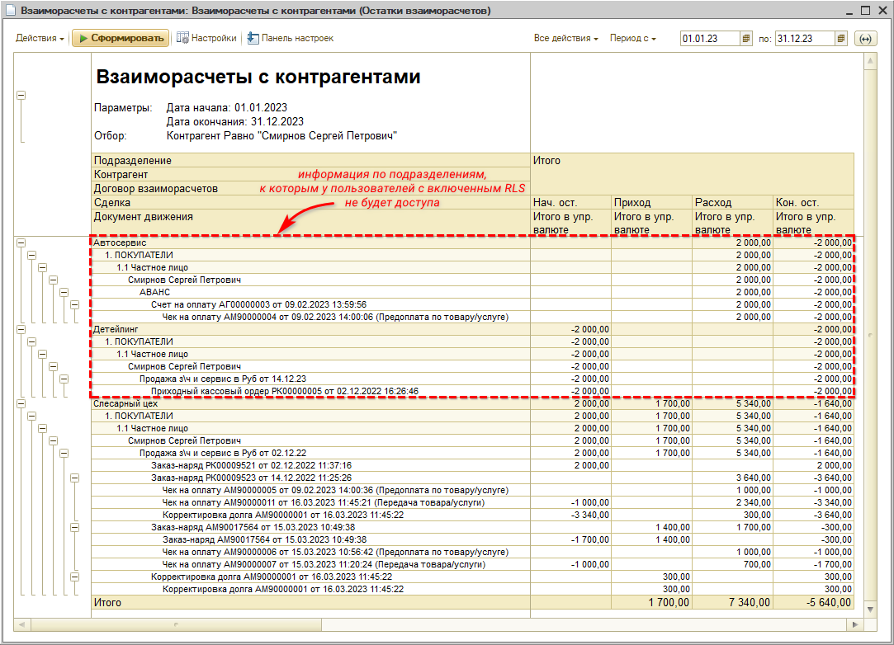

Тот же самый отчет, сформированный пользователем с настроенным RLS, содержит только данные по доступному ему подразделению:

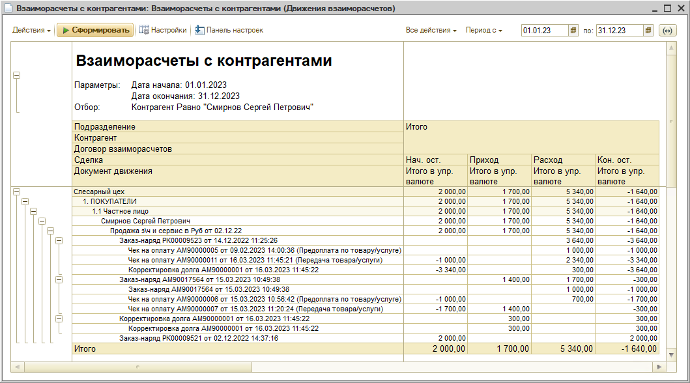

#### Остатки и обороты товаров

Отчет "Остатки и обороты товаров" у пользователя RLS по умолчанию формируется с фильтром по доступным ему подразделениям.

*Пример:*

Отчет, сформированный пользователем с неограниченным доступом:

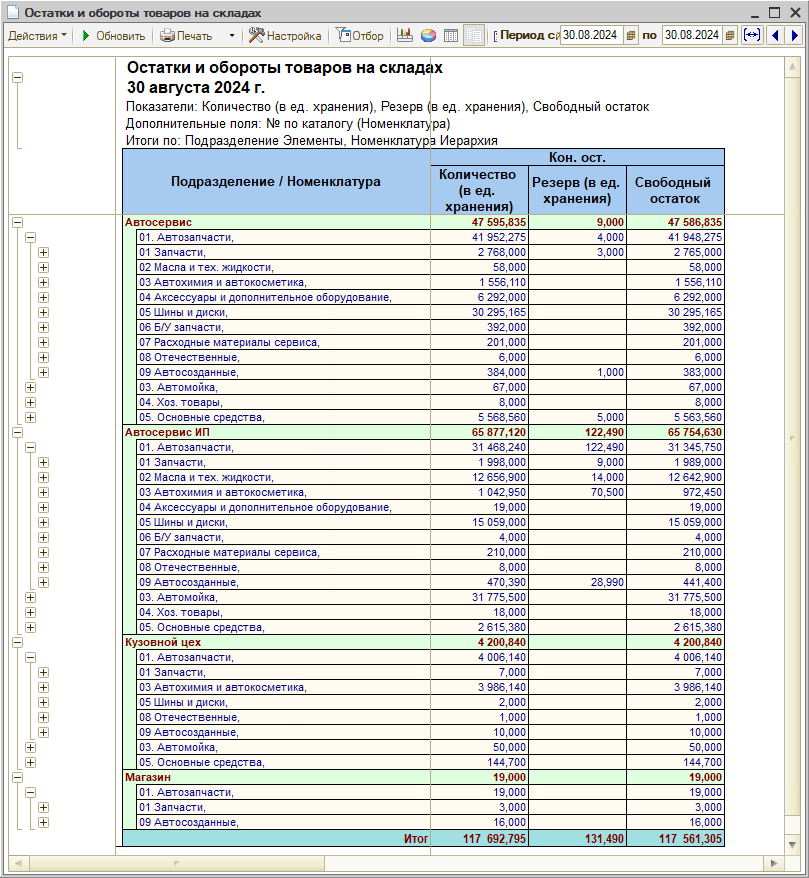

Тот же самый отчет, сформированный пользователем с настроенным RLS, по умолчанию содержит только данные по доступным ему подразделениям[\*](#snoska):

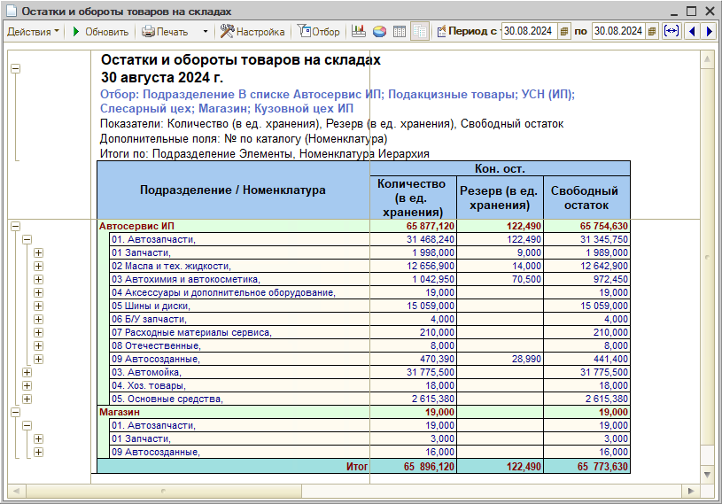

*\*Примечание:* В данном отчете отбор по подразделениям можно отключить при помощи настроек.

## Настройка

### Настройка в карточке пользователя

[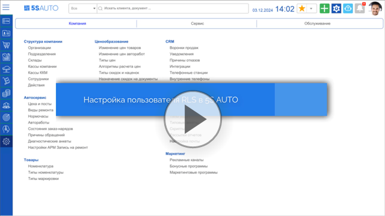](https://edu.5systems.ru/video/Polzovateli/Nastroyka_polzovatelya_RLS.mp4)

#### Роль “Пользователь RLS”

Для пользователей, которым требуется настроить ограничение прав, необходимо [выбрать роль](https://5systems.ru/help/polzovateli#dostupnye_roli) ***”Пользователь RLS”***:

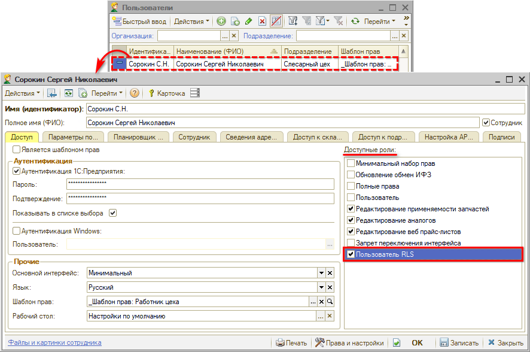

***Обратите внимание!*** Роли пользователя суммируются, а не исключают друг друга, - поэтому необходимо <u>снять флажки со всех остальных ролей, дающих доступ к документам</u>: таких как “Пользователь”, “Минимальный набор прав”, “Полные права”. Иначе эти роли отключат все ограничения роли “Пользователь RLS”. Дополнительные роли – “Редактирование применяемости запчастей”, “Редактирование аналогов”, “Редактирование веб прайс-листов” – не дают никакого доступа к документам: эти роли можно совмещать с ролью “Пользователь RLS”.

#### Настройка доступа к подразделениям

На вкладке “Доступ к подразделениям” требуется указать, какие подразделения или группы подразделений будут доступны пользователю:

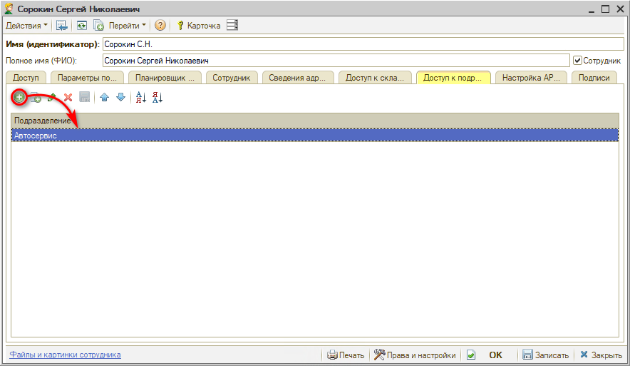

Выбор подразделений производится из специального *справочника “Доступ по подразделениям”,* который должен быть предварительно заполнен – см. [ниже](#настройка-справочника-доступ-по-подразделениям).

Для пользователя RLS обязательно должен быть настроен доступ к подразделению, принадлежность к которому указана на вкладке “[Параметры пользователя](../../Пользователи%20и%20права/Пользователи/polzovateli.md#вкладка-параметры-пользователя)”. Дополнительно может быть добавлен доступ к другим подразделениям.

После записи изменений в карточке пользователя строка с данным пользователем автоматически добавится в справочник “Доступ по подразделениям” – в указанные подразделения.

*Примечание:* Необходимо в [Правах и настройках](../../Пользователи%20и%20права/Установка%20прав%20и%20настроек%20пользователя/ustanovka-prav-i-nastroek-polzovatelya.md) запретить доступ к данному справочнику сотруднику, для которого будет назначаться роль “Пользователь RLS”, иначе он будет иметь возможность самостоятельно настроить для себя доступ к любым подразделениям.

*Внимание!* Для принятия новых прав доступа пользователю необходимо перезайти в программу.

### Настройка справочника “Доступ по подразделениям”

Для указания списка подразделений, к которому пользователь должен иметь доступ, используется специальный справочник “Доступ по подразделениям”:

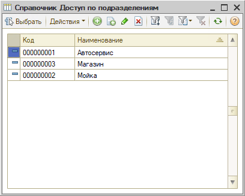

Каждый элемент справочника представляет собой перечень подразделений, для которых будет настраиваться доступ пользователей.

Справочник необходимо предварительно *заполнить,* чтобы потом выбирать готовые списки подразделений при настройке доступа в карточке пользователя – см. [выше](#настройка-доступа-к-подразделениям).

#### 1. Добавление подразделений

Для создания нового элемента справочника “Доступ по подразделениям” необходимо нажать кнопку “Добавить” на верхней панели. В открывшейся форме на вкладке “Подразделения” следует добавить нужные подразделения из справочника “[Подразделения компании](../../Структура%20компании/Справочник%20Подразделения%20компании/spravochnik-podrazdeleniya-kompanii.md)”, задать наименование и записать:

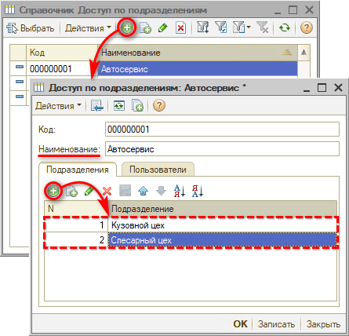

*Примечание 1:* Доступ будет действовать только к конкретному добавленному подразделению без учета иерархии справочника “Подразделения компании”. Т.е. нужно добавить в список каждое из подразделений, к которым у пользователя должен быть доступ, а не одно вышестоящее по иерархии.

*Примечание 2:* В некоторых случаях требуется предоставлять пользователю доступ к документам и сделкам с незаполненным подразделением – для этого нужно добавить в справочник пустое подразделение.

#### 2. Добавление пользователей

На вкладке “Пользователи” можно добавить пользователя или список пользователей, которые будут иметь доступ к каждому конкретному подразделению или группе подразделений:

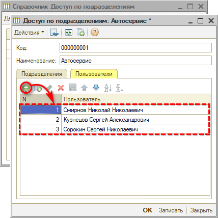

При настройке доступа к подразделениям в карточке пользователя (см. [выше](#настройка-доступа-к-подразделениям)) строка с этим пользователем добавится в справочник автоматически.

### Контроль корректности договора и склада документа

Для корректной работы механизма RLS необходимо настроить на подразделение право *“Контроль корректности договора и склада документа”:*

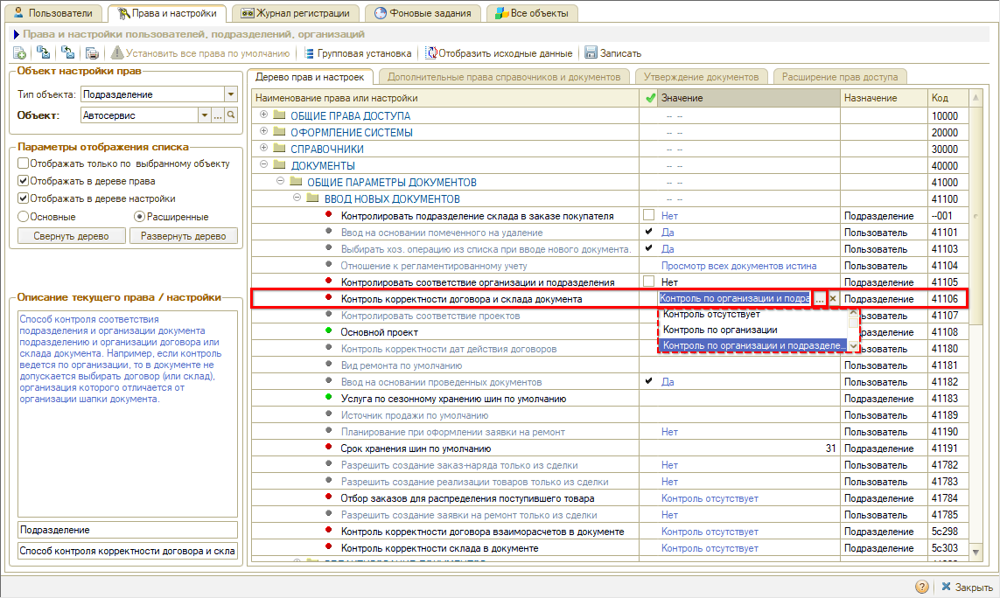

Данная настройка обеспечивает соответствие подразделения договора и склада подразделению документа, для того чтобы у пользователя RLS не возникало ситуаций, когда невозможно записать изменения в документе, т.к. склад или договор в данном документе принадлежит подразделению, к которому у пользователя нет доступа.

---

**Теги:** администрирование, rls, подразделения, доступ к данным, права

