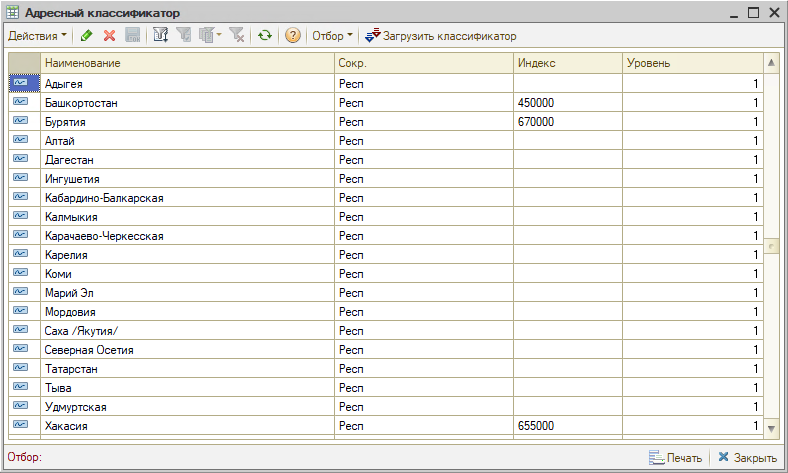
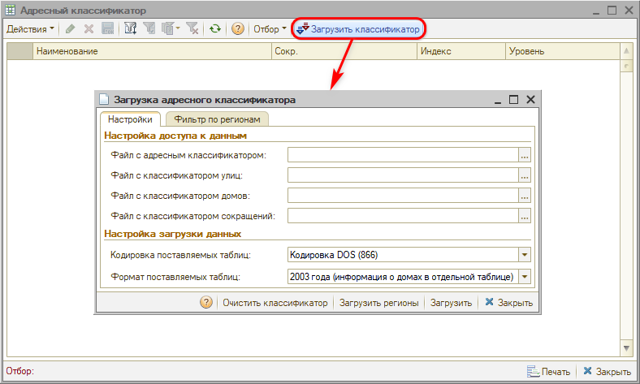
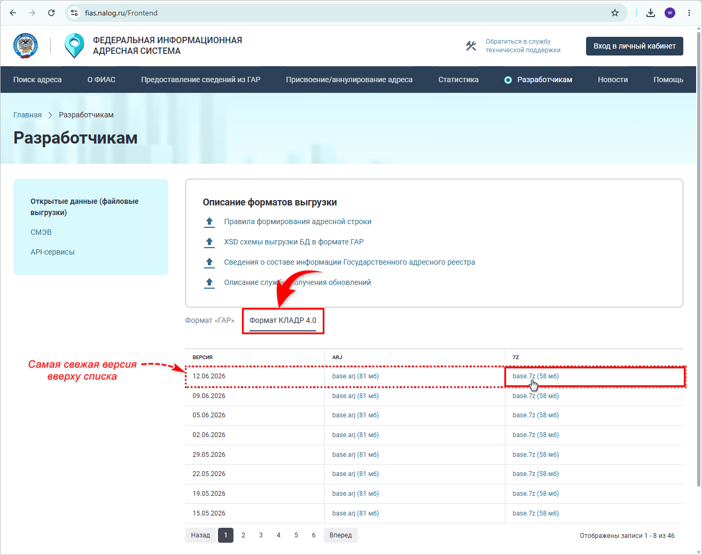
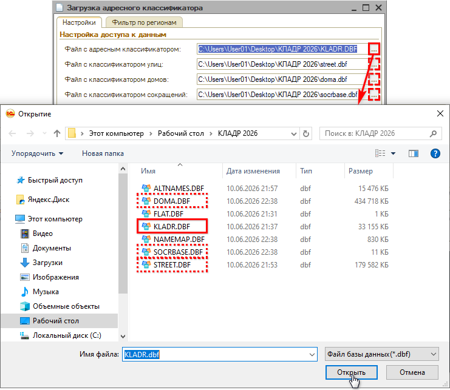
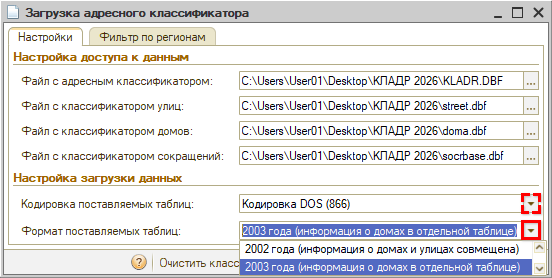
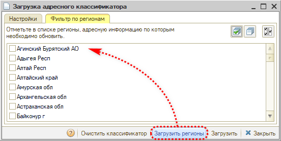
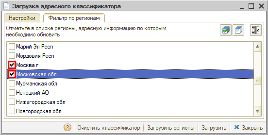
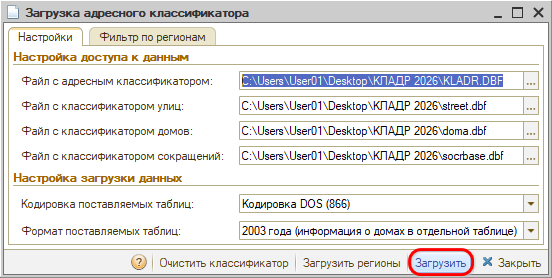
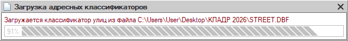
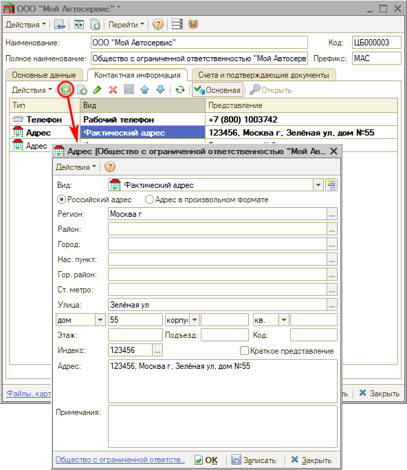

# Загрузка адресного классификатора

<table><tr><td><b>Время чтения:</b> 7 мин.</td><td><b>Обновлено:</b> 15.06.2026</td></tr></table>

Источник: https://www.5systems.ru/help/zagruzka-adresnogo-klassifikatora

## Содержание

1. [Введение](#введение)
2. [Загрузка классификатора](#загрузка-классификатора)
3. [Использование в программе](#использование-в-программе)

## Введение

*Регистр сведений **Адресный классификатор** (Справочники → Классификаторы → Адресный классификатор)* предназначен для хранения адресных элементов — регионов, районов, городов, населенных пунктов, улиц, домов, из которых составляются адреса внутри Российской Федерации и вычисляется почтовый индекс:

Возможность загрузки *адресного классификатора* предусмотрена для быстрого и правильного ввода адресов в программе, – например, в [контактной информации организации](../../Структура%20компании/Справочник%20Организации/spravochnik-organizacii.md#контактная-информация) и [контрагентов](https://www.5systems.ru/help/kontragenty-i-kontakty-0#vkl_kont_inf).

***Внимание!** З*агрузка адресного классификатора может занять до нескольких часов (подробнее см. [ниже](#reg)).

## Загрузка классификатора

**1. Форма загрузки классификатора**

Адресные элементы загружаются из внешнего файла через форму загрузки адресного классификатора. Для вызова этой формы служит кнопка *"Загрузить классификатор":*

**2. Скачивание КЛАДР**

Исходные файлы с актуальными классификаторами адресов можно взять с [сайта ФИАС](https://fias.nalog.ru/Frontend) → перейти на вкладку *Формат КЛАДР 4.0* и скачать файл "base.7z" последней версии:

Скачанный файл необходимо разархивировать и подгрузить в соответствующий классификатор в программе – см. *[далее](#nastr_zagr).*

**3. Настройка загрузки**

На форме загрузки адресного классификатора на вкладке "Настройки" в поле "Настройка доступа к данным" требуется указать путь к папке с загруженными классификаторами – следует выбрать файл в поле "Файл с адресным классификатором", остальные параметры заполнятся автоматически:

Для загрузки необходимы файлы:

- *kladr.dbf* — адресный классификатор (содержит информацию о регионах, районах, городах и населенных пунктах);
- *street.dbf* — классификатор улиц (содержит информацию об улицах и, для формата 2002 года, информацию для вычисления индекса по номеру дома);
- *doma.dbf* — классификатор домов, используется только для формата 2003 года. Содержит информацию для вычисления индекса по номеру дома;
- *socrbase.dbf* — классификатор адресных сокращений. Если этот файл не загружен или загружен неправильно, механизм адресного классификатора в некоторых случаях будет работать неверно.

При необходимости есть возможность выбрать другую *кодировку* файлов и *формат* представления адресной информации в них в поле "Настройка загрузки данных":

**4. Выбор регионов**

Для выбора регионов сначала следует *загрузить их список* – для этого нужно перейти на вкладку *"Фильтр по регионам"* и нажать кнопку *"Загрузить регионы"* на нижней панели:

Далее следует отметить флажками в списке те регионы, адресную информацию по которым необходимо загрузить. Есть возможность выбрать один, несколько или все\* регионы России. Для поиска региона в списке можно ввести первые буквы названия региона:

***\*Внимание!*** В зависимости от выбранных регионов и их количества загрузка адресного классификатора может занять *до нескольких часов.* Например, Москва и Московская область загружаются более часа. Чем меньше выбрано регионов для загрузки, тем быстрее загрузится классификатор и тем быстрее будет работать выбор адресных элементов и вычисление почтового индекса. Можно не загружать адреса тех регионов, которые заведомо не будут использоваться в работе. При необходимости в последующем можно дополнить классификатор по регионам, которые не были загружены ранее.

**5. Загрузка классификатора**

После настройки загрузки и выбора нужных регионов следует нажать кнопку *"Загрузить"* на нижней панели и дождаться загрузки данных:

*Примечание:* Загрузка данных может занять продолжительное время (до нескольких часов) – следует дождаться ее окончания (при необходимости есть возможность прервать загрузку и возобновить позднее):

**6. Дополнительные справочники**

Есть возможность загружать информацию и добавлять вручную свои значения в следующие дополнительные справочники:

1. *Адресные сокращения* – при заполнении адреса можно ввести свое значение региона, района и дополнить его правильным сокращением.
2. *Районы* – есть возможность загружать и добавлять вручную городские районы для уточнения адресов.
3. *Станции метро* – можно загрузить или добавить станции метро, также типовым функционалом предусмотрено раскрашивание их в цвета, соответствующие веткам метро.

## Использование в программе

Загруженный адресный классификатор в дальнейшем используется для быстрого и корректного заполнения адресов в программе путем выбора значений параметров из соответствующих классификаторов.

Адрес внутри Российской Федерации состоит из 9 основных полей: региона, района, города, населенного пункта, улицы, дома, корпуса, квартиры и почтового индекса. Регионы составляют первый уровень, районы — второй, города — третий и т. д.

На скриншоте ниже приводится пример процесса заполнения [адреса организации](../../Структура%20компании/Справочник%20Организации/spravochnik-organizacii.md#контактная-информация) с помощью адресного классификатора:

---

**Теги:** администрирование, адресный классификатор, фиас, адреса, загрузка

