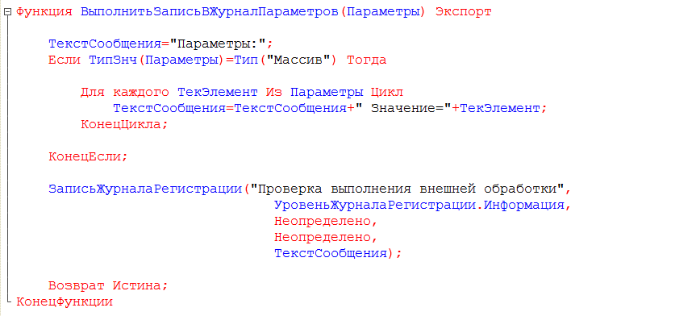
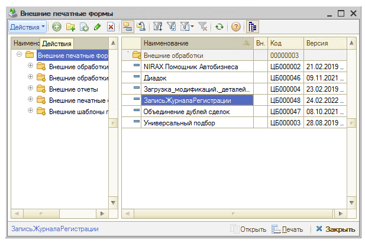
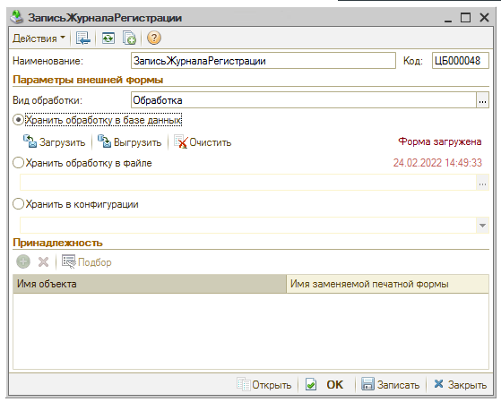
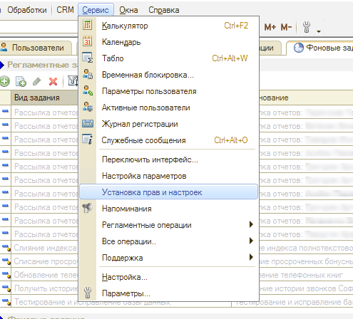
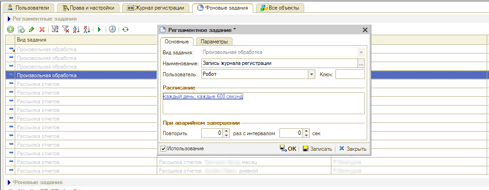
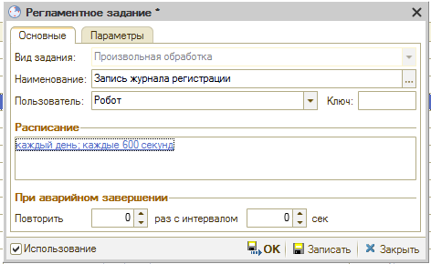

# Запуск произвольных обработок в регламентном задании

<table><tr><td><b>Время чтения:</b> 7 мин.</td><td><b>Обновлено:</b> 15.06.2022</td></tr></table>

Источник: https://www.5systems.ru/help/zapusk-proizvolnykh-obrabotok-v-reglamentnom-zadanii

## Содержание

1. [Введение](#введение)
2. [Этап 1. Создание внешней обработки с методами в модуле объекта](#этап-1-создание-внешней-обработки-с-методами-в-модуле-объекта)
3. [Этап 2. Настройка регламентного задания для периодического выполнения метода обработки](#этап-2-настройка-регламентного-задания-для-периодического-выполнения-метода-обработки)

## Введение

Механизм позволяет запускать внешние обработки в регламентных заданиях.

Настройка запуска обработки состоит из двух этапов:

1. Создание внешней обработки с методами в модуле объекта
2. Настройка регламентного задания для периодического выполнения метода обработки

## Этап 1. Создание внешней обработки с методами в модуле объекта

На первом этапе нужно создать внешнюю обработку с методом, который необходимо выполнять в регламентном задании.

В приведенном далее примере создана обработка *"ЗаписьЖурналаРегистрации"*, которая принимает список параметров, а затем записывает значения этих параметров в журнал регистрации.

Метод *ВыполнитьЗаписьВЖурналПараметров(Параметры)* определен в модуле объекта обработки:

После того, как внешняя обработка *"ЗаписьЖурналаРегистрации"* создана, ее необходимо поместить в справочник "Внешние печатные формы":

## Этап 2. Настройка регламентного задания для периодического выполнения метода обработки

На втором этапе необходимо настроить регламентное задание, которое будет выполнять метод *ВыполнитьЗаписьВЖурналПараметров(Параметры)*. Для этого необходимо перейти в *"Установку прав и настроек"*:

и на закладке "Фоновые задания" создать регламентное задание с видом задания "Произвольная обработка":

На закладке *"Параметры"* нового регламентного задания поля должны быть заполнены следующим образом:

1. Имя метода - *_5с_ОбщегоНазначенияСерверПрив.ВыполнитьМетодВнешнейОбработки*;
2. список параметров должен содержать по крайней мере 2 параметра:
   - первый параметр - *ЗаписьЖурналаРегистрации*  (это наименование элемента справочника "Внешние печатные формы");
   - второй параметр - *ВыполнитьЗаписьВЖурналПараметров* (это название метода внешней обработки, который определен в модуле объекта обработки);
   - третий параметр - необязательный, он добавляется в том случае, если в метод необходимо передать параметры.

Если третий параметр указан, то его тип должен быть "Список значений". Значения из этого параметры загружаются в массив, и этот массив передается в качестве параметра в метод *ВыполнитьЗаписьВЖурналПараметров*.

После того, как настройки на закладке "Параметры" будут выполнены, необходимо на закладке *"Основные"* установить периодичность выполнения регламентного задания, а также установить галочку *"Использование"*, чтобы активизировать регламентное задание:

После записи регламентное задание начнет выполнять метод обработки.

---

**Теги:** администрирование, регламентные задания, обработки, расписание, автоматизация

