# Мастер настройки системы

<table><tr><td><b>Время чтения:</b> 36 мин.</td><td><b>Обновлено:</b> 24.06.2022</td></tr></table>

Источник: https://www.5systems.ru/help/master-nastroyki-sistemy

>  **Статья для опытных пользователей!**

## Содержание

1. [Введение](#введение)
2. [CRM](#crm)
3. [Загрузка настроек](#загрузка-настроек)
4. [Настройка отправки сообщений](#настройка-отправки-сообщений)
   - [1. Общие настройки](#общие-настройки)
      - [Каналы доставки](#каналы-доставки)
      - [Права](#права)
      - [Регламентные задания](#регламентные-задания)
   - [2. Настройка отправки сообщений клиентам](#настройка-отправки-сообщений-клиентам)
      - [Параметры настройки](#параметры-настройки)
      - [Проверка шаблона сообщения](#проверка-шаблона-сообщения)
   - [3. Особенности настройки отправки сообщений по WhatsApp](#особенности-настройки-отправки-сообщений-по-whatsapp)
   - [4. Настройка регламентных заданий](#настройка-регламентных-заданий)
      - [Приглашение на ТО](#приглашение-на-то)
      - [Приглашение по рекомендациям](#приглашение-по-рекомендациям)
5. [Настройка бонусной программы](#настройка-бонусной-программы)
6. [Контроль неликвидов](#контроль-неликвидов)
7. [Прочие настройки](#прочие-настройки)

## Введение

***Мастер настройки системы*** представляет собой инструмент, объединяющий все основные настройки программы 5S AUTO.

Переход в *Мастер настройки системы – Администрирование → Сервис → Начальная настройка → Мастер настройки:*

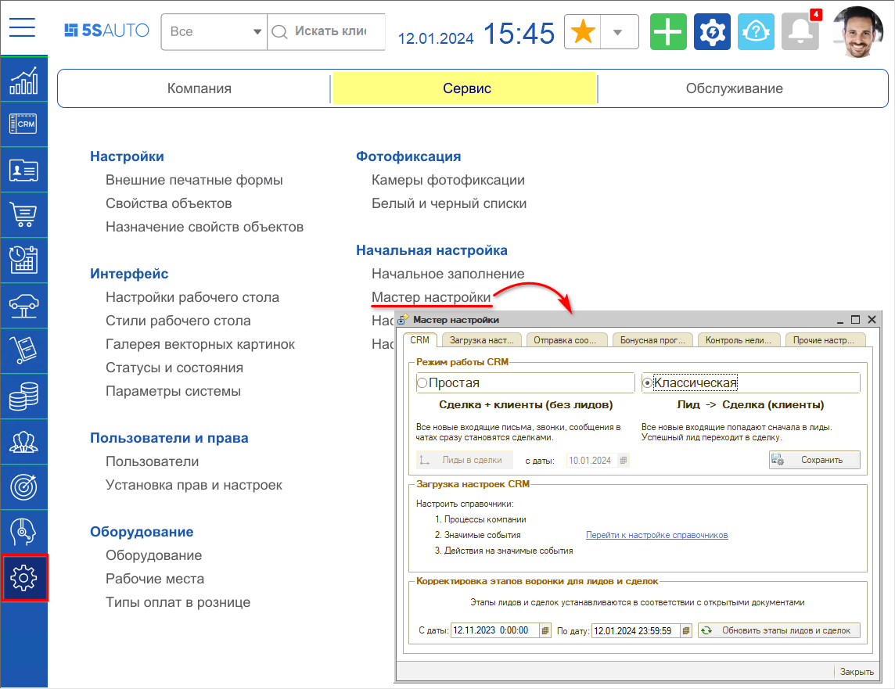

## CRM

*<раздел в разработке>*

1. Режим работы CRM 
2. Загрузка настроек CRM 
3. Корректировка этапов воронки для лидов и сделок

## Загрузка настроек

Для организации работы системы существуют предварительно заполненные справочники. Для того, чтобы загрузить предопределенные значения справочников предусмотрен *Мастер настройки системы*. Данный инструмент позволяет в одном месте загрузить новые или обновить текущие значения справочников. Кроме того, в *Мастере настроек системы* можно произвести изменения загруженных настроек.

Предусмотрены следующие режимы загрузки:

1. *Полностью обновить* - загрузятся предопределенные настройки значений справочников, т.е. произойдет сброс на значения по умолчанию.
2. *Загрузить новые* - загрузятся только новые значения справочников, текущие значения изменены не будут.
3. *Кроме измененных* - загрузятся новые значения справочников и обновятся текущие значения, в которых не были произведены изменения.
4. *Не обновлять* - предлагается по умолчанию, элементы справочника не будут изменены: не загрузятся новые значения и не обновятся текущие.

Для загрузки настроек нажмем кнопку "Загрузить настройки" окна Мастера:

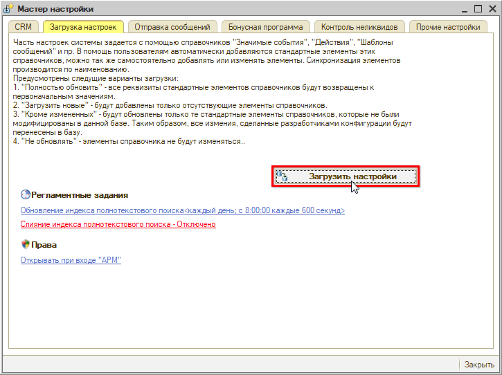

В появившемся окне загрузки настроек определим режимы загрузки для каждого справочника.

Можно задать вариант загрузки для всех справочников сразу:

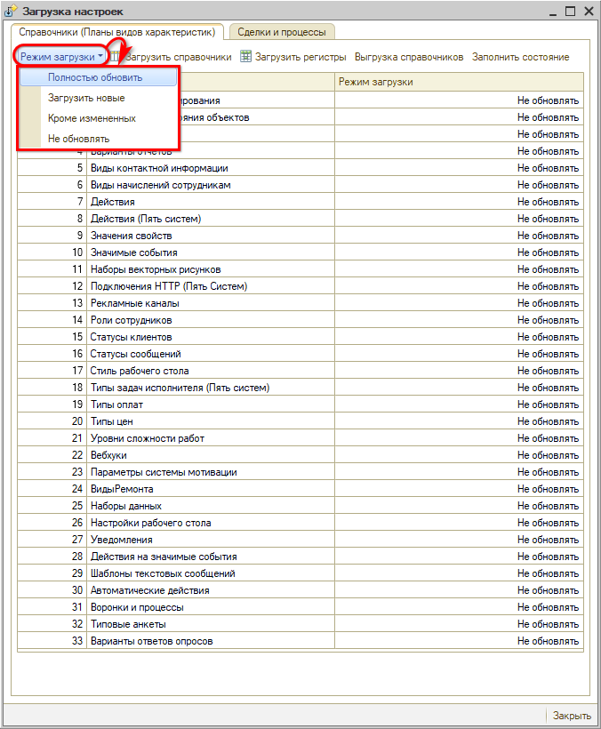

Можно задать вариант загрузки для каждого справочника по отдельности:

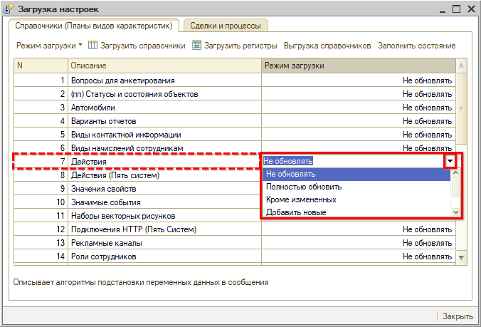

После того как режим загрузки выбран, нажимаем кнопку "Выполнить":

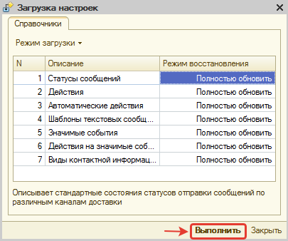

Готово! Изменения в справочники загружены.

## Настройка отправки сообщений

Настройка отправки сообщений находится на вкладке "Отправка сообщений" *Мастера настройки системы*.

### Общие настройки

Общие настройки располагаются на соответствующей вкладке:

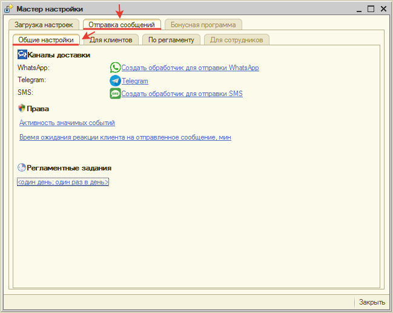

В общих настройках собраны все настройки, которые влияют на работу функционала "Отправка сообщений".

#### Каналы доставки

Для отправки сообщений должен быть настроен минимум один мессенджер.

Все настройки производится в справочнике "Интеграции" (см. [*Настройка интеграции с мессенджерами для рассылки сообщений*](../../Сообщения/Настройка%20интеграции%20с%20мессенджерами%20для%20рассылки%20сообщений/)). Для удобства в *Мастере* представлены ссылки на значения справочника, характерные для соответствующего мессенджера.

Если настройка мессенджера произведена, то отображается наименование настройки и ссылка на настроенное значение в справочнике:

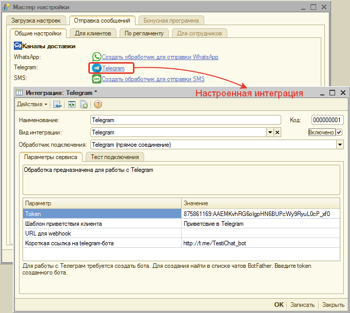

Если настройка мессенджера не произведена, то отображается ссылка на создание интеграции с предопределенным видом интеграции и обработчиком:

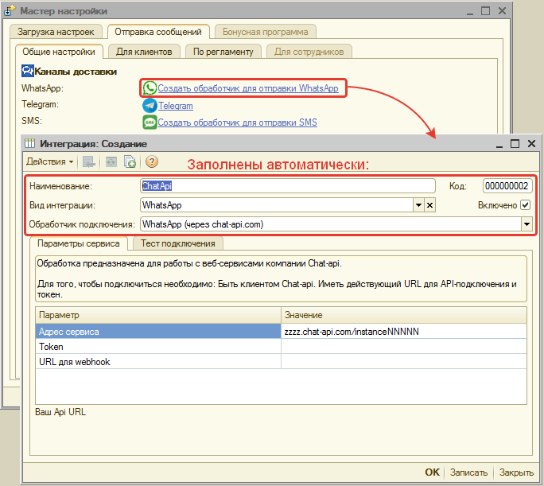

#### Права

В *Мастере* вынесены права АРМ "Администрирование", которые влияют на функционал:

1. *Активность значимых событий* - управляет работой встроенного типового механизма "Значимые события". Если установлено значение "Нет", то значимые события не обрабатываются в системе.
2. *Время ожидания реакции клиента на отправленное сообщение, мин* - время ожидания прочтения сообщения клиентом в мессенджере. После истечения заданного времени выбирается следующий канал доставки. По умолчанию устанавливается 10 мин.

Переход по ссылке с наименованием права ведет на настройку права в АРМ "Администрирование".

#### Регламентные задания

Необходимо настроить Регламентное задание "Обмен сообщениями (Пять систем)" по определенному Расписанию, по которому будет срабатывать отправка сообщений роботом.

Для настройки:

1. Перейдем по ссылке на текущее расписание:  
   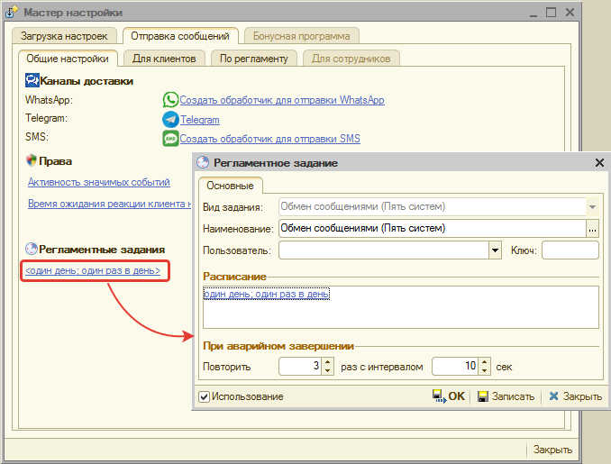
2. В открывшемся окне настройки Регламентного задания перейдем к настройке Расписания:  
   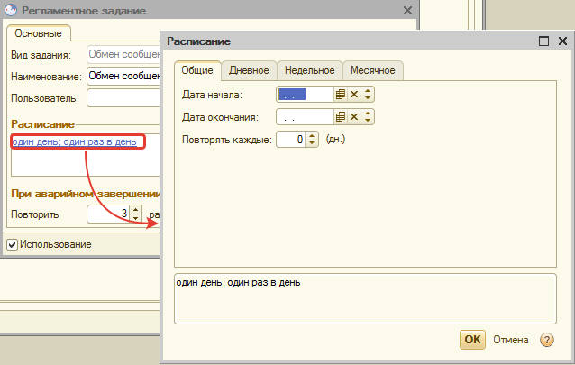
3. В открывшемся окне настройки Расписания укажем, что Регламентное задание будет срабатывать каждый день, каждые 60 сек.:  
   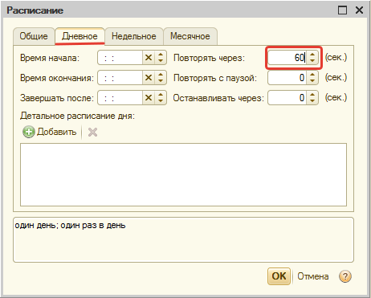
4. Сохраним изменения в Расписании, нажав кнопку "ОК" окна "Расписание".
5. Сохраним изменения в Регламентном задании, нажав кнопку "ОК" окна "Регламентное задание".

В итоге настроено Регламентное задание по определенному расписанию:

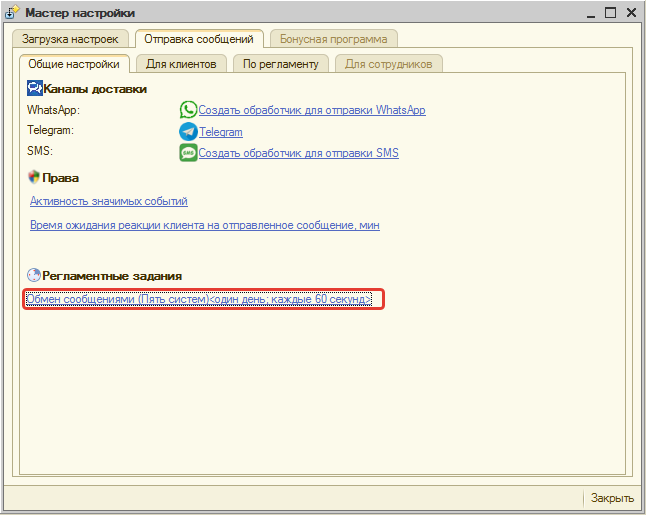

### Настройка отправки сообщений клиентам

В *Мастере настроек системы* вынесены основные параметры по преднастроенным значимым событиям (см. [*Преднастроенные значимые события*](../../Сообщения/Преднастроенные%20значимые%20события/prednastroennye-znachimye-sobytiya.md)):

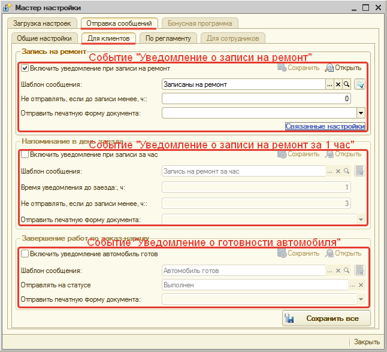

Описание параметров см. ниже: *Параметры настройки*.

Чтобы перейти к форме просмотра Значимого события, нажмите кнопку "Открыть":

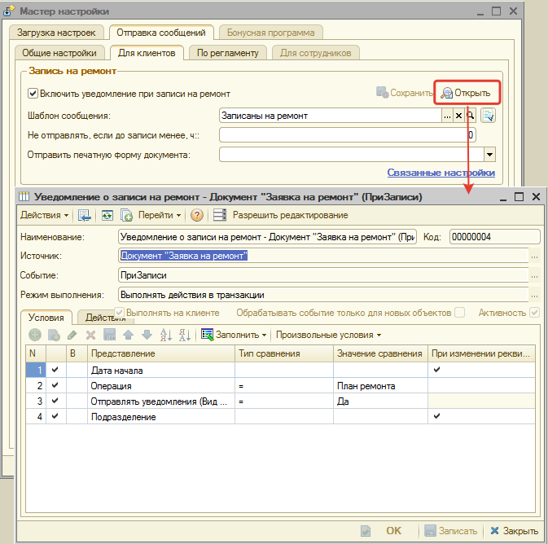

Чтобы сохранить изменения по событию, нажмите кнопку "Сохранить" в блоке с параметрами события:

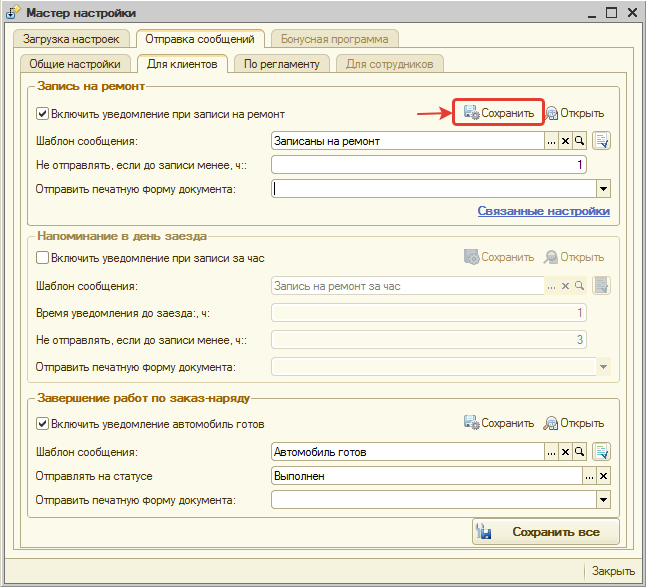

Чтобы сохранить изменения по всем событиям, нажмите кнопку "Сохранить все":

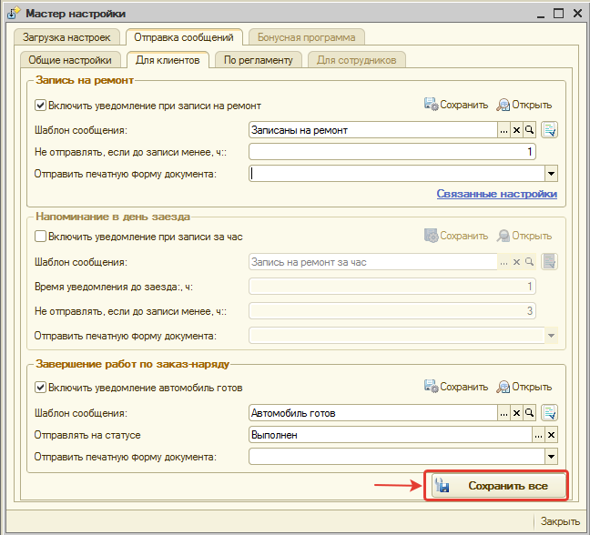

#### Параметры настройки

| **Параметр** | **Тип параметра** | **Принадлежность к блоку** | **Описание** |
| --- | --- | --- | --- |
| **Включить уведомление ...** | Переключатель | Общий для всех | Активирует или деактивирует значимое событие. |
| **Шаблон сообщения** | Поле выбора | Общий для всех | Устанавливает шаблон сообщения. Можно просмотреть выбранный шаблон, отредактировать его или выбрать другой. Как настроить шаблон см. [*Шаблоны сообщений*](../../Сообщения/Шаблоны%20сообщений/shablony-soobscheniy.md). Кроме того, предусмотрена функция предварительного просмотра сообщения по кнопке  "Проверить шаблон сообщения". Кнопка располагается рядом с параметром "Шаблон сообщения". |
| **Отправить печатную форму документа** | Поле выбора | Общий для всех | Устанавливает печатную форму документа, которая будет отправляться в сообщении. |
| **Не отправлять, если до записи менее. ч** | Поле ввода | Запись на ремонт, Напоминание в день заезда | Если до заезда автомобиля осталось менее установленного в параметре времени, сообщение не будет отправляться. Например, если клиент собрался приехать через 2 часа, то отправлять ему напоминание не имеет смысла. |
| **Связанные настройки** | Кнопка-ссылка | Запись на ремонт | По клику на кнопку-ссылку открывается окно с перечнем связанных настроек. Отображаются настройки, которые используются для подстановки в шаблоне и должны быть заполнены для корректного формирования сообщения. В преднастроенном шаблоне указывается адрес, телефон, название организации и ссылка на карту, поэтому соответствующие параметры должны быть заполнены по подразделению, которое указано в документе. |
| **Время уведомления до заезда, ч** | Поле ввода | Напоминание в день заезда | Сообщение будет отсылаться, если до времени заезда автомобиля осталось указанное в параметре количество часов. |
| **Отправлять в статусе** | Поле выбора | Завершение работ по заказ-наряду | Выбирается статус документа "Заказ-наряд", при переходе в который будут отправляться сообщения. |

#### Проверка шаблона сообщения

По выбранному параметру "Шаблон сообщения" можно проверить как будет выглядеть текст сообщения, который в итоге получит клиент. Для проверки нажмите кнопку "Проверить шаблон сообщения":

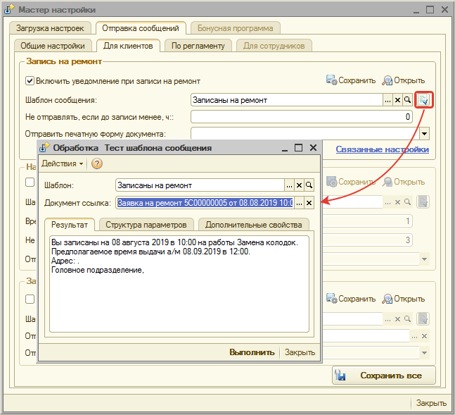

В окне обработки "Тест шаблона сообщения" в поле "Документ ссылка" подставляется документ, из которого отображаются данные в сообщении:

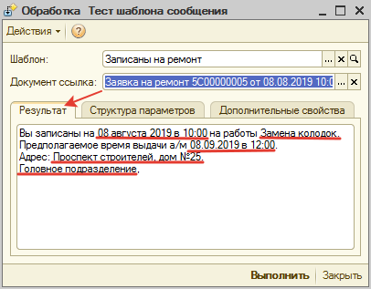

Можно изменить параметры "Шаблон" или "Документ ссылка". В этом случае, чтобы просмотреть результат, нажмите кнопку "Выполнить":

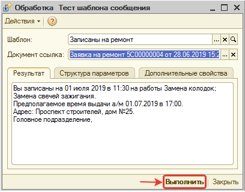

### Особенности настройки отправки сообщений по WhatsApp

Должны быть настроены следующие права для автоматической отправки сообщений: *«Активность значимых событий» –* значение *= «Да»* и *«Время ожидания реакции клиента на отправленное сообщение, мин»* значение права по умолчанию *= 10*.

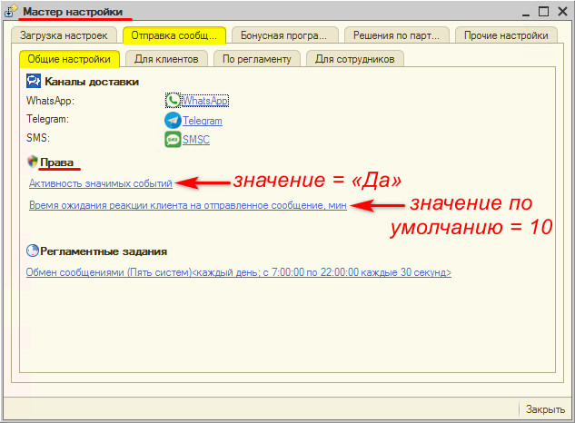

Эти настройки действуют следующим образом: если было отправлено сообщение по WhatsApp, а статус сообщения не сменился на «Прочитано» в течение указанного в настройке времени (10 минут), то отправка автоматически повторяется по другому каналу (Telegram, SMSC).

Порядок отправки по каналам доставки задается в настройках уведомлений по значимым событиям.

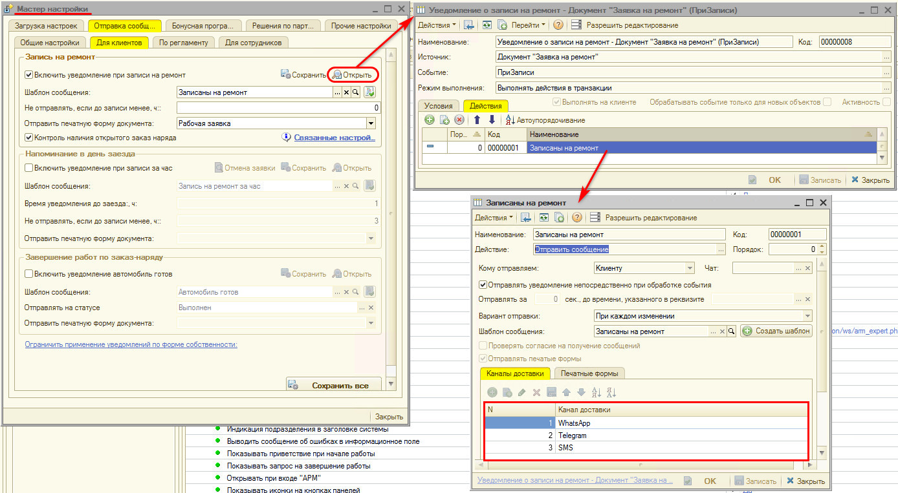

### Настройка регламентных заданий

На вкладке "По регламенту" предусмотрена возможность настроить выполнение автоматических действий системы, которые выполняются по регламентному заданию:

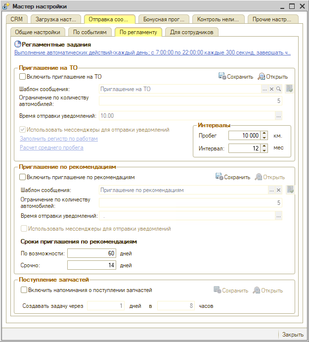

#### Приглашение на ТО

В *Мастере настроек* можно произвести все необходимые настройки для организации приглашений клиентов на ТО — см. [статью](../../CRM/Приглашения%20на%20ТО/priglasheniya-na-to.md):

1. Через отправку сообщений, используя мессенджеры: WhatsApp, Telegram.
2. Путем создания задачи "Пригласите клиента на ТО" мастеру-консультанту.

Для включения автоматического действия установите *флажок "Включить приглашение на ТО".*

При начале работы в программе необходимо рассчитать средний пробег по автомобилям, нажав кнопку-ссылку *"Расчет среднего пробега".* Это делается одни раз. В дальнейшем средний пробег будет перерасчитываться при изменении значения параметра "Пробег" для автомобиля.

В поле *"Ограничение по количеству автомобилей"* укажите максимальное количество автомобилей в день, по которым следует создавать приглашения на ТО.

**Обязательно укажите показатели межсервисного интервала**, так как приглашение на ТО будет формироваться по ним. Межсервисный интервал заполняется в списке Регламентных работ, который открывается по кнопке-ссылке *"Заполнить регистр по работам":*

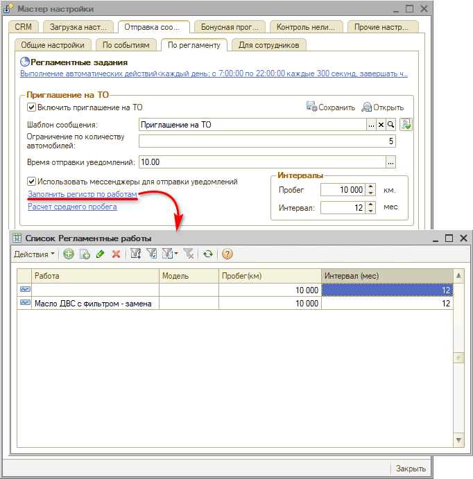

В списке Регламентных работ должен быть установлен пробег и интервал без привязки к работе и модели автомобиля — общие для всех автомобилей. По необходимости можно уточнить пробег и интервал по конкретной работе и модели. Работа при этом должна быть помечена как выполняемая регулярно при ТО:

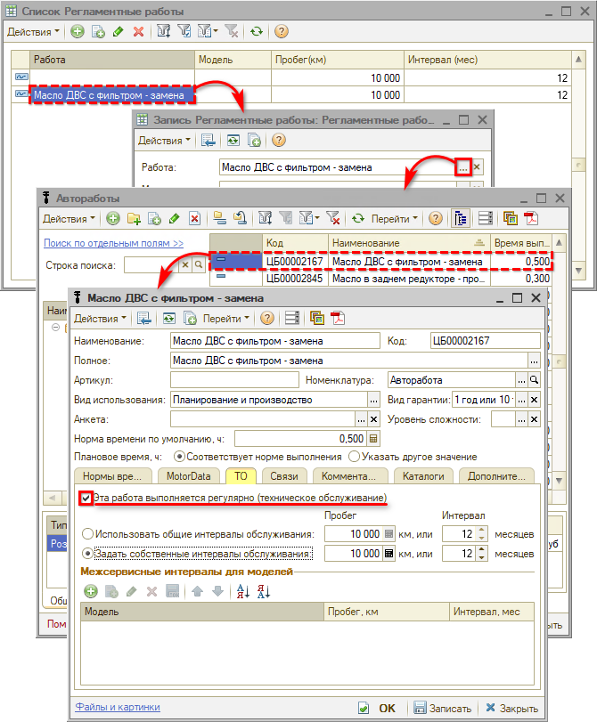

*Для того, чтобы приглашать клиента на ТО через мессенджеры:*

- установите флажок "Использовать мессенджеры для отправки уведомлений";
- укажите время отправки сообщения в поле "Время отправки уведомлений";
- настройте шаблон сообщения в поле "Шаблон сообщения", при этом есть возможность проверить шаблон по аналогии с настройкой отправки сообщений клиенту (см. *[Проверка шаблона сообщения](#проверка-шаблона-сообщения)).* 
  *Примечание:* Для WABA должны быть настроены и подтверждены специальные шаблоны — см. в статье "[Настройка шаблонов WhatsApp Business API](../../Сообщения/WhatsApp/Настройка%20шаблонов%20WhatsApp%20Business%20API/nastroyka-shablonov-whatsapp-business-api.md)".

Вне зависимости от того, настроена ли отправка приглашений на ТО через мессенджеры, по истечении срока межсервисного интервала будет создаваться лид или сделка в специальном разделе "Пригласите на ТО".

Если при этом настроена отправка приглашений на ТО через мессенджеры, то клиенту также будет автоматически отправлено сообщение по настроенному ранее шаблону.

Также создается задача "Пригласите клиента на ТО" на должность "Мастер-консультант" (если клиент ответит на сообщение, то создастся задача "Укажите результат обращения" в бизнес процессе "Контакт с клиентом", если клиент не ответит, то на следующий день после отправки сообщения создастся задача "Пригласите клиента на ТО").

***Внимание!*** Для сохранения изменений в параметрах не забудьте нажать на кнопку *"Сохранить"* в блоке "Приглашение на ТО". Изменения в списке Регламентных работ (кнопка-ссылка "Заполнить регистр по работам") и расчет среднего пробега производятся сразу — в этом случае нажимать кнопку "Сохранить" нет необходимости.

#### Приглашение по рекомендациям

В *Мастере настроек* можно произвести все необходимые настройки для организации приглашений клиентов по рекомендациям ремонта — см. [статью](../../Автосервис/Работа%20с%20рекомендациями/rabota-s-rekomendaciyami.md):

1. Через отправку сообщений, используя мессенджеры: WhatsApp, Telegram.
2. Путем создания задачи "Пригласите клиента по рекомендациям" мастеру-консультанту.

Приглашения создаются по автомобилям клиентов, для которых:

1. Установлены рекомендации.
2. Минимум у одной рекомендации значение "Актуально по" = <Текущая дата> ИЛИ (значение "Актуально по" не заполнено И <Дата рекомендации> + <Количество дней для степени критичности> = <Текущая дата>).

**Для включения автоматического действия создания приглашений** установите флажок "Включить приглашение по рекомендациям".

В поле "Ограничение по количеству автомобилей" укажите максимальное количество автомобилей в день, по которым следует создавать приглашения по рекомендациям.

*Для того, чтобы приглашать клиента по рекомендациям через мессенджеры:*

- установите флажок "Использовать мессенджеры для отправки уведомлений";
- укажите время отправки сообщения в поле "Время отправки уведомлений";
- настройте шаблон сообщения в поле "Шаблон сообщения", при этом есть возможность проверить шаблон по аналогии с настройкой отправки сообщений клиенту (см. [*Проверка шаблона сообщения*](#проверка-шаблона-сообщения)*). 
  Примечание:* Для WABA должны быть настроены и подтверждены специальные шаблоны — см. в статье "[Настройка шаблонов WhatsApp Business API](../../Сообщения/WhatsApp/Настройка%20шаблонов%20WhatsApp%20Business%20API/nastroyka-shablonov-whatsapp-business-api.md)".

Вне зависимости от того, настроена ли отправка приглашений по рекомендациям через мессенджеры, при наступлении срока критичности для рекомендаций будет создаваться лид или сделка в специальном разделе "Пригласить по рекомендациям".

Если при этом настроена отправка приглашений по рекомендациям через мессенджеры, то клиенту также будет автоматически отправлено сообщение по настроенному ранее шаблону.

Также создается задача "Пригласите клиента по рекомендациям" на должность "Мастер-консультант" (если клиент ответит на сообщение, то создастся задача "Укажите результат обращения" в бизнес процессе "Контакт с клиентом", если клиент не ответит, то на следующий день после отправки сообщения создастся задача "Пригласите клиента по рекомендациям").

*По рекомендациям предоставлена возможность **настроить количество дней актуальности рекомендации** в зависимости от степени ее критичности*:

1. По возможности.
2. Срочно.

По указанным значениям по умолчанию рассчитывается значение рекомендации "Актуально по" как <Текущая дата> + <Количество дней для степени критичности>.

***Внимание!*** Для сохранения изменений в параметрах не забудьте нажать на кнопку "Сохранить" в блоке "Приглашение по рекомендациям".

## Настройка бонусной программы

См. [Настройка бонусной системы → Мастер настроек бонусных программ](../../Бонусная%20система/Настройка%20бонусной%20системы/nastroyka-bonusnoy-sistemy.md).

## Контроль неликвидов

См. [Настройка прав доступа к Контролю неликвидов](../../Контроль%20неликвидов/Настройка%20прав%20доступа%20к%20Контролю%20неликвидов/nastroyka-prav-dostupa-k-kontrolyu-nelikvidov.md).

## Прочие настройки

*<раздел в разработке>*

---

**Теги:** администрирование, мастер настройки, первоначальная настройка, параметры, система
