

# Настройка видимости складов

<table><tr><td><b>Время чтения:</b> 12 мин.</td><td><b>Обновлено:</b> 08.09.2025</td></tr></table>

Источник: https://www.5systems.ru/help/nastroyka-vidimosti-skladov

> *Актуально начиная с версии релиза 5S AUTO **2.8.2**. Разделение настройки видимости остатков и права проведения документов – с релиза **2.8.3**.*

## Содержание

1. [Введение](#введение)
2. [Описание](#описание)
   - [1. Ограничение видимости остатков](#1-ограничение-видимости-остатков)
   - [2. Ограничение ввода документов](#2-ограничение-ввода-документов)
      - [1) Для пользователей без ограничения доступа по подразделениям](#1-для-пользователей-без-ограничения-доступа-по-подразделениям)
      - [2) Для пользователей RLS](#2-для-пользователей-rls)
3. [Настройка](#настройка)
   - [1. В карточке пользователя](#1-в-карточке-пользователя)
   - [2. В карточке склада](#2-в-карточке-склада)

## Введение

*Настройка видимости складов* позволяет ограничить пользователям доступ к информации по остаткам товаров на отдельных складах в некоторых интерфейсах программы, а также ограничить возможность создания и редактирования документов по определенным складам.

Например, функционал полезен для настройки прав *[пользователям RLS](../Доступ%20к%20данным%20по%20подразделениям%20%28RLS%29/dostup-k-dannym-po-podrazdeleniyam-rls.md).* Ограничение RLS оставляет пользователю доступ к просмотру остатков товаров по складам недоступных ему подразделений. Для того, чтобы пользователю не мешала лишняя информация, есть возможность дополнительно настроить видимость складов.

## Описание

### 1. Ограничение видимости остатков

Настройка видимости остатков позволяет ограничить доступ к информации по складам в следующих интерфейсах:

- форма [справочника номенклатуры](../../Склад%20и%20запчасти/Номенклатура/nomenklatura.md#работа-со-справочником-номенклатура);
- форма [элемента номенклатуры](../../Склад%20и%20запчасти/Номенклатура/nomenklatura.md#карточка-номенклатуры);
- [АРМ "Корзина"](../../Проценка%20запчастей%20и%20работ/Работа%20в%20АРМ%20Корзина/rabota-v-arm-korzina.md);
- [Поиск цен](../../Проценка%20запчастей%20и%20работ/Поиск%20цен/poisk-cen.md);
- отчеты “Остатки и обороты товаров” и “Остатки и обороты партий товаров”[\*](#snoska).

Другими словами, пользователь не будет видеть остатки товаров по недоступным ему складам в указанных местах в программе.

Доступ к видимости остатков по складам действует одинаково для пользователей с ограничением по подразделениям (RLS) и без ограничений (с ролями “Пользователь”, “Минимальный набор прав” или “Полные права”).

*\*Примечание:* В отчетах “Остатки и обороты товаров”, “Остатки и обороты партий товаров” автоматически устанавливается отбор по доступным складам. При снятии отбора пользователь может просматривать остатки по всем складам. Для пользователей RLS автоматически устанавливается отбор по доступным подразделениям, который также можно снять.

**Пример 1.**

Пример отображения остатков в списке номенклатуры для пользователя без настройки видимости по складам:

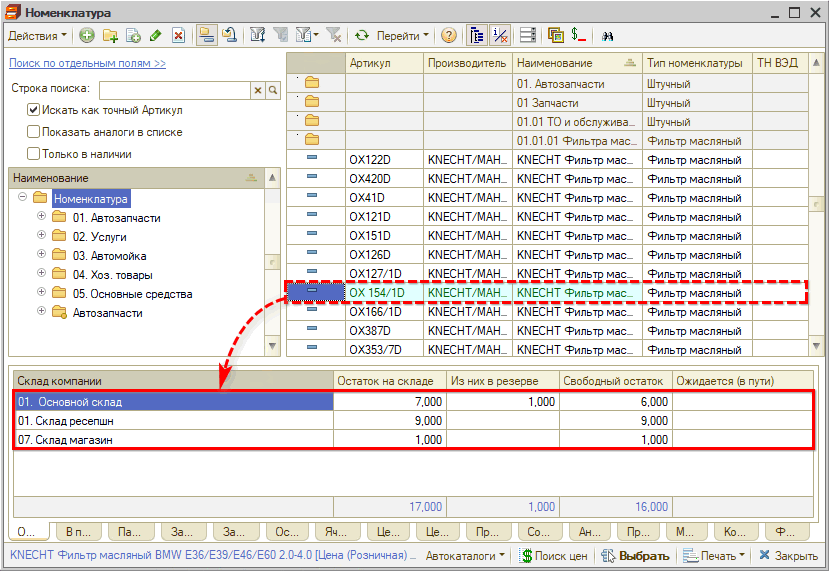

Отображение остатков в списке номенклатуры после настройки ограничения видимости по складам:

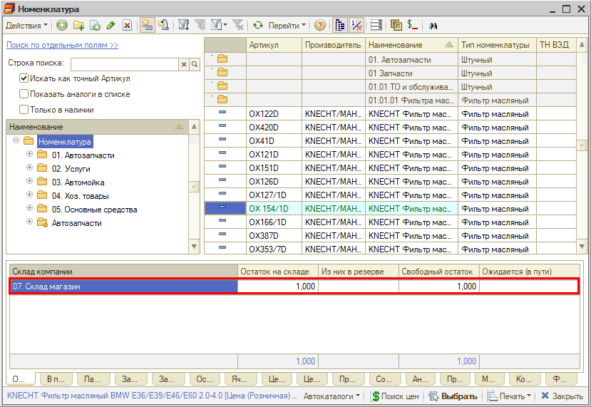

**Пример 2.**

Пример отображения остатков товара в интерфейсе “Корзины” для пользователя без настройки видимости по складам:

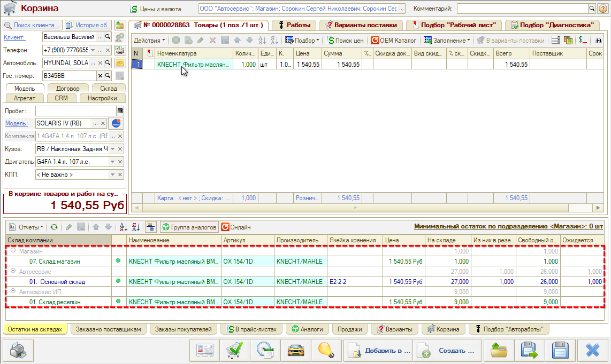

После настройки видимости по складам пользователь будет видеть только остатки по доступным ему складам:

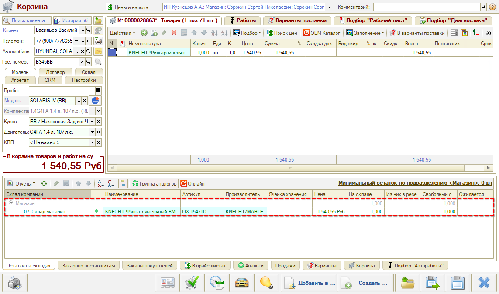

**Пример 3.**

Пример отображения остатков в Поиске цен для пользователя без настройки видимости по складам:

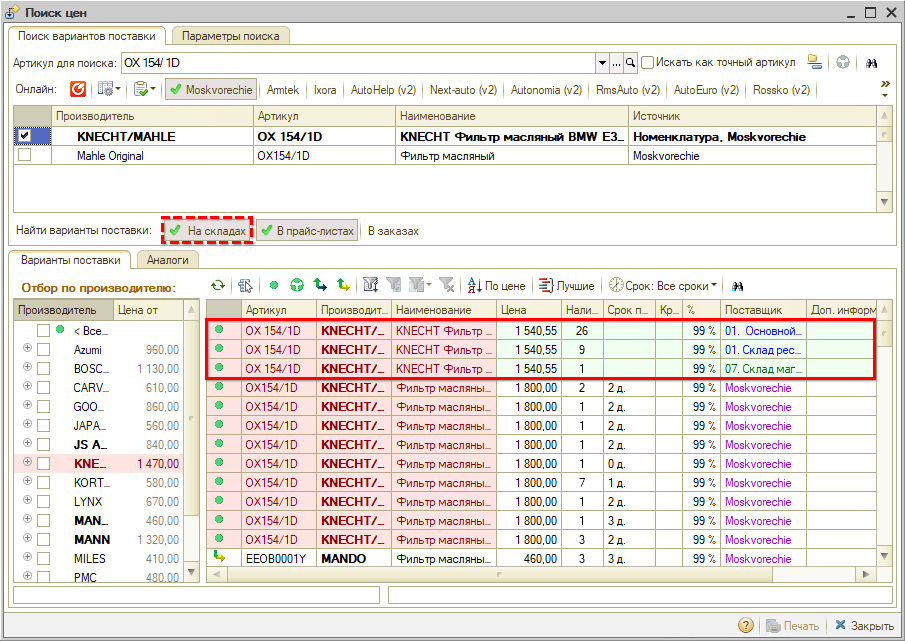

Отображение остатков в Поиске цен после настройки видимости по складам:

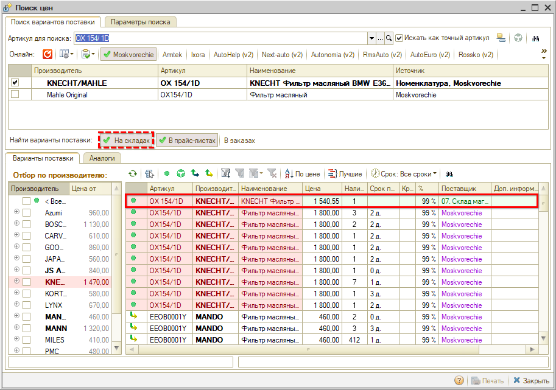

### 2. Ограничение ввода документов

#### 1) Для пользователей без ограничения доступа по подразделениям

Для пользователей *без ограничений доступа по подразделениям* (с [ролями](../../Пользователи%20и%20права/Роли%20пользователей/roli-polzovateley.md) “Пользователь”, “Минимальный набор прав” или “Полные права”) настройка видимости складов позволяет *запретить проведение документов* по каждому отдельному складу.

Пользователь сможет *просматривать, создавать и сохранять непроведенные документы* по недоступному складу, но при попытке *провести* документ или внести изменения в уже проведенный документ будет выходить служебное сообщение о запрете проведения документов с текущим складом, провести документ не удастся:

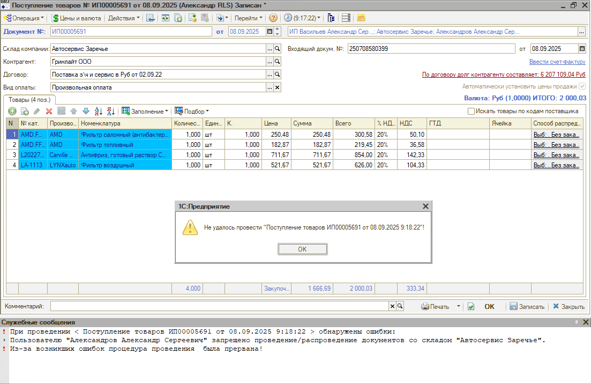

*Примечание:* Если доступ к документам по складу закрыт, то доступ к просмотру остатков по этому складу может быть либо также закрыт через отдельную настройку (см. [ниже](#1-для-пользователей-без-ограничения-доступа-по-подразделениям-1)), либо сохранен. Если доступ к документам по складу открыт, то автоматически открыт и доступ к остаткам по нему.

#### 2) Для пользователей RLS

1. **По запрещенным складам доступных подразделений**

   Для *пользователей RLS* в случае если подразделение доступно пользователю, но запрещен доступ к документам *по складу* – логика работы ограничений действует так же, как для пользователей без ограничений RLS (см. [выше](#1-для-пользователей-без-ограничения-доступа-по-подразделениям)).

2. **По складам недоступных подразделений**

   Ограничения роли *"Пользователь RLS"* по приоритету перекрывают действие настройки видимости складов: т.е. если будет стоять отметка доступа к документам по складу, пользователь все равно *не будет* видеть документы недоступных подразделений.

   *Примечание:* При этом, если будет стоять галочка видимости остатков, то пользователь RLS будет видеть остатки по этому складу.

## Настройка

### 1. В карточке пользователя

Доступ к складам настраивается в карточке [пользователя](../../Пользователи%20и%20права/Пользователи/polzovateli.md) программы на вкладке *“Доступ к складам”:*

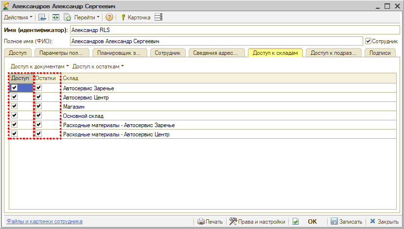

- колонка *“Доступ”* регулирует доступ к *редактированию документов* по складу;
- колонка *“Остатки”* регулирует доступ к *просмотру остатков* по складу.

#### 1) Для пользователей без ограничения доступа по подразделениям

При установке галочки в столбце “Доступ” автоматически устанавливается галочка в столбце “Остатки” – т.е. при предоставлении доступа к документам по складу также открывается доступ к просмотру остатков по нему:

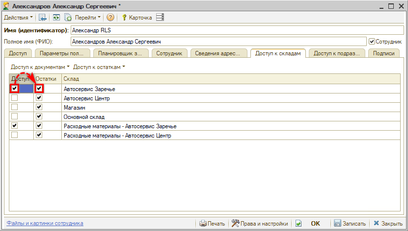

Доступ к просмотру остатков предоставляется независимо от доступа к документам – т.е. галочка устанавливается только в столбце “Остатки”.

Для групповой установки настроек используются кнопки выпадающего меню – отдельно для доступа к документам и для доступа к остаткам:

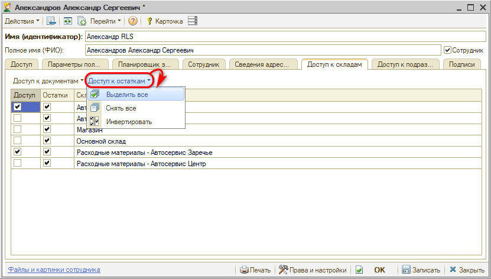

#### 2) Для пользователя RLS

Для *пользователя RLS* склады подразделений, к которым у него нет доступа, выделены серым цветом. По умолчанию у них установлены все галочки в столбце “Доступ” – в этом случае пользователь будет видеть остатки по складам подразделений, к которым у него нет доступа.

Для того, чтобы скрыть эти склады для пользователя, нужно нажать кнопку *“Доступ к остаткам → Запретить склады недоступных подразделений”* – при этом будут сняты галочки со всех складов недоступных подразделений:

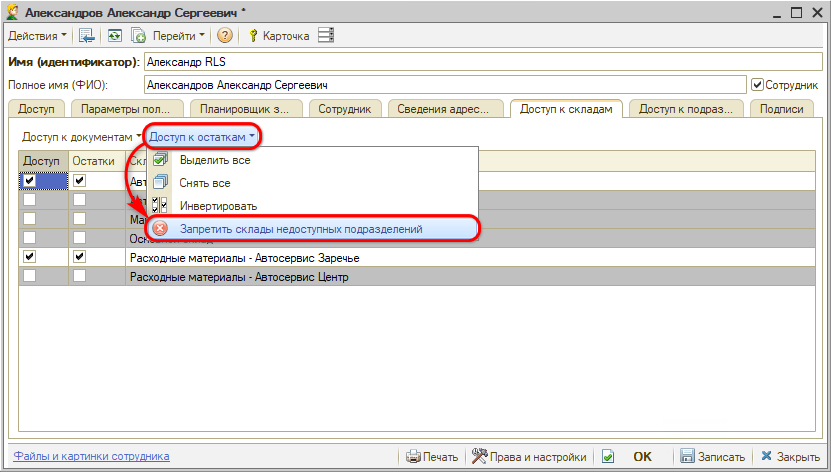

Либо можно отметить нужные склады вручную.

После установки настроек необходимо ***записать*** изменения в карточке пользователя.

### 2. В карточке склада

Для настройки доступа пользователей к конкретному складу следует перейти в карточку склада на вкладку *“Доступ пользователей”:*

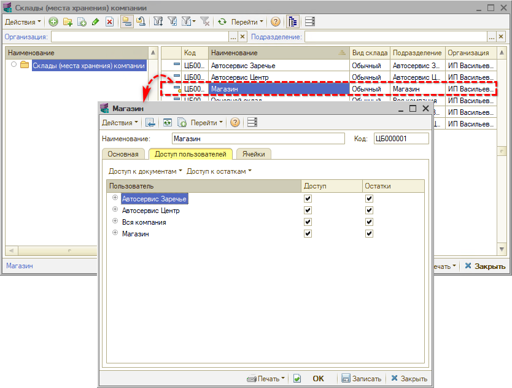

На данной вкладке отображаются все пользователи программы в разбивке по подразделениям, принадлежность к которым указана в параметрах пользователя.

Есть возможность настроить видимость остатков склада и возможность редактирования документов для пользователей – для этого следует отметить галочками пользователей, у которых должен быть доступ к данному складу, и снять галочки у пользователей, у которых не должно быть доступа.

Настройка доступа к документам производится установкой отметок в колонке “Доступ”, доступа к остатками по складу – установкой отметок в колонке “Остатки”.

Для групповой установки настроек используется меню, открывающееся по кнопке “Закрыть доступ” – отдельно для доступа к документам и для доступа к остаткам:

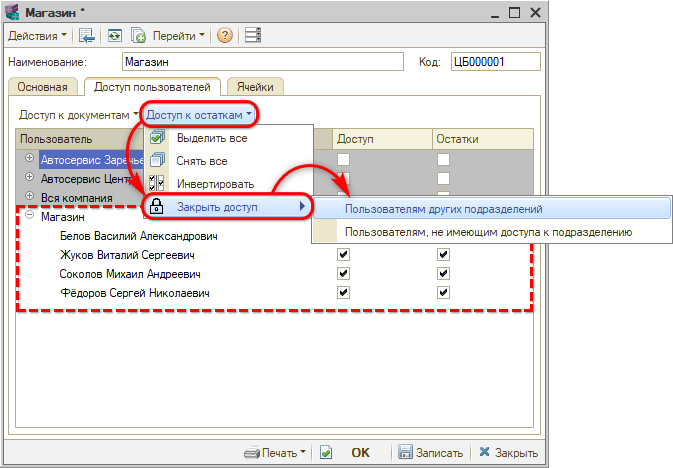

- кнопка *“Закрыть доступ → Пользователям других подразделений”* оставляет только тех пользователей, у которых подразделение совпадает с подразделением данного склада;
- кнопка *“Закрыть доступ → Пользователям, не имеющим доступа к подразделению”* используется для запрета доступа пользователям RLS, не имеющим доступа к подразделению, которому принадлежит данный склад.

Изменения в настройках склада необходимо ***записать***.

---

**Теги:** администрирование, складской учет, склады, видимость, права

