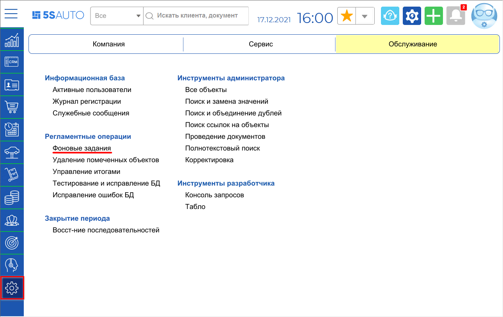
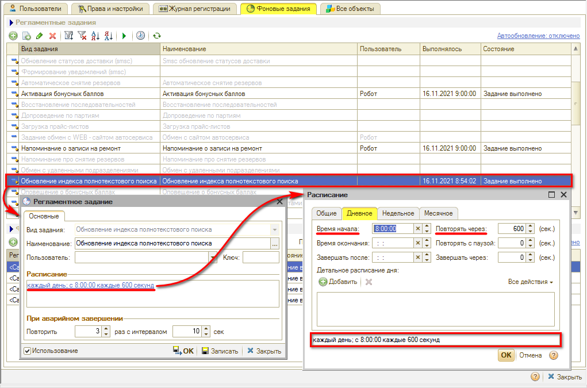
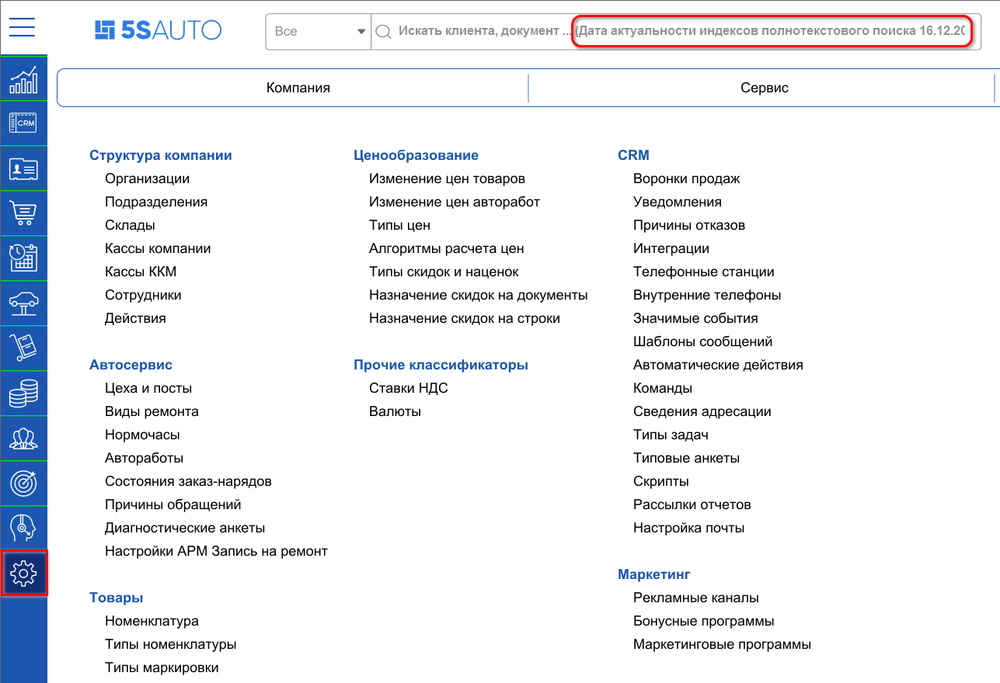
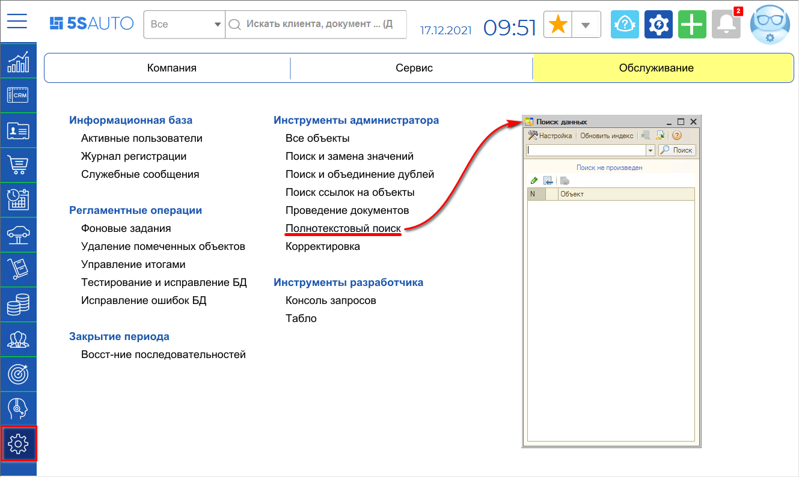
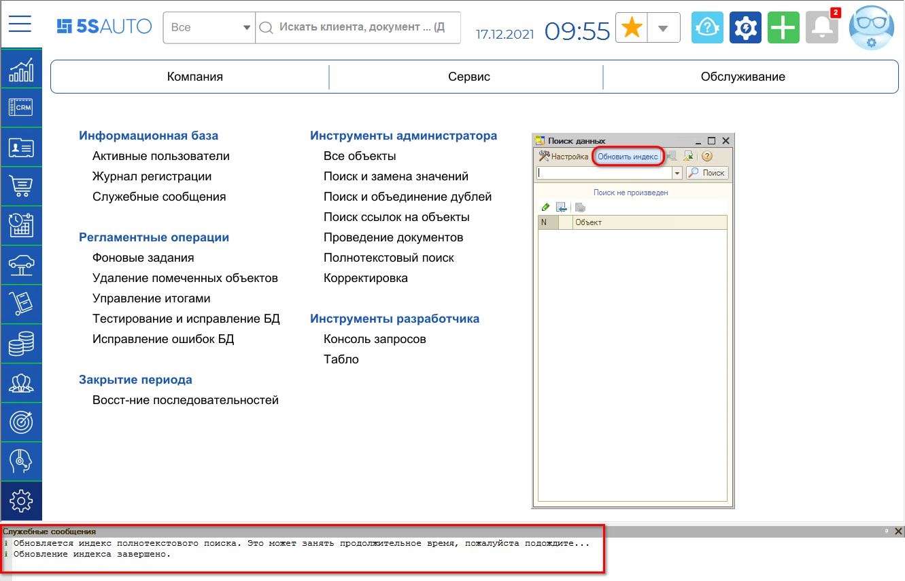
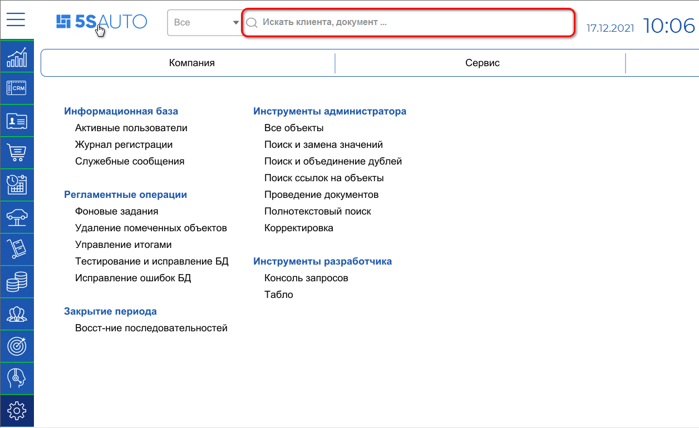
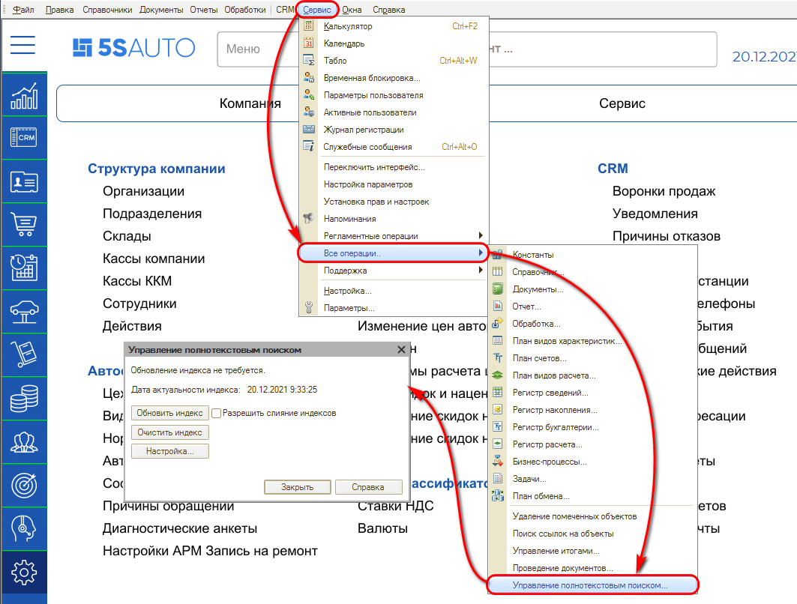
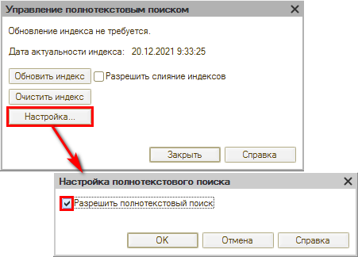
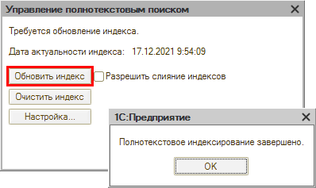
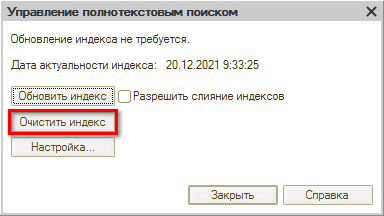

# Настройка полнотекстового поиска

<table><tr><td><b>Время чтения:</b> 7 мин.</td><td><b>Обновлено:</b> 14.01.2026</td></tr></table>

Источник: https://www.5systems.ru/help/nastroyka-polnotekstovogo-poiska

> *Актуально начиная с версии релиза 5S AUTO **2.001.001**.*

## Содержание

1. [Введение](#введение)
2. [Обновление индекса полнотекстового поиска](#обновление-индекса-полнотекстового-поиска)
   - [Настройка фонового обновления индекса поиска](#настройка-фонового-обновления-индекса-поиска)
   - [Обновление индекса поиска вручную](#обновление-индекса-поиска-вручную)
3. [Управление полнотекстовым поиском](#управление-полнотекстовым-поиском)
   - [Включение полнотекстового поиска](#включение-полнотекстового-поиска)
   - [Обновить индекс](#обновить-индекс)
   - [Очистить индекс](#очистить-индекс)

## Введение

О работе с механизмом полнотекстового поиска см. статью: [Работа с полнотекстовым поиском](../../CRM/Работа%20с%20полнотекстовым%20поиском/rabota-s-polnotekstovym-poiskom.md).

Механизм полнотекстового поиска основан на использовании полнотекстового индекса, который создается в базе данных и затем периодически, по мере необходимости, обновляется.

После добавления в базу новой [сделки](../../CRM/Работа%20со%20сделкой/rabota-so-sdelkoy.md), документа, [контрагента](../../Работа%20с%20клиентами/Контрагенты%20и%20контакты/kontragenty-i-kontakty.md) и пр. они не будут сразу отображаться в поиске, – они появятся там после того, как будет в очередной раз выполнено регламентное задание по обновлению индекса. Если регламентное задание не было настроено или включено, или не срабатывает, то поиск по новым элементам базы не будет работать.

## Обновление индекса полнотекстового поиска

Для фонового обновления индекса поиска необходимо включить регламентное задание.

### Настройка фонового обновления индекса поиска

Путь перехода к настройке фоновых заданий: *Администрирование → Обслуживание → Регламентные операции → Фоновые задания*

Обновлением индекса полнотекстового поиска управляет соответствующее фоновое задание, которое требуется настроить.

Устанавливается расписание обновления индекса – в частности, время начала (8:00) и интервал повтора (600 сек).

Для включения регламентного задания требуется установить флаг *“Использование”*.

Регламентное задание без указания пользователя может не работать. Для повышения стабильности работы регламентного задания можно указать [*пользователя*](../../Пользователи%20и%20права/Пользователи/polzovateli.md) “Робот” и проверить установленные у него роли: “Полные права”, “Администратор CRM”, “Пользователь”.

*Примечание:* При первом включении обновления индекса оно может занять продолжительное время: чем больше база, тем дольше будет идти обновление (~20 мин. в базе с 1-2 подразделениями, работающими в программе примерно год), – требуется подождать. Последующие обновления происходят за несколько секунд.

### Обновление индекса поиска вручную

Ручное обновление индекса может потребоваться при некорректной работе или при ошибке в работе автоматического обновления.

Обнаружить сбой в работе индексирования поиска можно по появившейся в окне поиска надписи “Дата актуальности индекса полнотекстового поиска <чч.мм.год>”.

Для обновления индекса полнотекстового поиска вручную предусмотрена специальная обработка.

Путь: *Администрирование → Обслуживание → Инструменты администратора → Управление полнотекстовым поиском*

Требуется нажать кнопку ***“Обновить индекс”***. Система проинформирует о начале и завершении обновления индекса посредством служебных сообщений.

Если надпись про дату актуальности индекса не исчезла из строки поиска, нужно нажать на логотип на верхней панели интерфейса для обновления.

## Управление полнотекстовым поиском

Обработка “Управление полнотекстовым поиском” позволяет регулировать работу поиска, исправлять ошибки посредством ручной очистки и обновления.

Обработка открывается через главное меню стандартного интерфейса: *Сервис → Все операции → Управление полнотекстовым поиском*

### Включение полнотекстового поиска

Чтобы полнотекстовый поиск работал, он должен быть включен: должна стоять “галочка” в настройках.

### Обновить индекс

Обработка также может использоваться для обновления индекса полнотекстового поиска вручную. Для этого требуется нажать кнопку “Обновить индекс”. Система уведомит о завершении обновления индекса.

### Очистить индекс

Кнопка “Очистить индекс” используется при некорректной работе индексирования или ошибках в индексе для полной очистки индекса полнотекстового поиска.

После очистки требуется обязательно сделать обновление индекса: при этом оно займет продолжительное время, как при первом включении обновления.

---

**Теги:** администрирование, полнотекстовый поиск, индекс, поиск, настройка

