

# Настройка рабочего стола

<table><tr><td><b>Время чтения:</b> 13 мин.</td><td><b>Обновлено:</b> 10.06.2022</td></tr></table>

Источник: https://www.5systems.ru/help/nastroyka-rabochego-stola

> *Актуально* *начиная с версии релиза* *2.001.001*

## Содержание

1. [Стиль рабочего стола](#стиль-рабочего-стола)
2. [Настройки разделов и пунктов рабочего стола](#настройки-разделов-и-пунктов-рабочего-стола)
   - [Настройка рабочего стола](#настройка-рабочего-стола)
      - [Справочник “Настройки рабочего стола”](#справочник-настройки-рабочего-стола)
      - [Разделы меню](#разделы-меню)
      - [Пункты меню в разделах](#пункты-меню-в-разделах)
      - [Редактирование состава рабочего стола](#редактирование-состава-рабочего-стола)
   - [Привязка интерфейса к пользователю](#привязка-интерфейса-к-пользователю)
3. [Автоматическая блокировка работы в программе](#автоматическая-блокировка-работы-в-программе)

## Стиль рабочего стола

**Стили рабочего стола** содержатся в соответствующем справочнике. Путь: *раздел “Администрирование” → Сервис → Стили рабочего стола*.

Чтобы настроить стиль рабочего стола для своей компании, можно открыть “Стиль по умолчанию” (5SYSTEMS) и изменять его. При необходимости можно будет восстановить преднастроенный стиль программы, нажав кнопку “Заполнить по умолчанию”.

Либо можно создать новый вариант стиля копированием элемента “Стиль по умолчанию”.

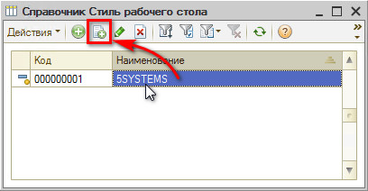

Карточка стиля содержит три вкладки с настройками. Рассмотрим подробнее каждую из них.

### Вкладка “Рабочий стол”

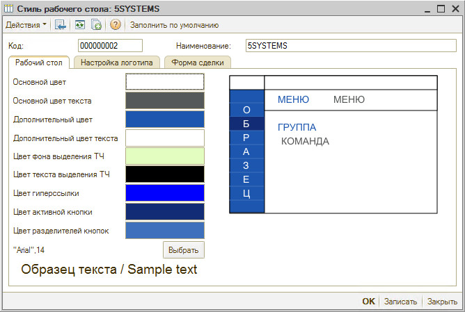

Здесь задается цвет стиля: настраиваются цвета кнопок, разделителей, текста, размер шрифта и т.д.

### Вкладка “Настройка логотипа”

На данной вкладке можно установить свой логотип, который будет отображаться в левом верхнем углу интерфейса программы. Логотип на данный момент рисуется из svg.

Обратитесь в техподдержку и специалисты установят вам новый логотип по желанию.

### Вкладка “Форма сделки”

Стилизация формы сделки: настройка цветов, размеров и шрифтов в сделке.

## Настройки разделов и пунктов рабочего стола

Наполнение [интерфейса 5S AUTO](../../CRM/Структура%20интерфейса%205S%20AUTO/struktura-interfeysa-5s-auto.md) настраивается максимально гибко.

[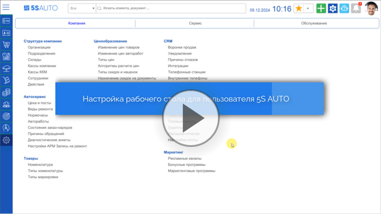](https://edu.5systems.ru/video/Polzovateli/Nastroyka_rabochego_stola_dlya_polzovatelya.mp4)

### Настройка рабочего стола

#### Справочник “Настройки рабочего стола”

Путь: *Администрирование → Сервис → группа “Интерфейс” → Настройки рабочего стола.*

Это справочник, в котором содержатся различные варианты настроек основного интерфейса для пользователей.

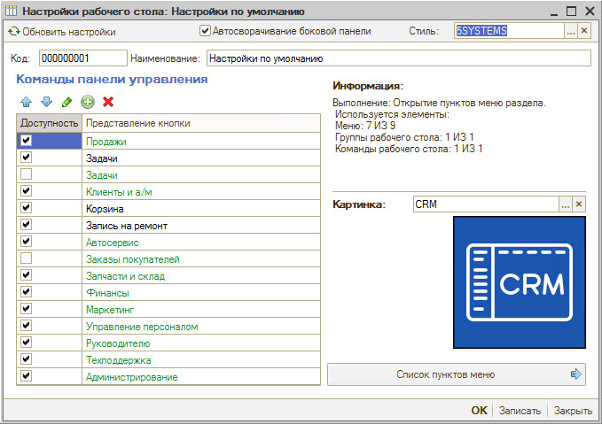

Можно создать несколько вариантов настройки рабочего стола, например: “Полный интерфейс”, “Мастер-приемщик”, “Оператор” и пр.

Рекомендуется создавать новый вариант настроек копированием элемента “Настройки по умолчанию” (а не добавлением нового).

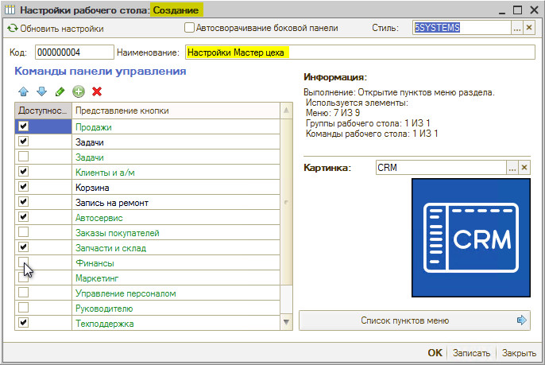

В карточке настройки можно добавлять разделы, изменять наименования, порядок пунктов меню, удалять лишние или просто скрывать ненужные пункты. Доступность (видимость) разделов меню регулируется установкой или снятием галочек.

#### Разделы меню

**Добавление нового раздела**

В случае, если необходимо добавить новый раздел в интерфейс, требуется нажать кнопку “Добавить команду”. Открывается окно “Новый элемент рабочего стола”.

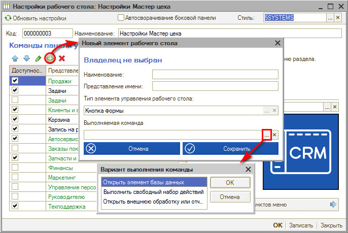

Нужно выбрать вариант выполнения команды:

1. “Открыть элемент базы данных” (справочник, документ, отчет);
2. “Открыть внешнюю обработку или отчет”
3. “Выполнить свободный набор действий” (из справочника “Действия (Пять систем)”)

**Картинка раздела**

При сворачивании боковой панели остается узкая вертикальная панель с символическими изображениями разделов меню. Выбор картинки либо загрузка новых производится в соответствующем поле карточки настройки.

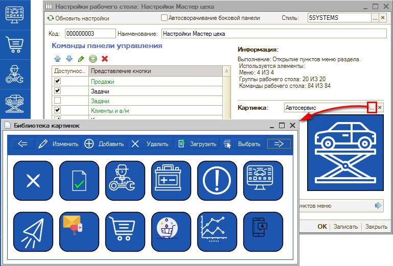

Для предустановленных разделов [*картинки*](../Библиотека%20картинок/biblioteka-kartinok.md) уже загружены. При добавлении новых разделов также необходимо выбрать или загрузить картинку, чтобы при сворачивании боковой панели кнопка раздела не осталась пустой.

**Автосворачивание боковой панели**

Если установлена галочка “Автосворачивание боковой панели”, то при нажатии на какой-либо раздел меню будет автоматически сворачиваться.

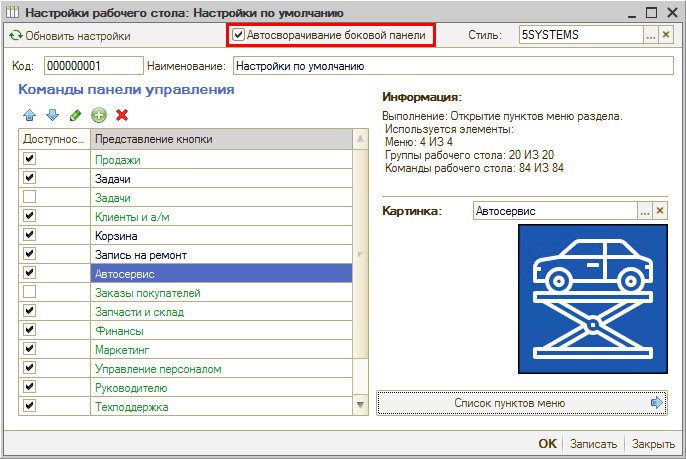

Первоначально рекомендуется ее не ставить, т.к. по одним картинкам пользователю сначала будет сложно ориентироваться.

#### Пункты меню в разделах

**Редактирование пунктов меню в разделах**

Разделы меню с наполнениями, например, “Автосервис”, делятся на подразделы, каждый из которых состоит из перечня пунктов, собранных в группы.

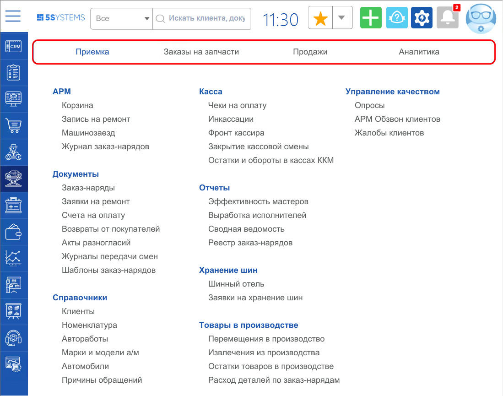

Для перехода к редактированию пунктов меню нажмите на кнопку *Список пунктов меню*.

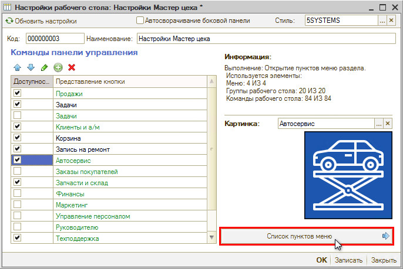

Добавление и изменение пунктов меню, перестановка порядка и скрытие доступности происходит по аналогии с редактированием разделов.

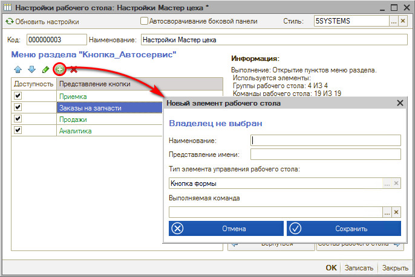

**Картинка пункта меню**

Так же, как к разделам, к пунктам меню можно добавить уже имеющиеся [картинки](../Библиотека%20картинок/biblioteka-kartinok.md) либо загрузить свои собственные.

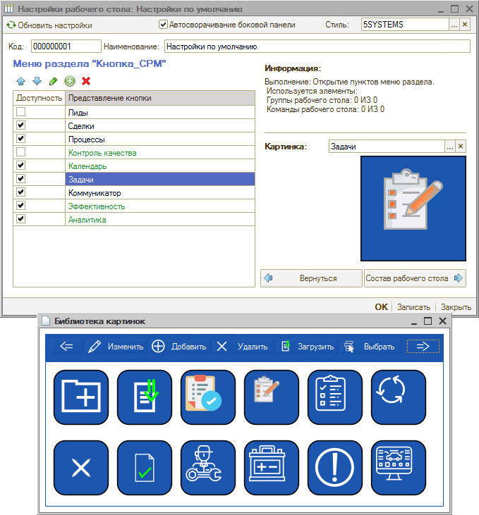

Разделы с картинками более понятны сотрудникам и упрощают навигацию.

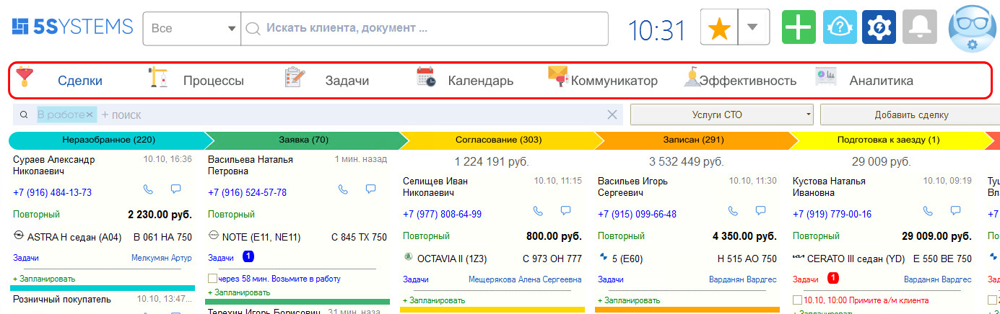

#### Редактирование состава рабочего стола

Чтобы изменить расположение группы пунктов меню в подразделе интерфейса, требуется перейти по кнопке “Состав рабочего стола”.

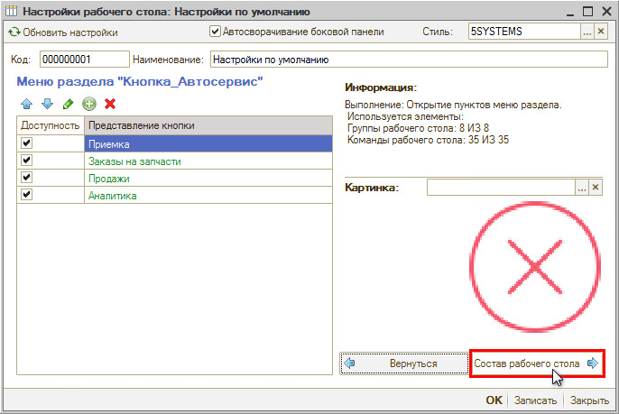

Здесь также можно изменять наполнение пунктов меню в каждой группе, переставлять местами, группировать, добавлять новые элементы и папки, задавать доступность.

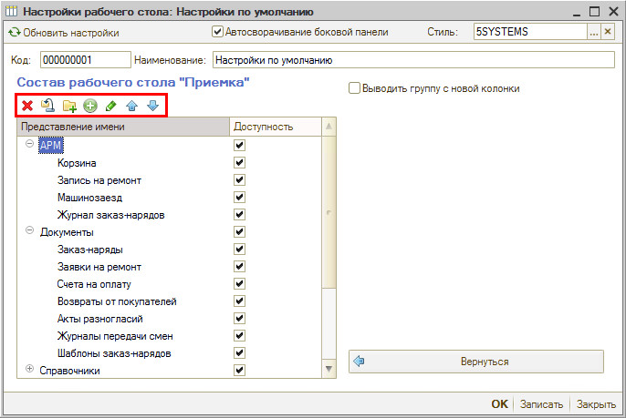

Чтобы изменить расположение группы в интерфейсе, используется галочка “Выводить группу с новой колонки”.

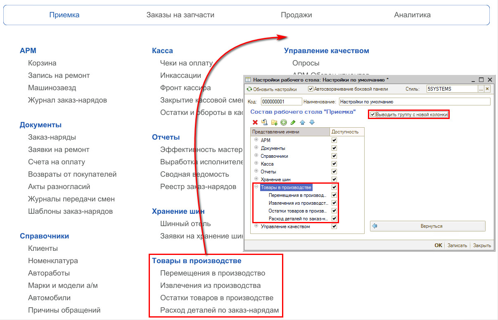

Например, можно вывести группу “Товары в производстве” с новой колонки.

*Примечание:* При этом порядок (последовательность расположения) групп сохранится, если предварительно не изменить его.

Для сохранения изменений требуется нажать кнопку “Записать” и обновить рабочий стол (нажатием на логотип).

### Привязка интерфейса к пользователю

В справочнике “[*Пользователи*](../../Пользователи%20и%20права/Пользователи/polzovateli.md)” есть связка пользователя с настройкой “Рабочий стол”, т.е. тот вариант настройки рабочего стола, который будет открываться ему при входе в систему.

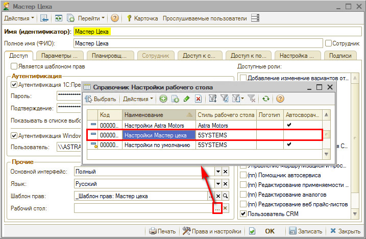

Таким образом, интерфейс системы можно настроить под конкретного пользователя для того, чтобы он видел только те функции, которые ему необходимы для работы.

Стиль рабочего стола при этом будет устанавливаться согласно стилю, привязанному в настройке.

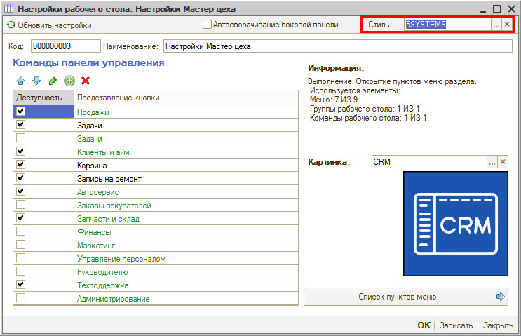

## Автоматическая блокировка работы в программе

Описание механизма ручной блокировки работы пользователя в системе см. в статье "[Структура интерфейса 5S AUTO → Временная блокировка работы в системе](../../CRM/Структура%20интерфейса%205S%20AUTO/struktura-interfeysa-5s-auto.md#временная-блокировка-работы-в-системе)".

Есть возможность настроить автоматическую блокировку программы по истечении нескольких минут бездействия пользователя.

Чтобы активировать функцию, необходимо в [*Правах и настройках системы*](../../Пользователи%20и%20права/Установка%20прав%20и%20настроек%20пользователя/ustanovka-prav-i-nastroek-polzovatelya.md) для права *“Автоматическая блокировка пользователя”* задать значение в минутах – это время простоя, по истечении которого работа в программе будет блокироваться – и записать изменения:

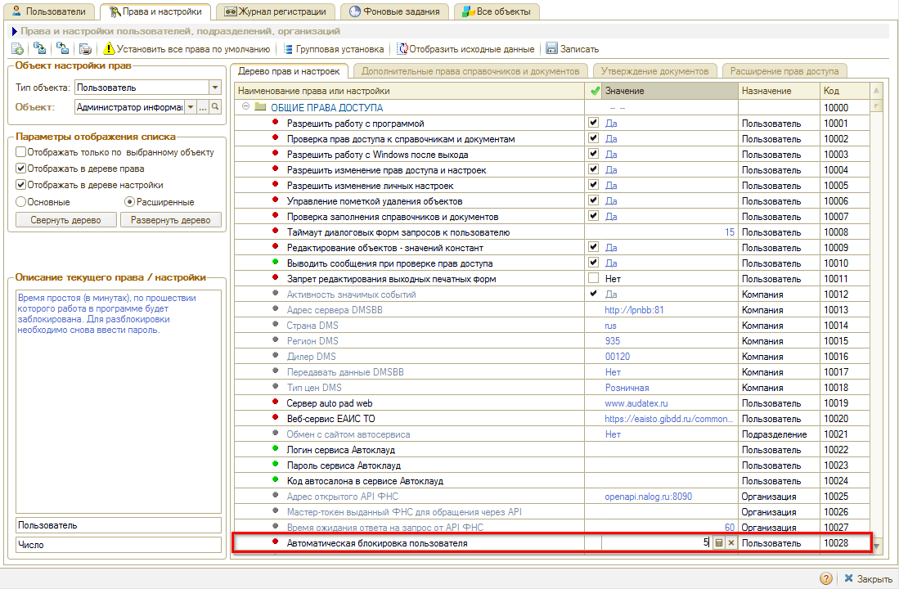

Например, если установить значение “5”, то через 5 минут бездействия пользователя будет блокироваться программа и выходить окно блокировки.

Дальнейшие действия аналогичны, как при ручной блокировке (см. [статью](../../CRM/Структура%20интерфейса%205S%20AUTO/struktura-interfeysa-5s-auto.md#razblock)).

---

**Теги:** администрирование, рабочий стол, интерфейс, настройка, разделы меню

