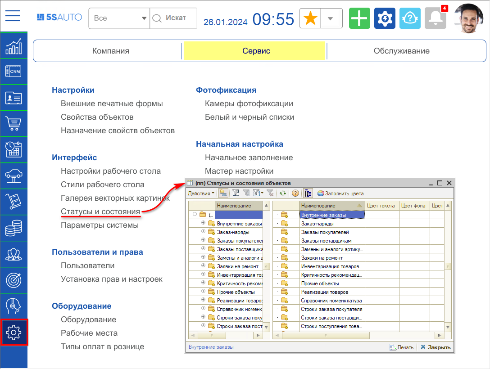
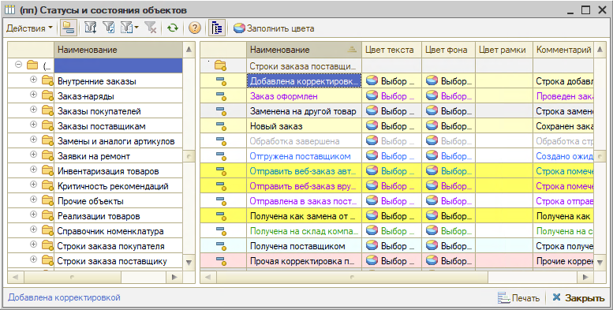
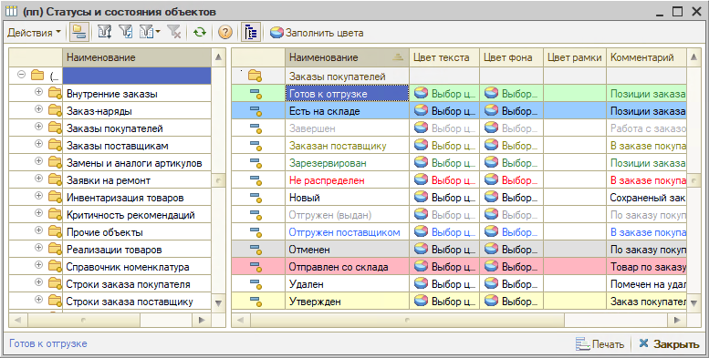
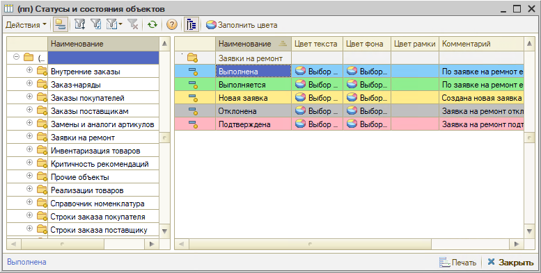
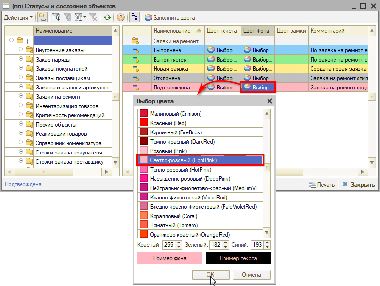

# Настройка цветового оформления статусов и состояний

<table><tr><td><b>Время чтения:</b> 9 мин.</td><td><b>Обновлено:</b> 24.01.2024</td></tr></table>

Источник: https://www.5systems.ru/help/nastroyka-cvetovogo-oformleniya-statusov-i-sostoyaniy

## Содержание

1. [Введение](#введение)
2. [Переход в справочник "Статусы и состояния"](#переход-в-справочник-статусы-и-состояния)
3. [Примеры отображения списка состояний](#примеры-отображения-списка-состояний)
4. [Настройка статусов и состояний](#настройка-статусов-и-состояний)

## Введение

Для удобного визуального поиска данных в таблицах предусмотрен ***справочник "Статусы и состояния"***, в котором есть возможность настроить цветовое оформление (цвет текста/фона) в зависимости от статуса или состояния объекта системы: Заказ-наряда, Заказа поставщику, Заказа покупателя, Заявки на ремонт и т.д.

## Переход в справочник "Статусы и состояния"

Перейти в справочник "Статусы и состояния" можно из меню *"CRM → Помощник автосервиса → Статусы и состояния"*. Справочник разбит на группы по объектам системы:

## Примеры отображения списка состояний

## Настройка статусов и состояний

Для настройки статусов и состояний:

1. Перейдите в объект, состояния которого необходимо настроить.
2. В табличной части со статусами и состояниями внесите необходимые изменения:  
   **1)** двойным кликом мыши по полю "Цвет текста" или "Цвет фона" откройте окно выбора цвета, 
   **2)** выберите цвет и нажмите кнопку "ОК":  
   

---

**Теги:** администрирование, статусы, состояния, цвета, оформление
