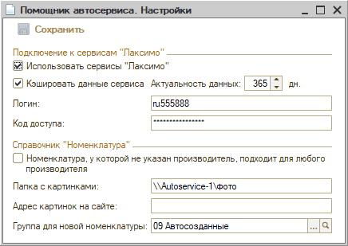

# Настройки Помощника автосервиса

<table><tr><td><b>Время чтения:</b> 7 мин.</td><td><b>Обновлено:</b> 24.06.2022</td></tr></table>

Источник: https://www.5systems.ru/help/nastroyki-pomoschnika-avtoservisa

>  **Статья для опытных пользователей!**

## Описание

***Помощник автосервиса*** - сервис поиска запчастей во внешних системах: оригинальные каталоги автомобилей, веб-сервисы поставщиков. С помощью настроек *Помощника автосервиса* можно подключить каталоги Laximo и настроить интеграцию найденных деталей во внешних системах со справочником "Номенклатура".

Перейти к *Настройкам* *Помощника автосервиса* можно через меню программы *CRM → Помощник автосервиса → Настройки сервиса:*

<table><tr><th><b>Параметр</b></th><th><b>Тип параметра</b></th><th><b>Описание</b></th></tr><tr><td colspan="3"><b><i>Подключение к сервисам "Лаксимо"</i></b></td></tr><tr><td><b>Использовать сервисы "Лаксимо"</b></td><td>Флажок</td><td>При включении будет доступен поиск в оригинальных каталогах Laximo</td></tr><tr><td><b>Кэшировать данные сервиса</b></td><td>Флажок</td><td>При включении данные, полученные из сервисов Laximo, будут кэшироваться на количество дней, указанное в параметре "Актуальность данных". Кэширование помогает ускорить процесс получения данных из сервисов Laximo.</td></tr><tr><td><b>Актуальность данных (дн.)</b></td><td>Поле ввода числа</td><td>Количество дней, на которое данные, полученные из сервисов Laximo будут кэшироваться при включении параметра "Кэшировать данные сервиса"</td></tr><tr><td><b>Логин</b></td><td>Поле ввода</td><td>Логин для доступа к сервисам, указанный в ЛК → "Профили" сайта laximo.ru</td></tr><tr><td><b>Код доступа</b></td><td>Поле ввода</td><td>Код доступа к сервисам, указанный в ЛК → "Профили" сайта laximo.ru</td></tr><tr><td colspan="3"><b><i>Справочник "Номенклатура"</i></b></td></tr><tr><td><b>Номенклатура, у которой не указан производитель, подходит для любого производителя</b></td><td>Флажок</td><td>При включении поиск вариантов поставки в сервисах по аналогам и заменам будет происходить среди номенклатуры без производителя</td></tr><tr><td><b>Папка с картинками</b></td><td>Поле ввода</td><td>Путь к папке с картинками для номенклатуры на сервере. Картинка для товара определяется по артикулу и производителю, указанным в наименовании картинки</td></tr><tr><td><b>Адрес картинок на сайте</b></td><td>Поле ввода</td><td>Адрес на сайте, где хранятся картинки номенклатуры</td></tr><tr><td><b>Группа для новой номенклатуры</b></td><td>Выбор группы номенклатуры из справочника</td><td>Группа номенклатуры, в которую будут сохраняться товары, созданные на основе результатов поиска во внешних сервисах через обработку <a href="../../Проценка%20запчастей%20и%20работ/Поиск%20цен/poisk-cen.md">Поиск цен</a></td></tr></table>

---

**Теги:** администрирование, помощник автосервиса, настройки, автосервис, подсказки

