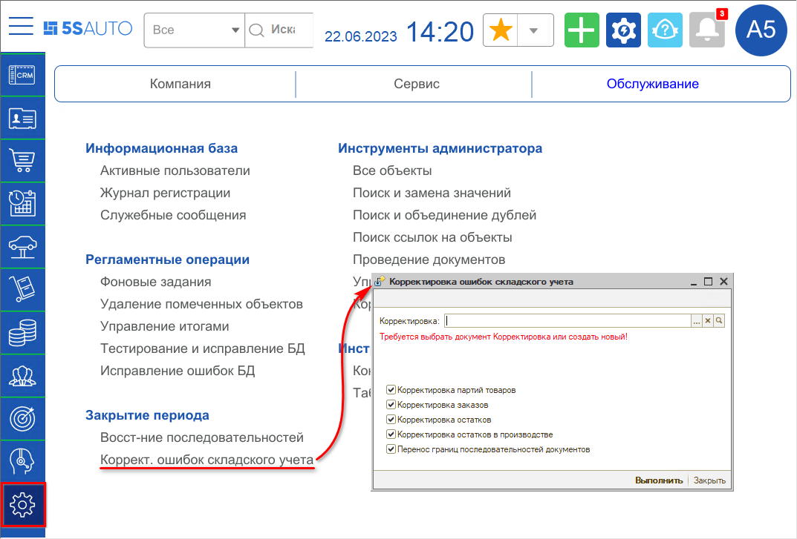
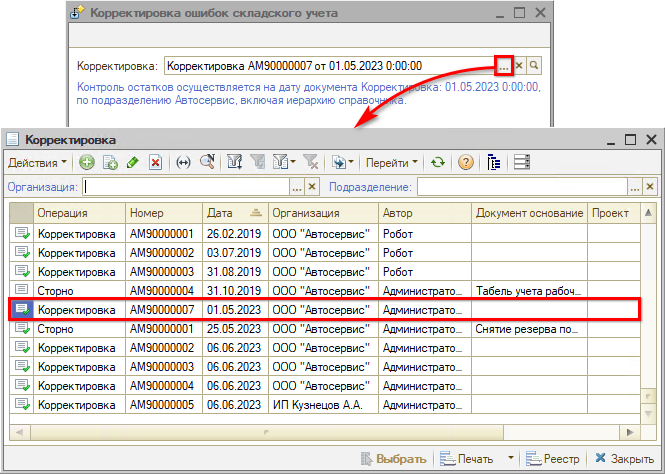
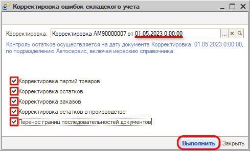
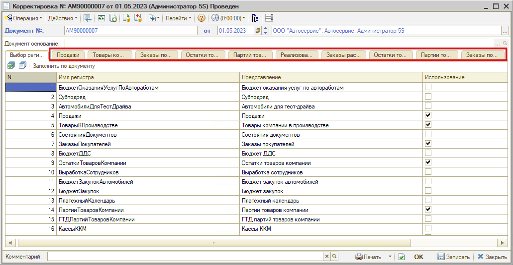
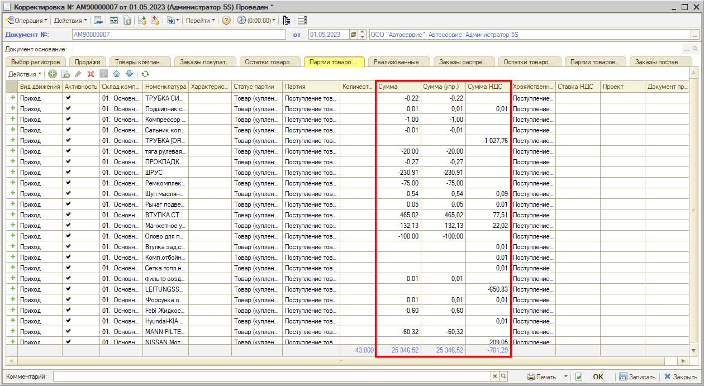
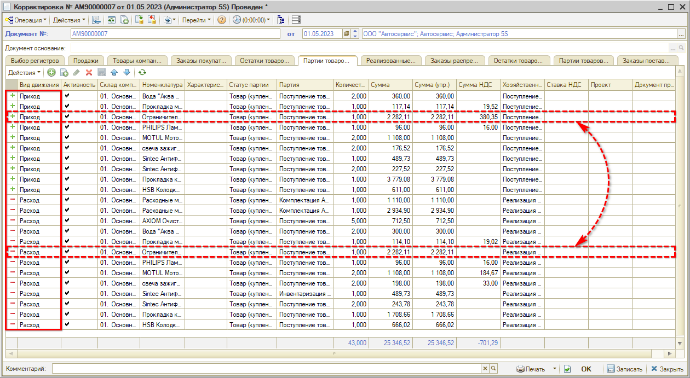
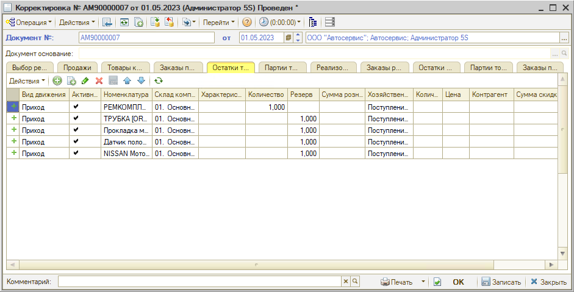
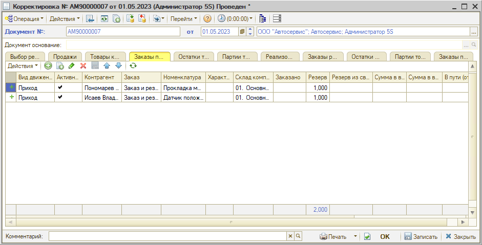
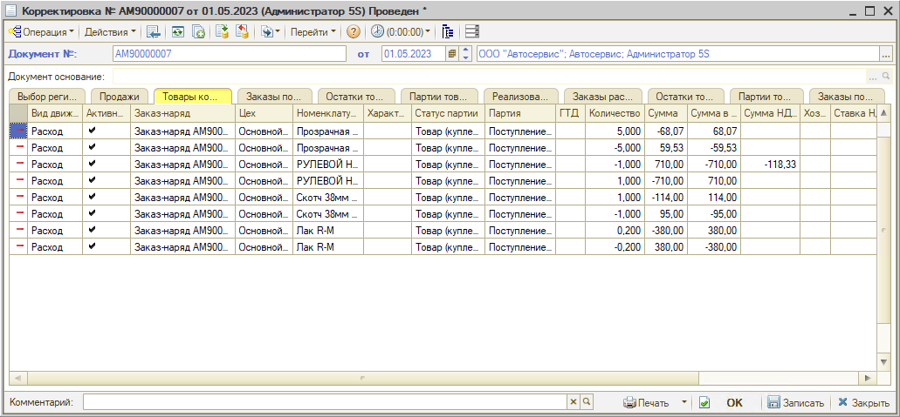
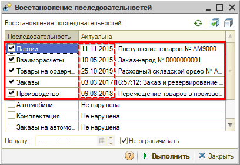

# Обработка исправления ошибок в складском учете

<table><tr><td><b>Время чтения:</b> 17 мин.</td><td><b>Обновлено:</b> 26.06.2023</td></tr></table>

Источник: https://www.5systems.ru/help/obrabotka-ispravleniya-oshibok-v-skladskom-uchete

## Содержание

1. [Введение](#введение)
2. [Обработка “Корректировка ошибок складского учета”](#обработка-корректировка-ошибок-складского-учета)
3. [Описание опций корректировки](#описание-опций-корректировки)
   - [1. Корректировка партий товаров](#1-корректировка-партий-товаров)
   - [2. Корректировка остатков](#2-корректировка-остатков)
   - [3. Корректировка заказов](#3-корректировка-заказов)
   - [4. Корректировка остатков в производстве](#4-корректировка-остатков-в-производстве)
   - [5. Перенос границ последовательностей](#5-перенос-границ-последовательностей)

## Введение

При проведении документов “задним числом” нарушается хронологическая последовательность проведения документов, что может привести к нарушению корректности данных, например, учета партий товаров, резервов, сделок взаиморасчетов и т.д. Для *восстановления последовательностей документов* в программе предусмотрена специальная обработка – см. [статью](../Восстановление%20последовательностей%20документов/vosstanovlenie-posledovatelnostey-dokumentov.md).

Если данная обработка не запускалась ни разу, либо запускалась давно, то имеет смысл начать перепроведение последовательностей не за весь период использования программы, а с определенного момента, т.е. задать точку отсчета, начиная с которой следует скорректировать остатки. Для этого рекомендуется использовать *обработку по исправлению ошибок в складском учете.*

***Корректировка ошибок складского учета*** позволяет в автоматическом режиме устранить ошибки в регистре накопления партий товаров компании. Обработка не делает никаких движений в документах взаиморасчетов – только наводит порядок в регистрах. Корректировка может использоваться перед восстановлением последовательностей либо самостоятельно, в произвольный момент времени.

После выполнения корректировки и восстановления последовательностей следует закрыть период для редактирования (см. “[Восстановление последовательностей документов → Закрытие периода после восстановления последовательностей](../Восстановление%20последовательностей%20документов/vosstanovlenie-posledovatelnostey-dokumentov.md#закрытие-периода-после-восстановления-последовательности)”) и больше не менять эти документы. Если в дальнейшем необходимо будет что-то изменить в рамках этих дат – снова нужно будет использовать обработку.

## Обработка “Корректировка ошибок складского учета”

Обработка открывается через меню программы *Администрирование → Обслуживание → Закрытие периода → Корректировка ошибок складского учета[\*](#snoska):*

*\*Примечание: В случае если данного пункта меню нет на рабочем столе, можно добавить его вручную – см. статью "[Настройка рабочего стола](../Настройка%20рабочего%20стола/nastroyka-rabochego-stola.md#настройки-разделов-и-пунктов-рабочего-стола)".*

Требуется выбрать или создать документ “Корректировка”:

Из данного документа подтягивается подразделение и дата – обработка скорректирует все документы до этой даты, не включая ее. Следует задать в документе дату, например, начало предыдущего месяца, и время – рекомендуется ставить начало дня: 0:00:00.

Для использования обработки следует отметить галочками показатели, которые необходимо скорректировать – рекомендуется отметить все – и нажать кнопку “Выполнить”:

При наведении курсора на каждую опцию отображается подсказка – описание, что делает обработка при выборе данного пункта.

После выполнения обработки в документе “Корректировка” отображаются вкладки в соответствии с исправленными регистрами: “Остатки товаров компании”, “Товары компании в производстве” и т.д.

## Описание опций корректировки

### 1. Корректировка партий товаров

Обработка производит корректировку показателей в регистре “Партии товаров компании” в случае их несоответствия.

*1) Удаление отрицательных сумм*

Остатки партий хранятся в регистре в следующих измерениях: Количество и 3 суммы: Сумма, Сумма Упр. и Сумма НДС. В случае если количество товара равно “0”, а сумма не нулевая – как правило, могут оставаться копейки – корректировка списывает данные отрицательные значения.

*2) Перенос отрицательных остатков на другие партии*

Вследствие проведения списания партии задним числом может дважды списаться одна и та же партия, и образоваться отрицательный остаток по товару – корректировка отменит неправильное списание.

Либо по одной партии может быть отрицательный остаток, по другой положительный – корректировка произведет их взаимозачет.

### 2. Корректировка остатков

*1) Приведение остатка в соответствие с партиями товаров*

Программой ведутся 2 регистра учета остатков компании: регистр накопления “Партии товаров компании” ведется с учетом партий, регистр “Остатки товаров компании” – без учета партий.

Остатки хранятся в регистрах в определенных измерениях: Склад, Партия, Номенклатура, Статус партии (купленные или взятые на комиссию), Количество, Сумма, Сумма Упр. и Сумма НДС – которые тянутся из Поступлений товаров и Инвентаризаций.

При проведении документов задним числом партии могут быть использованы не по порядку: сначала проданы более новые, потом товары из предыдущих партий, могут два разных документа использовать одну и ту же партию и т.д.

Корректировка сравнивает эти два регистра накопления и приводит количество остатков товаров в соответствие с остатками партий, т.е. добавляет показатели из регистра партий товаров в регистр остатков.

*2) Приведение резерва в соответствие с резервом по Заказам*

Аналогичным образом корректировка приводит в соответствие резервы в регистре “Остатки товаров компании” с резервами регистра “Заказы покупателей”, т.е. количество резервов остатков товаров на складах переносит с Заказов покупателей на Остатки товаров.

### 3. Корректировка заказов

Обработка приводит в порядок измерения регистров Заказы покупателей и Заказы поставщикам.

*1) Удаление отрицательных резервов и остатков по Заказам покупателя*

Если по заказам появились минусовые значения по резервам или остаткам – корректировка приходует отрицательный резерв, т.е. делает его нулевым.

Минусовой резерв может возникнуть, например, если товар был зарезервирован, затем списан в производство, потом в поступлении товаров изменили значение и перепровели документ, а в расходе не перепровели – остается отрицательный резерв.

*2) Удаление отрицательных остатков по Заказам поставщикам*

Не должно быть отрицательных значений, но теоретически могут возникнуть – обработка скорректирует значения.

### 4. Корректировка остатков в производстве

Обработка обнуляет все остатки в производстве по закрытым Заказ-нарядам.

При передаче товаров в производство товары списываются со склада и хранятся в регистре “Товары в производстве” до закрытия Заказ-наряда. Корректировка обнуляет остатки в данном регистре.

Несоответствие по остаткам в Заказ-наряде может возникнуть, например, при пересортице партий, если при закрытом Заказ-наряде перепровели перемещение в производство и захватили другую партию, а в документе осталась старая.

### 5. Перенос границ последовательностей

В обработке “Восстановление последовательности” отображается, в каких регистрах на какие даты есть последовательности с нарушениями:

Обработка “Корректировка ошибок складского учета” осуществляет перенос границ последовательностей Партий, Взаиморасчетов, Товаров на ордерных складах, Заказов, Производства – даты переносятся на дату документа “Корректировка”.

---

**Теги:** администрирование, складской учет, исправление ошибок, остатки, обработка
