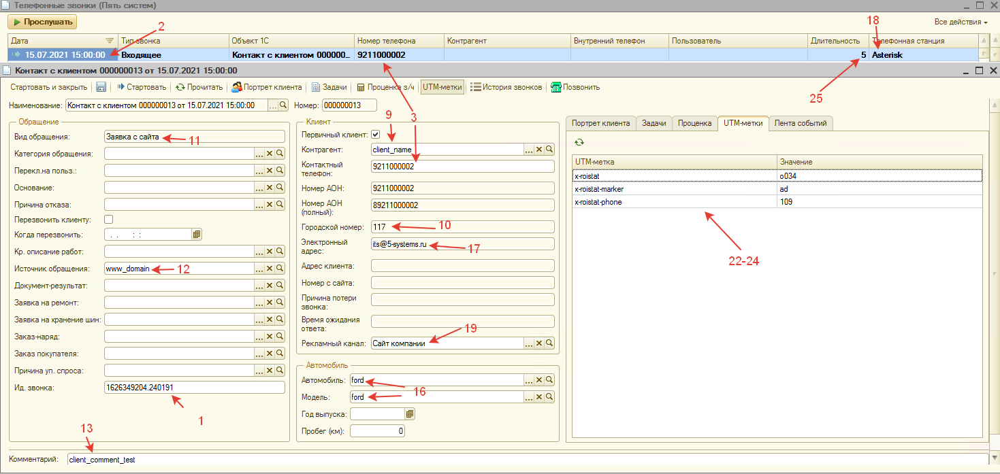

# Перечень используемых Вебхуков (Webhooks) (неактуальный материал)

<table><tr><td><b>Время чтения:</b> 18 мин.</td><td><b>Обновлено:</b> 17.06.2022</td></tr></table>

Источник: https://www.5systems.ru/help/perechen-ispolzuemykh-vebkhukov-webhooks-neaktualnyy-material

> *Комментарий: статья требует актуализации.*

## Содержание

1. [Введение](#введение)
2. [Перечень Вебхуков (Webhooks)](#перечень-вебхуков-webhooks)
   - [crm_reg_call.php](#crm_reg_callphp)
   - [getcallerdata.php](#getcallerdataphp)
   - [getcalltype.php](#getcalltypephp)
   - [getcurrenttime.php](#getcurrenttimephp)
   - [/messenger/webhook_telegram](#messengerwebhook_telegram)
   - [/messenger/webhook_whatsapp](#messengerwebhook_whatsapp)
   - [/crm/callback.php](#crmcallbackphp)
   - [/jivosite/jivosite.php](#jivositejivositephp)

## Введение

В статье представлено описание всех ***Вебхуков (Webhooks)*** и методов, которые используются для организации взаимодействия программы с внешними системами: телефония, сайт, мобильное приложение, мессенджеры и т.д.

## Перечень Вебхуков (Webhooks)

### crm_reg_call.php

**Описание**

Регистрирует события в программе: звонок (входящий, исходящий, пропущенный), заявка с сайта.

**Входящие параметры**

| № | Параметр | Описание | Как обрабатывается ссылка скриптом с указанным параметром, если он не указан |
| --- | --- | --- | --- |
| 1 | CallId | Идентификатор звонка | Генерируется |
| 2 | CallDate | Дата звонка | Передается пустым |
| 3 | CallerNumber | Номер телефона, с которого идет звонок | Ищет параметр phone, если не находит, то передается пустым |
| 4 | CalledNumber | Номер телефона, на который звонят при исходящем звонке | - |
| 5 | AnswerWaitTime | Время ожидания ответа | Передается пустым |
| 6 | ReasonCallLoss | Причина потери звонка | Передается пустым |
| 7 | MissedCall | Признак пропущенного звонка | Передается пустым |
| 8 | Outcoming | Признак исходящего звонка | Передается пустым |
| 9 | ContactInfo | Наименование контрагента | Ищет параметр name, если не находит, то передается пустым |
| 10 | FirstCalledNumber | Городской номер | Передается пустым |
| 11 | FromWeb | Признак заявки с сайта | Передается пустым |
| 12 | WebPage | Страница, с которой пришла заявка с сайта | Ищет параметр domain, если не находит, то передается пустым |
| 13 | Comment | Комментарий, что подтянется в задачу | Ищет параметр comment, если не находит, то пустой |
| 14 | Object1CId | Id объекта 1С, что передается вместе с событием (используется для исходящих) | Передается пустым |
| 15 | Object1CType | Тип объекта 1С, что передается вместе с событием (используется для исходящих) | Передается пустым |
| 16 | CarModel | Модель автомобиля | Передается пустым |
| 17 | Email | Электронная почта | Передается пустым |
| 18 | PhoneStation | Передает 'AS' | Код телефонной станции |
| 19 | AdvChannel | Рекламный канал | Ищет advchannel, если не находит, то передается пустым |
| 20 | session_id | Параметр для динамического коллтрэкинга | Передается пустым |
| 21 | user_id | Параметр для динамического коллтрэкинга | Передается пустым |
| 22 | X_ROISTAT | UTM-метка | Ищет x-roistat, если не находит, то передается пустым |
| 23 | X_ROISTAT_PHONE | UTM-метка | Передается пустым |
| 24 | X_ROISTAT_MARKER | UTM-метка | Передается пустым |
| 25 | Duration | Длительность звонка | Передается пустым |
| 26 | Parts |  | если не указан, то <?xml version="1.0" encoding="UTF-8"?>, если session_id и user_id заполнены, то <object type="string" name="session_id">'.$session_id.'</object>'.'<object type="string" name="user_id">'.$user_id.'</object> если WebPage заполнено и равно JivoSite, то <object type="string" name="ВидОбращения">Чат</object> если Duration заполнено, то <object type="string" name="Duration">'.$Duration.'</object>' Если $x_roistat заполнено, то <object type="string" name="x-roistat">'.$x_roistat.'</object> <object type="string" name="x-roistat-phone">'.$x_roistat_phone.'</object> <object type="string" name="x-roistat-marker">'.$x_roistat_marker.'</object></datа> Если указан, то декодируем, добавляем строки перед </datа> <object type="string" name="session_id">'.$session_id.'</object> <object type="string" name="user_id">'.$user_id.'</object> <object type="string" name="Duration">'.$Duration.'</object> |

### getcallerdata.php

**Описание**

Возвращает имя клиента, который отображается на экране телефона.

**Входящие параметры**

| Параметр | Тип | Описание |
| --- | --- | --- |
| CallId |  | Идентификатор звонка |
| CallerNumber |  | Номер телефона, с которого идет звонок |
| ParsedCallerNumber |  |  |

### getcalltype.php

**Описание**

Возвращает тип звонка согласно умной маршрутизации (см. шаги 3, 4, 5, 6 в [*Умная маршрутизация входящего звонка*](../../Работа%20с%20клиентами/Умная%20маршрутизация%20входящего%20звонка/umnaya-marshrutizaciya-vkhodyaschego-zvonka.md)).

**Входящие параметры**

| Параметр | Тип | Описание |
| --- | --- | --- |
| CallerNumber |  | Номер телефона, с которого идет звонок |

### getcurrenttime.php

**Описание**

Возвращает время на сервере 1С

### /messenger/webhook_telegram

**Описание**

Регистрирует входящие сообщения из Telegram в программе

### /messenger/webhook_whatsapp

Регистрирует входящие сообщения из WhatsApp в программе

### /crm/callback.php

**Описание**

При поступлении заявки с сайта связывает клиента с менеджером по телефону.

Для настройки интеграции сайта и CRM-модуля при отправке форм с сайта необходимо вызывать Webhook следующего формата: http://<IP-адрес>/callback.php?[params], где:

- <IP-адрес> - IP-адрес сервера телефонии, с которым интегрирована программа "Управление автоцентром".
- [params] - параметры http-запроса (см. Входящие параметры).
- Название скрипта может варьироваться от телефонии, что его размещает.

**Логика работы**

На сайте компании размещается форма для обратного звонка, заявки. Клиент заполняет форму, отправляет ее. Сайт в это время вызывает скрипт callback.php.

Срабатывает умная маршрутизация в скрипте, если есть ответственный по этому клиенту.

Далее на согласованные при настройке номера поступает звонок. Звонят одновременно

В момент звонка на телефонах отображается “Заявка с сайта”, “Имя” и “Номер”.

- Если трубку взяли, то после поднятия трубки ответившему проигрывается приветствие “Поступила заявка с сайта”, и в это же время открывается форма сделки. Идет дозвон до клиента.
- Если трубку не взяли, то делаются три попытки дозвона на все согласованные трубки по 30 сек с интервалом в 30 сек. Если никто не ответил, то фиксируем заявку в 1с на должность.

При этом, звонок может зависеть от подразделения.

**Интеграция с сайтом**

1. Если сайт на https, то специалисты техподдержки 5s генерируют ссылку для обратного звонка. Пример ссылки, которую будет вызывать форма на сайте:

[https://cloud.5-systems.ru/callback/actions/папка_с_наименованием_клиента/connect.php?key=00000000&phone=9210000000&name=client_name&comment=client_comment&domain=www_domain&advchannel=website&department=](https://cloud.5-systems.ru/callback/actions/%D0%BF%D0%B0%D0%BF%D0%BA%D0%B0_%D1%81_%D0%BD%D0%B0%D0%B8%D0%BC%D0%B5%D0%BD%D0%BE%D0%B2%D0%B0%D0%BD%D0%B8%D0%B5%D0%BC_%D0%BA%D0%BB%D0%B8%D0%B5%D0%BD%D1%82%D0%B0/connect.php?key=00000000&phone=9210000000&name=client_name&comment=client_comment&domain=www_domain&advchannel=website&department=)

Здесь параметры:

- key - персональный ключ для организации, которой выдали ссылку
- phone - телефон клиента
- name - имя клиента (необязательный)
- comment - комментарий (необязательный)
- domain - адрес сайта, с которого делается вызов (необязательный)
- advchannel - рекламный канал (необязательный)
- department - подразделение

Параметры нужно url-кодировать

2. Если сайт на http, то сайт может вызывать скрипт напрямую из телефонии.

Пример ссылки, вызываемой с сервера телефонии:

[http://xx.xx.xx.xx:80/zeon/api/integration/1c-callback.php?&phone=8900000000&name=test&comment=test_comment&domain=www_domain&advchannel=advertising_channel&department=&user_id=&session_id=&FromWeb=1](http://xx.xx.xx.xx/zeon/api/integration/1c-callback.php?&amp;phone=8900000000&amp;name=test&amp;comment=test_comment&amp;domain=www_domain&amp;advchannel=advertising_channel&amp;department=&amp;user_id=&amp;session_id=&amp;FromWeb=1)

### /jivosite/jivosite.php

**Описание**

Регистрирует сообщения с чата Jivosite, интегрированного на сайте для взаимодействия с клиентами

**Входящие параметры**

| Параметр | Тип | Описание |
| --- | --- | --- |
| source |  | Код рекламного канала |

---

**Теги:** администрирование, вебхуки, webhooks, api, интеграция

