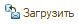
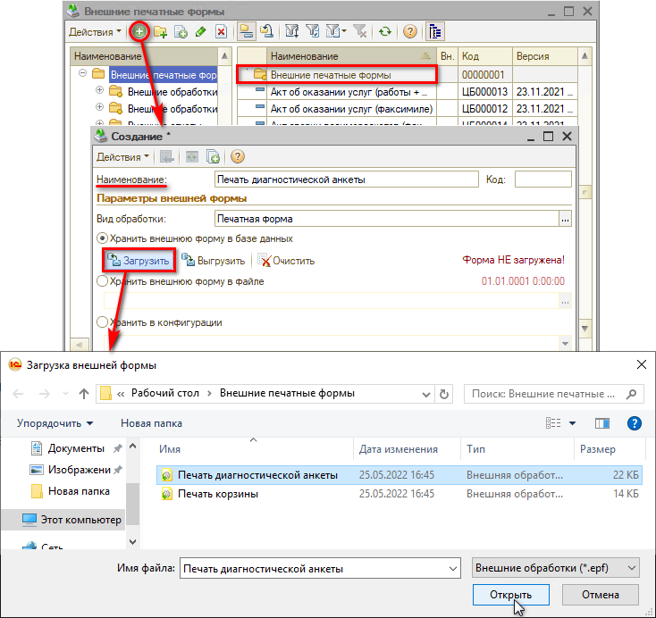
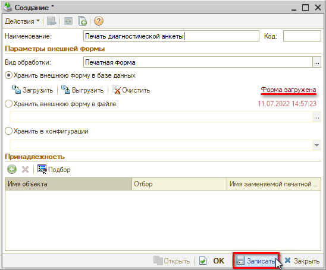

# Подключение внешней печатной формы "Печать диагностической анкеты"

<table><tr><td><b>Время чтения:</b> 5 мин.</td><td><b>Обновлено:</b> 11.07.2022</td></tr></table>

Источник: https://www.5systems.ru/help/podklyuchenie-vneshney-pechatnoy-formy-pechat-diagnosticheskoy-ankety

## Содержание

1. [Порядок подключения](#порядок-подключения)
2. [Работа механизма](#работа-механизма)

## Порядок подключения

В программе реализована стандартная форма печати [Диагностической анкеты](../../../Автосервис/Диагностические%20анкеты/diagnosticheskie-ankety.md). При необходимости можно подключить *внешнюю печатную форму* – загрузить любую свою *(сначала ее должен разработать программист)*.

Подключение внешних печатных форм производится в соответствующем справочнике *– Администрирование → Сервис → Настройки → Внешние печатные формы*, папка *“Внешние печатные формы”*:

Для подключения внешней формы печати Диагностической анкеты следует:

1. Создать добавлением новый элемент справочника;
2. Задать *наименование “Печать диагностической анкеты”*;
3. Выбрать вид обработки “Печатная форма” (должен стоять по умолчанию).
4. Загрузить с компьютера файл с печатной формой нажатием на кнопку “Загрузить”  . 
   *Пример файла для загрузки можно скачать по ссылке:* [Печать диагностической анкеты.7z](attachments/pechat-diagnosticheskoy-ankety-7z.7z) (требуется разархивировать). 
   ***Файл должен иметь наименование “Печать диагностической анкеты.epf”***:  
   

Принадлежность задавать не нужно.

Создаваемую форму требуется *записать*:

## Работа механизма

Загруженная форма будет вызываться на печать вместо [стандартной формы печати Диагностической анкеты](https://5systems.ru/help/kak-raspechatat-blank-ankety).

## Файлы для скачивания

- [pechat-diagnosticheskoy-ankety.7z](attachments/pechat-diagnosticheskoy-ankety.7z) (.7z, 18 КБ)

---

**Теги:** администрирование, печатные формы, диагностическая анкета, внешняя обработка, печать

