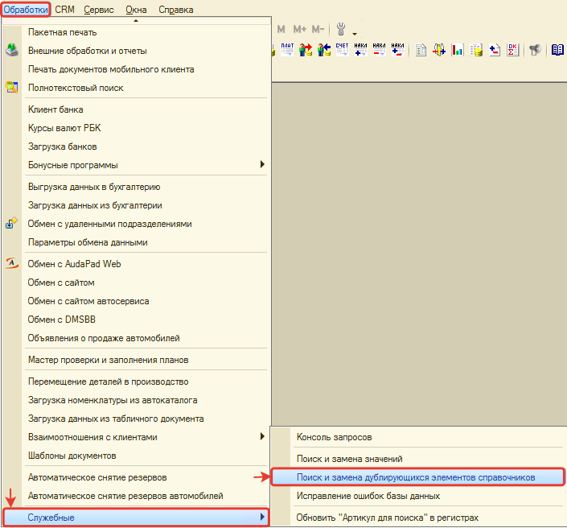
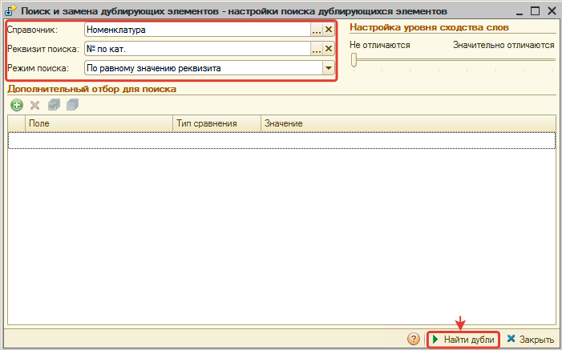
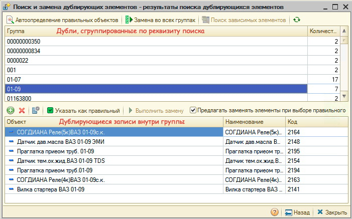
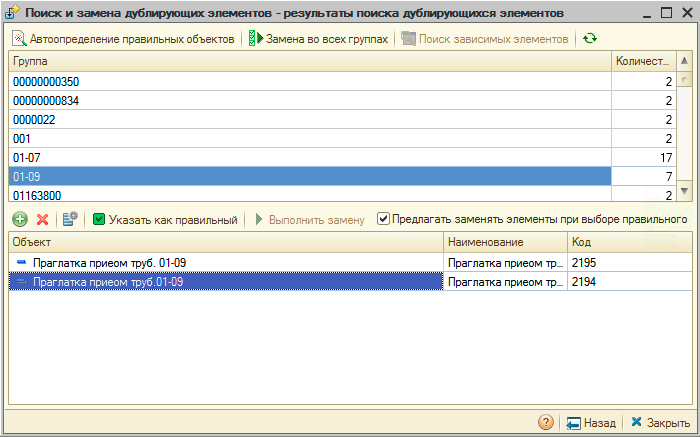
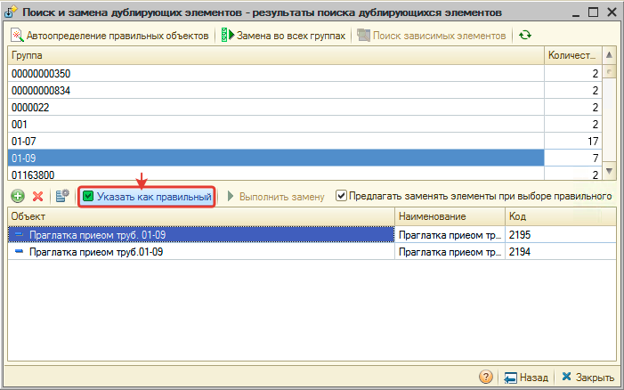
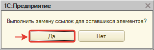
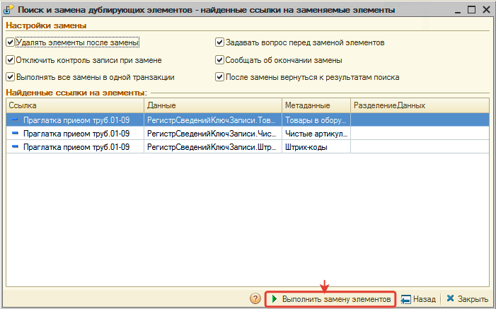

# Поиск и замена дублирующихся записей

<table><tr><td><b>Время чтения:</b> 12 мин.</td><td><b>Обновлено:</b> 24.06.2022</td></tr></table>

Источник: https://www.5systems.ru/help/poisk-i-zamena-dubliruyuschikhsya-zapisey

>  **Статья для опытных пользователей!**

## Содержание

1. [Введение](#введение)
2. [Работа с обработкой "Поиск и замена дублирующихся элементов справочников"](#работа-с-обработкой-поиск-и-замена-дублирующихся-элементов-справочников)
   - [Переход к обработке](#переход-к-обработке)
   - [Пример работы](#пример-работы)

## Введение

Рано или поздно в любом справочнике программы могут появиться дублирующиеся записи (элементы). Для того, чтобы ***объединить дублирующиеся записи*** предусмотрена служебная обработка "Поиск и замена дублирующихся элементов справочников".

***Внимание!** Объединение дублирующихся записей является необратимым действием! Перед запуском обработки рекомендуем предварительно потренироваться в объединении дублей на тестовой базе.*

## Работа с обработкой "Поиск и замена дублирующихся элементов справочников"

### Переход к обработке

### Пример работы

Рассмотрим пример поиска дублей в справочнике "Номенклатура".

На форме обработки:

- в поле *Справочник* выбираем значение "Номенклатура",
- в поле *Реквизит поиска* выбираем значение "№ по кат." (можно искать по любому из реквизитов справочника),
- в поле *Режим поиска* выбираем значение "По равному значению реквизита" (поиск дублей по точному совпадению),
- при необходимости можно задать условие отбора (например, "Тип номенклатуры" не равен "Масла") в табличной части "Дополнительный отбор для поиска", в рамках примера задавать отбор не будем,
- нажимаем кнопку "Найти дубли":

В результате отображаются дублирующиеся записи, сгруппированные по реквизиту поиска. При клике на группу дублей в нижней табличной части детально отображаются записи справочника, совпадающие по реквизиту поиска (в данном случае по "№ по кат."):

При необходимости удаляем те записи, которые не считаем дублирующимися (в примере оставляем только два дубля):

Внимательно просматриваем карточки номенклатуры дублей, чтобы принять решение какую запись считать правильной. Устанавливаем курсор на правильную запись и нажимаем кнопку "Указать как правильный":

Соглашаемся заменить ссылки с неправильного на правильный элемент справочника в документах, регистрах и прочих объектах программы:

В результате отображаются ссылки на данные, в которых произойдет замена. Для замены нажимаем кнопку "Выполнить замену элементов":

Подтверждаем замену и удаление элементов справочника.

ГОТОВО! Дублирующийся элемент удален и ссылки на него заменены на правильный элемент.

---

**Теги:** администрирование, дубли, справочники, поиск и замена, обработка

