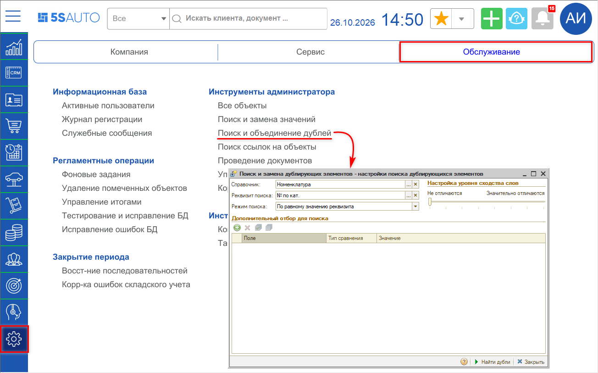
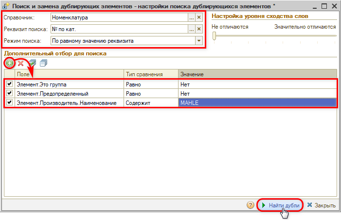
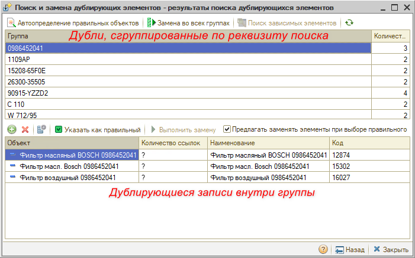
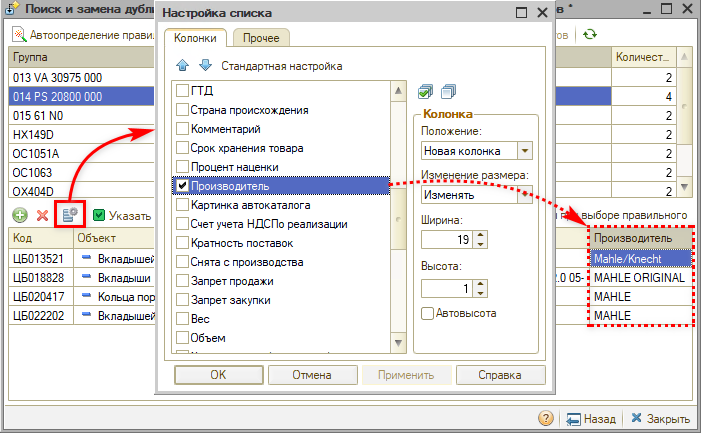
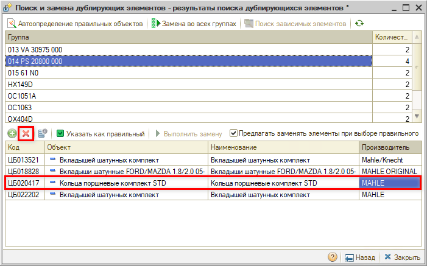
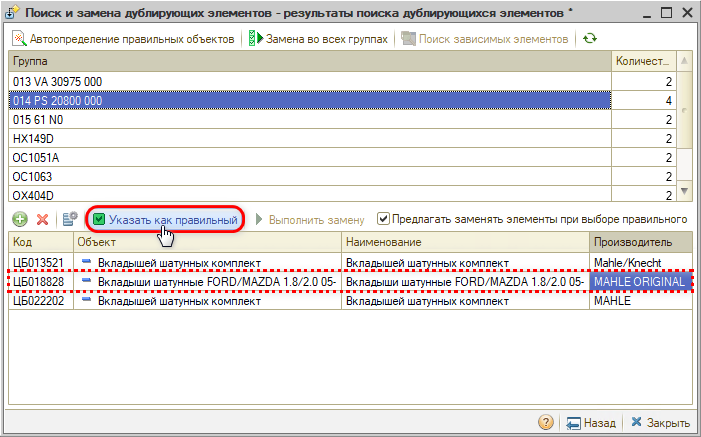
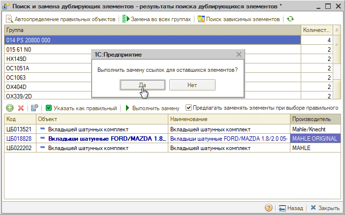
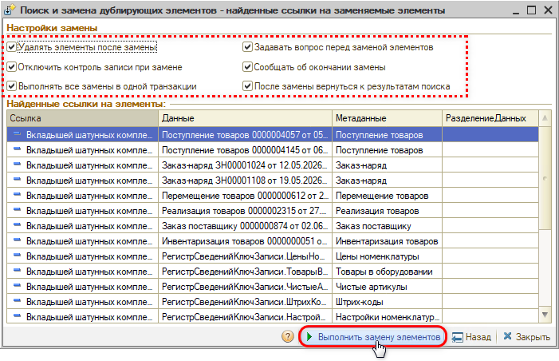

# Поиск и замена дублирующихся записей

<table><tr><td><b>Время чтения:</b> 14 мин.</td><td><b>Обновлено:</b> 27.10.2026</td></tr></table>

Источник: https://www.5systems.ru/help/poisk-i-zamena-dubliruyuschikhsya-zapisey

###### *Опубликовано 08.09.2026: [https://kb.5systems.ru/articles/5s-auto/administrirovanie-i-nastroyka-sistemy/poisk-i-zamena-dubliruyuschikhsya-zapisey](https://kb.5systems.ru/articles/5s-auto/administrirovanie-i-nastroyka-sistemy/poisk-i-zamena-dubliruyuschikhsya-zapisey)*

>  **Статья для опытных пользователей!**

## Содержание

1. [Введение](#введение)
2. [Работа с обработкой «Поиск и объединение дублей»](#работа-с-обработкой-поиск-и-объединение-дублей)
   - [Переход к обработке](#переход-к-обработке)
   - [Пример работы](#пример-работы)
3. [Что нельзя объединять](#что-нельзя-объединять)

## Введение

Рано или поздно в любом справочнике программы могут появиться дублирующиеся записи (элементы). Для того, чтобы ***объединить дублирующиеся записи***, предусмотрена служебная обработка «Поиск и объединение дублей». Она заменяет ссылки на элемент-дубль во всех документах, регистрах и других объектах программы ссылкой на правильный элемент, а дубль удаляет.

> [!CAUTION]
> *Объединение дублирующихся записей является необратимым действием! Перед запуском обработки рекомендуем предварительно потренироваться в объединении дублей на тестовой базе. Если нужно объединить много дублей, сначала объедините два элемента и проверьте результат.*

## Работа с обработкой «Поиск и объединение дублей»

### Переход к обработке

Обработка открывается из меню *Администрирование → Обслуживание → Инструменты администратора → Поиск и объединение дублей*:

### Пример работы

Рассмотрим пример поиска дублей в справочнике «Номенклатура» по номеру по каталогу.

Если искать дубли только по реквизиту «№ по кат.» во всем справочнике, список групп получится слишком большим, и в нем трудно понять, что является дублями, а что нет: одинаковые номера по каталогу встречаются у разных производителей. Поэтому поиск удобно ограничить производителем.

На форме обработки:

- в поле *Справочник* выбираем значение «Номенклатура»,
- в поле *Реквизит поиска* выбираем значение «№ по кат.» (можно искать по любому из реквизитов справочника),
- в поле *Режим поиска* выбираем значение «По равному значению реквизита» (поиск дублей по точному совпадению),
- в табличной части «Дополнительный отбор для поиска» кнопкой «Добавить» задаем условия отбора: «Элемент.Это группа» – «Равно» – «Нет» и «Элемент.Предопределенный» – «Равно» – «Нет», чтобы в поиск не попали группы и предопределенные элементы, а также «Элемент.Производитель.Наименование» – «Содержит» – «<наименование производителя>» (в примере – «MAHLE»), чтобы искать дубли только среди товаров этого производителя,
- нажимаем кнопку «Найти дубли»:

  

Производитель одной и той же детали может быть заведен по-разному: например, «MAHLE», «MAHLE ORIGINAL», «Mahle/Knecht». Условие «Содержит» находит все такие варианты. Если производитель записан по-русски, такие карточки в поиск не попадут. В этом случае можно выбрать тип сравнения «В списке» и перечислить в значении все варианты написания производителя, в том числе русские. Для этого в поле «Значение» нажимаем кнопку выбора и в окне «Редактирование списка значений» добавляем все варианты написания. А чтобы найти все карточки конкретной детали независимо от написания производителя, задаем отбор по ее номеру по каталогу.

> [!WARNING]
> Нельзя объединять группу с элементом (например, папку номенклатуры с карточкой товара) и предопределенные элементы – они нужны для работы программы. Такое объединение может нарушить целостность данных, и программа перестанет корректно работать во всей базе. Условия отбора «Элемент.Это группа» и «Элемент.Предопределенный» необязательны, но рекомендуем их добавлять, чтобы такие элементы случайно не попали в поиск.

Режим «По похожим словам» находит значения, которые похожи, но не совпадают точно, например наименования с опечаткой. Ползунок «Настройка уровня сходства слов» задает, насколько сильно могут различаться значения: чем ближе он к «Значительно отличаются», тем больше элементов попадет в одну группу.

> [!NOTE]
> Не рекомендуем искать в режиме «По похожим словам», особенно с ползунком, сдвинутым к «Значительно отличаются»: в одну группу попадают разные элементы с похожими значениями. Кроме того, без дополнительного отбора обработка проверяет весь справочник, и в большой базе поиск идет долго (программа на это время перестает отвечать). Чтобы поиск прошел быстрее, ограничьте его отбором, например по производителю.

Если дубли не найдены, проверяем, что значения реквизита поиска у элементов совпадают полностью и в отборе указаны так же, как в элементах.

В результате отображаются дублирующиеся записи, сгруппированные по реквизиту поиска. При клике на группу дублей в нижней табличной части детально отображаются записи справочника, совпадающие по реквизиту поиска (в данном случае по «№ по кат.»). В примере в группе «014 PS 20800 000» четыре карточки. Три из них – одна и та же деталь, вкладыши шатунные: наименования и производители («Mahle/Knecht», «MAHLE ORIGINAL», «MAHLE») заведены по-разному, но номер по каталогу один. Четвертая карточка – кольца поршневые: это другая деталь, номер по каталогу у нее введен с ошибкой:

Состав колонок нижней таблицы можно настроить: на панели над таблицей нажимаем кнопку «Настройка списка» и отмечаем нужные колонки – в примере выведена колонка «Производитель». Колонки можно переставлять местами, перетаскивая их заголовки мышью:

Внимательно просматриваем карточки номенклатуры дублей: чтобы открыть карточку, дважды щелкаем по строке в колонке «Объект» и нажимаем кнопку «Открыть». Совпадение реквизита поиска еще не означает, что это дубль: под одним номером по каталогу может оказаться другая деталь, например если номер введен с ошибкой. Такие записи убираем из списка: выделяем строку и нажимаем кнопку «Удалить». В примере удаляем кольца поршневые и оставляем три дубля вкладышей:

Если в элементе-дубле есть данные, которых нет в правильном элементе, переносим их в правильный элемент до объединения.

Устанавливаем курсор на правильную запись (в примере – первая карточка) и нажимаем кнопку «Указать как правильный»:

Соглашаемся заменить ссылки с неправильного на правильный элемент справочника в документах, регистрах и прочих объектах программы:

В результате отображаются ссылки на данные, в которых произойдет замена, и настройки замены. По умолчанию все флажки включены: например, при включенном флажке «Удалять элементы после замены» элемент-дубль будет удален. При необходимости настройки замены можно изменить. Для замены нажимаем кнопку «Выполнить замену элементов»:

Подтверждаем замену и удаление элементов справочника.

ГОТОВО! Дублирующиеся элементы удалены, и ссылки на них заменены на правильный элемент.

## Что нельзя объединять

Обработка работает с любым справочником, поэтому выбирайте элементы для объединения очень внимательно. Не объединяйте:

- **предопределенные элементы** – например, организацию «-» в справочнике «Организации» или головное подразделение в справочнике «Подразделения компании». Они нужны для работы программы;
- **группу с элементом** – например, папку номенклатуры с карточкой товара;
- **элементы, которые только похожи**: однофамильцев с разными телефонами и автомобилями, товары с одинаковым номером по каталогу, но разных производителей (а не разных написаний одного производителя) или разного назначения. Совпадение реквизита поиска еще не означает, что это дубль.

> [!NOTE]
> Если задвоилась не карточка клиента, а сделка, используйте обработку «Объединение процессов» – см. статью «[Объединение сделок](https://kb.5systems.ru/articles/5s-auto/crm/obedinenie-sdelok)».

Пример объединения дублирующихся карточек клиентов – в совете «[Как объединить дублирующиеся карточки контрагентов](https://kb.5systems.ru/tips/5s-auto/administrirovanie/kak-obedinit-dubliruyushchiesya-kartochki-kontragentov)».

---

**Теги:** администрирование, дубли, справочники, поиск и замена, обработка, поиск и объединение дублей, объединение дублей
