# Права на редактирование документов

<table><tr><td><b>Время чтения:</b> 16 мин.</td><td><b>Обновлено:</b> 27.06.2025</td></tr></table>

Источник: https://www.5systems.ru/help/prava-na-redaktirovanie-dokumentov

## Содержание

1. [Введение](#введение)
2. [Права](#права)
   - [1. Дата запрета редактирования](#1-дата-запрета-редактирования)
   - [2. Право редактирования документов в закрытом периоде](#2-право-редактирования-документов-в-закрытом-периоде)
   - [3. Редактирование документов в заданном интервале](#3-редактирование-документов-в-заданном-интервале)
   - [4. Редактирование проведенных документов](#4-редактирование-проведенных-документов)
   - [5. Редактирование закрытых заказ-нарядов](#5-редактирование-закрытых-заказ-нарядов)
   - [6. Редактирование заказ-нарядов в состоянии Выполнен](#6-редактирование-заказ-нарядов-в-состоянии-выполнен)
   - [7. Права на редактирование документов определенного типа](#7-права-на-редактирование-документов-определенного-типа)

## Введение

Доступ пользователей к *редактированию документов* определяется рядом *прав* (см. основную статью “[Установка прав и настроек пользователя](../../Пользователи%20и%20права/Установка%20прав%20и%20настроек%20пользователя/ustanovka-prav-i-nastroek-polzovatelya.md)”), собранных в группе *“Документы → Общие параметры документов → Редактирование документов”,* а также в группе *“Документы → Права доступа документов”.* В рамках текущей статьи рассмотрены только несколько из них, наиболее часто используемых – полный список прав и их описание можно найти в программе.

Все перечисленные в данной статье права устанавливаются *на пользователя,* за исключением права “Дата запрета редактирования”, которое устанавливается *на организацию.* Права, устанавливаемые на пользователя, настраиваются, как правило, для [шаблона прав](../../Пользователи%20и%20права/Установка%20прав%20и%20настроек%20пользователя/ustanovka-prav-i-nastroek-polzovatelya.md#шаблоны-прав), либо могут быть установлены для отдельного пользователя (если для него не задан шаблон прав).

Все приведенные в данной статье права относятся к *основным,* за исключением прав “Редактирование документов в закрытом периоде”, “Редактирование проведенных документов” и прав в группе “Права доступа документов”, которые относятся к *расширенным* правам – для их редактирования требуется переключиться на полный список прав (см. в [статье](../../Пользователи%20и%20права/Установка%20прав%20и%20настроек%20пользователя/ustanovka-prav-i-nastroek-polzovatelya.md#основные-и-расширенные-права)).

*Примечание 1:* Изменять права и настройки – как свои, так и других пользователей – может только пользователь с включенным правом "Разрешить изменение прав доступа и настроек".

*Примечание 2:* Доступ пользователей к редактированию документов также зависит от ролей пользователя – см. [статью](../../Пользователи%20и%20права/Роли%20пользователей/roli-polzovateley.md). Ограничения по правам имеют более высокий приоритет (если иное не описано в самом праве).

## Права

### 1. Дата запрета редактирования

Право *“Дата запрета редактирования”* предназначено для установки даты, до которой будет запрещено изменение, проведение и удаление документов. Например, перед выгрузкой данных в [1С:Бухгалтерия](../../Прочее/Материалы%20для%20обмена%20с%201С%20Бухгалтерия/materialy-dlya-obmena-s-1s-bukhgalteriya.md) рекомендуется установить запрет изменения данных до даты окончания выгружаемого периода. После [восстановления последовательности проведения документов](../Восстановление%20последовательностей%20документов/vosstanovlenie-posledovatelnostey-dokumentov.md) также рекомендуется закрывать период данным правом.

Право устанавливается *на организацию:*

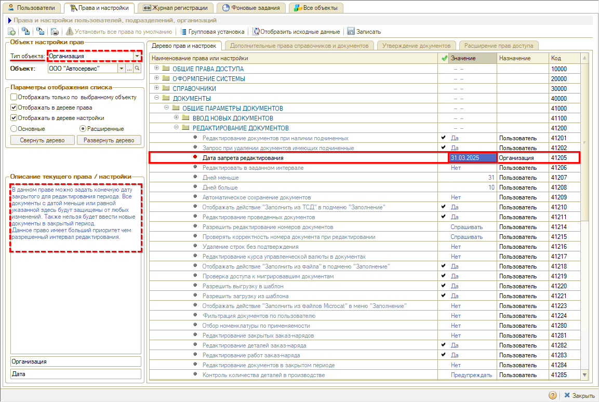

В значении права следует задать конечную дату закрытого для редактирования периода – все документы с датой меньше или равной указанной здесь будут защищены от любых изменений. Также нельзя будет ввести новые документы в закрытый период.

Данное право используется вместе с правом редактирования документов в закрытом периоде (см. [ниже](#2-право-редактирования-документов-в-закрытом-периоде)):

- если у пользователя будет включено право “Редактирование в закрытом периоде”, ему будет разрешено редактировать документы, созданные до даты запрета редактирования;
- если у пользователя в данном праве будет установлено значение “Нет”, то при попытке редактирования документа в закрытом периоде формы документов будут открываться для него в режиме просмотра, и будет выходить предупреждение программы:  
  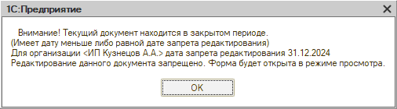

Данное право распространяется на проведенные и непроведенные документы: форма непроведенных документов будет открываться в режиме редактирования, но провести документ будет невозможно.

Данное право имеет *больший приоритет,* чем разрешенный интервал редактирования (см. [ниже](#3-редактирование-документов-в-заданном-интервале)).

### 2. Право редактирования документов в закрытом периоде

Право *“Редактирование документов в закрытом периоде”* относится к расширенным правам – для его настройки требуется переключиться на полный список прав (см. в [статье](../../Пользователи%20и%20права/Установка%20прав%20и%20настроек%20пользователя/ustanovka-prav-i-nastroek-polzovatelya.md#основные-и-расширенные-права)).

Данное право используется для исключения действий ограничений права “Дата запрета редактирования” (см. [выше](#1-дата-запрета-редактирования)). Например, при установке на организацию даты запрета редактирования рядовые пользователи не смогут изменять документы в закрытом периоде, но для руководителей, бухгалтеров и других ответственных сотрудников может потребоваться снятие этого запрета. При этом необходимо понимать последствия изменений при внесении данных в документы закрытого периода.

Право устанавливается *на пользователя:*

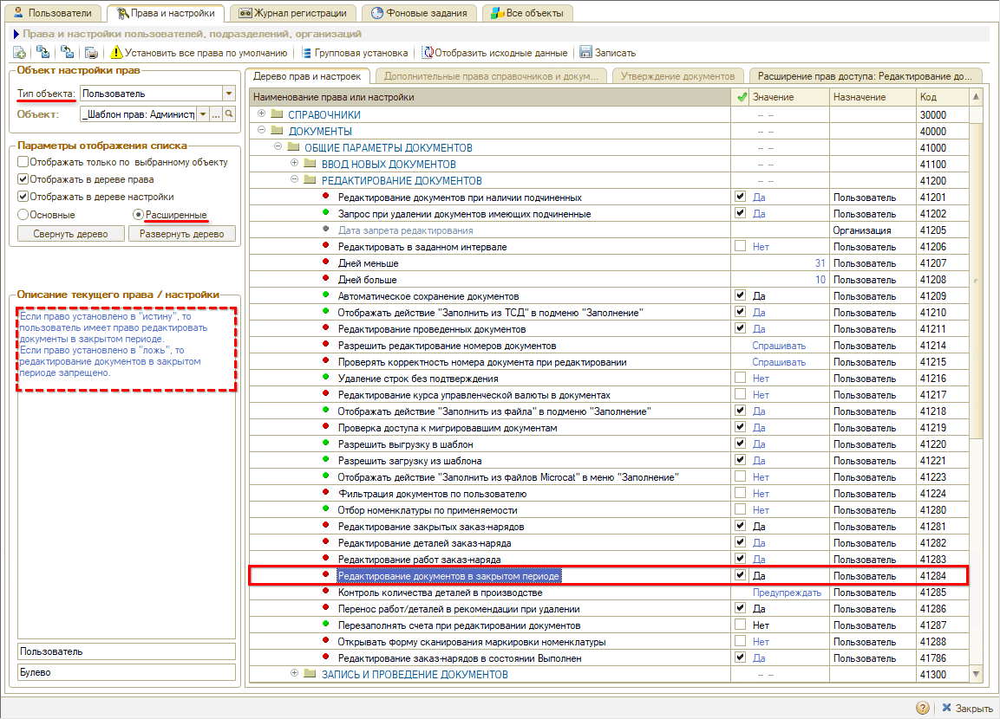

Если право установлено в значение "Да", то пользователь имеет право редактировать документы в закрытом периоде (т.е. до даты, указанной в праве “Дата запрета редактирования” – см. [выше](#1-дата-запрета-редактирования)).

Если право установлено в значение "Нет", то редактирование документов в закрытом периоде запрещено.

Для данного права предусмотрено *расширение прав доступа:* есть возможность добавить исключения по отдельным типам документов. При стандартной настройке права запрет распространяется на все документы.

Например, пользователю разрешено редактирование документов в закрытом периоде, но для некоторых документов необходимо запретить редактирование. Для этого следует установить основное право в значение “Да”, перейти на вкладку *“Расширение прав доступа”,* добавить документы, которые пользователю будет запрещено редактировать, и установить для них значение “Нет”:

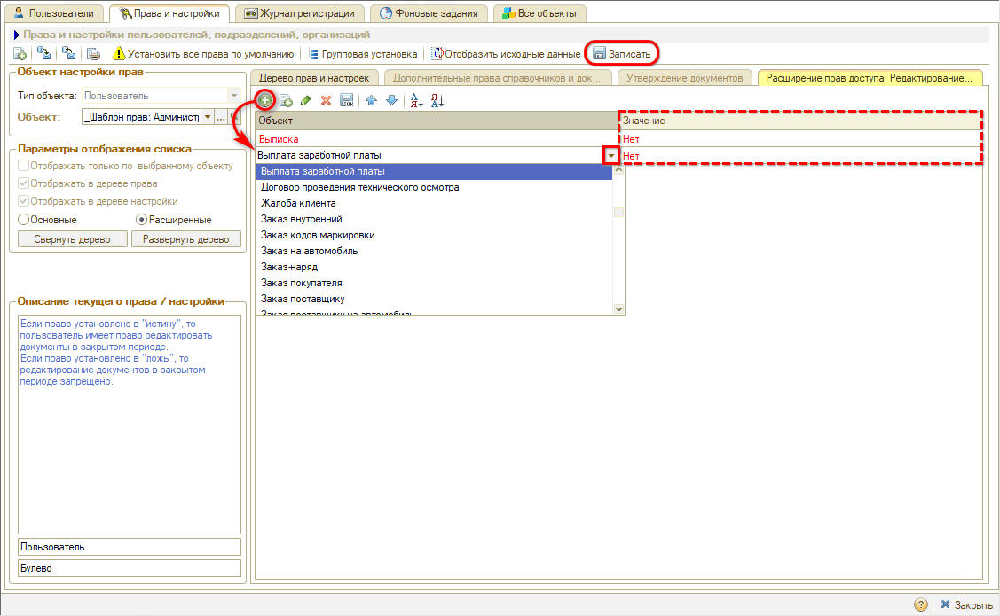

Либо наоборот, пользователю запрещено редактировать все документы, но для некоторых документов требуется предоставить доступ. В этом случае следует установить основное право в значение “Нет”, а в расширениях добавить документы, которые пользователю будет разрешено редактировать, и установить для них значение “Да”.

*Примечание:* Настройки расширения прав доступа при необходимости требуется делать отдельно для каждого шаблона прав или пользователя – они не сохраняются при [копировании](../../Пользователи%20и%20права/Установка%20прав%20и%20настроек%20пользователя/ustanovka-prav-i-nastroek-polzovatelya.md#kopy) прав.

Подробнее о дополнительных настройках прав см. в [статье](../../Пользователи%20и%20права/Установка%20прав%20и%20настроек%20пользователя/ustanovka-prav-i-nastroek-polzovatelya.md#дополнительные-настройки-прав-доступа).

### 3. Редактирование документов в заданном интервале

Право *“Редактировать в заданном интервале”* является альтернативой права “Дата запрета редактирования” (см. [выше](#1-дата-запрета-редактирования)) и так же, как оно, используется совместно с правом “Редактирование документов в закрытом периоде” (см. [выше](#2-право-редактирования-документов-в-закрытом-периоде)).

*Внимание!* Право "Дата запрета редактирования" имеет *приоритет* запрещения перед текущим правом.

Право устанавливается *на пользователя:*

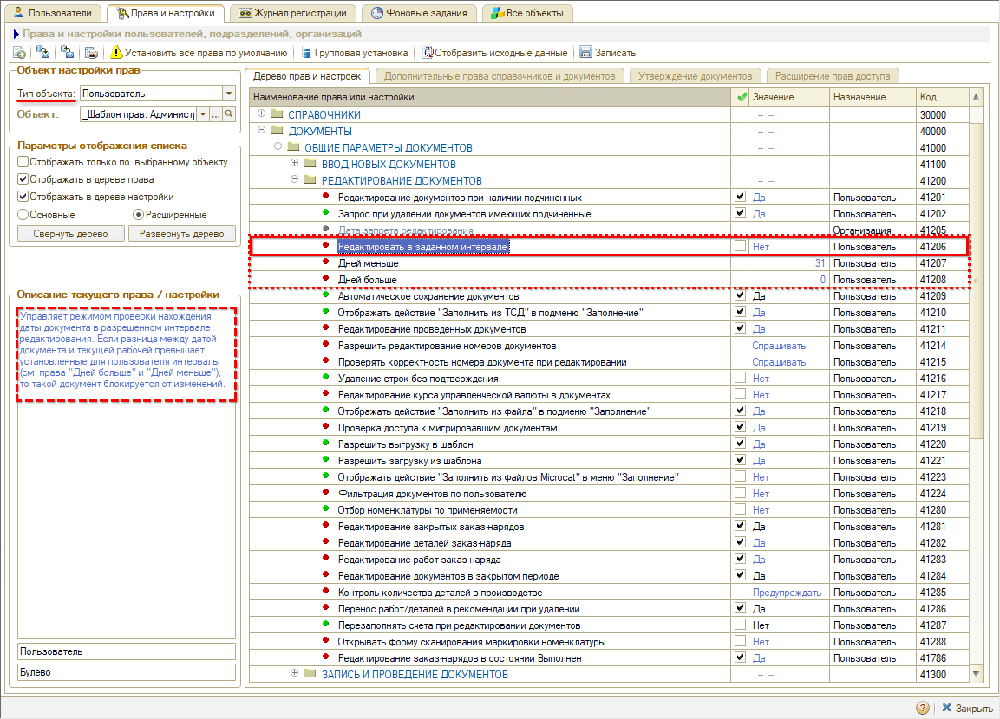

Данное право управляет режимом проверки нахождения даты документа в разрешенном интервале редактирования. Если разница между датой документа и текущей рабочей превышает установленные для пользователя интервалы (см. права "[Дней меньше](#dney_menshe)" и "[Дней больше](#dney_bolshe)"), то такой документ блокируется от изменений.

Если установить право в значение "Да", становятся доступны настройки *"Дней меньше" и "Дней больше":*

**1) Дней меньше**

Данное право работает только при включении режима "Редактирование в заданном интервале" (см. [выше](#3-редактирование-документов-в-заданном-интервале)).

В значении права *“Дней меньше”* устанавливается нижний порог разрешенного интервала редактирования документов. То есть максимальный срок давности документа в днях  (считая назад от текущей рабочей даты), когда еще можно вносить в документ изменения:

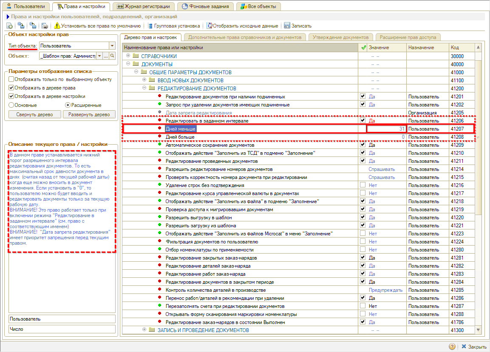

Если установить значение "0", то пользователю можно будет вводить и редактировать документы только за текущую рабочую дату.

**2) Дней больше**

Данное право работает только при включении режима "Редактирование в заданном интервале" (см. [выше](#3-редактирование-документов-в-заданном-интервале)).

В значении права *“Дней больше”* устанавливается верхний порог разрешенного интервала редактирования документов. То есть максимальное опережение даты документа в днях текущей рабочей даты:

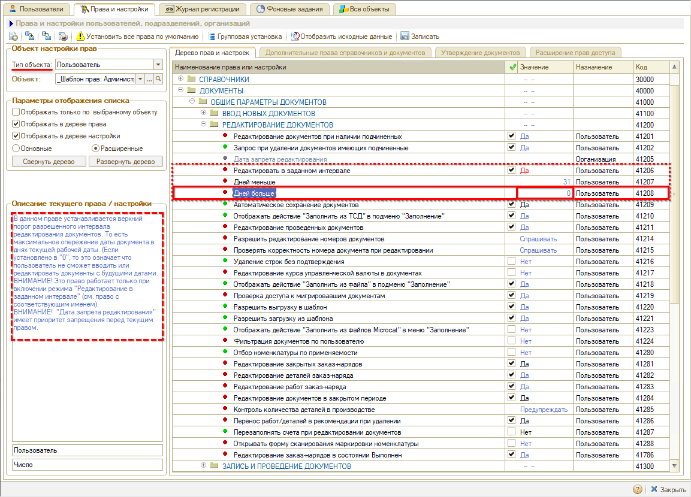

Рекомендуемое значение для данного права “0”: если установлено значение "0", то пользователь не сможет вводить или редактировать документы с будущими датами.

### 4. Редактирование проведенных документов

Право *“Редактирование проведенных документов”* является альтернативой права “Редактировать в заданном интервале” (см. [выше](#3-редактирование-документов-в-заданном-интервале)), но с более жесткими ограничениями – пользователи могут редактировать только непроведенные документы, после проведения документов возможность редактирования блокируется. Выводится предупреждение системы, форма проведенных документов открывается в режиме просмотра:

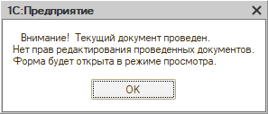

Запрещается любое изменение проведенного документа, включая изменение его состояния на непроведенное и установки ему пометки на удаление.

В случае необходимости внести изменения в уже проведенный документ пользователю потребуется обратиться к ответственным сотрудникам, имеющим права на редактирование.

*Примечание:* В случае редактирования Заказ-нарядов данное право действует только на документы в состоянии “Закрыт”.

Право “Редактирование проведенных документов” относится к *расширенным* правам – для его настройки требуется переключиться на полный список прав (см. в [статье](../../Пользователи%20и%20права/Установка%20прав%20и%20настроек%20пользователя/ustanovka-prav-i-nastroek-polzovatelya.md#основные-и-расширенные-права)), устанавливается *на пользователя:*

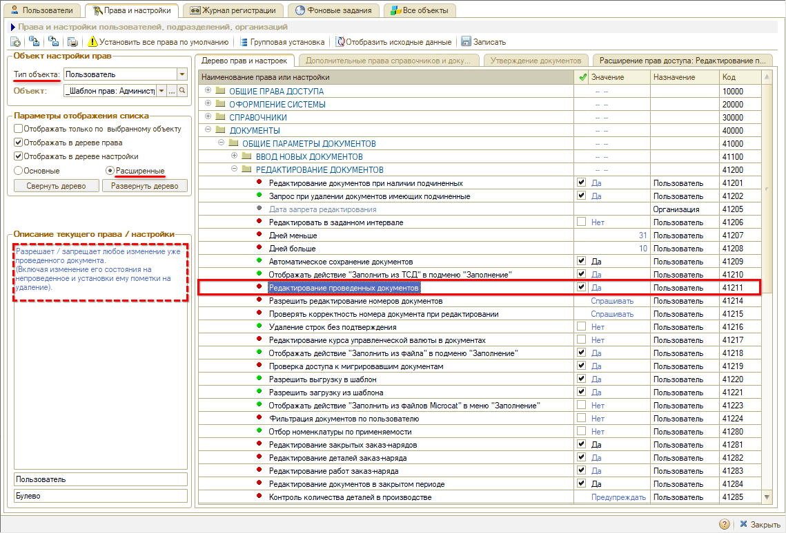

Для данного права предусмотрено *расширение прав доступа.* При стандартной настройке права запрет распространяется на все документы. Однако часто возникает ситуация, что пользователю требуется, например, перезаписать клиента – внести изменения в запись на ремонт, но он не может это сделать, т.к. у него нет права редактировать документы.

В таком случае можно установить основное право в значение “Нет”, перейти на вкладку *“Расширение прав доступа”,* добавить документы, которые пользователю будет разрешено редактировать, и установить для них значение “Да”:

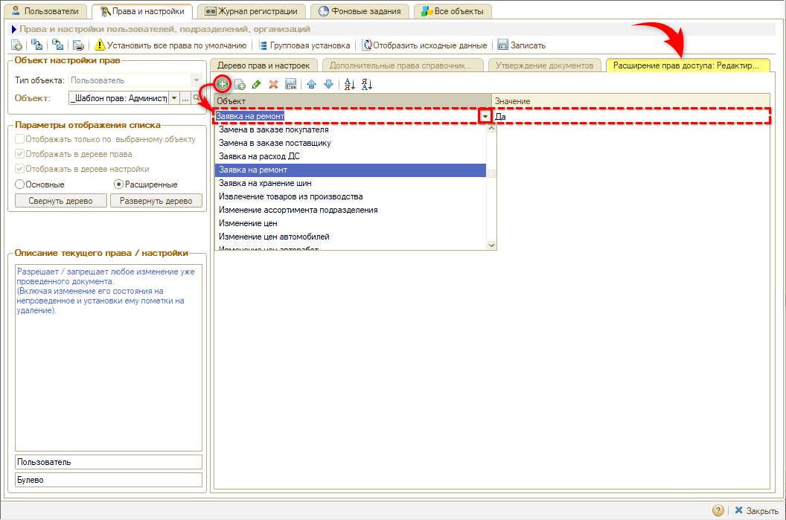

Одно из *рекомендуемых исключений* – “Заявка на ремонт”: если данный документ будет закрыт для редактирования, у пользователя не будет возможности изменять созданные записи в [планировщике](../../Запись%20на%20ремонт/Календарь%20для%20планирования%20работ/kalendar-dlya-planirovaniya-rabot.md). При добавлении документа в исключения пользователь не сможет редактировать проведенные документы за исключением "Записей на ремонт".

Либо наоборот, может быть настроен доступ к редактированию всех проведенных документов, т.е. в основных настройках права установлено значение “Да”, а в расширении указано, для каких документов будет установлен запрет редактирования, т.е. значение “Нет”.

*Примечание:* Настройки расширения прав доступа при необходимости требуется делать отдельно для каждого шаблона прав или пользователя – они не сохраняются при [копировании](../../Пользователи%20и%20права/Установка%20прав%20и%20настроек%20пользователя/ustanovka-prav-i-nastroek-polzovatelya.md#kopy) прав.

Подробнее о дополнительных настройках прав см. в [статье](../../Пользователи%20и%20права/Установка%20прав%20и%20настроек%20пользователя/ustanovka-prav-i-nastroek-polzovatelya.md#дополнительные-настройки-прав-доступа).

### 5. Редактирование закрытых заказ-нарядов

Право *“Редактирование закрытых заказ-нарядов”* устанавливается *на пользователя:*

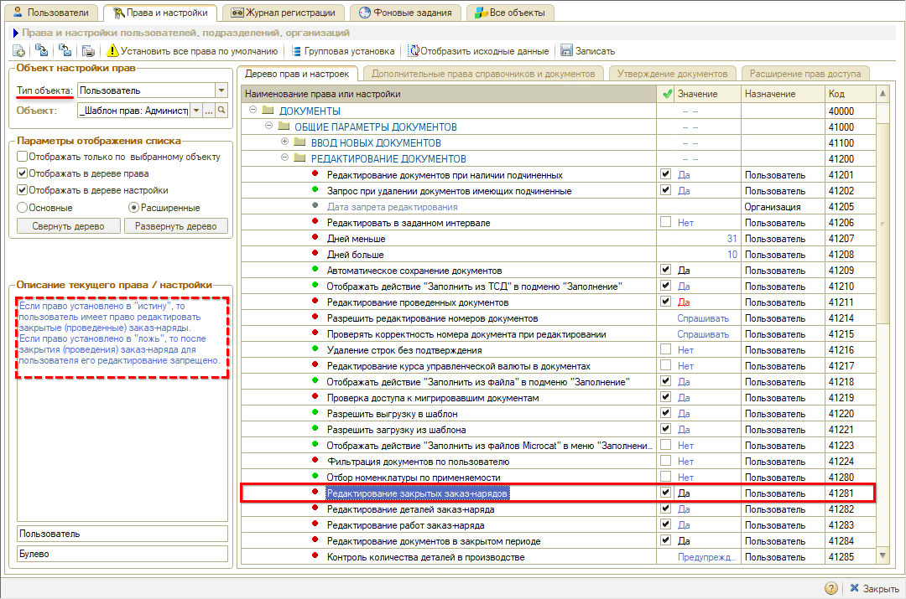

Если право установлено в значение "Да", то пользователь имеет право редактировать закрытые (проведенные) [заказ-наряды](../../Автосервис/Работа%20с%20Заказ-нарядами/Заказ-наряды/zakaz-naryady.md).

Если право установлено в значение "Нет", то после перевода заказ-наряда в [состояние](../../Автосервис/Работа%20с%20Заказ-нарядами/Состояния%20Заказ-наряда/sostoyaniya-zakaz-naryada.md) “Закрыт” для пользователя его редактирование запрещено.

Рекомендуется для рядовых пользователей установить данное право в значение “Нет”.

*Примечание:* Для того, чтобы пользователь мог редактировать закрытые заказ-наряды, у него должны быть установлены разрешения как текущим правом, так и правом “Редактирование проведенных документов” (см. [выше](#4-редактирование-проведенных-документов)).

### 6. Редактирование заказ-нарядов в состоянии Выполнен

Право *“Редактирование заказ-нарядов в состоянии Выполнен”* предназначено для дополнительного контроля над действиями сотрудников. Обычно окончательная оплата [заказ-наряда](../../Автосервис/Работа%20с%20Заказ-нарядами/Заказ-наряды/zakaz-naryady.md) осуществляется после его перевода в [состояние](../../Автосервис/Работа%20с%20Заказ-нарядами/Состояния%20Заказ-наряда/sostoyaniya-zakaz-naryada.md) “Выполнен”. Данное право ограничивает возможность редактирования документов после перевода в это состояние, т.е. после оплаты документа пользователь не сможет вносить в него изменения.

Данное право устанавливается *на пользователя:*

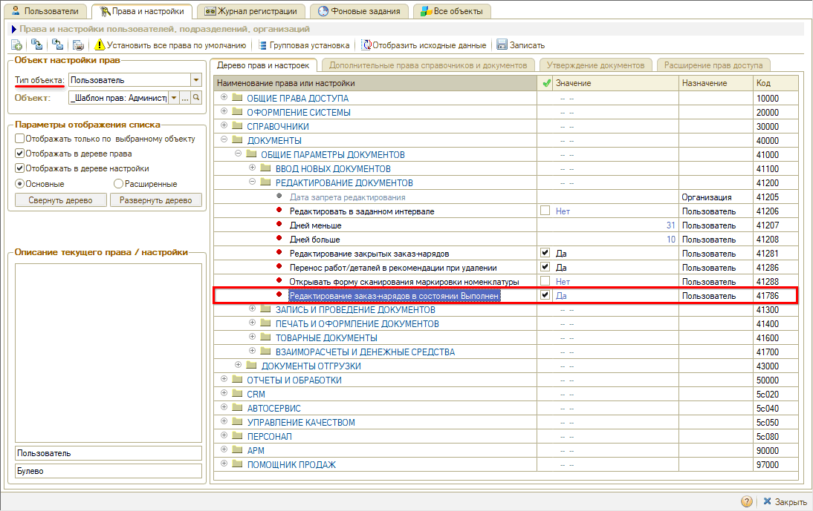

По умолчанию право установлено в значение “Да” – в данном случае пользователю доступно редактирование заказ-нарядов в состоянии “Выполнен”. Если право установить в значение “Нет”, то при переводе заказ-нарядов в состояние “Выполнен” их редактирование для пользователя блокируется, есть возможность только перевести заказ-наряд в состояние “Закрыт”.

### 7. Права на редактирование документов определенного типа

Для более детальной настройки прав есть возможность ограничить доступ к *редактированию* *документов определенного типа* – по каждому типу документов.

Данные права собраны в группе *расширенных* прав “Права доступа документов” и устанавливаются *на пользователя:*

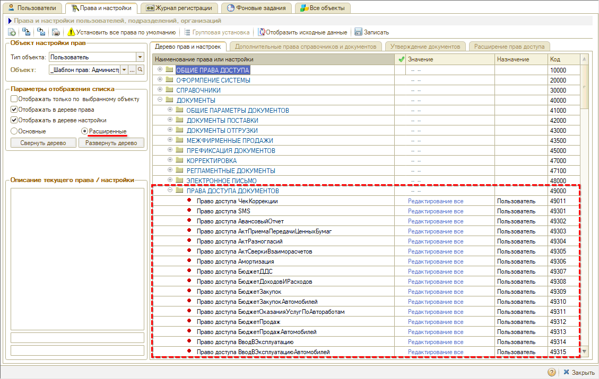

Предусмотрены следующие варианты *значений:*

- *Редактирование все* – предоставляет доступ к редактированию всех документов данного типа.
- *Редактирование по пользователям* – предоставляет доступ по авторам документов: если установить данное значение, пользователь сможет редактировать только созданные им самим документы, также можно добавить других авторов на вкладке дополнительных прав (по аналогии с настройкой редактирования по подразделениям). Чужие документы будут закрыты для редактирования, доступны только для чтения. На практике данная настройка используется редко.
- *Редактирование по подразделениям* – предоставляет доступ к редактированию только тех документов данного типа, которые созданы по подразделению пользователя. Документы по другим подразделениям закрыты для редактирования, доступны только для чтения.
- *Чтение все* – предоставляет доступ только к просмотру документов. Редактирование всех документов данного типа будет недоступно. При открытии документа выйдет служебное сообщение: *“Нет прав на редактирование объектов вида <вид документа>”,* документ будет открыт только для чтения – пользователь не сможет внести в него никакие изменения.
- *Нет доступа* – закрывает доступ и к просмотру, и к редактированию всех документов данного типа. Пользователь сможет просматривать реестр документов, а также увидеть их через дерево документов (при наличии доступа к связанным) и через отчеты[\*](#snoska), но при попытке открыть документ будет выходить служебное сообщение: *“Нет доступа к объектам вида <вид документа>”,* формы документов открываться не будут.  
  *\*Примечание: При необходимости полного запрета доступа к документам в программе следует использовать отключение [ролей пользователя](../../Пользователи%20и%20права/Роли%20пользователей/roli-polzovateley.md#описание-ролей), механизм [разграничения доступа к данным по подразделениям (RLS)](../Доступ%20к%20данным%20по%20подразделениям%20%28RLS%29/dostup-k-dannym-po-podrazdeleniyam-rls.md), а также настройку [рабочих столов](../Настройка%20рабочего%20стола/nastroyka-rabochego-stola.md#редактирование-состава-рабочего-стола) и интерфейса (см. [статью](../Настройка%20рабочего%20стола/nastroyka-rabochego-stola.md#настройки-разделов-и-пунктов-рабочего-стола)).*

Требуется выбрать объект установки права, т.е. шаблон прав (либо пользователя без шаблона), установить нужное значение и записать. Установка прав производится отдельно для каждого типа документов:

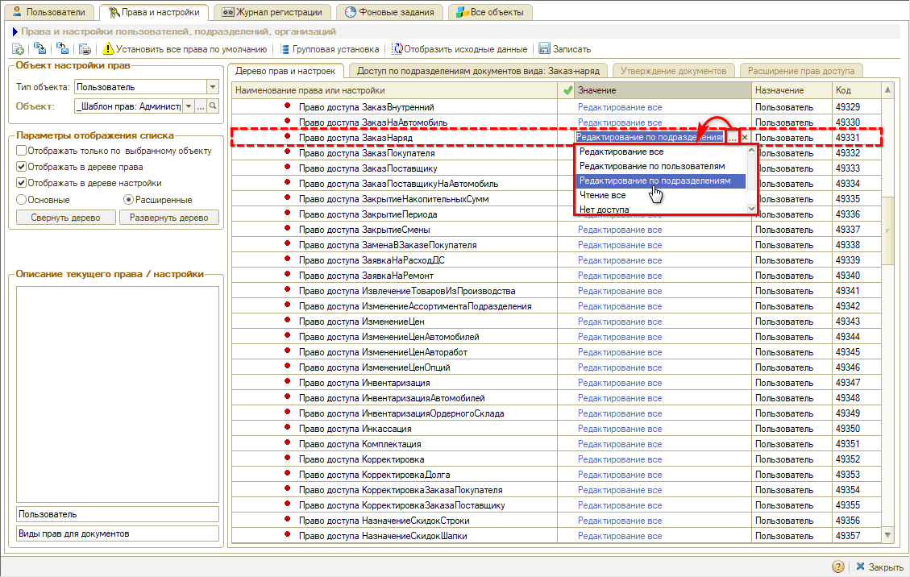

При необходимости установки данного значения на все шаблоны прав удобно использовать механизм [групповой установки прав](../../Пользователи%20и%20права/Установка%20прав%20и%20настроек%20пользователя/ustanovka-prav-i-nastroek-polzovatelya.md#групповая-установка-прав):

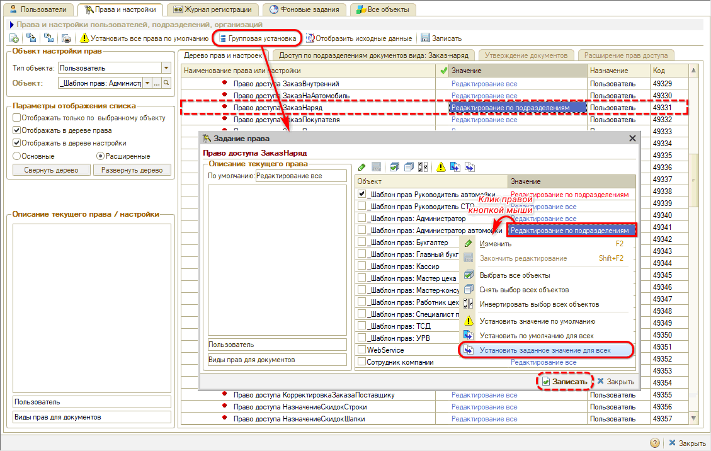

При такой настройке каждому пользователю будут доступны для редактирования только документы по тому подразделению, принадлежность к которому установлена в карточке пользователя.

Дополнительно можно выбрать и другие подразделения, к документам которых нужно открыть доступ. Для этого следует перейти на вкладку *“Доступ по подразделениям документов вида”,* которая становится активной при выборе значения “Редактирование по подразделениям”, добавить на нее подразделение пользователя и другие подразделения, по которым требуется предоставить доступ, и *записать* изменения:

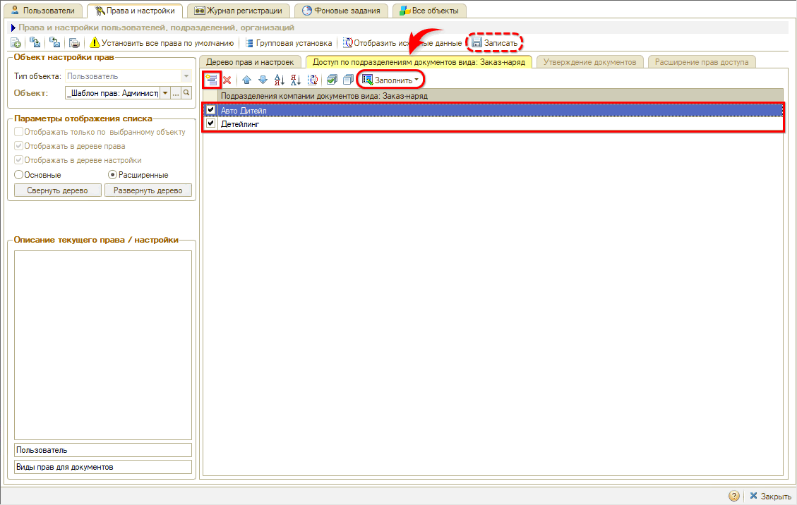

Если не указать на данной вкладке подразделения, то у пользователя будет доступ к редактированию документов данного типа только по своему подразделению.

При попытке пользователя открыть документ недоступного подразделения система не позволит его редактировать: появится служебное сообщение *“Нет прав на редактирование объектов вида <вид документа>”,* документ будет открыт только для чтения – никакие изменения внести в него пользователь не сможет. Также все документы будут доступны для просмотра в реестрах и отчетах.

*Примечание 1:* Для ограничения просмотра документов по чужим подразделениям можно включить права в группе *“Справочники”:*

- право *“Фильтрация справочников и документов”* в значение *“Фильтровать по организации и подразделению”;*
- право *“Разрешить отключать фильтрацию справочников и документов”* в значение *“Нет”.*

*Примечание 2:* При необходимости полного запрета доступа к документам других подразделений следует использовать механизм [разграничения доступа к данным по подразделениям (RLS)](../Доступ%20к%20данным%20по%20подразделениям%20%28RLS%29/dostup-k-dannym-po-podrazdeleniyam-rls.md).

---

**Теги:** пользователи и права, администрирование, редактирование документов, права, запрет изменений
