

# Создание и редактирование пользователей 5S Cloud

<table><tr><td><b>Время чтения:</b> 15 мин.</td><td><b>Обновлено:</b> 04.04.2025</td></tr></table>

Источник: https://www.5systems.ru/help/sozdanie-i-redaktirovanie-polzovateley-5s-cloud

> *Актуально начиная с версии релиза 5S AUTO **2.8.2**.*

## Содержание

1. [Введение](#введение)
2. [Добавление пользователей администратором](#добавление-пользователей-администратором)
   - [1. Добавление нового пользователя](#1-добавление-нового-пользователя)
   - [2. Установка пароля администратором](#2-установка-пароля-администратором)
   - [3. Редактирование пользователей](#3-редактирование-пользователей)
      - [1) Редактирование учетных данных](#1-редактирование-учетных-данных)
      - [2) Изменение пароля](#2-изменение-пароля)
   - [4. Блокировка пользователей](#4-блокировка-пользователей)
3. [Самостоятельная регистрация пользователем](#самостоятельная-регистрация-пользователем)
   - [1. Авторизация](#1-авторизация)
   - [2. Создание нового пользователя](#2-создание-нового-пользователя)
      - [1) Создание пользователя](#1-создание-пользователя)
      - [2) Установка пароля](#2-установка-пароля)
   - [3. Редактирование учетных данных](#3-редактирование-учетных-данных)
      - [1) Изменение данных профиля](#1-изменение-данных-профиля)
      - [2) Изменение пароля](#2-изменение-пароля-1)
4. [Регистрация пользователя для контрагента](#регистрация-пользователя-для-контрагента)

## Введение

***5S Cloud –*** это экосистема облачных продуктов и сервисов компании 5SYSTEMS, в которую, например, входят:

- [Контакт-центр 5S Chat](https://element.5systems.ru/);
- [Терминал 5S Pay](https://pay.5systems.ru/);
- [Шлюз Export API](https://api.5systems.ru/export/v1/doc);
- [Шлюз Part API](https://api.5systems.ru/part/v1/doc#tag/Stocks);
- и т.д.

Все составляющие экосистемы связаны воедино с помощью *общей системы аутентификации.*

Существует возможность *управлять списком учетных записей* напрямую из справочников [пользователей](../../Пользователи%20и%20права/Пользователи/polzovateli.md) и [контрагентов](../../Работа%20с%20клиентами/Контрагенты%20и%20контакты/kontragenty-i-kontakty.md) 5S AUTO.

Для работы функционала необходима настроенная интеграция с [API 5S AUTO](../API%205S%20AUTO/api-5s-auto.md), в которой логин и пароль задаются как раз от пользователя 5S Cloud (эта служебная учетная запись создается сотрудниками компании 5SYSTEMS, далее под ее правами создаются учетные записи для других пользователей компании).

**Информация для технических специалистов:** Учетные записи для системы аутентификации администрируются через шлюз [Admin API](https://api.5systems.ru/admin/v1/swagger/index.html#/Users/post_user), авторизация происходит через шлюз [Auth API](https://api.5systems.ru/auth/v1/doc).

## Добавление пользователей администратором

### 1. Добавление нового пользователя

Добавить нового пользователя 5S Cloud может [пользователь](../../Пользователи%20и%20права/Пользователи/polzovateli.md) программы 5S AUTO с правами *администратора.*

Для этого следует открыть карточку пользователя программы и перейти на вкладку “Параметры пользователя”. В поле “Доступ к 5S Cloud” следует либо выбрать существующего пользователя 5S Cloud:

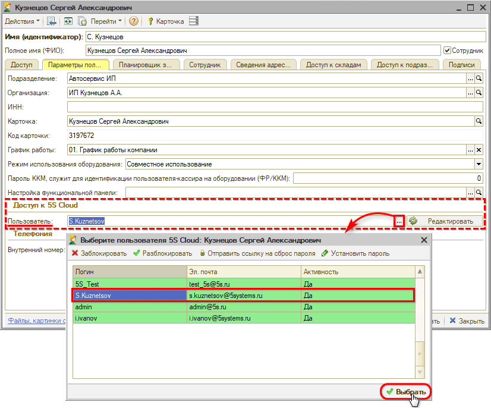

либо добавить нового:

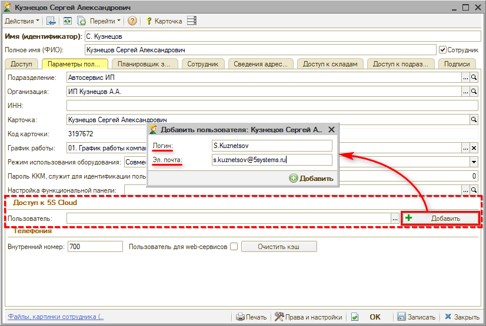

Следует заполнить *логин* и *электронную почту* пользователя. Эл. почту рекомендуется использовать действующую, чтобы у пользователя была возможность менять свой пароль, но можно использовать любой фейковый адрес.

*Примечание 1:* Для логина нельзя использовать никакие специальные символы, кроме: . , - _ (точка, запятая, тире, подчеркивание). При вводе недопустимых символов выйдет предупреждение программы:

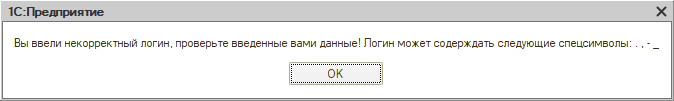

*Примечание 2:* Контролируется *уникальность* логинов и адресов электронной почты всех пользователей в 5S Cloud.

После заполнения данных следует нажать кнопку “Добавить” – при этом появляется сообщение программы об успешном создании пользователя:

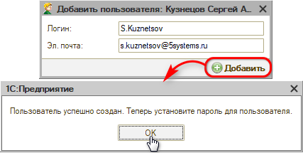

Далее необходимо задать пароль для пользователя 5S Cloud – письмо для установки пароля будет отправлено на указанную электронную почту:

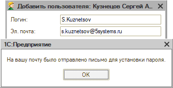

Пользователю следует найти в своей эл. почте данное письмо и установить пароль, следуя указаниям – см. *[ниже](#2-установка-пароля).*

Также пароль может быть установлен администратором – см. *[далее](#2-установка-пароля-администратором).*

### 2. Установка пароля администратором

Администратор может самостоятельно установить или изменить пароль любому пользователю 5S Cloud. Для этого следует в списке пользователей нажать кнопку “Установить пароль”:

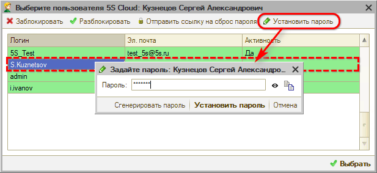

Можно ввести произвольный пароль либо нажать кнопку “Сгенерировать пароль”.

Пароль отображается в зашифрованном виде для обеспечения безопасности его хранения. Для контроля корректности вводимых данных можно использовать кнопку *“Показать”:*

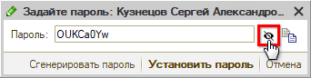

> [!CAUTION]
> ***Внимание!*** ***Введенный пароль будет использоваться во всех сервисах компании 5SYSTEMS, доступ к которым осуществляется через авторизацию в 5S Cloud. Обязательно* ***сохраните пароль*** *в безопасном месте, чтобы не забыть.***

Скопировать пароль в буфер обмена можно с помощью специальной кнопки:

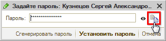

После ввода пароля следует нажать кнопку *“Установить пароль”* и подтвердить действие:

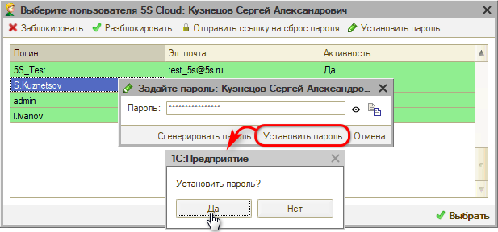

Программа выводит сообщение об успешной установке пароля:

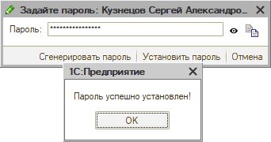

### 3. Редактирование пользователей

#### 1) Редактирование учетных данных

Администратор имеет возможность редактировать информацию о пользователях 5S Cloud.

Для изменения логина или эл. почты следует в поле “Доступ к 5S Cloud” в карточке пользователя программы нажать кнопку *“Редактировать”:*

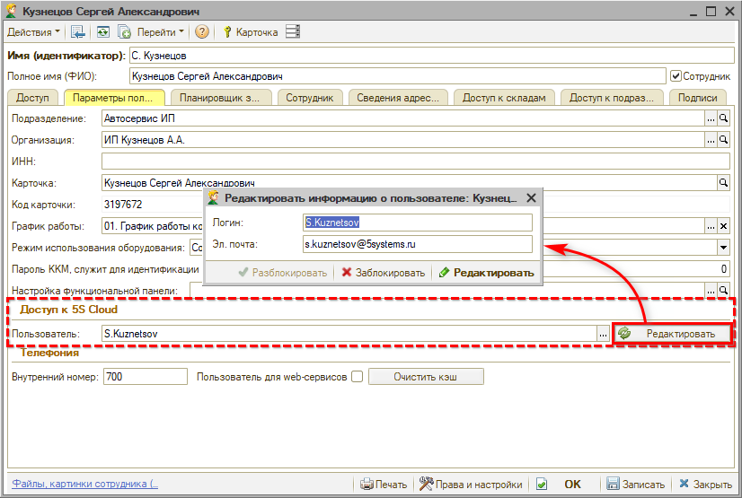

Следует ввести новые логин и/или эл. почту и нажать кнопку “Редактировать” на форме редактирования информации о пользователе.

#### 2) Изменение пароля

Администратор может самостоятельно изменить пароль любому пользователю 5S Cloud – действия аналогичны установке пароля (см. *[выше](#2-установка-пароля-администратором)).*

Также есть возможность отправить пользователю на эл. почту ссылку на сброс пароля для того, чтобы пользователь сам установил себе новый пароль. Для этого в [списке](#добавление-пользователей-администратором) пользователей 5S Cloud следует нажать кнопку *“Отправить ссылку на сброс пароля”:*

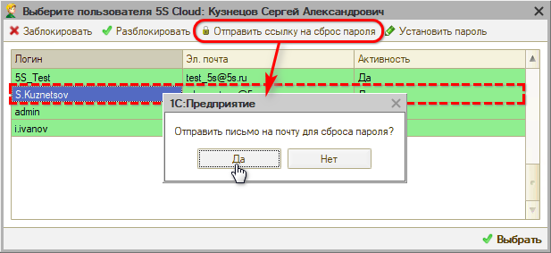

После отправки письма выходит сообщение программы:

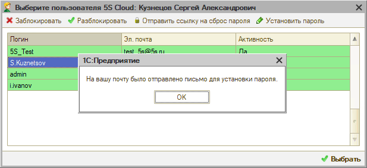

Далее пользователю следует найти данное письмо в своей почте и установить новый пароль, следуя инструкции – см. *[ниже](#2-установка-пароля).*

### 4. Блокировка пользователей

Администратор имеет возможность *заблокировать / разблокировать* любого пользователя 5S Cloud.

При закрытии доступа пользователю 5S AUTO связанная с ним учетная запись 5S Cloud блокируется. Заблокированный пользователь не сможет воспользоваться продуктами и сервисами 5S Cloud.

Заблокировать пользователя администратор может следующими *способами:*

**1) Через форму редактирования пользователя**

Для этого следует перейти к форме редактирования пользователя (см. [*выше*](#3-редактирование-пользователей)) и нажать кнопку “Заблокировать” или “Разблокировать”:

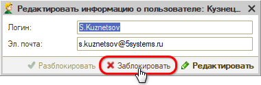

*Примечание:* Доступна одна из этих кнопок в зависимости от того, активен или заблокирован пользователь на данный момент.

**2) Через список пользователей**

Для этого следует перейти к *[списку](#добавление-пользователей-администратором) пользователей 5S Cloud* и нажать в нем кнопку “Заблокировать” или “Разблокировать”:

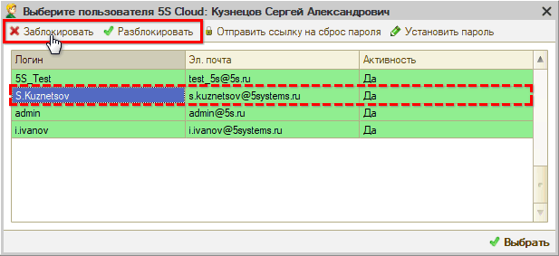

**3) Увольнение сотрудника**

Пользователь 5S Cloud автоматически блокируется при установке признака “Сотрудник уволен” в карточке пользователя 5S AUTO на [вкладке “Сотрудник”](../../Пользователи%20и%20права/Пользователи/polzovateli.md#вкладка-сотрудник) или признака “Уволен” в карточке сотрудника.

## Самостоятельная регистрация пользователем

### 1. Авторизация

Пользователи программы 5S AUTO могут самостоятельно авторизоваться в 5S Cloud.

Для этого необходимо нажать на кнопку с аватаром на [рабочем столе](../../CRM/Структура%20интерфейса%205S%20AUTO/struktura-interfeysa-5s-auto.md) и выбрать пункт меню *“Авторизоваться в 5S Cloud”:*

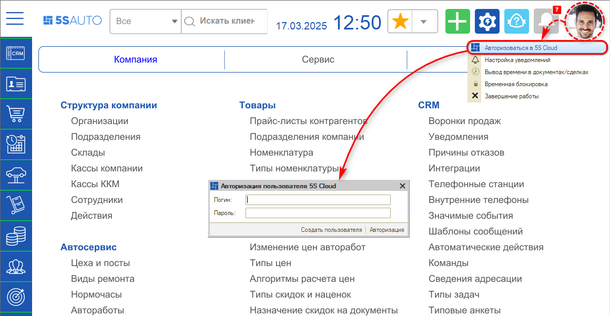

Если учетная запись пользователя была ранее создана, то нужно только авторизоваться, т.е. установить связь пользователя программы с учетными данными пользователя 5S Cloud.

Для этого необходимо *ввести логин и пароль* пользователя 5S Cloud и нажать кнопку *“Авторизация”.*

*Примечание:* логин – это имя пользователя, а не адрес электронной почты.

В случае ввода корректных данных появляется сообщение программы об успешной авторизации:

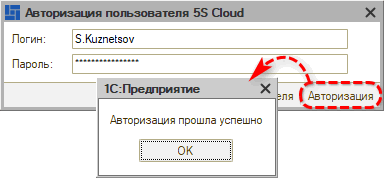

При повторном открытии формы авторизации через аватар пользователя 5S AUTO выводится информация об учетной записи:

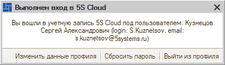

При необходимости можно *редактировать* данные (см. [ниже](#3-редактирование-учетных-данных)), переустановить пароль (см. [ниже](#2-изменение-пароля-1)), а также *выйти из профиля* и авторизоваться под другими учетными данными.

### 2. Создание нового пользователя

#### 1) Создание пользователя

Если учетная запись для пользователя ранее не создавалась, пользователь 5S AUTO может самостоятельно зарегистрироваться в 5S Cloud.

Для этого необходимо также перейти к форме авторизации через аватар на рабочем столе – см. *[выше](#1-авторизация),* и нажать кнопку “Создать пользователя”:

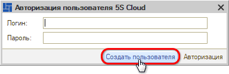

Производится переход к форме создания пользователя. Требуется задать *логин и e-mail* и нажать кнопку *“Создать”:*

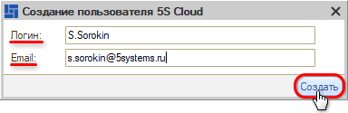

Программа уведомляет о том, что пользователь успешно создан:

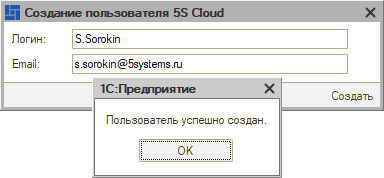

#### 2) Установка пароля

Далее следует задать пароль – для этого на эл. почту отправляется письмо:

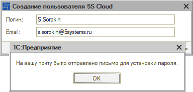

Следует найти в эл. почте данное письмо и перейти по ссылке:

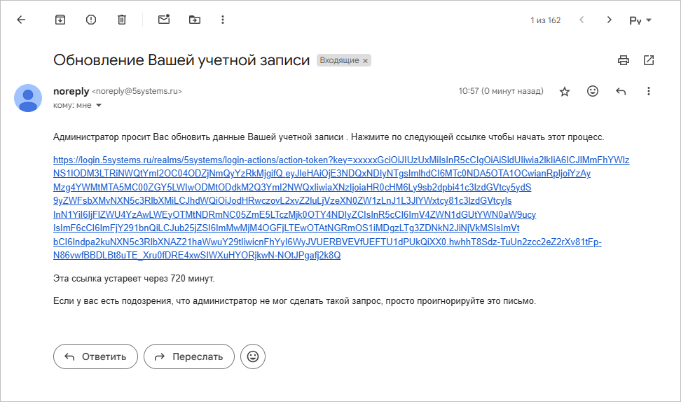

Открывается страница сайта в браузере. Следует кликнуть на ссылку *"Click here to proceed"* для продолжения:

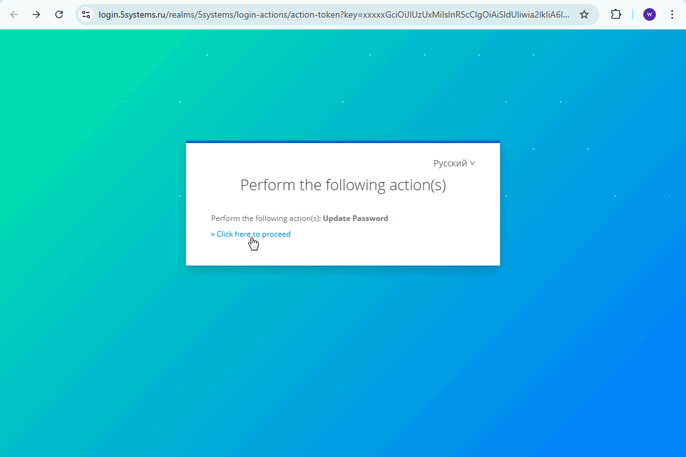

В открывшемся окне следует задать новый пароль и подтвердить его:

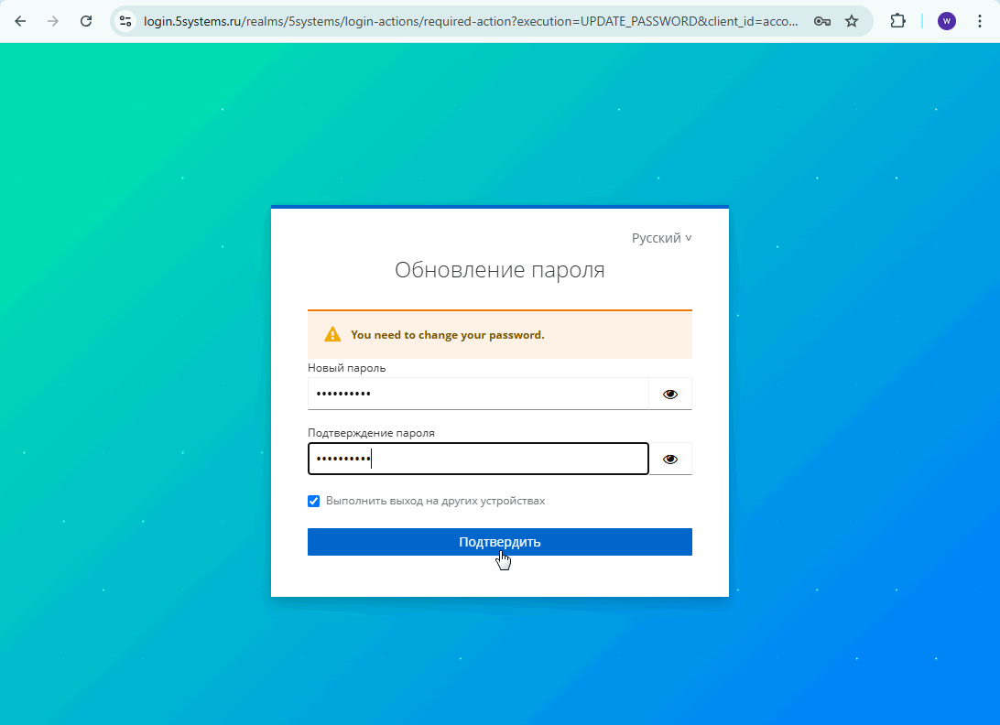

После нажатия кнопки "Подтвердить" выходит сообщение об успешном обновлении учетной записи:

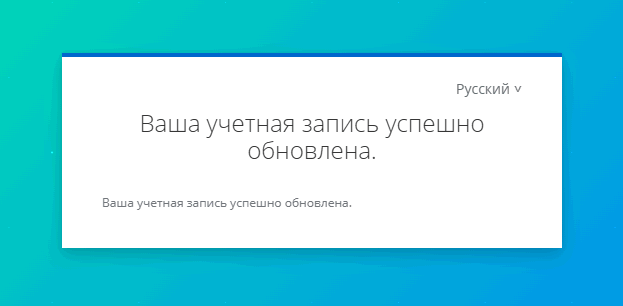

После этого следует вернуться в программу и авторизоваться. Необходимо ввести установленный пароль – для контроля корректности ввода можно использовать кнопку “Показать”. Затем нажать кнопку “Авторизация”:

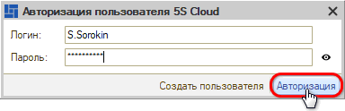

Выходит уведомление программы об успешной авторизации (см. *[выше](#uspeshn)).* Форму авторизации можно закрыть. При повторном ее открытии через аватар пользователя 5S AUTO на рабочем столе выводится информация об учетной записи:

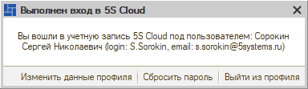

### 3. Редактирование учетных данных

#### 1) Изменение данных профиля

Для редактирования учетных данных авторизованного пользователя 5S Cloud следует открыть форму авторизации через аватар на рабочем столе – при этом выводится информация об учетной записи. Для изменения логина и e-mail следует нажать кнопку “Изменить данные профиля”:

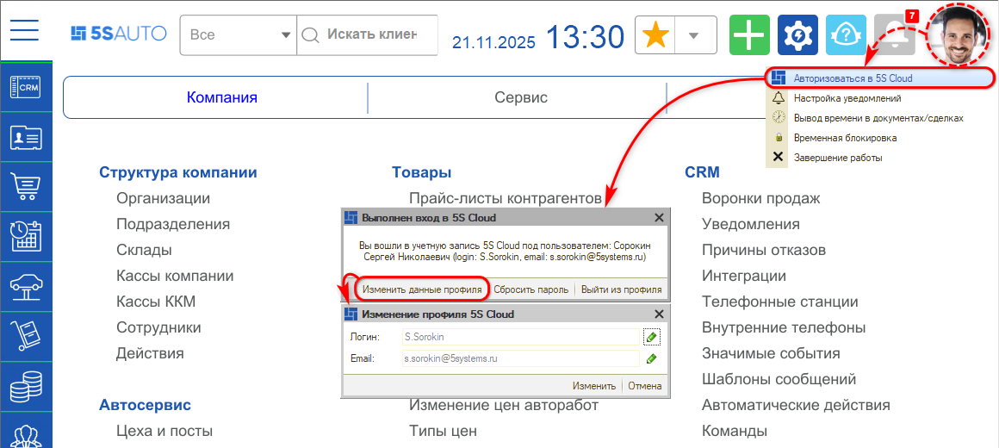

Для активации строк нужно нажать на кнопку с карандашом, затем ввести новые данные и нажать кнопку “Изменить”:

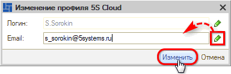

Для отмены изменений необходимо нажать кнопку *“Отмена”* (если просто закрыть форму, изменения автоматически запишутся).

#### 2) Изменение пароля

Пользователь имеет возможность задать для себя новый пароль.

Для этого следует перейти к форме авторизации и нажать кнопку “Сбросить пароль”:

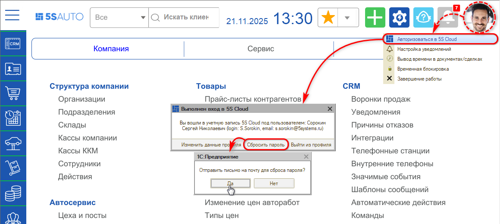

Производится отправка письма на электронную почту пользователя со ссылкой для сброса пароля:

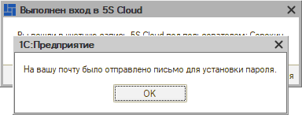

Дальнейшие действия аналогичны установке пароля при создании пользователя – см. *[выше](#2-установка-пароля).*

## Регистрация пользователя для контрагента

*в разработке*

---

**Теги:** администрирование, 5s cloud, пользователи, создание пользователя, облако

