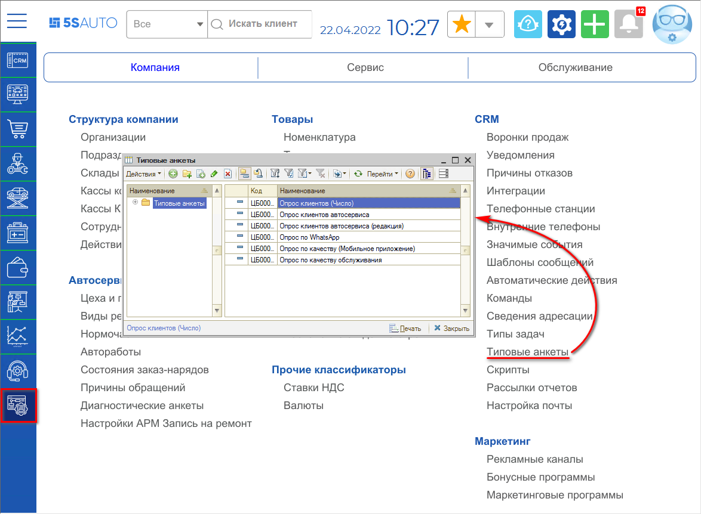
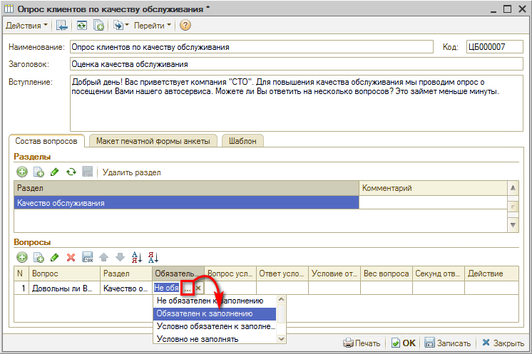
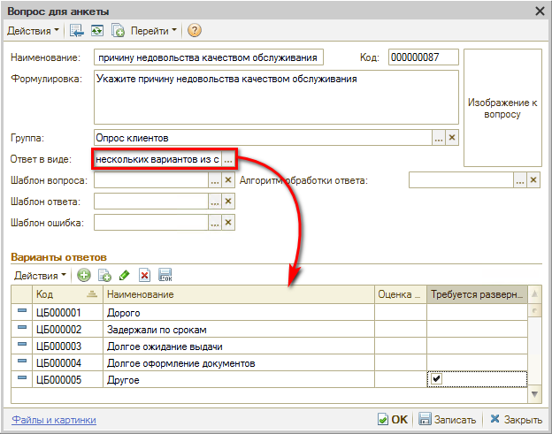
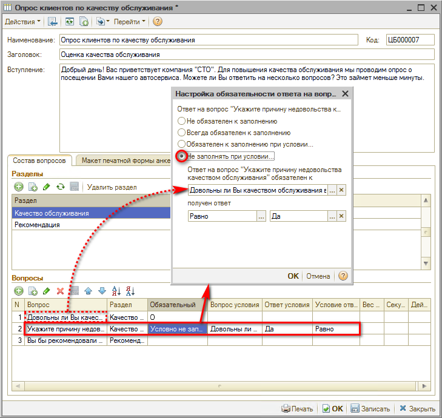
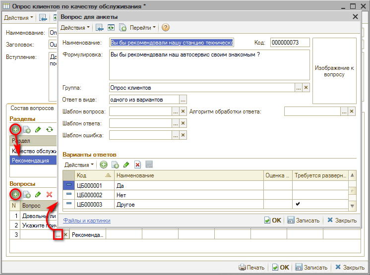
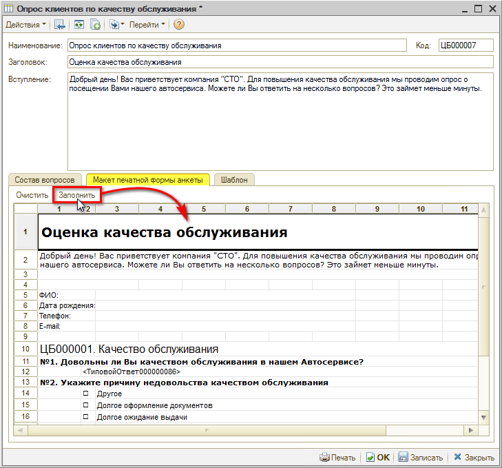
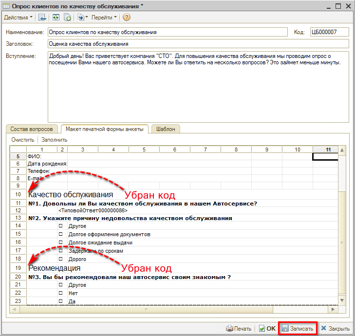

# Создание типовой анкеты

<table><tr><td><b>Время чтения:</b> 16 мин.</td><td><b>Обновлено:</b> 15.06.2022</td></tr></table>

Источник: https://www.5systems.ru/help/sozdanie-tipovoy-ankety

## Содержание

1. [Введение](#введение)
2. [Пример создания анкеты](#пример-создания-анкеты)
3. [Виды ответов](#виды-ответов)
4. [Параметры обязательности для вопроса](#параметры-обязательности-для-вопроса)
5. [Правка макета печатной формы](#правка-макета-печатной-формы)

## Введение

Анкеты для опроса клиентов создаются в справочнике "Типовые анкеты" (в меню интерфейса: *Администрирование → Компания → CRM → Типовые анкеты* / в стандартном меню: *Справочники → Взаимоотношения с клиентами → Типовые анкеты*):

Анкета состоит из параметров самой анкеты, вопросов и вариантов ответов на них, которые создаются в справочнике "Вопросы для анкетирования". Вопросы могут быть разбиты по разделам, а могут просто идти общим списком.

## Пример создания анкеты

Рассмотрим пример создания анкеты, состоящий из двух разделов.

Для начала заполним параметры самой анкеты:

1. ***Наименование*** - обязательно для заполнения.
2. ***Заголовок*** - при заполнении используется в печатной форме анкеты.
3. ***Вступление*** - при заполнении используется в печатной форме анкеты.

и запишем изменения:

Далее создадим раздел "Качество обслуживания" и добавим вопросы для раздела:

На форме создания вопроса заполним наименование, выберем вид ответа на вопрос "да/нет" (см. ниже [*"Виды ответов"*](#виды-ответов)) и нажмем кнопку "ОК":

Параметр вопроса *"Формулировка"* по умолчанию копируется из Наименования. При необходимости можно заполнить с более расширенным описанием вопроса. Формулировка вопроса отображается в режиме "Быстрое заполнение" опроса и печатной форме.

Выберем созданный вопрос для анкеты:

и установим ему обязательность заполнения:

Вторым вопросом раздела создадим вопрос с видом ответа "несколько вариантов из списка" (см. далее [*"Виды ответов"*](#виды-ответов)) и заполним возможные варианты ответов:

При установке галочки *"Требуется развернутый ответ"* появится текстовое поле для ввода пояснения.

Поскольку причину недовольства нужно указать только, если клиент на первый вопрос ответит "нет", то в качестве обязательности выберем следующую настройку:

Все возможные параметры обязательности заполнения см. [*"Параметры обязательности для вопроса"*](#параметры-обязательности-для-вопроса).

И создадим второй раздел "Рекомендации". В раздел добавим необязательный для заполнения вопрос с видом ответа "одного из вариантов" (см. [*"Виды ответов"*](#виды-ответов)):

Готово! Сохраним изменения, нажав кнопку "Ок".

## Виды ответов

| № п/п | Вид ответа | Описание |
| --- | --- | --- |
| 1 | Число | Ввод ответа только в виде числа. Можно ограничить количеством символов |
| 2 | Строка | Ввод ответа строкой. Можно ограничить количеством символов |
| 3 | Дата | Ввод ответа только в виде даты |
| 4 | Дата/время | Ввод ответа только в виде даты/времени |
| 5 | Да/нет | Выбор из вариантов ответа "да" или "нет" |
| 6 | Один из вариантов | Выбор одного варианта из предложенного списка с помощью переключателя. Заполняется список вариантов |
| 7 | Несколько вариантов из списка | Выбор нескольких вариантов из предложенного списка с помощью флажков. Заполняется список вариантов |
| 8 | Таблица | Ввод ответа в виде таблицы. Заполняется список колонок таблицы и указывается количество строк таблицы |
| 9 | Текст | Ввод ответа в виде текста |
| 10 | Ссылка | Расширяет возможности ввода ответа. Можно указать собственный тип данных для ввода ответа: число, строка, дата, булево (да/нет), значения из предопределенных справочников: Автомобили, Варианты ответов опросов, Должности, Модели автомобилей и т.д. |
| 11 | Контактная информация | Ввод ответа в виде контактной информации: телефон, адрес, e-mail и т.п. Способ ввода ответа зависит от выбранного вида и типа контактной информации |

## Параметры обязательности для вопроса

На вопрос можно настроить обязательность его заполнения. Обязательность заполнения проверяется в ходе режима "Быстрого заполнения" анкеты.

**Варианты обязательности:**

| № п/п | Параметр обязательности | Описание |
| --- | --- | --- |
| 1 | Не обязателен к заполнению | Устанавливается по умолчанию. Ответ на вопрос заполнять не обязательно. |
| 2 | Обязателен к заполнению | Нельзя перейти к следующему вопросу или завершить опрос, пока не заполнен ответ на вопрос. |
| 3 | Условно обязателен к заполнению | Задается условие при котором обязательно нужно ответить на вопрос. В качестве условия выступает ответ на предыдущий вопрос, в зависимости от которого проверяется или не проверяется обязательность заполнения. |
| 4 | Условно не заполнять | Задается условие при котором не отображается вопрос для заполнения в режиме "Быстрое заполнение". В качестве условия выступает ответ на предыдущий вопрос, в зависимости от которого отображается или не отображается данный вопрос. |

## Правка макета печатной формы

По типовой анкете предусмотрена возможность подкорректировать макет печатной формы. Для этого:

1. Перейдите на вкладку "Макет печатной формы" формы редактирования анкеты и нажмите кнопку "Заполнить":  
   
2. Подкорректируйте макет (например, уберите код раздела) и запишите изменения:  
   

Если нужно вернуться к печатной форме, формируемой программой, нажмите кнопку *"Очистить"*:

и запишите изменения.

---

**Теги:** управление качеством, анкета, типовая анкета, опрос, настройка

