

# Часовые пояса

<table><tr><td><b>Время чтения:</b> 24 мин.</td><td><b>Обновлено:</b> 22.04.2024</td></tr></table>

Источник: https://www.5systems.ru/help/chasovye-poyasa

> *Актуально начиная с версии релиза 5S AUTO **2.7.1**.*

## Содержание

1. [Введение](#введение)
2. [Отображение часовых поясов](#отображение-часовых-поясов)
   - [В документах](#в-документах)
   - [В воронке продаж](#в-воронке-продаж)
   - [В лидах/сделках](#в-лидахсделках)
   - [В планировщике](#в-планировщике)
3. [Настройка](#настройка)
   - [1. Часовой пояс информационной базы](#часовой-пояс-информационной-базы)
   - [2. Часовой пояс подразделения](#часовой-пояс-подразделения)
   - [3. Часовой пояс сеанса пользователя](#часовой-пояс-сеанса-пользователя)
   - [4. Часовой пояс АРМ “Запись на ремонт”](#часовой-пояс-арм-запись-на-ремонт)
      - [1) Часовой пояс сеанса](#часовой-пояс-сеанса)
      - [2) Часовой пояс АРМ](#часовой-пояс-арм)
   - [5. Настройка режима вывода времени в документах по умолчанию](#настройка-режима-вывода-времени-в-документах-по-умолчанию)

## Введение

Программа рассчитана на работу в условиях, когда *часовой пояс* на сервере не совпадает с реальным часовым поясом пользователей. Например, с сервером, расположенным в Москве, работают сотрудники компании из Омска, и при этом все операции в системе выполняются по местному времени (Омска).

В случае если все пользователи базы находятся в одном часовом поясе, проблем не возникает. Но если, например, головной офис компании работает в Москве, а филиалы – в других городах в разных часовых поясах, – есть риск возникновения нестыковок, которые могут привести к некорректной работе следующих инструментов программы:

- планирование записи на ремонт;
- отправка уведомлений и напоминаний о записи;
- планирование задач и звонков;
- рассылка сообщений;
- интеграция с различными сервисами; 
  и т.д.

Для того, чтобы не было нестыковок по времени, и чтобы сотрудники в географически распределенных филиалах видели в программе свое местное время, а не время головного подразделения, необходимо настроить часовые пояса для подразделений компании.

После настройки часовых поясов в программе будет выводится местное время – свое для каждого подразделения:

1. В документах;
2. В списке сделок/на канбане;
3. В Лиде/Сделке;
4. В планировщике записи на ремонт.

При наличии единого колл-центра у компании настройка часовых поясов позволяет переключаться между часовыми поясами для просмотра записи и документов в соответствии с местным временем подразделений в других городах.

Также настройка позволяет руководителю компании и другим сотрудникам, работающим с разными филиалами – например, маркетологу, – работать с данными по всем подразделениям компании с учетом их часовых поясов.

## Отображение часовых поясов

### В документах

После настройки часовых поясов время в списке документов будет по-разному отображаться для пользователей, работающих в разных подразделениях.

*Пример:* Список Заказ-нарядов у пользователя в головном подразделении, в котором установлено московское время:

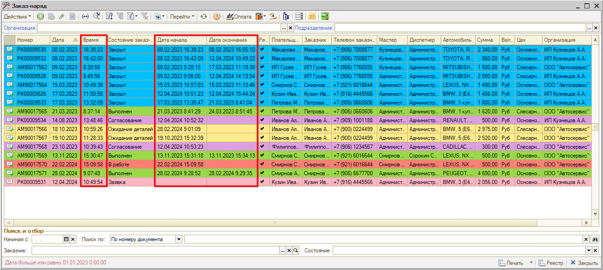

Этот же список документов у пользователя в подразделении, находящемся в другом часовом поясе, время в котором на 3 часа больше московского, в случае выбора [режима](#rezhim) отображения времени *по часовому поясу подразделения пользователя:*

В случае выбора [режима](#rezhim) отображения времени *по часовому поясу подразделения документа/сделки* отличаться от московского подразделения будут только те документы, которые оформлены по подразделению, находящемуся в другом часовом поясе:

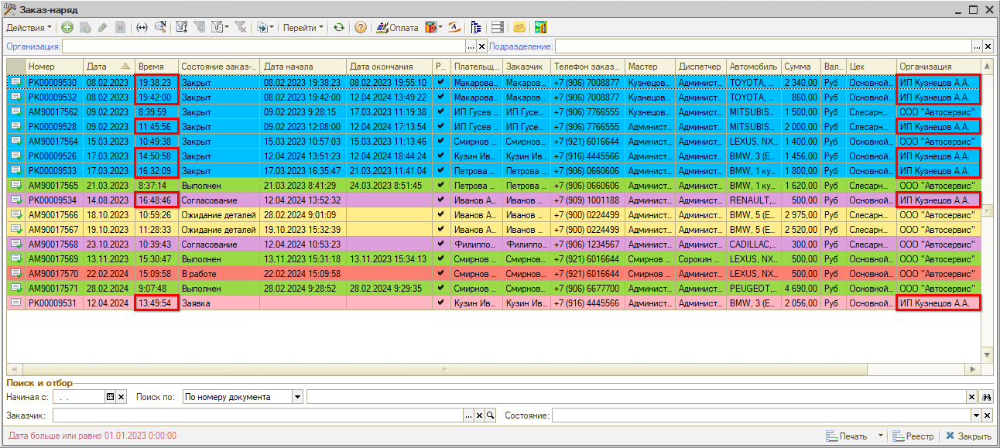

На формах документов отображается время создания документа, начала и окончания работ, машинозаезда и др.:

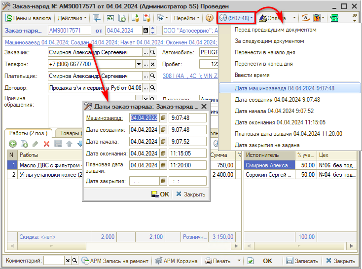

При переключении на другой часовой пояс (+3 часа) все временные показатели в документах изменяются:

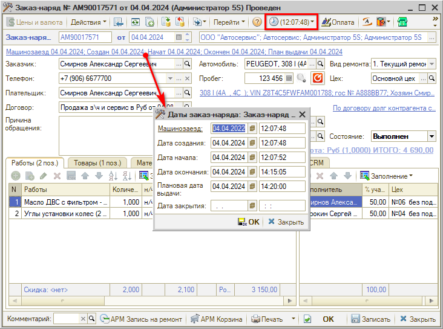

В печатных формах документов время также выводится в соответствии с часовым поясом и выбранным режимом. Время отображается в [печатных формах заказ-наряда](../../Автосервис/Работа%20с%20Заказ-нарядами/Заказ-наряды/zakaz-naryady.md#печать-заказ-наряда) “Рабочая заявка” и “Сопроводительный лист”:

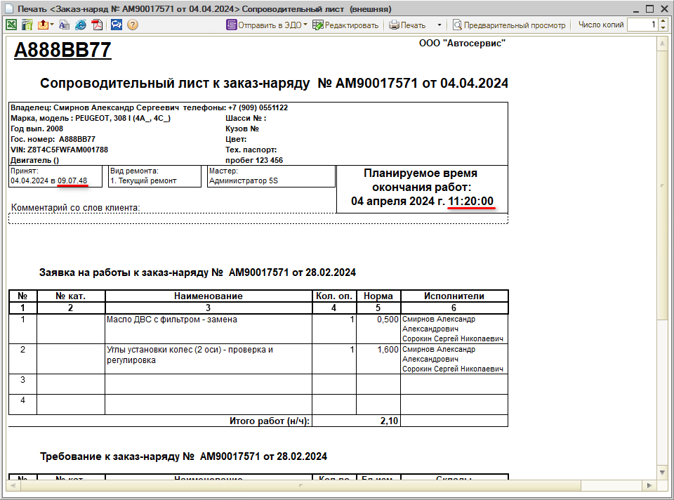

Время в этой же печатной форме в подразделении с другим часовым поясом (+3 часа):

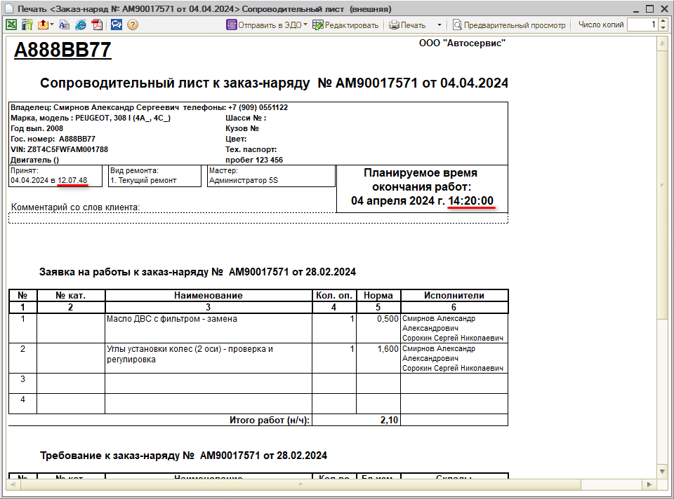

### В воронке продаж

После настройки часового пояса подразделения устанавливается местное время на верхней панели [интерфейса](../../CRM/Структура%20интерфейса%205S%20AUTO/struktura-interfeysa-5s-auto.md), а также время последней активности и время исполнения задач во всех карточках лидов/сделок на [канбане](../../CRM/Канбан%20сделок/kanban-sdelok.md#карточка-сделки) или в [списке](../../CRM/Список%20сделок/spisok-sdelok.md).

*Пример:* Отображение времени сеанса для пользователя в головном подразделении, работающем по московскому времени:

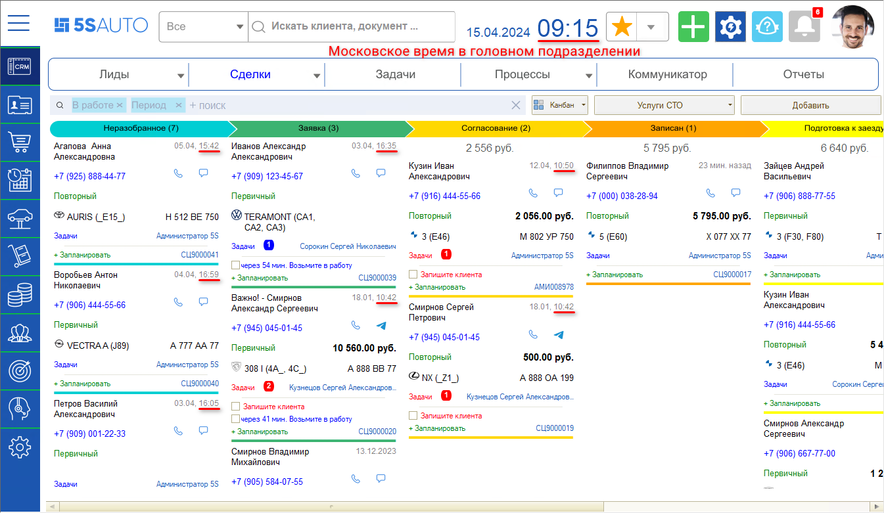

Время в подразделении с другим часовым поясом (+3 часа):

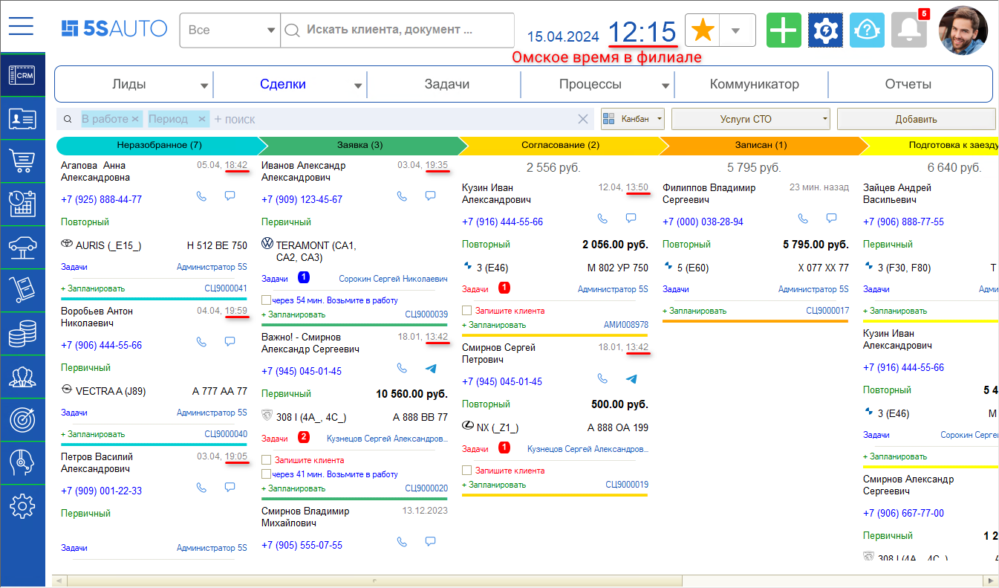

В случае выбора [режима](#rezhim) часового пояса *по подразделению документа/сделки* время в каждой сделке меняется в соответствии с временем, установленным для подразделения этой сделки:

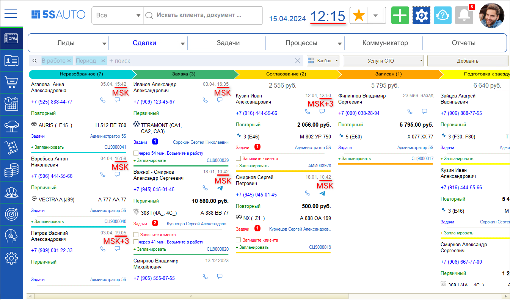

При планировании задачи или звонка в режиме списка отображается время с указанием часового пояса. Например, в омском подразделении отображается обозначение “MSK+3”:

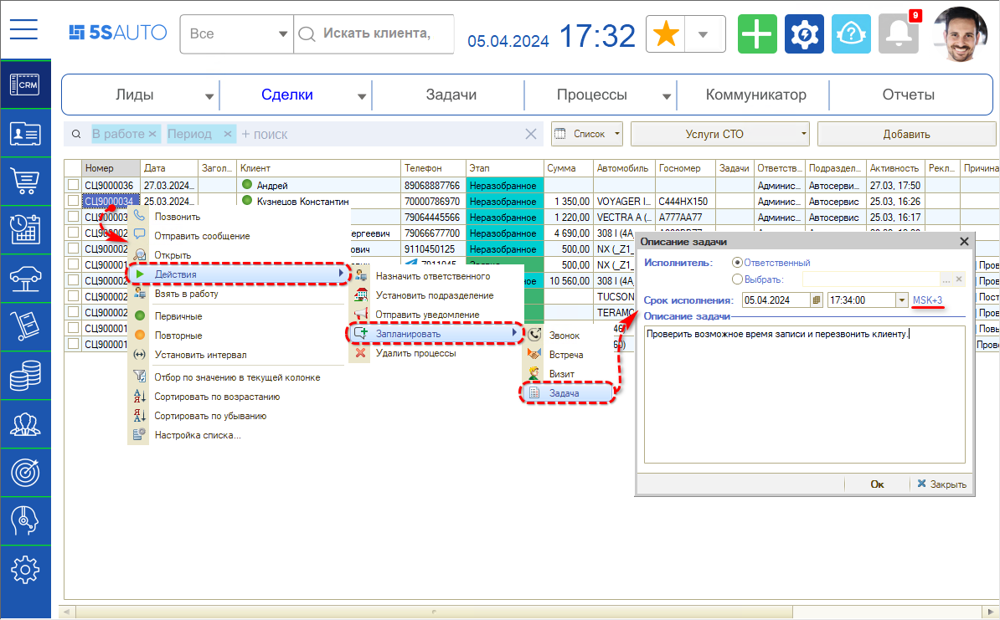

### В лидах/сделках

Время на [форме сделки](../../CRM/Работа%20со%20сделкой/rabota-so-sdelkoy.md) – время создания сделки и документов, а также время в [событиях сделки](../../CRM/События%20сделки/sobytiya-sdelki.md) – отображается для пользователей в подразделениях с разными часовыми поясами в зависимости от выбранного режима настройки.

В случае выбора [режима](#rezhim) *по подразделению пользователя* время в Сделке будет отображаться в соответствии с часовым поясом пользователя.

Пример отображения Сделки для пользователя в головном подразделении, работающем по московскому времени:

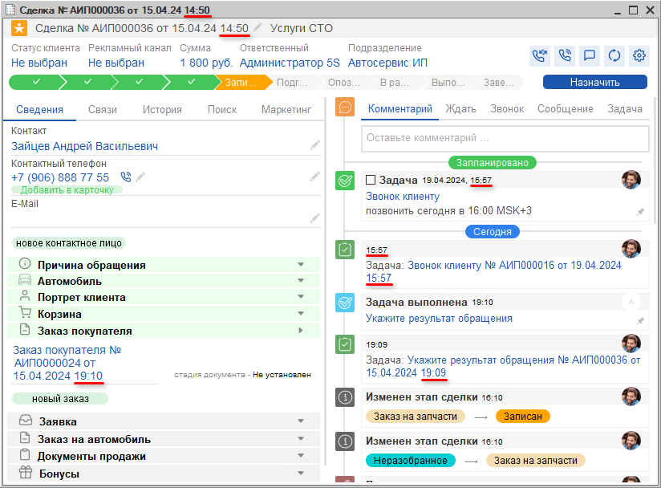

Для пользователя, работающего в подразделении с другим часовым поясом (омское время) эта же сделка отображается следующим образом:

В случае выбора режима часового пояса *по подразделению документа/сделки* время в каждой сделке отображается в соответствии с временем, установленным для подразделения, по которому создана данная сделка. Т.е., в приведенном выше примере для пользователя, работающего в московском головном подразделении, в Сделке, созданной в омском подразделении, будет отображаться омское время.

При [планировании](../../CRM/События%20сделки/sobytiya-sdelki.md#2-запланировано) звонка клиенту время в событиях сделки отображается с обозначением часового пояса. Добавляется обозначение часового пояса: например, для омского времени – “MSK+3”:

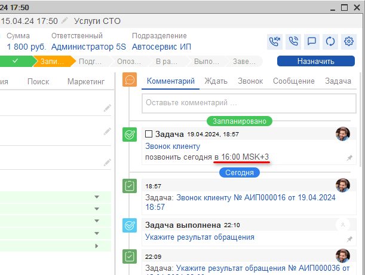

При [создании новой сделки](https://5systems.ru/help/sozdanie-sdelki) также устанавливается время в соответствии с заданным часовым поясом подразделения.

### В планировщике

В [АРМ “Запись на ремонт”](../../Запись%20на%20ремонт/Календарь%20для%20планирования%20работ/kalendar-dlya-planirovaniya-rabot.md) часовой пояс отображается на вертикальной строке в планировщике – если он отличается от часового пояса информационной базы. Время записи, текущее, рабочее и нерабочее время отображается в соответствии с текущим часовым поясом, при условии настроенного [графика](../../Запись%20на%20ремонт/Начальные%20настройки%20для%20работы%20в%20АРМ%20Запись%20на%20ремонт/nachalnye-nastroyki-dlya-raboty-v-arm-zapis-na-remont.md#особенности-настройки-справочника-графики-работ) работы.

*Пример:* Отображение времени в АРМ “Запись на ремонт” для пользователя, работающего в головном подразделении с московским временем:

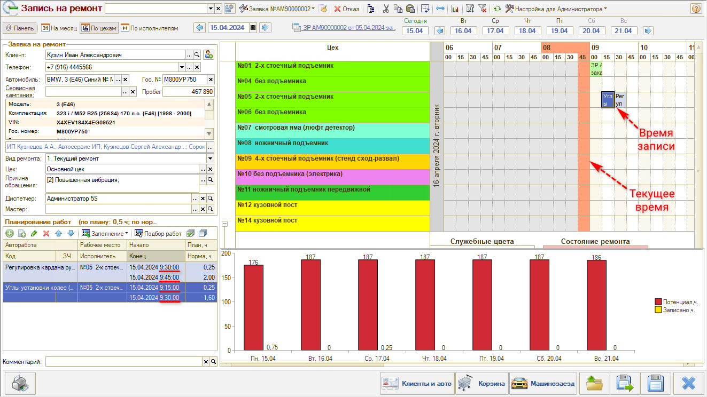

При переключении на другой часовой пояс меняется текущее время, время записи, начала и окончания работ, смещаются соответствующие полосы в планировщике:

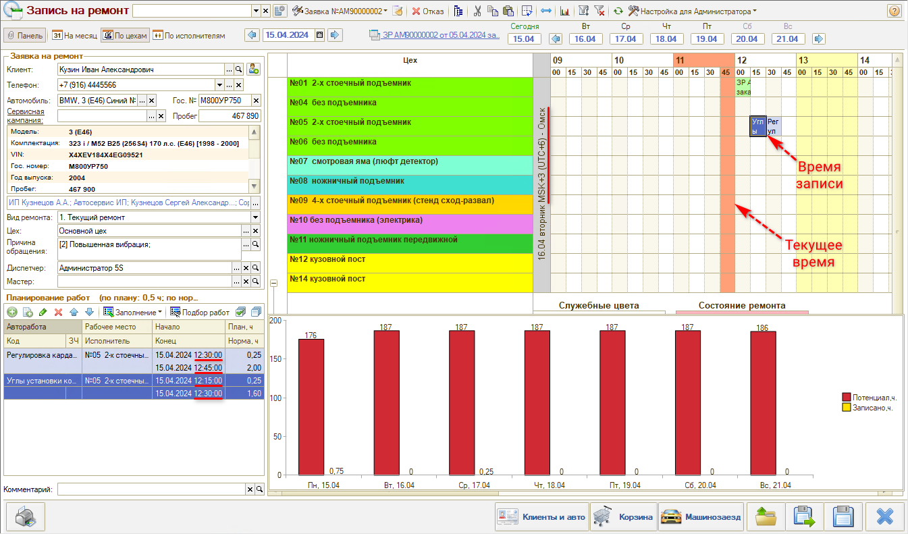

В создаваемых при записи документах “Заявка на ремонт” также устанавливается местное время в соответствии с выбранным часовым поясом – время создания документа, дата начала и дата окончания ремонта.

*Примечание:* Время вне графика работы, т.е. нерабочее по часовому поясу в контексте подразделения текущего пользователя, отображается с выделением серым цветом. При большой разнице между часовыми поясами запись перемещается на другую дату – т.е. при переключении на другой часовой пояс пользователю нужно будет открыть другую дату в планировщике, чтобы найти нужную запись.

В случае выбора [режима](#rezhim) вывода времени “*По часовому поясу подразделения документа/сделки”,* при переходе к редактированию записи на ремонт, сделанной в подразделении с другим часовым поясом, происходит временное переключение на часовой пояс того подразделения и запись перемещается на его местное время.

*Пример:* Открыт АРМ “Запись на ремонт” в подразделении, работающем по Московскому времени, в планировщике отображается текущее время:

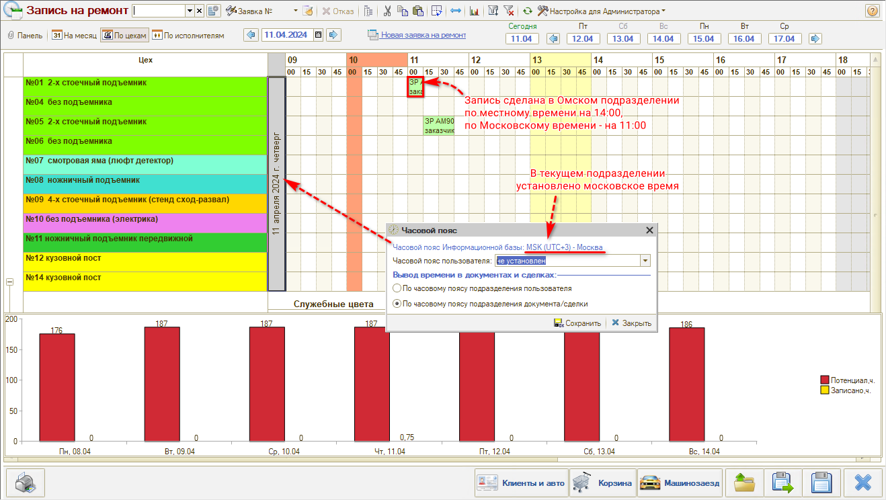

При открытии для редактирования записи на ремонт, сделанной в Омском подразделении, запись смещается на Омское время:

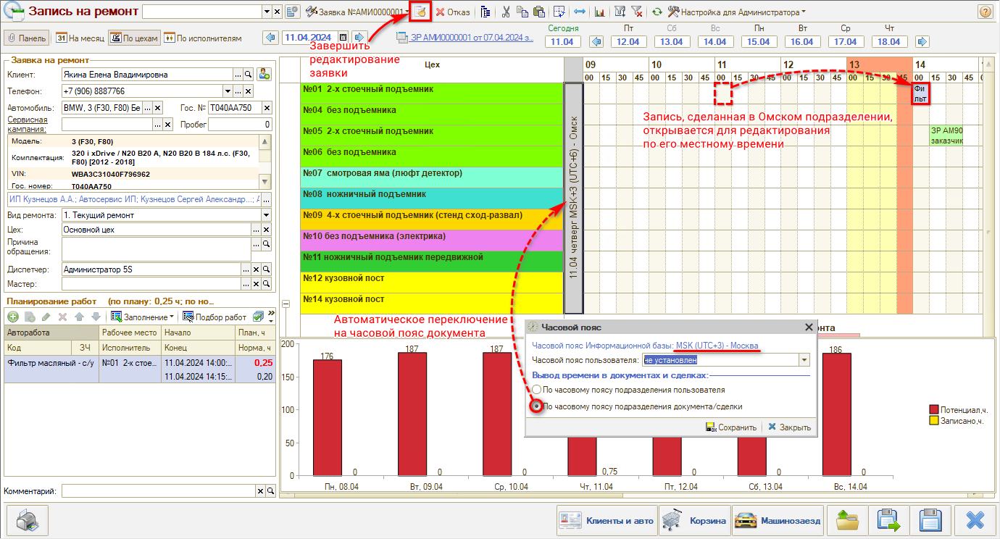

По завершении редактирования записи время изменяется обратно на текущее по часовому поясу пользователя: т.е., в приведенном примере – на московское.

## Настройка

### Часовой пояс информационной базы

Параметр *"Часовой пояс информационной базы"* определяет, в каком часовом поясе находится информационная база. По умолчанию часовым поясом базы считается часовой пояс сервера.

Настройка *часового пояса информационной базы* производится в [*Мастере настройки*](../Мастер%20настройки%20системы/master-nastroyki-sistemy.md):

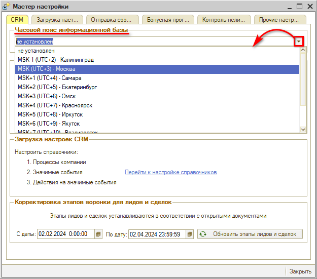

Следует выбрать основной часовой пояс для компании в зависимости от города, в котором располагается головное подразделение – установить часовой пояс в соответствии с сервером базы данных.

После выбора настройки появляется служебное сообщение об успешном изменении часового пояса:

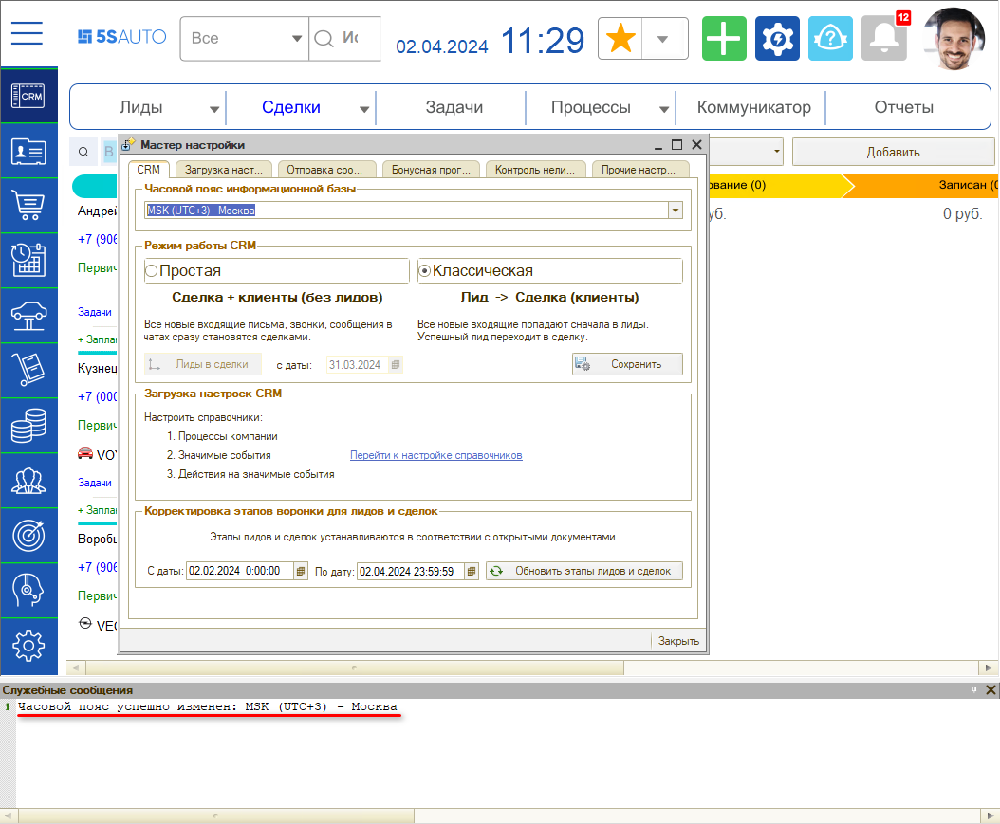

Настройка производится один раз – перед началом работы в базе либо по необходимости. Для корректности данной настройки требуется установка монопольного режима – чтобы никого из пользователей не было в базе. Чтобы все сеансы переняли установленную настройку – всем необходимо будет перезайти в базу.

### Часовой пояс подразделения

Для [подразделений](../../Структура%20компании/Справочник%20Подразделения%20компании/spravochnik-podrazdeleniya-kompanii.md), расположенных в других часовых поясах, отличающихся от головного подразделения, необходимо настроить местное время в соответствии с их часовыми поясами.

*В карточке* [*пользователя*](../../Пользователи%20и%20права/Пользователи/polzovateli.md#вкладка-параметры-пользователя) *должно быть правильно установлено подразделение, в котором он работает, с настроенным часовым поясом.*

Настройка часового пояса для подразделений производится в карточке каждого подразделения – следует выбрать *часовой пояс подразделения* в соответствующем параметре:

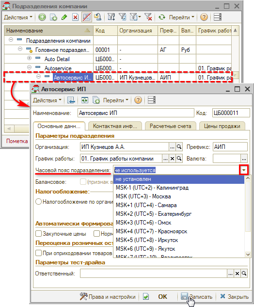

Значение по умолчанию “Не используется” означает, что для данного подразделения используется часовой пояс информационной базы, установленный в Мастере настройки (см. *[выше](#часовой-пояс-информационной-базы)).*

При установке часового пояса для вышестоящего подразделения программа предлагает установить данный часовой пояс также для подчиненных подразделений, если значение отличается:

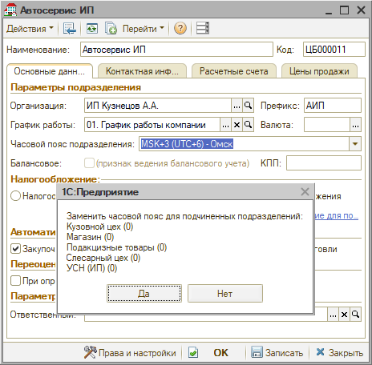

Часовой пояс отображается в справочнике подразделений в отдельной колонке:

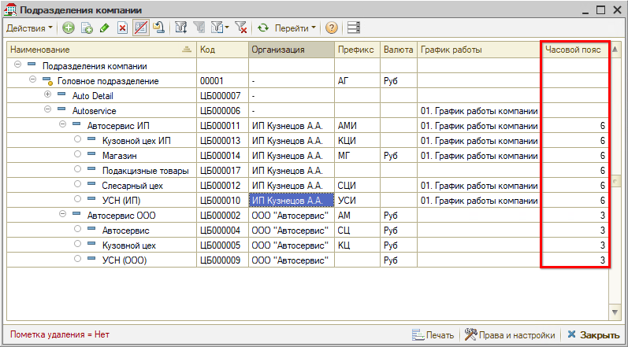

### Часовой пояс сеанса пользователя

Настройка часового сеанса пользователя производится через [панель управления пользователем](../../CRM/Структура%20интерфейса%205S%20AUTO/struktura-interfeysa-5s-auto.md#9-панель-управления-пользователем), которая открывается нажатием на аватар на верхней панели:

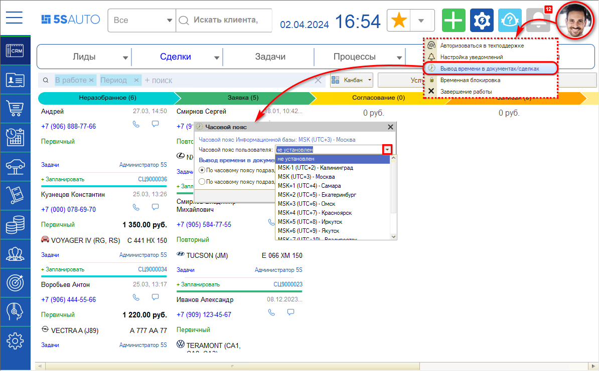

Открывается окно настройки часового пояса со следующими параметрами:

1. *Часовой пояс информационной базы* – выводится для справки (о настройке см. [выше](#часовой-пояс-информационной-базы)).
2. *Часовой пояс пользователя* – часовой пояс для текущего пользователя в соответствии с местным временем, по которому он работает. По умолчанию подтягивается из [подразделения](#часовой-пояс-подразделения) пользователя. Данную настройку можно использовать для переключения между разными часовыми поясами.
3.  *Вывод времени в документах и сделках* – выбор режима вывода времени в документах и сделках. Существует два режима: 
   **1)** *По часовому поясу подразделения пользователя* – во всех документах будет отображаться время по часовому поясу, установленному в параметре “Часовой пояс пользователя”; 
   **2)** *По часовому поясу подразделения документа/сделки* – в каждом документе будет отображаться местное время того подразделения, по которому создан документ. Например, данный режим удобно использовать для колл-центра – если общий колл-центр записывает клиентов в филиалы, находящиеся в разных городах по их местному времени. Если нет – удобнее использовать первый режим. 
   Режим по умолчанию устанавливается в зависимости от того, включена ли настройка *“Использовать часовой пояс подразделения документа/сделки”* (см. [ниже](#настройка-режима-вывода-времени-в-документах-по-умолчанию)).

После установки часового пояса сеанса изменяется время на верхней панели интерфейса, в документах, лидах / сделках и планировщике записи на ремонт, также в некоторых полях появляется обозначение часового пояса рядом с указанием времени – см. выше раздел “[Отображение часовых поясов](#отображение-часовых-поясов)”.

### Часовой пояс АРМ “Запись на ремонт”

Для пользователей, которые *не работают с [рабочим столом CRM](../../CRM/Структура%20интерфейса%205S%20AUTO/struktura-interfeysa-5s-auto.md),* предусмотрена настройка часового пояса сеанса пользователя непосредственно из [АРМ “Запись на ремонт”](../../Запись%20на%20ремонт/Календарь%20для%20планирования%20работ/kalendar-dlya-planirovaniya-rabot.md).

#### Часовой пояс сеанса

Настройка часового пояса сеанса в АРМ “Запись на ремонт” открывается двойным кликом на вертикальную строку с датой и временем:

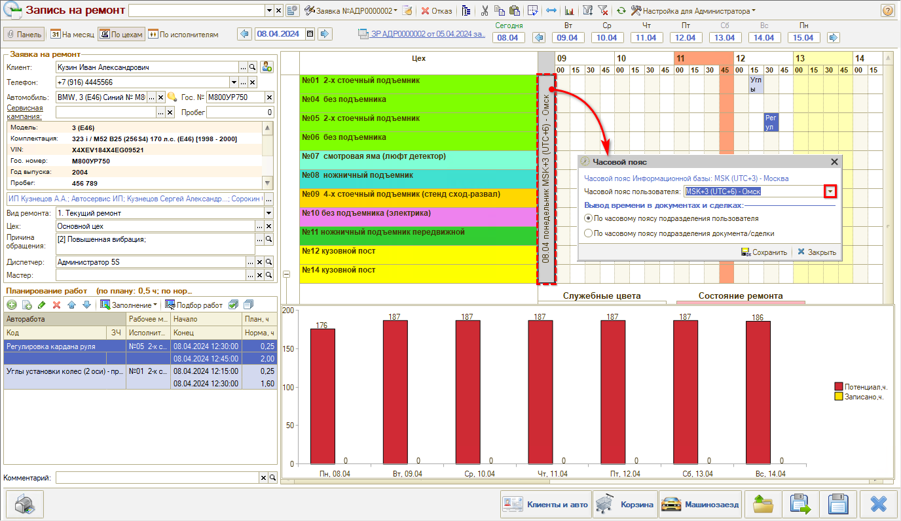

По умолчанию устанавливается часовой пояс [подразделения](#часовой-пояс-подразделения) пользователя либо документа – в зависимости от того, включена ли настройка “Использовать часовой пояс подразделения документа/сделки” (см. [ниже](#настройка-режима-вывода-времени-в-документах-по-умолчанию)).

Выбор часового пояса сеанса позволяет переключаться между часовыми поясами для просмотра записи и документов в соответствии с местным временем других подразделений – например, для сотрудников единого коллцентра компании.

Выбор режима вывода времени в документах и сделках влияет на отображении времени в документах, а также на редактирование в планировщике записей, сделанных по подразделениям с другими часовыми поясами.

В случае использования режима “По часовому поясу подразделения/сделки” при редактировании записей, сделанных в подразделении с другим часовым поясом, запись на время редактирования будет перемещаться на местное время этого подразделения – см. пример в разделе “[Отображение часовых поясов](#в-планировщике)”.

При использовании режима “По часовому поясу подразделения пользователя” все записи будут редактироваться в соответствии с часовым поясом пользователя.

#### Часовой пояс АРМ

Есть возможность установить *часовой пояс АРМ* для сохраненного варианта настроек АРМ “Запись на ремонт” (см. статью [*Сохранение настроек АРМ “Запись на ремонт”*](../../Запись%20на%20ремонт/Сохранение%20настроек%20АРМ%20Запись%20на%20ремонт/sokhranenie-nastroek-arm-zapis-na-remont.md)).

Для выбора часового пояса АРМ следует перейти в *настройки параметров календар*я по кнопке на верхней панели *Настройки → Изменить настройку:*

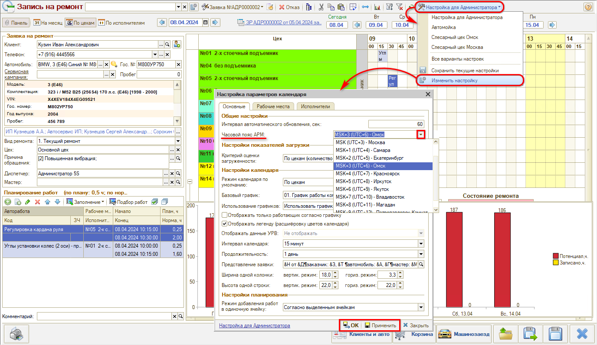

В параметре *“Часовой пояс АРМ”* следует установить нужный часовой пояс.

По умолчанию или при выборе значения “Не установлен” в качестве часового пояса АРМ используется часовой пояс информационной базы или, если он не заполнен, часовой пояс сервера.

Сохранять настройку *необходимо* через меню *Настройки → Сохранить текущие настройки* – изменить текущий вариант либо создать новый:

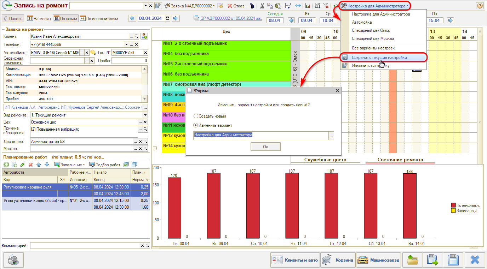

Есть возможность сохранить разные варианты настроек для подразделений с разными часовыми поясами и затем переключаться между ними, выбирая нужную настройку в контекстном меню. Например, сохранить разные варианты настроек для подразделений, находящихся в разных часовых поясах.

*Пример:* Настройка для головного подразделения в Москве:

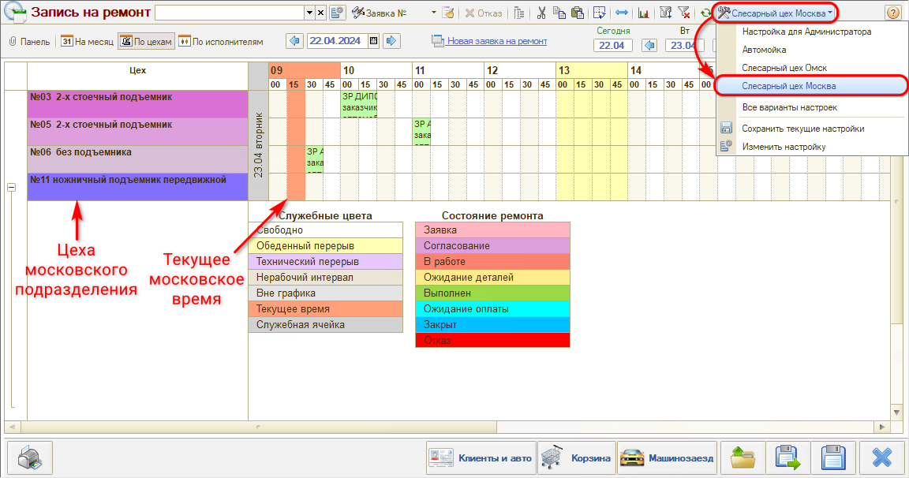

Настройка для автосервиса в Омске:

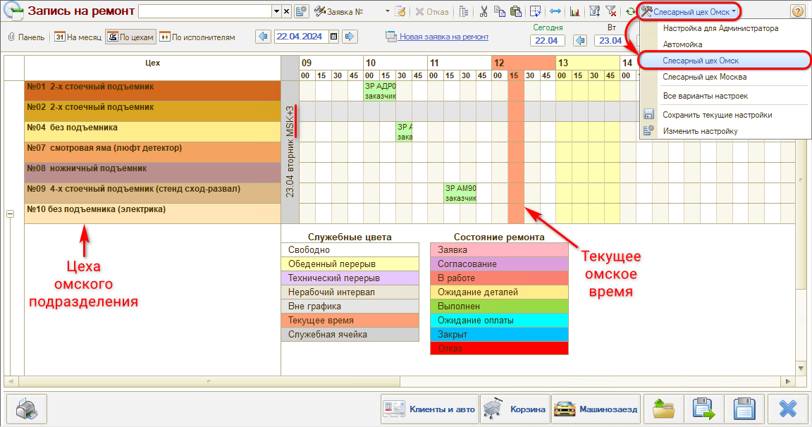

### Настройка режима вывода времени в документах по умолчанию

Активация [настройки](../../Пользователи%20и%20права/Установка%20прав%20и%20настроек%20пользователя/ustanovka-prav-i-nastroek-polzovatelya.md) *“Использовать часовой пояс подразделения документа/сделки”* устанавливает по умолчанию [*режим вывода времени*](#rezhim) в списках и на формах документов *”По часовому поясу подразделения документа/сделки”:*

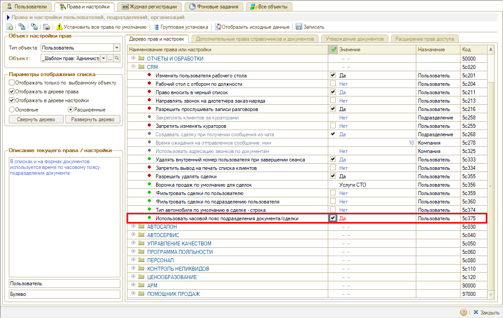

При установке значения “Нет” по умолчанию будет устанавливаться режим *“По часовому поясу подразделения пользователя”.*

---

**Теги:** администрирование, часовые пояса, время, подразделения, настройка

