

# Настройка интеграции с Calltouch

<table><tr><td><b>Время чтения:</b> 21 мин.</td><td><b>Обновлено:</b> 15.03.2024</td></tr></table>

Источник: https://www.5systems.ru/help/nastroyka-integracii-s-calltouch

> *Актуально начиная с версии релиза 5S AUTO **2.7.1**.*

## Содержание

1. [Введение](#введение)
2. [Настройка](#настройка)
   - [1. Настройка телефонии](#1-настройка-телефонии)
   - [2. Настройка заявок с сайта](#2-настройка-заявок-с-сайта)
   - [3. Настройка интеграции](#3-настройка-интеграции)
      - [1) Создание интеграции](#1-создание-интеграции)
      - [2) Настройка параметров](#2-настройка-параметров)
      - [3) Включение интеграции](#3-включение-интеграции)
      - [4) Дополнительные настройки подключения Calltouch](#4-дополнительные-настройки-подключения-calltouch)
         - [Настройка регламентного задания](#nas_rz)
         - [Метки](#metki)
         - [Корректировка данных](#korrekt)
         - [Часовой пояс](#chas_poyas)
      - [5) Тестирование](#5-тестирование)
3. [Использование отчетов](#использование-отчетов)
4. [Отображение в сделке](#отображение-в-сделке)

## Введение

***Calltouch*** – это платформа омниканального маркетинга, сервис аналитики рекламы для измерения ее эффективности. Подробнее см. на сайте: [https://www.calltouch.ru/about/](https://www.calltouch.ru/about/).

В Calltouch используются технологии *статического и динамического коллтрекинга*. Первый благодаря статической подмене телефонного номера дает возможность определить, какой из каналов рекламы привел клиента, например, наружная реклама, печатная продукция, радио и т.д.

Основной инструмент – *динамический коллтрекинг* – позволяет отслеживать источники всех звонков в компанию и обращений через формы на сайте. Суть технологии заключается в автоматической подмене телефонных номеров на сайте компании при помощи специального скрипта. Одновременные посетители сайта видят разные номера – свой уникальный номер телефона для каждого посетителя на время пребывания на сайте. При звонке на подменный номер он фиксируется в системе и связывается с посетителем.

Каждому посетителю сайта присваивается свой идентификатор, по которому в базе данных Calltouch сохраняются данные: откуда перешел, сколько времени провел на сайте, сколько раз заходил, оставил ли заявку и т.д. Calltouch собирает детальную информацию из utm-меток, cookies и других параметров и отображает ее в различных отчетах.

*Отчеты* формируются автоматически в личном кабинете Calltouch. Они представлены в нескольких форматах: журнал звонков с данными по каждому лиду, дашборд с подробной информацией по рекламной кампании и детальная статистика с рекламных площадок и из CRM.  Есть возможность анализировать количество обращений, их источник, созданные заказ-наряды, сумму, менеджера, статус сделок (этап воронки), причины отказов и другие данные.

*Логика работы интеграции* заключается в том, что при звонке или заявке с сайта в программу передается идентификатор посетителя, а затем данные о сделке загружаются обратно в Calltouch. Таким образом, интеграция позволяет дополнить аналитику Calltouch данными воронки продаж 5S AUTO.

Аналитика позволяет определить эффективные каналы рекламы и наиболее конверсионные страницы сайта. Это дает возможность точно посчитать, какие кампании не окупаются, и понять, в какую рекламу стоит вкладывать деньги.

Подробную информацию по настройке в личном кабинете Calltouch и работе с отчетами см. на сайте сервиса: [https://www.calltouch.ru/support/](https://www.calltouch.ru/support/).

## Настройка

Прежде всего необходимо зарегистрироваться на платформе Calltouch, выбрать и оплатить подходящий тариф.

Настройка интеграции с сервисом Calltouch производится в 3 этапа:

1. Настройка на стороне телефонии;
2. Настройка заявок с сайта;
3. Настройка интеграции в программе.

### 1. Настройка телефонии

На первом этапе производится настройка звонков на подменные номера в рамках услуги коллтрекинга. Для динамического коллтрекинга Calltouch может предоставить пул номеров, либо можно использовать свои номера при наличии. Подробнее см.: [https://www.calltouch.ru/support/nomera-upravlenie/](https://www.calltouch.ru/support/nomera-upravlenie/).

Телефонные линии Calltouch должны быть подключены к офисной телефонии по протоколу SIP[\*](#snoska). Настройка выполняется специалистами технической поддержки по телефонии совместно со специалистами Calltouch.

*\*SIP-телефония (Session Initiation Protocol – “Протокол Установления Сеанса”) – это один из протоколов передачи голосовой информации, который базируется на принципах IP-телефонии. Протокол SIP работает по схеме “клиент-сервер-клиент”, чередуя запросы и ответы.*

Благодаря возможностям протокола SIP в момент звонка передается идентификатор посетителя, который сохраняется в лиде/сделке.

### 2. Настройка заявок с сайта

При создании заявки с сайта через API 5S AUTO необходимо передать идентификатор посетителя в соответствующем поле.

### 3. Настройка интеграции

Настройка в программе производится в справочнике “Интеграции”.

#### 1) Создание интеграции

Следует создать новый элемент справочника и заполнить в нем основные параметры:

- *Наименование:* Calltouch (заполняется автоматически)
- *Вид интеграции:* Система аналитики
- *Обработчик подключения:* Calltouch

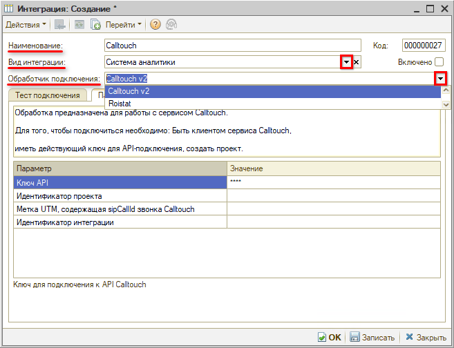

#### 2) Настройка параметров

На вкладке “Параметры сервиса” настраиваются параметры интеграции:

- *Ключ API* — ключ для подключения к API, значение параметра “API токен (access_token)” из личного кабинета Calltouch;
- *Идентификатор проекта* — проект Calltouch, номер из параметра “ID личного кабинета (site_id)” из личного кабинета Calltouch;
- *Метка UTM, содержащая sipCallId звонка Calltouch* – нужно выбрать из справочника метку, которая будет присваиваться Лиду, созданному по звонку.

Для того, чтобы найти параметры *API токен* и *ID личного кабинета* в личном кабинете Calltouch, нужно перейти к настройкам проекта – в списке аккаунтов открыть нужный, кликнуть на наименование проекта или на кнопку “Открыть”:

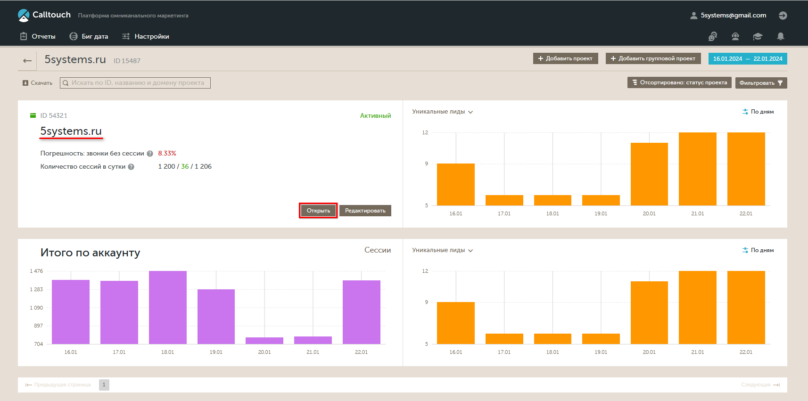

Перейти на вкладку “Интеграции” → Отправка данных во внешние системы → API и Webhooks:

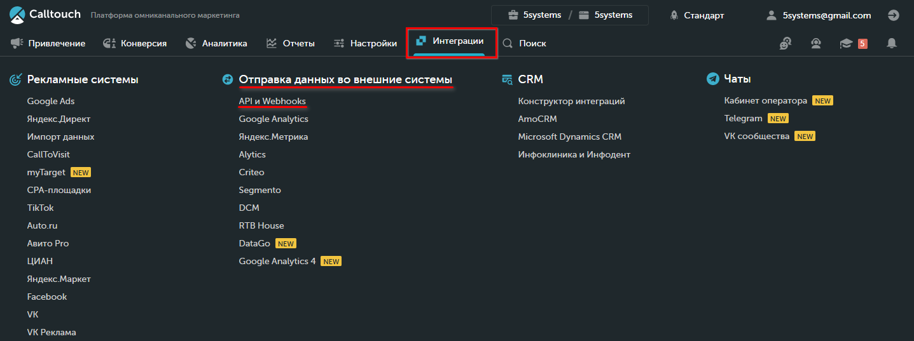

На вкладке API находятся данные доступа к API:

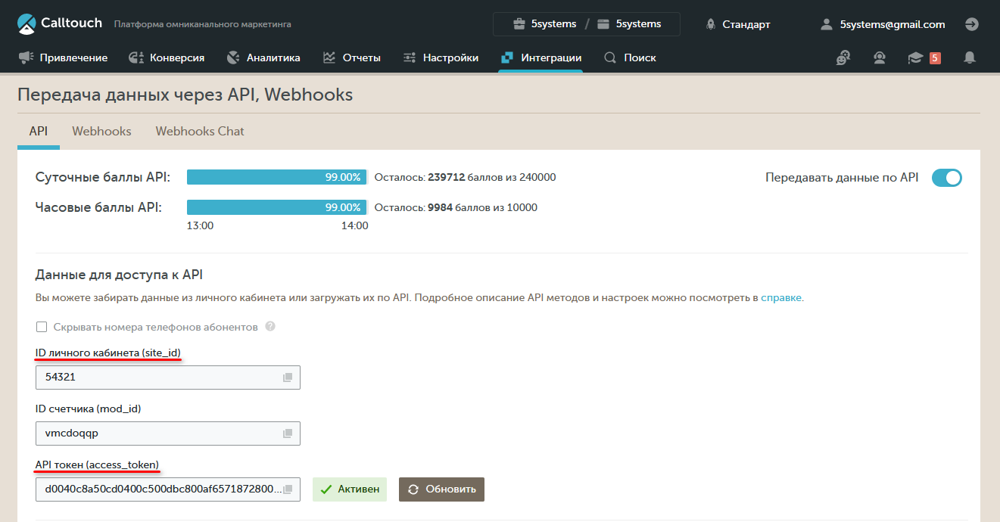

#### 3) Включение интеграции

После настройки параметров интеграции следует *установить галочку “Включено”* и *записать* нажатием на кнопку *“ОК”:*

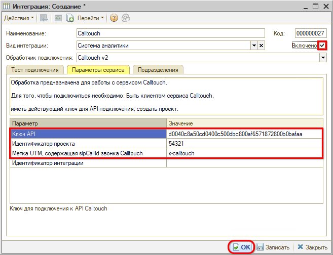

#### 4) Дополнительные настройки подключения Calltouch

**1. Настройка регламентного задания**

После настройки всех параметров и успешного тестирования интеграции требуется настроить регламентное задание. Для этого нужно перейти в окно дополнительных настроек по кнопке на вкладке *Тест подключения* — "*Методы интеграции → Регламентное задание":*

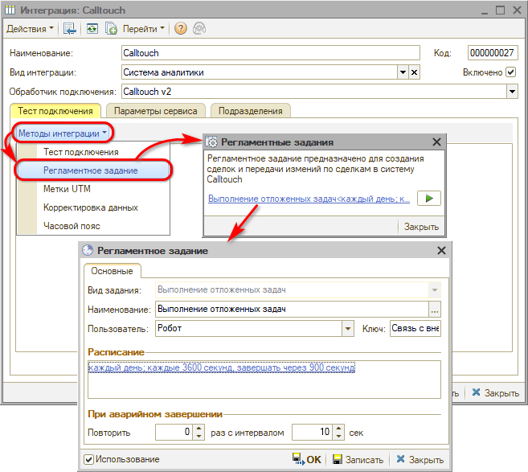

Регламентное задание включено по умолчанию – следует настроить расписание его работы и записать.

**2. Метки**

В данное окно выводится регистр сведений “Метки UTM” с отбором по меткам Calltouch:

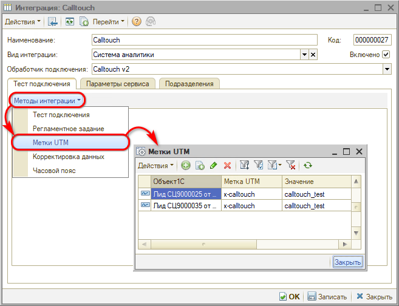

Данные в регистре позволяют проверить, отправляются ли записи.

**3. Корректировка данных**

В случае необходимости есть возможность удалить из личного кабинета на сайте Calltouch все сделки и загрузить заново из программы. Для этого нужно перейти в окно корректировки данных по кнопке *"Методы интеграции → Корректировка данных":*

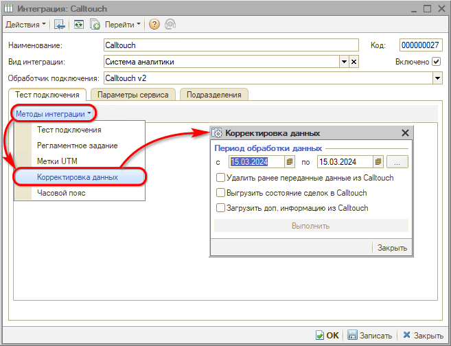

Например, если компания работала с Calltouch до настройки интеграции в 5S AUTO, то рекомендуется перезагрузить старые сделки на сайте, чтобы к ним подтянулись данные из программы. Для этого нужно выполнить следующие шаги:

1. Удалить ранее переданные данные из Calltouch. 
2. Выгрузить состояние сделок в Calltouch. 
3. Загрузить доп. информацию из Calltouch.

Для выполнения каждого из этих действий следует установить соответствующий флаг и нажать кнопку “Выполнить” – последовательно для каждого шага.

**4. Часовой пояс**

Дополнительным параметром является настройка смещения времени часового пояса – по умолчанию установлено смещение для московского времени, равное 3 часам:

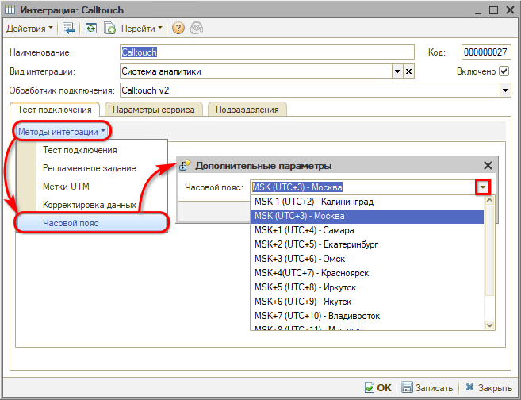

#### 5) Тестирование

Для проверки корректной работы интеграции следует на вкладке “Тест подключения” нажать кнопку *“Методы интеграции → Тест подключения”:*

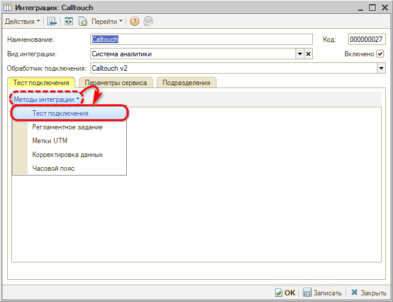

В случае успешного подключения должно появиться сообщение следующего вида:

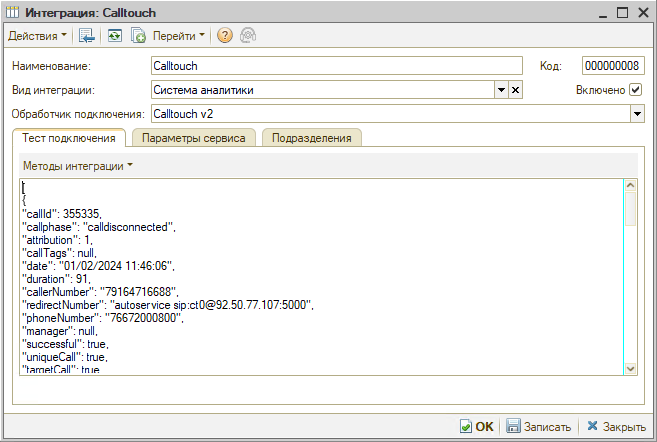

*Примечание: В случае отсутствия звонков через Calltouch текст между скобками [{  }] не будет заполнен.*

В случае некорректно настроенной интеграции при тестировании выйдет одна из ошибок:

1. **Не заполнен идентификатор:**

   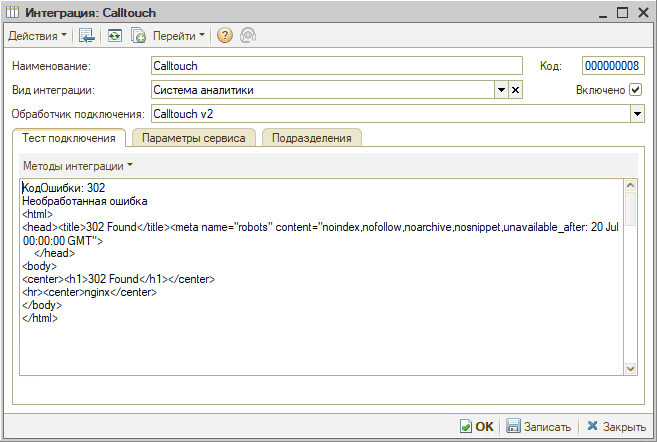

2. **Неверный ключ:**

   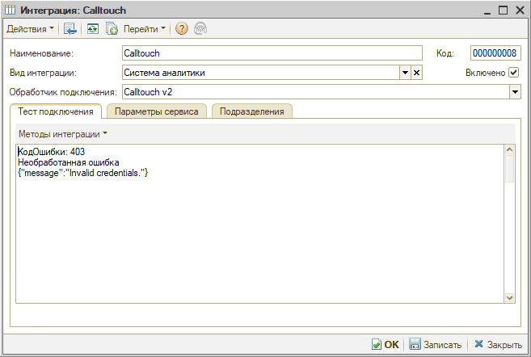

3. **Ключ не заполнен:**

   

## Использование отчетов

Отчеты в личном кабинете на сайте находятся на вкладках “Аналитика” и “Отчеты”.

В “Журнале звонков” собрана вся информация по звонкам, заявкам, лидам, сделкам и клиентам.

В программе на каждый звонок создается сделка. Из программы на сайт передается информация о сделках — воронка, статус, стоимость сделки и маржинальность, менеджер, первичный или повторный клиент, номер заказ-наряда, рекламный канал и т.д.:

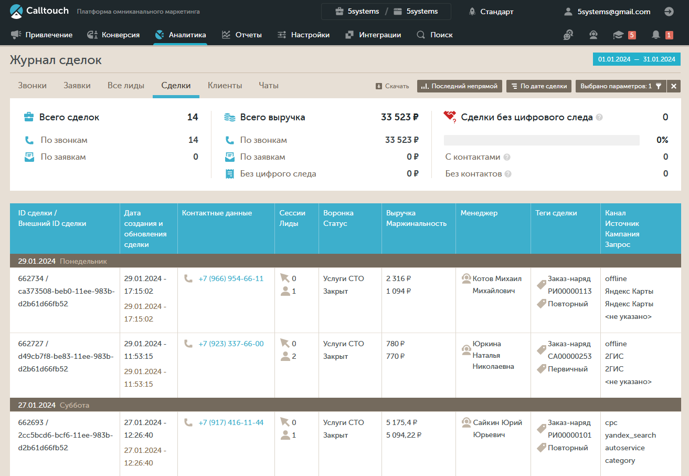

В случае отказа в колонку “Теги сделки” передаются также причины отказов:

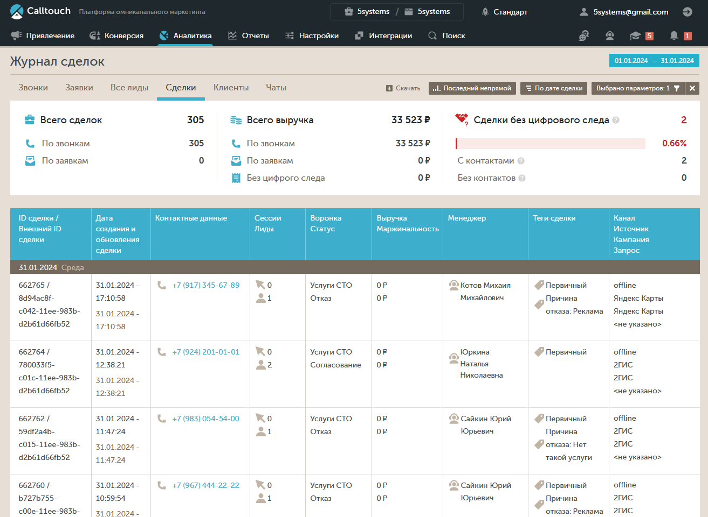

Каждую сделку в журнале можно открыть для просмотра:

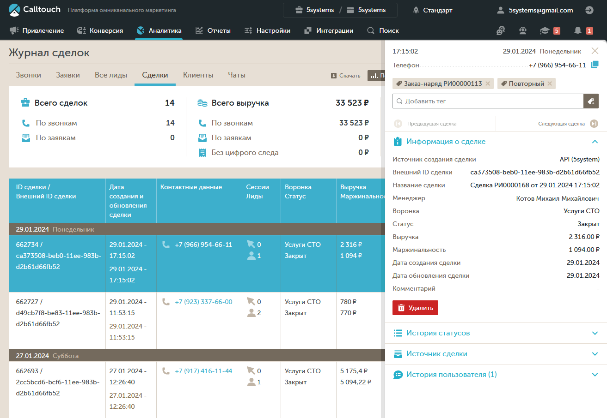

Также есть возможность в личном кабинете анализировать данные с помощью графиков и диаграмм. Для этого нужно перейти на вкладку “Аналитика → Сквозная аналитика”:

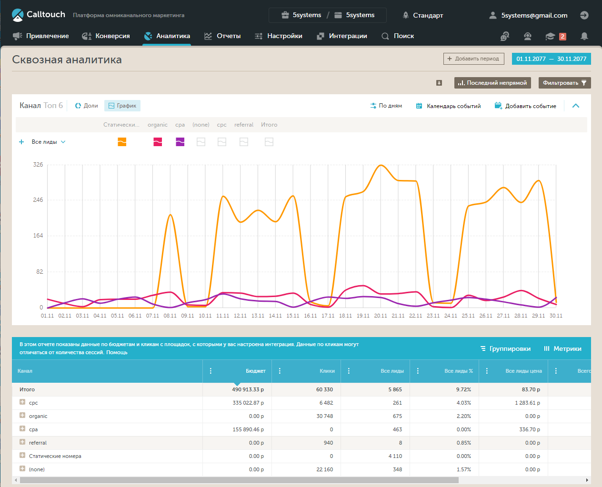

Для просмотра статистики в виде диаграммы следует нажать кнопку “Доли”:

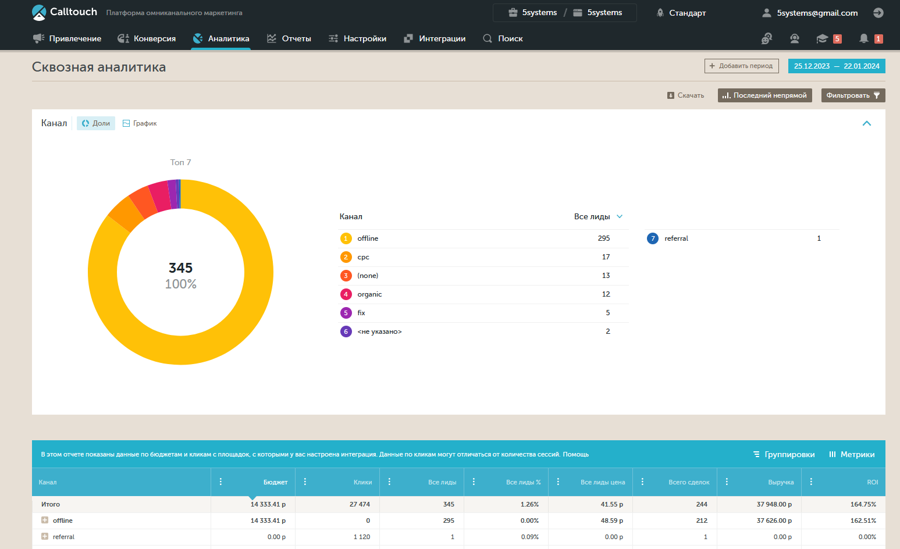

## Отображение в сделке

После подключения интеграции в лиды/сделки будут передаваться метки Calltouch – на дополнительные поля вкладки “Маркетинг”:

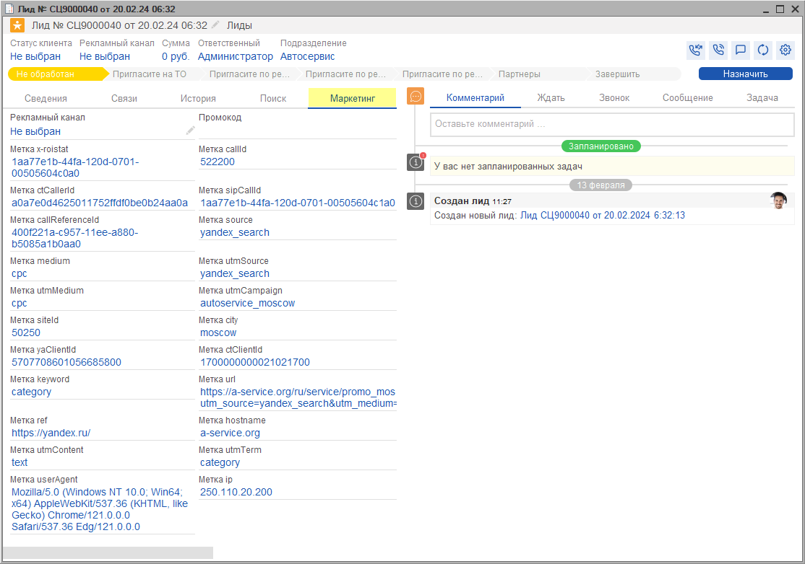

Все передаваемые метки можно использовать для дальнейшего детального анализа эффективности рекламных каналов.

---

**Теги:** аналитика, calltouch, интеграция, телефония, заявки с сайта, метки, отчеты

