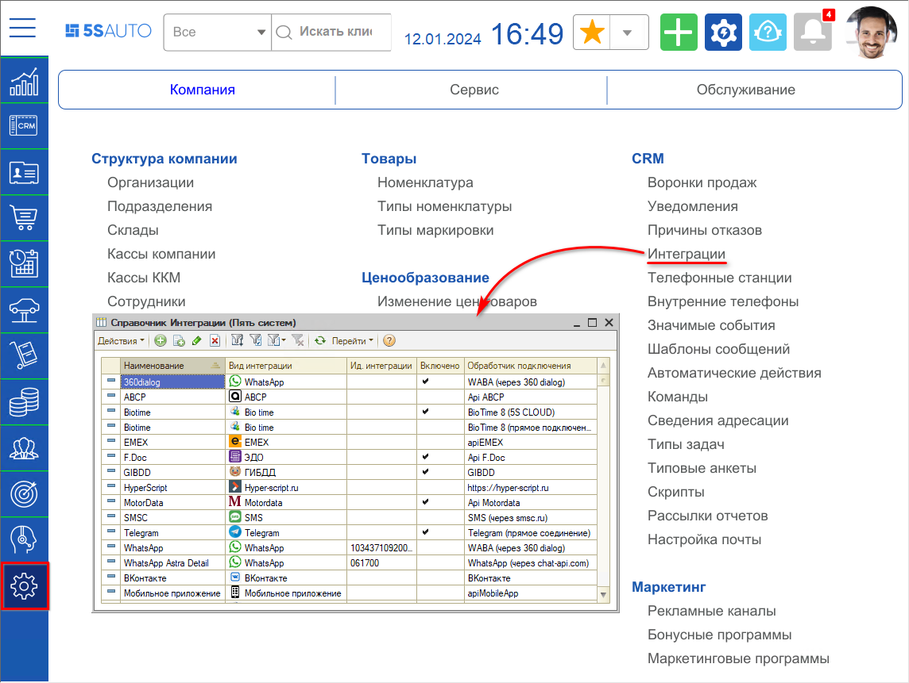
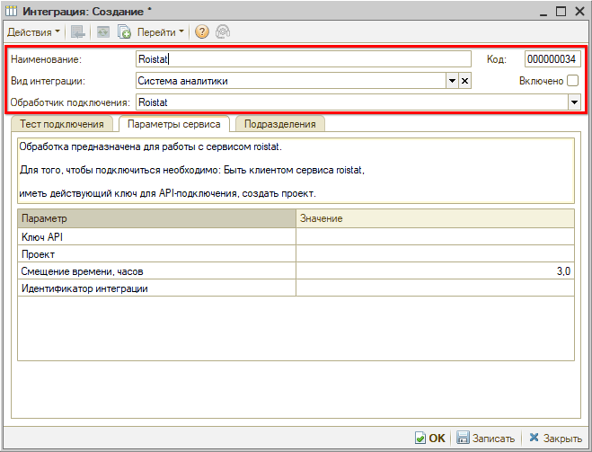
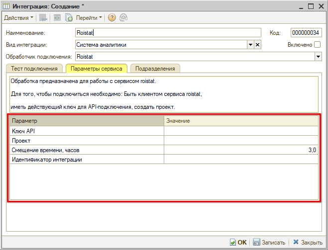
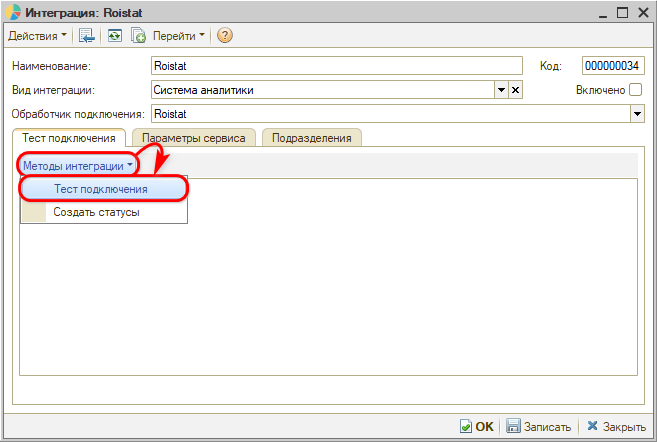
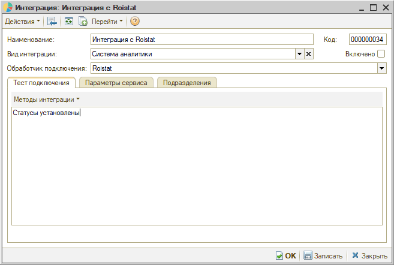
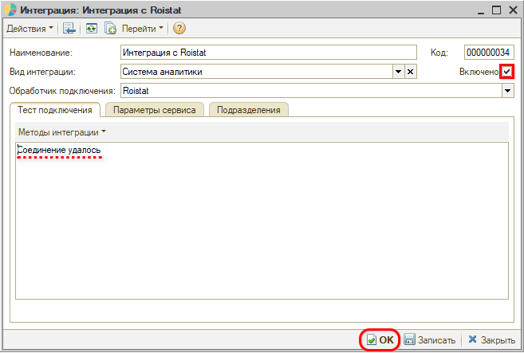
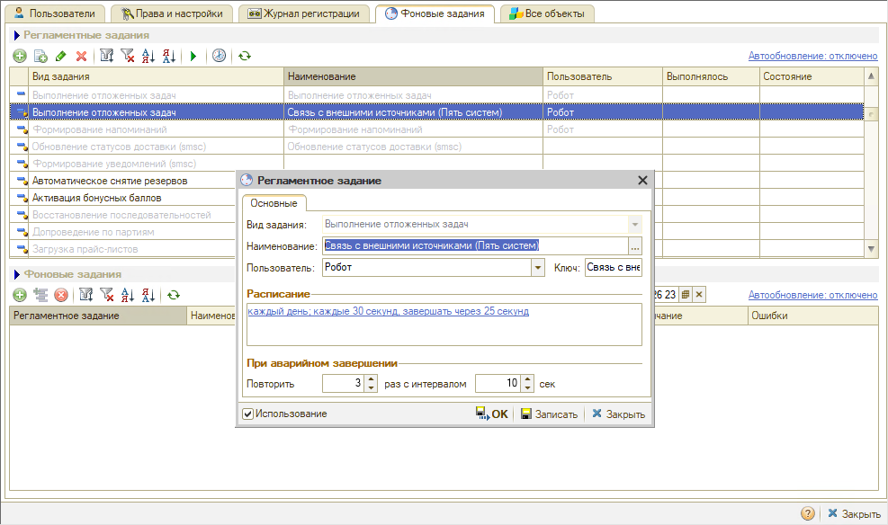
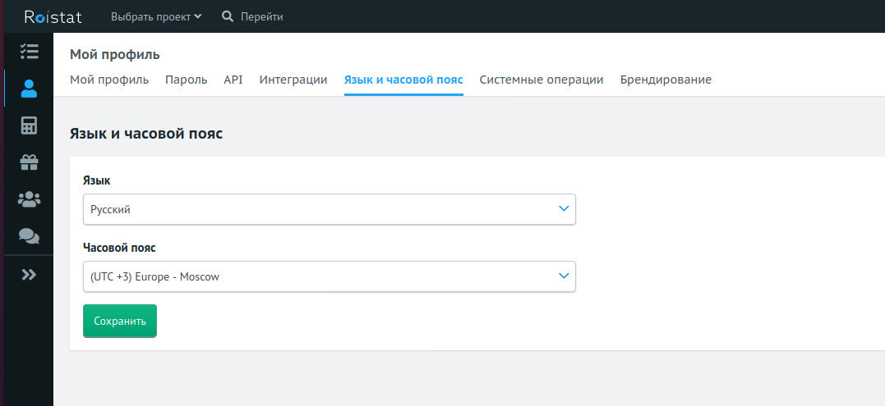
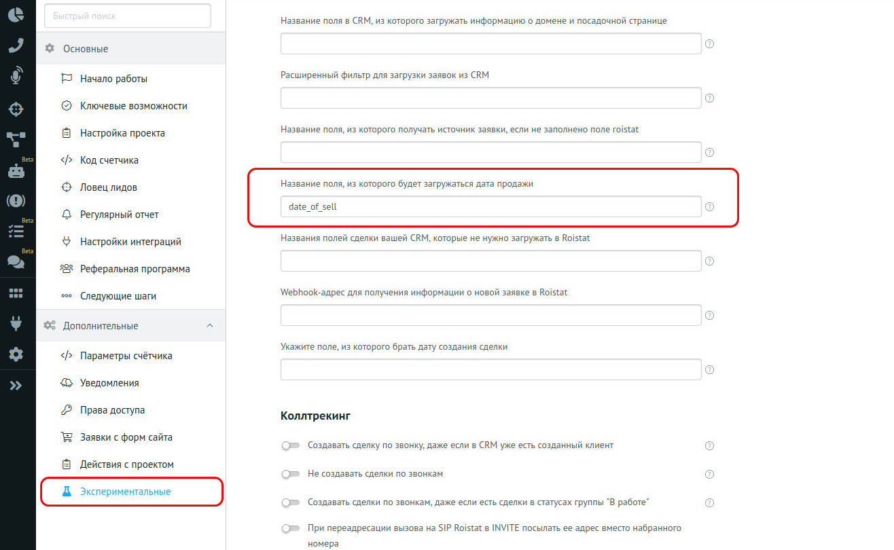
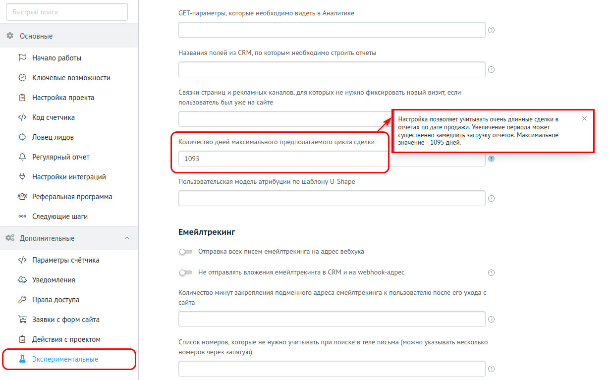

# Настройка интеграции с системой аналитики Roistat

<table><tr><td><b>Время чтения:</b> 20 мин.</td><td><b>Обновлено:</b> 21.05.2026</td></tr></table>

Источник: https://www.5systems.ru/help/nastroyka-integracii-s-sistemoy-analitiki-roistat

## Содержание

1. [Введение](#введение)
2. [Настройка интеграции](#настройка-интеграции)
3. [Настройка интеграции в личном кабинете Roistat](#настройка-интеграции-в-личном-кабинете-roistat)
4. [Описание логики настройки интеграции](#описание-логики-настройки-интеграции)
5. [Соответствие отчета "Основной" Roistat и "Операционной воронки продаж"](#соответствие-отчета-основной-roistat-и-операционной-воронки-продаж)

## Введение

В программе предусмотрена возможность интеграции с сервисами бизнес-аналитики. На данный момент реализована интеграция с системой ***Roistat***: [https://roistat.com](https://roistat.com/)

Если настроена интеграция с Roistat, при звонке или с продающего сайта передаются UTM-метки[\*](#snoska). 
\**UTM-метки* - параметры URL, содержащие дополнительные данные, которые позволяют получить полную информацию о каждом источнике траффика.

UTM-метки сохраняются в обращении. По сохраненным UTM-меткам из CRM в Roistat передается информация по обращению. Уже в сервисе Roistat можно увидеть всю аналитику обращений клиентов и выявить нецелевые маркетинговые кампании. Например, можно понять какая контекстная реклама лучше всего работает, а какая совсем не работает.

## Настройка интеграции

Перед настройкой интеграции в программе необходимо:

1. Подключиться к сервису Roistat.
2. Создать проект в сервисе Roistat.

Настройка интеграции осуществляется в справочнике "Интеграции":

Для настройки интеграции с Roistat в параметрах формы создания интеграции следует выбрать *вид интеграции* "Система аналитики", *обработчик подключения* "Roistat" и заполнить *наименование:*

После выбора обработчика отображаются параметры сервиса для интеграции с данным обработчиком:

Требуется заполнить ключ API, идентификатор проекта, полученный на сайте Roistat, и смещение времени для часового пояса, в котором Вы работаете, в соответствующих параметрах. Если у Вас московское время, то параметр "Смещение времени" должен быть равен 3.

Далее необходимо записать настройки, нажав кнопку "Записать", и протестировать соединение. Для теста соединения следует перейти на вкладку "Тест подключения" и нажать кнопку *"Методы интеграции → Тест подключения":*

При успешном подключении отобразится сообщение "Соединение удалось" (см. скриншот [ниже](#vkl)).

Также может потребоваться установка статусов – для этого нужно нажать кнопку "Методы интеграции → Создать статусы". После успешного создания статусов при нажатии на эту кнопку выходит сообщение "Статусы установлены":

Если все успешно настроено, активируйте интеграцию, установив флажок у параметра "Включено", и нажмите на кнопку "ОК":

Для работы интеграции с Roistat необходимо, чтобы работало регламентное задание "Связь с внешними источниками" (вид задания "Выполнение отложенных задач").

Пример настройки этого регламентного задания:

## Настройка интеграции в личном кабинете Roistat

Для правильной работы интеграции в личном кабинете Roistat необходимо:

1. Указать часовой пояс, в котором Вы работаете.
2. Указать название параметра, в котором передается дата продажи из базы данных.

Если у Вас московское время, то часовой пояс должен быть UTC+3 (это часовой пояс по умолчанию). Если Вы работаете в другом часовом поясе, то необходимо указать Ваш часовой пояс в настройках профиля.

Для правильной передачи даты продажи из базы данных 1С в Roistat, необходимо в экспериментальных параметрах установить значение параметра "Название поля, из которого будет загружаться дата продажи" равным "date_of_sell", как показано на снимке экрана. Эта настройка нужна для получения правильных данных в отчете Roistat "По дате продажи".

Также требуется настроить количество дней максимального предполагаемого цикла сделки.

Устанавливается максимальное значение – 1095 дней.

## Описание логики настройки интеграции

1. Создаются скрипты для получения информации из форм захвата на сайте:
   - 1\. скрипт для создания задачи в CRM,
   - 2\. скрипт для создания задачи в CRM и инициации автоматического звонка клиенту. 
         Настраивается типовая логика работы этих скриптов. Для работы обратного звонка требуется работающая интеграция IP-телефонии и CRM. Добавление счетчика Roistat на сайт, добавление и оптимизация форм захвата, установка скриптов на формы производится силами и средствами клиента.
2. Для передачи данных с рекламных площадок (например, Google AdWords, Яндекс Директ и т.п.) требуется подключение и настройка интеграции в личном кабинете Roistat.
3. Расходы по статическим рекламным каналам заполняются клиентом самостоятельно в личном кабинете Roistat.
4. Аналитические отчеты. В CRM имеется возможность сверить данные по продажам с отчетами в Roistat:
   - 1\. «Воронка продаж по закрытым сделкам» соответствует отчету «По дате продажи» в Roistat
   - 2\. «Операционная воронка продаж» в 1С соответствует отчету «Основной» в Roistat.
5. В 1С название рекламного канала и ключевые слова не передаются из Roistat. Данные передаются по следующей логике:
   - 1\. если у обращения рекламный канал заполнен, а метка Roistat не заполнена, то в Roistat передается значение рекламного канала;
   - 2\. если рекламный канал не заполнен и метка Roistat не установлена, то в Roistat данные группируются в «Сделках, созданных самостоятельно»;
   - 3\. если имеется метка Roistat и установлен рекламный канал вручную, то приоритет имеет метка Roistat, по которой Roistat определяет рекламный канал самостоятельно.
6. Создаются и предоставляются учетные данные для входа в личный кабинет системы аналитики Roistat, либо происходит интеграция с имеющимся личным кабинетом. 5S AUTO выступает в качестве партнера компании Roistat и закрепляет клиента в свой пул клиентов с единой типовой логикой интеграции с CRM.
7. Типовая логика передачи данных:

| **В терминах Roistat** | **В терминах CRM** |
| --- | --- |
| **Звонки** | Данные по звонкам, записи разговоров будут отображаться в Roistat, если изначально звонок был направлен от Оператора на Roistat, потом на Asterisk. Данные по прямым звонкам (Оператор-Asterisk) не передаются в Roistat. |
| **Заявка** | Данные передаются документами: Запись на ремонт, Заказ-наряды, продажи запчастей и отказы из этих документов. |
| **Прогнозируемые продажи** | Данные передаются документами: созданные, но неоплаченные реализации (Заказ покупателя) и неоплаченные Заказ-наряды (статус не «закрыт»). Заказ-наряды в статусе «Архив» не формируют движений. |
| **Продажи** | Оплаченные Заказ-наряды и реализации. Проведенные Реализации считаются оплаченными. Логика установки статусов работы: статус «выполнен» необходимо изменить на статус «закрыт» после получения оплаты от клиента. |

8. Производится настройка передачи данных себестоимости из 1С в Roistat:
   - 1\. по товарам — на основании данных по себестоимости из 1С;
   - 2\. по работам заранее устанавливается фиксированный процент себестоимости;
9. Для подключения статических рекламных каналов клиент предоставляет список рекламных каналов (наименования) с указанием соответствующих телефонных номеров. Производится настройка сценариев и осуществляется взаимодействие со специалистами по настройке телефонии, производится тестирование.
10. Для подключения динамических рекламных каналов клиент предоставляет список телефонных номеров, эти номера будут использоваться как подменные на сайте клиента. Производится настройка сценариев и осуществляется взаимодействие со специалистами по настройке телефонии, производится тестирование.
11. На стороне телефонии необходимо настроить транки для переадресации звонка через Roistat. Работы по настройке транков на АТС и настройка переадресации звонка производится силами и средствами клиента – либо самостоятельно, либо с привлечением компании подрядчика.
12. Клиент может использовать телефонные номера, купленные у Roistat или другого оператора. Требование к Оператору телефонии: необходима возможность передачи данных в SIP заголовках. По идентификатору, передаваемому на телефонную станцию в SIP заголовках, происходит сопоставление данных CRM и Roistat.
13. На этапе интеграции и во время проведения настроек для клиента сохраняется тестовый период. Использование интеграции c 5S AUTO у компании Roistat бесплатное, но само использование системы аналитики Roistat платное. Интеграция работает только при отсутствии задолженности со стороны клиента перед компанией Roistat. После завершения интеграции клиент переходит на выбранный им тарифный план. Ежемесячная абонентская плата устанавливается на стороне Roistat.

## Соответствие отчета "Основной" Roistat и "Операционной воронки продаж"

Отчет [*«Операционная воронка продаж»*](../../Отчеты/Отчет%20Операционная%20воронка%20продаж/otchet-operacionnaya-voronka-prodazh.md) соответствует отчету «Основной» в Roistat:

| **Колонка «Операционной воронки продаж»** | **Описание** | **Колонка в отчете Roistat «Основной»** |
| --- | --- | --- |
| **Заезды (закрытые)** | – количество закрытых заказ-нарядов и проведенных реализаций товаров | **Продажи** |
| **Продажи всего** | – общая сумма продаж за период | **Выручка** |
| **Маржа всего** | – сумма продаж минус себестоимость товаров и авторабот | **Прибыль** |

---

**Теги:** аналитика, roistat, интеграция, utm-метки, операционная воронка продаж
