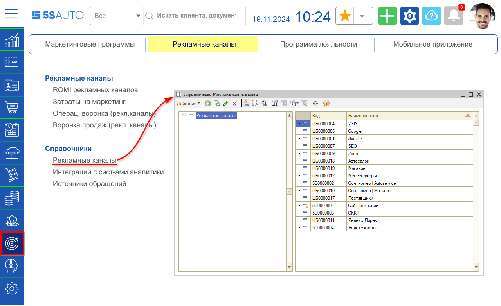
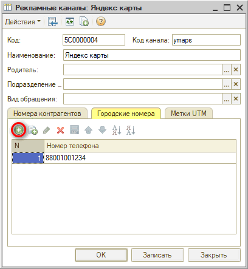
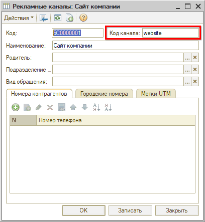
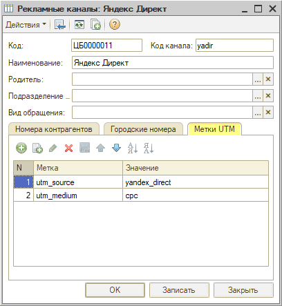
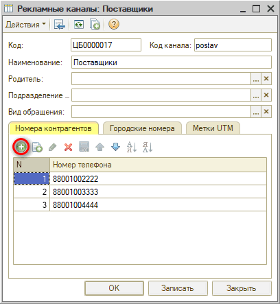
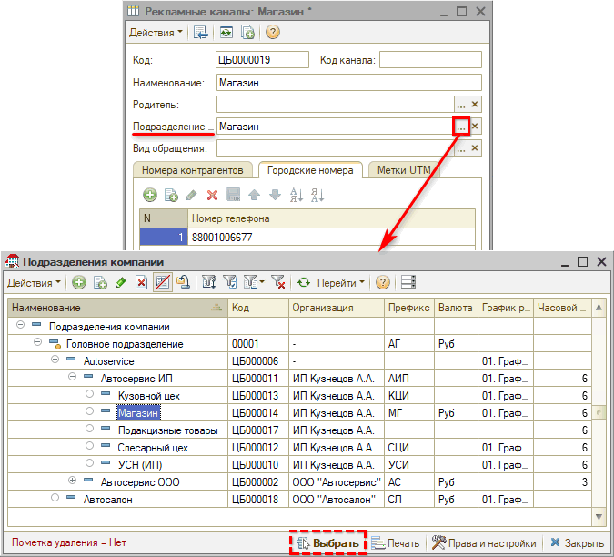
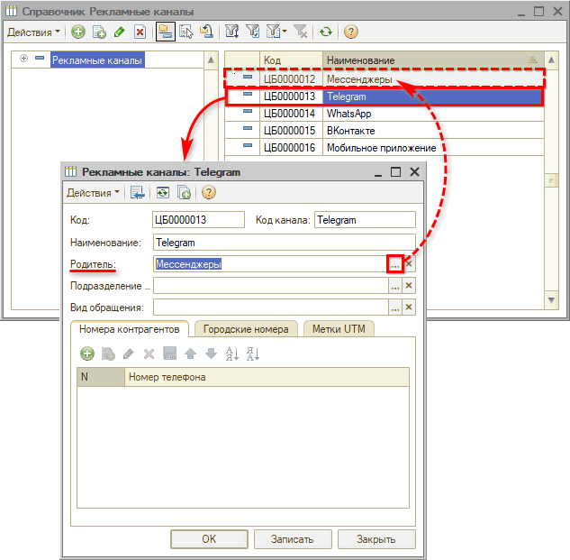
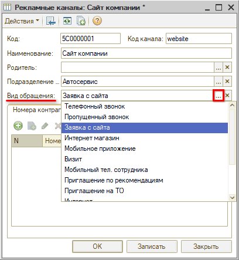

# Настройка рекламных каналов

<table><tr><td><b>Время чтения:</b> 8 мин.</td><td><b>Обновлено:</b> 19.11.2024</td></tr></table>

Источник: https://www.5systems.ru/help/nastroyka-reklamnykh-kanalov

## Содержание

1. [Введение](#введение)
2. [Настройка рекламных каналов](#настройка-рекламных-каналов)
3. [Привязка подразделения](#привязка-подразделения)
4. [Группировка рекламных каналов](#группировка-рекламных-каналов)
5. [Настройка вида обращения](#настройка-вида-обращения)

## Введение

Параметр ***"Рекламный канал"*** в [Сделке](../../CRM/Работа%20со%20сделкой/rabota-so-sdelkoy.md) позволяет проанализировать эффективность той или иной маркетинговой стратегии привлечения клиентов.

Параметр "Рекламный канал" может заполняться автоматически либо вручную при создании Сделки – подробнее см. в [статье](../../CRM/Работа%20со%20сделкой/rabota-so-sdelkoy.md#5-вкладка-маркетинг) и в [уроке](https://5systems.ru/help/sozdanie-sdelki#reklam). Для этого предварительно нужно произвести настройку справочника *"Рекламные каналы".*

Перейти в справочник можно через меню *Администрирование → вкладка "Компания" → раздел "Маркетинг"* либо *Маркетинг → вкладка "Рекламные каналы" → раздел "Справочники":*

## Настройка рекламных каналов

С телефонным звонком / webhook-ом есть возможность передавать различные параметры, которые позволяют *автоматически* определять рекламные каналы в Сделке. Настройка производится специалистами по телефонии.

Есть *несколько вариантов* настройки рекламных каналов:

1. Для разных рекламных каналов задать разные *городские номера:*  
     
   Для определения рекламного канала по городскому номеру требуется, чтобы у компании были выделены *несколько отдельных номеров* телефонов. В итоге в сделке подставится рекламный канал, заданный для номера телефона, на который звонит клиент. 
   Либо могут быть настроены *подменные номера* – в данном случае в сделке будет определяться рекламный канал по номеру телефона, с которого поступает звонок.
2. Задать *код канала:*  
     
   Настройка работает аналогично городским номерам. Рекламный канал определяется по коду.
3. *[Настроить интеграцию с системой аналитики данных](../Настройка%20интеграции%20с%20системой%20аналитики%20Roistat/nastroyka-integracii-s-sistemoy-analitiki-roistat.md)* и задать для рекламного канала *UTM-метки* – параметры перехода на сайт с указанием источника перехода:  
     
   Настройка производится совместно со специалистами со стороны системы аналитики.
4. Настроить *номера телефонов контрагентов:*  
     
   В случае использования агрегаторов рекламы указываются номера телефонов, с которых будут поступать звонки. В итоге в сделке подставится рекламный канал, заданный для номера телефона, с которого поступает звонок. Поскольку номер телефона не принадлежит клиенту, идентификация клиента не будет происходить автоматически – нужно будет просить клиента продиктовать свой номер телефона и вручную вносить его в сделку для идентификации.

## Привязка подразделения

Для компаний с несколькими подразделениями также есть возможность указать в рекламном канале *[подразделение](../../Структура%20компании/Справочник%20Подразделения%20компании/spravochnik-podrazdeleniya-kompanii.md) –* в этом случае при звонке на указанный в настройке номер телефона будет устанавливаться не только рекламный канал, но также подразделение, которое там указано:

## Группировка рекламных каналов

Параметр "Родитель" позволяет группировать рекламные каналы в справочнике:

## Настройка вида обращения

Для рекламных каналов *"Сайт компании"* и *"Мобильное приложение"* следует также выбрать значение параметра *Вид обращения:*

Данный параметр необходим для того, чтобы в новую сделку при заявке с сайта или приложения автоматически подтягивался рекламный канал *(примечание: веб-хук* *FromWeb).*

Также наличие данного параметра будет влиять на то, чтобы при общении с клиентом в рамках заявки с сайта или мобильного приложения карточка сделки поднималась вверх канбана или списка.

---

**Теги:** аналитика, рекламные каналы, сделка, подразделение, группировка, вид обращения

