

# Автоматическая загрузка банковских выписок

<table><tr><td><b>Время чтения:</b> 12 мин.</td><td><b>Обновлено:</b> 18.03.2025</td></tr></table>

Источник: https://www.5systems.ru/help/avtomaticheskaya-zagruzka-bankovskikh-vypisok

## Содержание

1. [Описание возможностей](#описание-возможностей)
   - [1. Загрузка выписок через регламентное задание](#1-загрузка-выписок-через-регламентное-задание)
   - [2. Автоматическая загрузка выписок через обработку](#2-автоматическая-загрузка-выписок-через-обработку)
   - [3. Автоматическая сверка остатков на расчетных счетах](#3-автоматическая-сверка-остатков-на-расчетных-счетах)
2. [Настройка на стороне банка](#настройка-на-стороне-банка)
3. [Настройка в программе](#настройка-в-программе)
   - [1. Проверка интеграции с API 5S AUTO](#1-проверка-интеграции-с-api-5s-auto)
   - [2. Создание интеграции с банком](#2-создание-интеграции-с-банком)
   - [3. Параметры сервиса](#3-параметры-сервиса)
   - [4. Настройка подключения](#4-настройка-подключения)
   - [5. Авторизация](#5-авторизация)
   - [6. Загрузка сертификатов (для Сбербанка)](#6-загрузка-сертификатов-для-сбербанка)
   - [7. Тест подключения](#7-тест-подключения)
   - [8. Настройка регламентного задания](#8-настройка-регламентного-задания)
      - [1) Заполнение банковских счетов](#1-заполнение-банковских-счетов)
      - [2) Режимы загрузки](#2-режимы-загрузки)
      - [3) Настройка расписания](#3-настройка-расписания)
   - [9. Уведомление о новых платежах](#9-уведомление-о-новых-платежах)

*Доступно начиная с релиза 2.8.2.*

## Описание возможностей

В 5S AUTO реализована возможность *загрузки банковских выписок через API* следующих банков:

- Сбербанк;
- Т-Банк (Tinkoff);
- Альфа-Банк.

Данные по загруженным выпискам используются в следующих разделах программы:

### 1. Загрузка выписок через регламентное задание

Выписки из банка загружаются автоматически при срабатывании *регламентного задания “Загрузка банковских выписок”* согласно заданному расписанию. В программе создается новый документ, а также выходит уведомление о загрузке выписки.

### 2. Автоматическая загрузка выписок через обработку

В *обработке “Обработка для загрузки банковских выписок” (см. [статью](../Обработка%20для%20загрузки%20банковских%20выписок/obrabotka-dlya-zagruzki-bankovskikh-vypisok.md))* помимо загрузки из файла есть возможность выбрать загрузку банковской выписки через API банка за нужный период.

### 3. Автоматическая сверка остатков на расчетных счетах

На форме реестра банковских выписок при выделении последней загруженной выписки отображается результат автоматической сверки остатков на расчетном счете на конец дня в программе с данными, подгруженными по API.

## Настройка на стороне банка

См. статью для вашего банка:

- [Подключение API Сбербанка](../Настройка%20API%20Сбербанка%20для%20загрузки%20выписок/nastroyka-api-sberbanka-dlya-zagruzki-vypisok.md);
- [Подключение API T-Банка](../Подключение%20загрузки%20выписок%20Т-Банка/podklyuchenie-zagruzki-vypisok-t-banka.md);
- [Подключение API Альфа-Банка](../Подключение%20загрузки%20выписок%20Альфа-Банка/podklyuchenie-zagruzki-vypisok-alfa-banka.md).

## Настройка в программе

### 1. Проверка интеграции с API 5S AUTO

Предварительно должна быть настроена интеграции с [API 5S AUTO](https://www.5systems.ru/help/api-5s-auto). Если это не будет выполнено, то функционал автоматической загрузки работать не будет.

### 2. Создание интеграции с банком

В текущей статье представлено описание настройки интеграции *на примере Альфа-Банка.*

Для подключения загрузки выписок по API банка первым делом необходимо перейти в справочник “Интеграции” и создать в нем новый элемент:

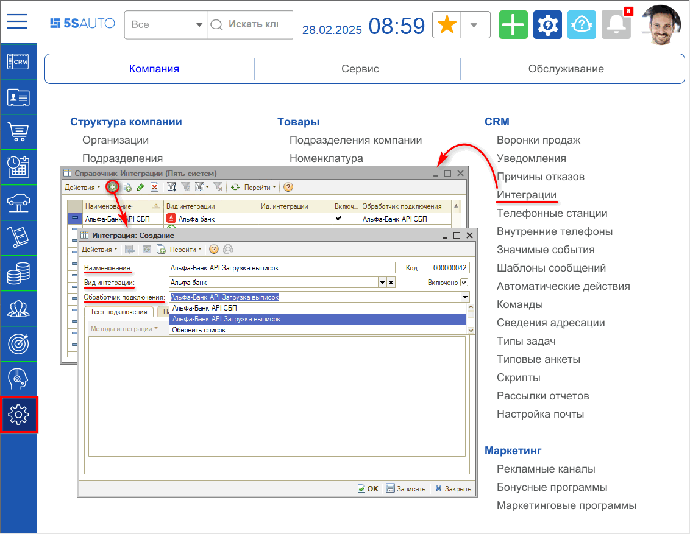

Требуется заполнить реквизиты:

- *Наименование интеграции* – заполняется автоматически после выбора обработчика подключения, при необходимости его можно изменить;
- *Вид интеграции* – выбрать нужную платежную систему (банк);
- *Обработчик подключения* – выбрать соответствующий обработчик;
- Установить галочку *“Включено”;*
- *Записать* изменения.

### 3. Параметры сервиса

В случае если в программе настроено несколько интеграций с API 5S AUTO, то на вкладке *“Параметры сервиса”* необходимо выбрать значение параметра “Интеграция с API 5S AUTO” и *сохранить* изменения:

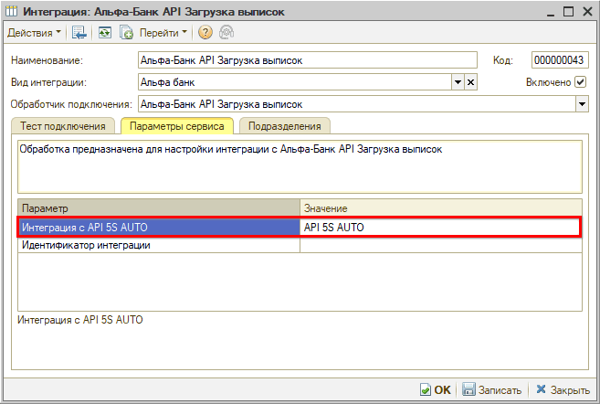

В случае если настроена одна интеграция с API 5S AUTO, то данный параметр можно не заполнять.

### 4. Настройка подключения

На вкладке “Тест подключения” следует перейти к добавлению настройки подключения по кнопке *“Методы интеграции → Настройки”:*

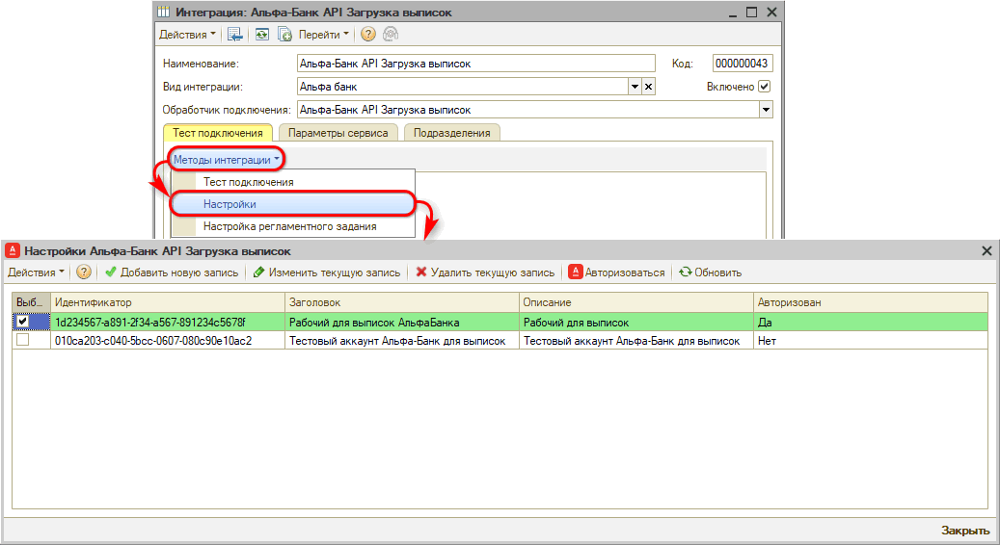

Сначала необходимо добавить новую настройку подключения:

Для разных банков требуется задать различные параметры подключения – подробнее см. в [статьях](../).

### 5. Авторизация

Далее для подключения загрузки выписок Сбербанка и Альфа-Банка требуется пройти *авторизацию* – для этого следует нажать кнопку “Авторизоваться”, при этом открывается QR-код:

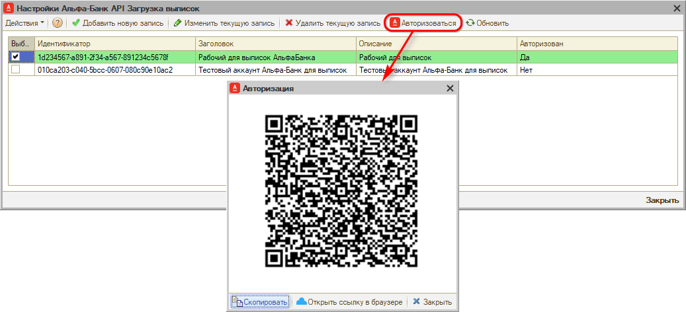

Необходимо перейти на страницу авторизации через сканирование QR-кода, либо нажать кнопку “Открыть ссылку в браузере”, либо скопировать ссылку нажатием кнопки “Скопировать” и открыть ее в браузере:

Требуется ввести учетные данные ЛК соответствующего банка.

В результате авторизации устанавливается постоянное подключение к банку, после чего можно запрашивать банковские выписки в автоматическом режиме.

*Примечание:* Для Т-Банка совершать отдельные действия по авторизации не требуется.

### 6. Загрузка сертификатов (для Сбербанка)

Для Сбербанка необходимо *загрузить сертификаты* для загрузки выписок через API, полученные на этапе настройки подключения на стороне банка – см. [*в статьях*](../).

Для Т-Банка и Альфа-Банка загрузка сертификатов не требуется.

### 7. Тест подключения

После всех настроек следует сделать тест подключения – для этого нужно нажать кнопку *“Методы интеграции → Тест подключения”.*

Должно появиться сообщение *“Тест подключения прошел успешно”:*

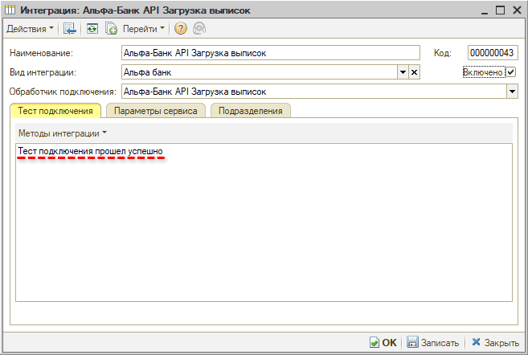

### 8. Настройка регламентного задания

Настройка регламентного задания позволяет выбрать режим загрузки и задать расчетные счета, по которым будет срабатывать фоновое задание. Для настройки следует на вкладке “Тест подключения” перейти в *Методы интеграции → Настройки регламентного задания:*

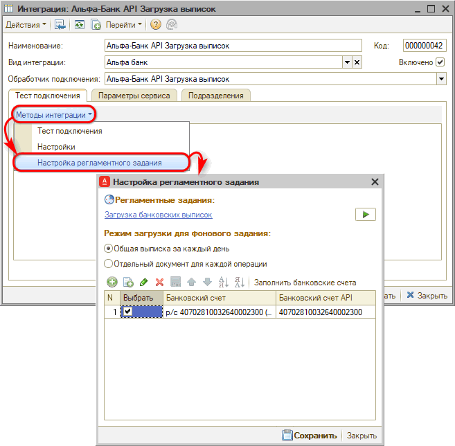

#### 1) Заполнение банковских счетов

В таблице следует заполнить расчетные счета компании, по которым следует загружать выписки. Для этого требуется нажать кнопку “Заполнить банковские счета” – при этом автоматически подтягиваются счета компании из ЛК по API, их нужно сопоставить со счетами в программе – выбрать нужные счета из справочника:

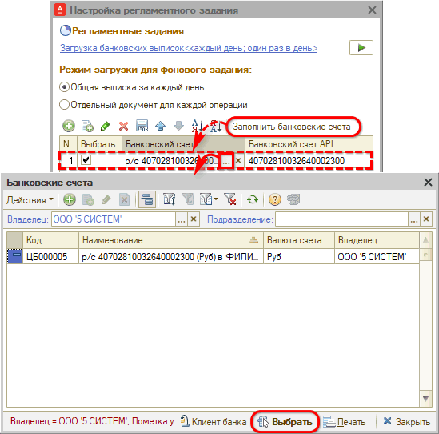

В случае если в программе р/с отсутствует или если счета введены некорректно, счета для сопоставления можно добавить вручную, а также при необходимости создать новый счет в базе.

Обязательно установить *галочку “Выбрать”* напротив нужных счетов.

После сопоставления счетов необходимо *сохранить* изменения.

#### 2) Режимы загрузки

Есть возможность выбрать один из двух режимов для фонового задания:

1. *Общая выписка за каждый день* – будет создаваться один документ с хоз. операцией “Банковская выписка” за день по всем операциям и дополняться по мере появления новых данных;
2. *Отдельный документ для каждой операции* – будет создаваться отдельный документ с хоз. операцией “Строка банковской выписки” по каждой транзакции.

#### 3) Настройка расписания

Для настройки расписания, согласно которому будет срабатывать регламентное задание, следует нажать на ссылку “Загрузка банковских выписок”. Также можно запустить регламентное задание вручную:

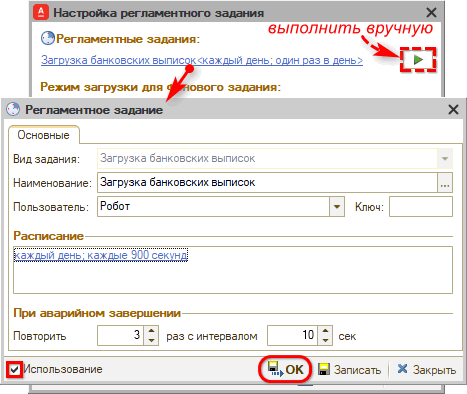

### 9. Уведомление о новых платежах

При включении интеграции автоматически подключается *уведомление* о поступлении платежа на расчетный счет. Следует настроить способы оповещения – см. в статье “[Работа с уведомлениями](../../../CRM/Работа%20с%20уведомлениями/rabota-s-uvedomleniyami.md#настройка-уведомлений)”:

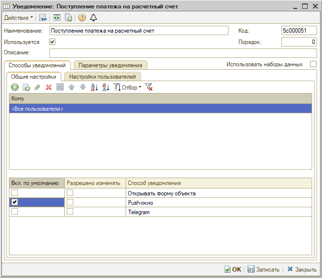

Уведомление будет приходить в программе автору документа-основания и менеджеру, указанному в документе:

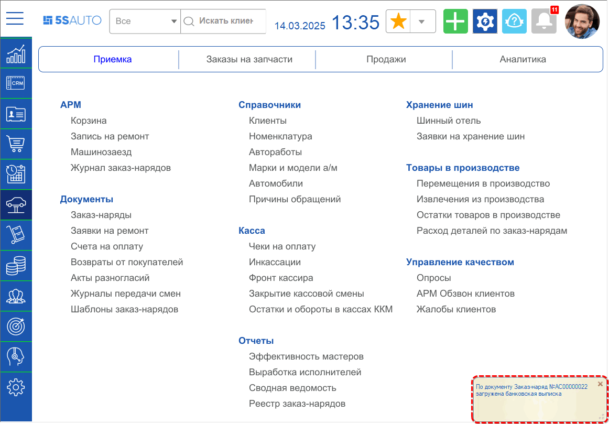

Уведомление автору и менеджеру документа отправляется, только если системой определена сделка выписки.

Если сделка не определена, то уведомление о загрузке выписки без указания документа-основания будет приходить пользователям со следующими должностями, указанными в сведениях адресации: Бухгалтер, Кассир, Управляющий директор и Финансовый директор.

Если в автоматически загруженной выписке не определились контрагенты, в комментарий загруженного документа добавляются сведения об ошибке загрузки. Приходит уведомление “Загружена банковская выписка с ошибками”.

Выписка в данном случае сохраняется без проведения. В случае загрузки без ошибок выписка автоматически проводится.

При клике на ссылку в уведомлении производится переход в загруженный документ:

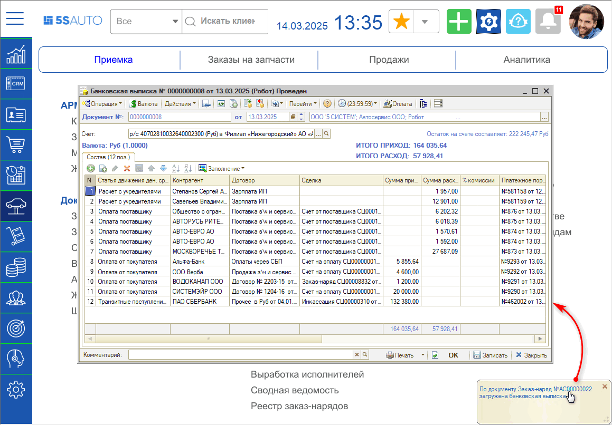

---

**Теги:** банковские выписки, регламентное задание, автоматическая загрузка, сверка остатков, банк

