

# Настройка API Сбербанка для загрузки выписок

<table><tr><td><b>Время чтения:</b> 10 мин.</td><td><b>Обновлено:</b> 31.07.2026</td></tr></table>

Источник: https://www.5systems.ru/help/nastroyka-api-sberbanka-dlya-zagruzki-vypisok

## Содержание

1. [Введение](#введение)
2. [Настройка на стороне банка](#настройка-на-стороне-банка)
   - [1. Создание пользователя в СберБизнес](#1-создание-пользователя-в-сбербизнес)
   - [2. Подключение Sber API](#2-подключение-sber-api)
3. [Настройка интеграции в программе](#настройка-интеграции-в-программе)
   - [1. Создание интеграции с банком](#1-создание-интеграции-с-банком)
   - [2. Параметры сервиса](#2-параметры-сервиса)
   - [3. Настройка подключения](#3-настройка-подключения)
   - [4. Авторизация](#4-авторизация)
   - [5. Загрузка сертификатов](#5-загрузка-сертификатов)
   - [6. Тест подключения](#6-тест-подключения)
   - [7. Настройка регламентного задания](#7-настройка-регламентного-задания)
   - [8. Уведомление о новых платежах](#8-уведомление-о-новых-платежах)

*Доступно начиная с релиза 2.8.2.*

## Введение

В текущей статье представлено описание подключения и настройки интеграции для *загрузки выписок через API Сбербанка.* См. основную статью “[Автоматическая загрузка банковских выписок](../Автоматическая%20загрузка%20банковских%20выписок/avtomaticheskaya-zagruzka-bankovskikh-vypisok.md)”.

## Настройка на стороне банка

Предварительно для настройки автоматической загрузки банковских выписок через API Сбербанка необходимо быть зарегистрированным в [СберБизнес](https://www.sberbank.com/ru/s_m_business/new_sbbol), иметь личный кабинет.

В личном кабинете в разделе "Sber API" следует проверить наличие *набора API* с признаком **"Компаниям"** и статусом "Активирован" (он должен быть выбран при подключении Sber API). Если такой карточки нет, необходимо в разделе "Витрина API" подключить набор API с наименованием "Компаниям" (нажать кнопку "Подключить"), а также подписать корректирующее заявление (см. [инструкции](https://developers.sber.ru/docs/ru/sber-api/start/connect)):

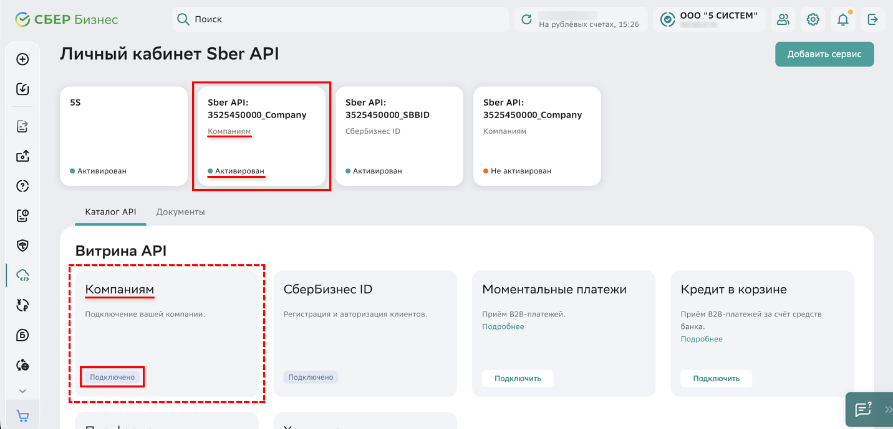

### 1. Создание пользователя в СберБизнес

**Важно!** Рекомендуется добавить нового пользователя с ограниченными правами – доступ к сервису будет определяться по данному сотруднику, интеграция будет работать под его правами.

Для создания пользователя потребуются e-mail и телефон.

**Шаг 1.** *Перейдите в личный кабинет*

В ЛК в верхнем меню справа откройте профиль пользователя и перейдите в раздел *Моя организация → Пользователи и сотрудники:*

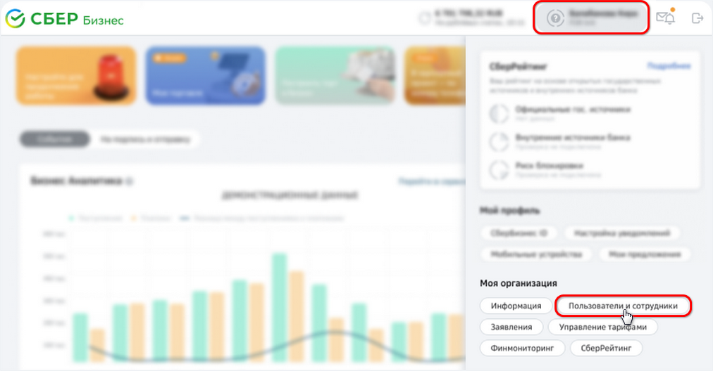

Нажмите кнопку *“Новый сотрудник”:*

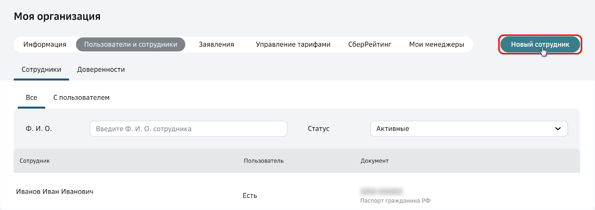

**Шаг 2.** *Внесите данные о сотруднике*

В разделе “Возможности сотрудника” выберите пункт “Предоставить доступ в интернет-банк”:

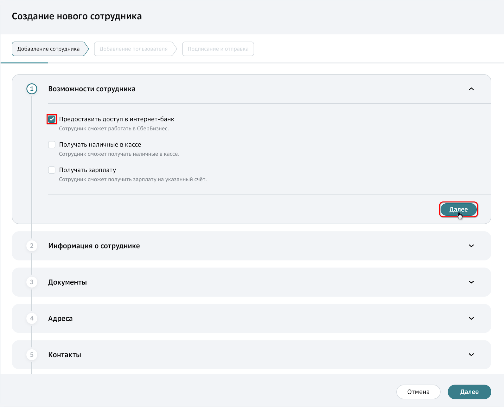

Заполните блок “Информация о сотруднике”:

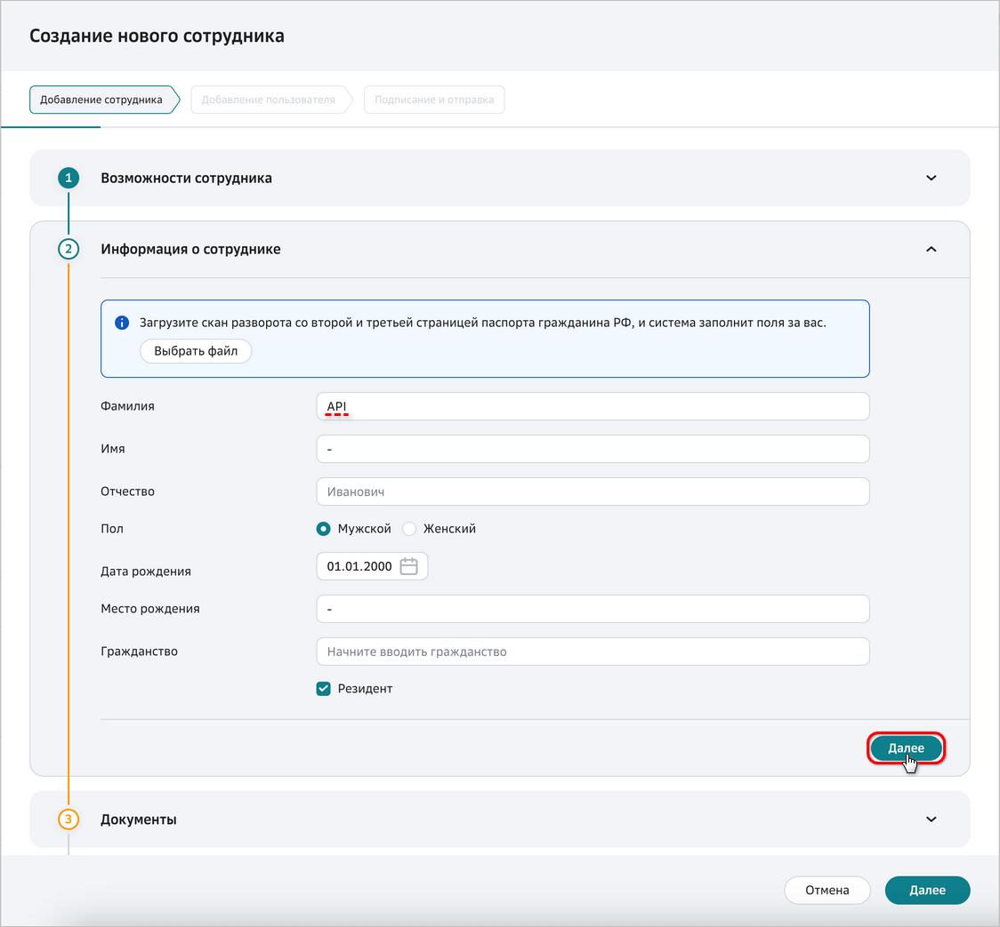

Заполните блок “Документы”:

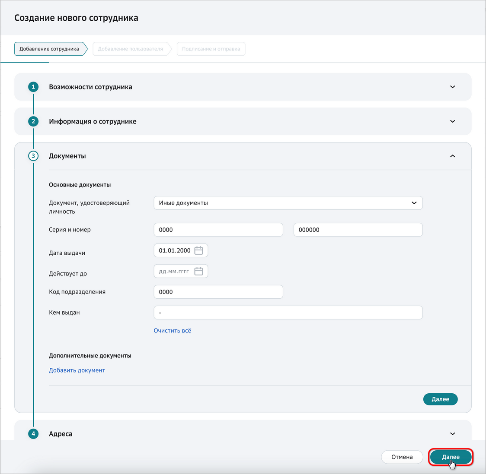

Нажмите кнопку *“Далее”.* При этом производится переход на следующую вкладку – “Добавление пользователя”.

**Шаг 3.** *Настройте параметры для доступа в интернет-банк*

Заполните следующие параметры:

1. Укажите *телефон* для входа и *электронную почту* – эти данные будут использоваться для авторизации. Телефон и почта должны быть ранее не использованными для регистрации пользователей:

   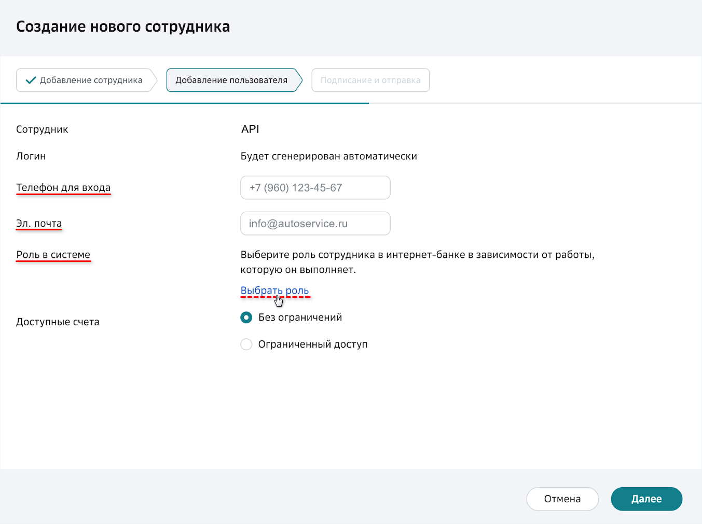

2. Выберите роль пользователя в системе – рекомендуется выбрать роль “Бухгалтер”:

   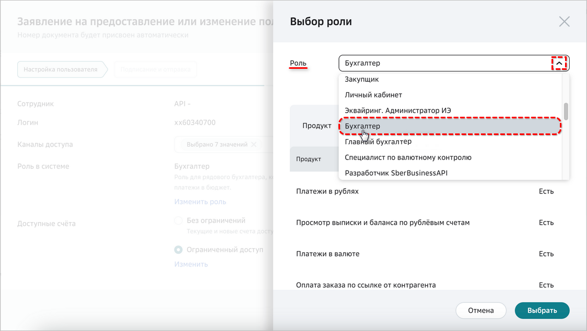

Настройте *доступ к счетам.*

Нажмите кнопку *“Далее”.*

После настройки информация по созданному пользователю будет иметь следующий вид:

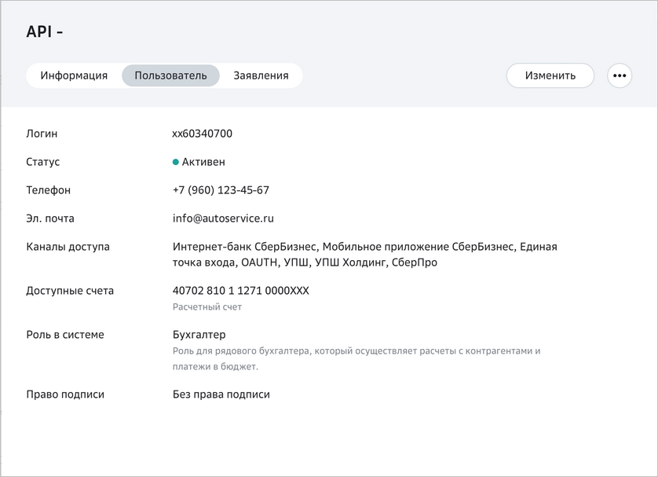

**Шаг 4.** *Отправьте заявление в банк*

На странице с заявлением проверьте все данные. Подпишите заявление с помощью СМС-кода или электронного ключа (токена) и отправьте в банк.

После проверки заявления на указанную электронную почту поступит письмо, а также СМС-код на указанный номер, после чего можно будет войти в систему.

### 2. Подключение Sber API

Перейдите в раздел *“Все продукты и услуги” → блок “Сбербанк API”:*

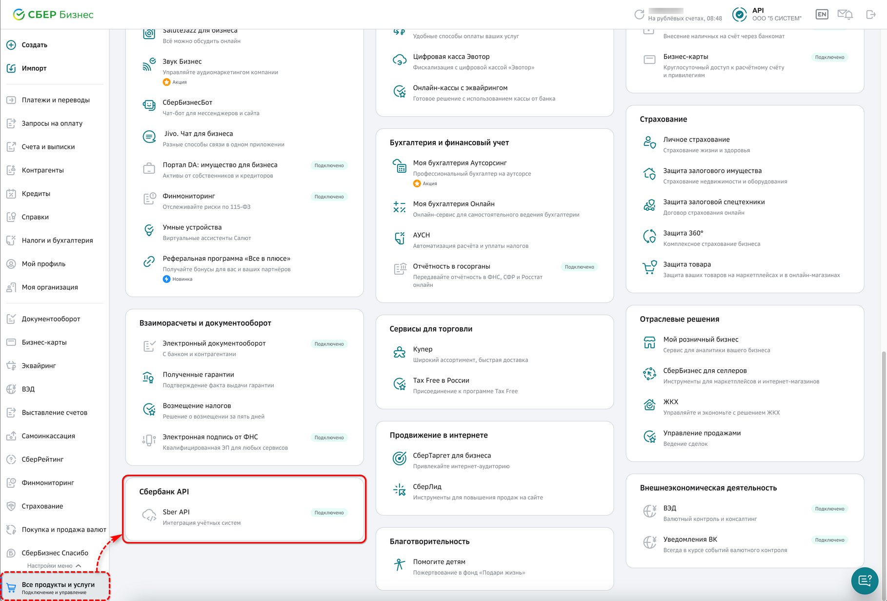

В *ЛК* *Sber API* в блоке *"Сертификаты шифрования"* нажмите кнопку ***"Сгенерировать*** ***сертификат"**,* в открывшемся окне задайте ***пароль доступа*** *и сохраните его,* затем нажмите кнопку ***"Создать сертификат"***:

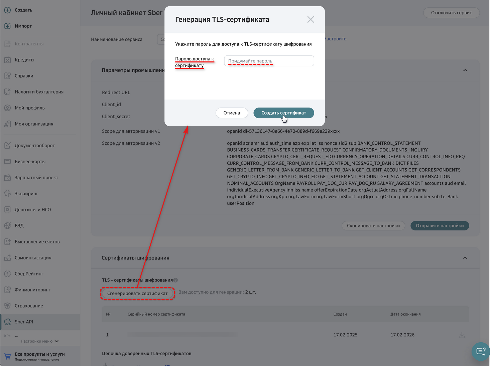

Скопируйте параметры ***Client_id*** и ***Client_secret*** и скачайте созданный ***сертификат*** в формате *.p12:*

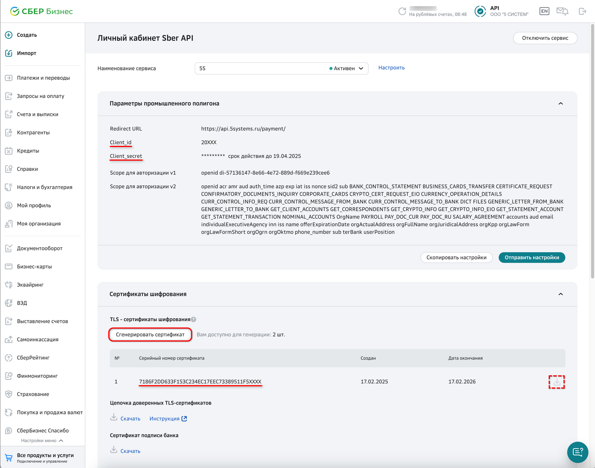

Затем из загруженного файла .p12 необходимо получить ***приватный ключ*** и ***клиентский сертификат***. Это можно сделать с помощью утилиты OpenSSL:

*openssl pkcs12 -in <имя вашего файла>.p12 -nodes -nocerts -out private.key*

*openssl pkcs12 -in <имя вашего файла>.p12 -clcerts -nokeys -out client_cert.crt*

*потребуется ввод [пароля](#parol) от сертификата*

*В случае возникновения сложностей, обратитесь в техподдержку 5SYSTEMS.*

Полученные ***приватный ключ*** и ***клиентский* *сертификат*** необходимо будет загрузить в программу при дальнейшей настройке – см. [*далее*](#5-загрузка-сертификатов).

## Настройка интеграции в программе

### 1. Создание интеграции с банком

Описание общих настроек подключения загрузки выписок через API для всех банков см. в статье “[Автоматическая загрузка банковских выписок](../Автоматическая%20загрузка%20банковских%20выписок/avtomaticheskaya-zagruzka-bankovskikh-vypisok.md#настройка-в-программе)”.

При добавлении новой интеграции со Сбербанком для загрузки выписок следует ввести следующие реквизиты:

- *Наименование интеграции* – заполняется автоматически после выбора обработчика подключения, при необходимости можно изменить;
- *Вид интеграции* – выбрать *“Сбербанк”;*
- *Обработчик подключения* – выбрать обработчик *“Сбербанк API Загрузка выписок”;*
- Установить галочку *“Включено”;*
- *Записать* изменения.

### 2. Параметры сервиса

На вкладке *“Параметры сервиса”* необходимо задать параметр “Интеграция с API 5S AUTO” и сохранить изменения – см. в статье “[Автоматическая загрузка банковских выписок](../Автоматическая%20загрузка%20банковских%20выписок/avtomaticheskaya-zagruzka-bankovskikh-vypisok.md#3-параметры-сервиса)”.

### 3. Настройка подключения

На вкладке “Тест подключения” следует перейти к добавлению настройки подключения по кнопке *“Методы интеграции → Настройки”:*

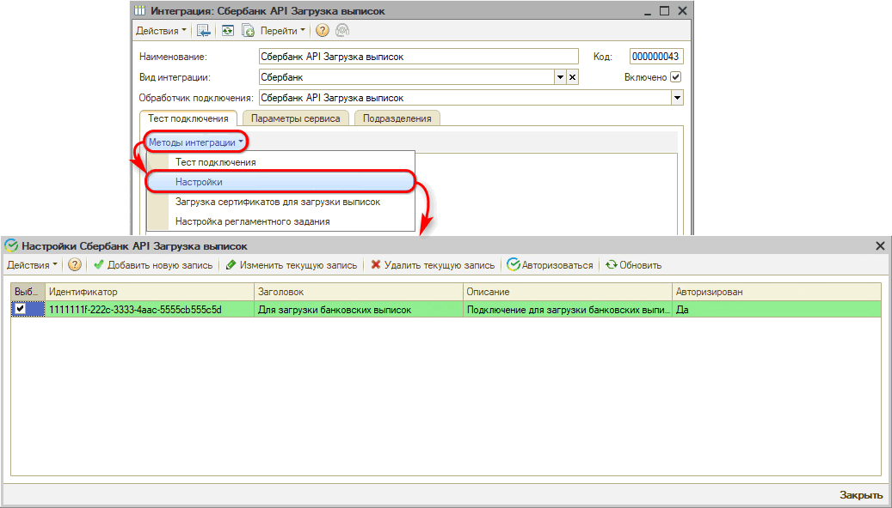

Сначала необходимо добавить новую настройку подключения:

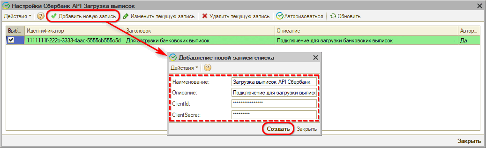

Для Сбербанка необходимо задать следующие параметры подключения:

- *Наименование* – наименование интеграции с API Сбербанка;
- *Описание* – описание аккаунта;
- *ClientId* и *ClientSecret* – параметры из ЛК *Sber API*, полученные при настройке сервиса на стороне банка – см. [выше](#sertif).

### 4. Авторизация

Затем требуется пройти *авторизацию* – для этого следует нажать кнопку “Авторизоваться”, при этом открывается QR-код:

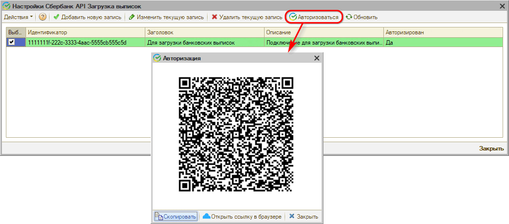

Необходимо перейти на страницу авторизации через сканирование QR-кода, либо нажать кнопку “Открыть ссылку в браузере”, либо скопировать ссылку нажатием кнопки “Скопировать” и открыть ее в браузере:

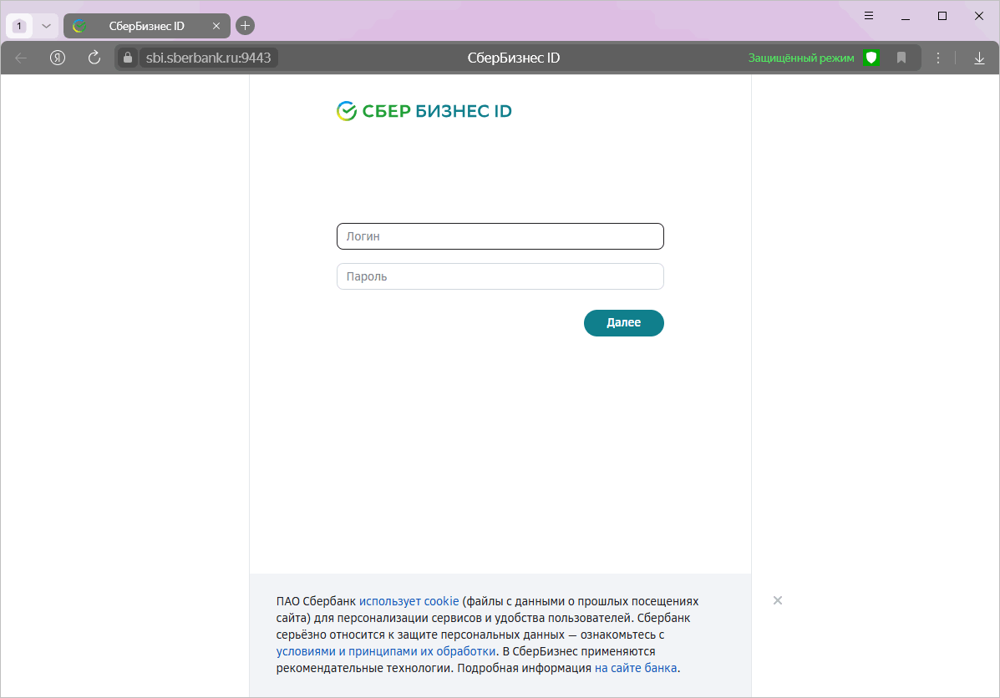

Требуется ввести учетные данные ЛК Сбербанка.

В результате устанавливается постоянное подключение к банку, после чего можно запрашивать банковские выписки в автоматическом режиме.

### 5. Загрузка сертификатов

Для интеграции с API Сбербанка для загрузки выписок необходимо загрузить файлы сертификата и личного ключа, полученные из скачанного в ЛК файла сертификата .p12 на этапе настройки сервиса на стороне банка – см. *[выше](#sertif):*

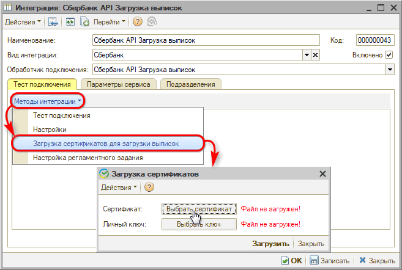

После выбора файлов сертификата и ключа нажать кнопку *“Загрузить”:*

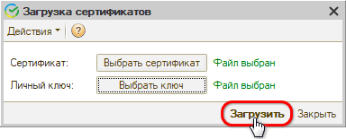

### 6. Тест подключения

После произведенных настроек следует сделать *тест подключения* – см. в статье “[Автоматическая загрузка банковских выписок](../Автоматическая%20загрузка%20банковских%20выписок/avtomaticheskaya-zagruzka-bankovskikh-vypisok.md#7-тест-подключения)”.

### 7. Настройка регламентного задания

Настройка регламентного задания позволяет:

- настроить расписание, по которому будет работать регламентное задание либо запустить вручную при необходимости;
- выбрать один из двух режимов загрузки;
- задать расчетные счета компании, по которым нужно загружать выписки.

Для настройки следует на вкладке “Тест подключения” перейти в *Методы интеграции → Настройки регламентного задания –* подробнее см. в статье “[Автоматическая загрузка банковских выписок](../Автоматическая%20загрузка%20банковских%20выписок/avtomaticheskaya-zagruzka-bankovskikh-vypisok.md#8-настройка-регламентного-задания)”.

### 8. Уведомление о новых платежах

При включении интеграции автоматически подключается *уведомление* о загрузке банковской выписки, которое будет приходить в программе автору документа-основания и менеджеру, указанному в документе.

Если не определен документ-основание, то уведомление о загрузке выписки без указания документа будет приходить пользователям со следующими должностями, указанными в сведениях адресации: Бухгалтер, Кассир, Управляющий директор и Финансовый директор.

Для пользователей следует настроить способы оповещения.

Подробнее см. в статье “[Автоматическая загрузка банковских выписок](../Автоматическая%20загрузка%20банковских%20выписок/avtomaticheskaya-zagruzka-bankovskikh-vypisok.md#9-уведомление-о-новых-платежах)”.

---

**Теги:** банковские выписки, сбербанк, сбербизнес, api, интеграция

