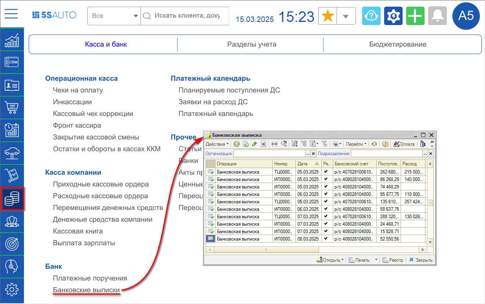
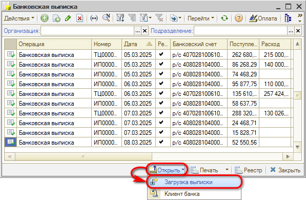
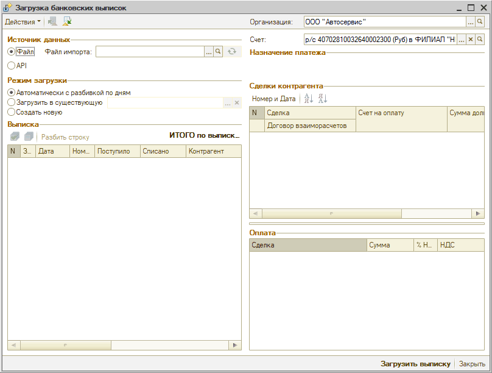
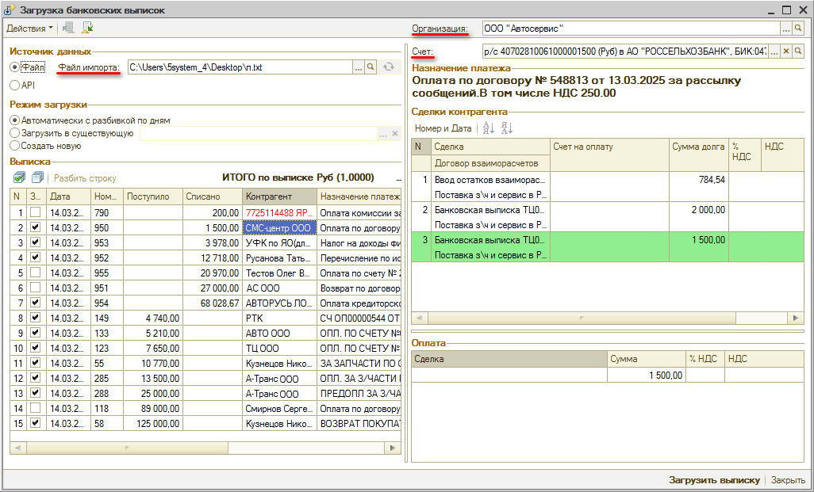
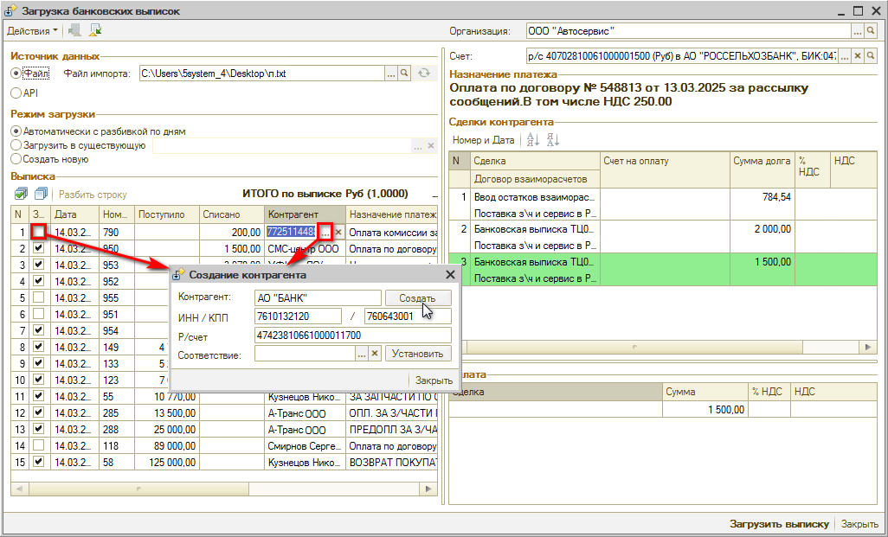
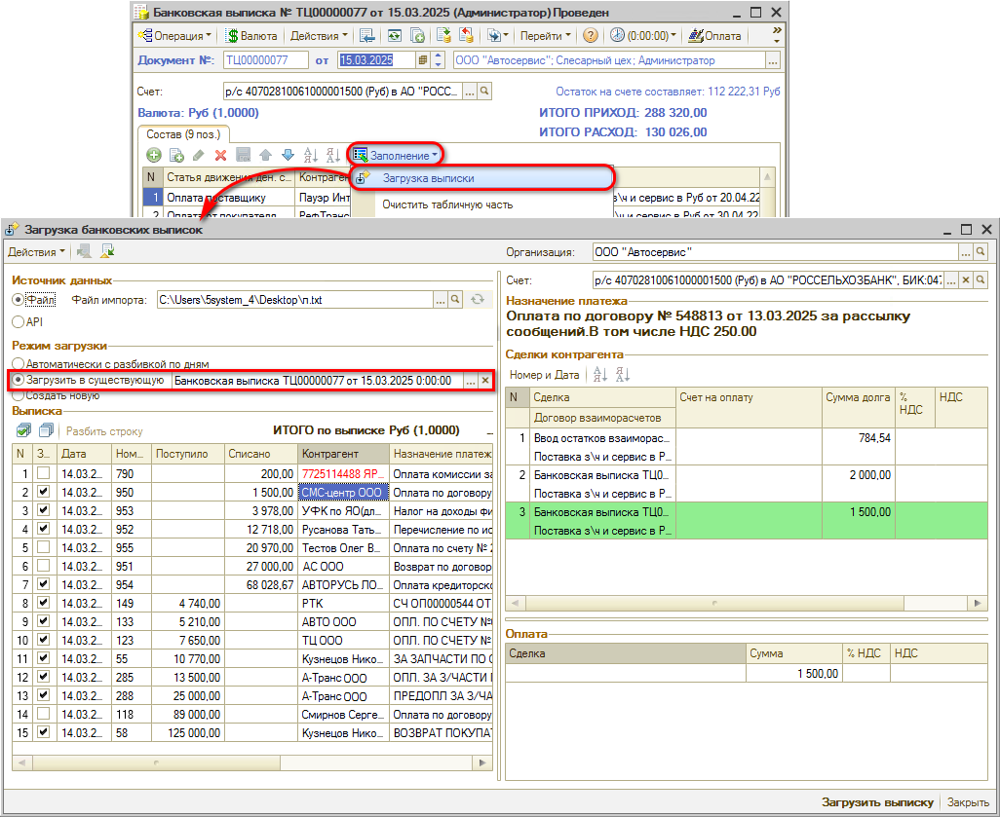
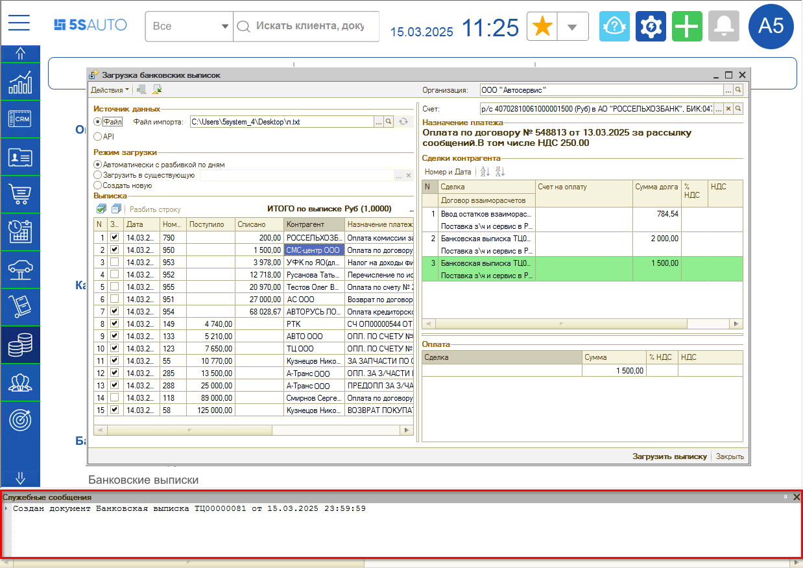
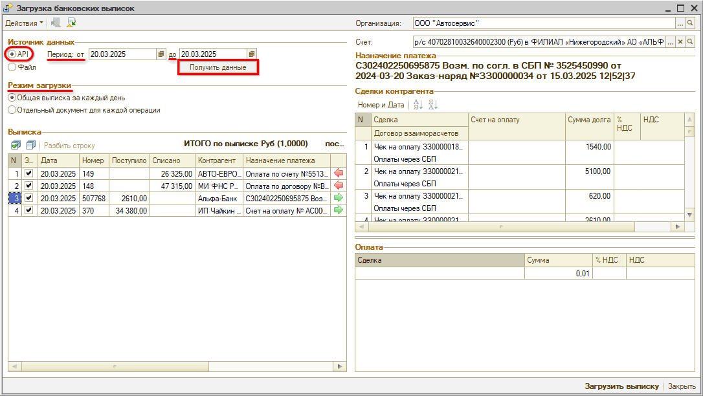

# Обработка для загрузки банковских выписок

<table><tr><td><b>Время чтения:</b> 11 мин.</td><td><b>Обновлено:</b> 20.03.2025</td></tr></table>

Источник: https://www.5systems.ru/help/obrabotka-dlya-zagruzki-bankovskikh-vypisok

> *Актуально начиная с версии релиза 5S AUTO **2.002.007**, загрузка через API банка – с релиза **2.8.2**.*

## Содержание

1. [Введение](#введение)
2. [Описание](#описание)
   - [1. Переход к загрузке выписки](#1-переход-к-загрузке-выписки)
   - [2. Загрузка из файла](#2-загрузка-из-файла)
   - [3. Загрузка через API банка](#3-загрузка-через-api-банка)

## Введение

В системе реализован функционал *загрузки банковской выписки* с помощью *специальной обработки* из следующих источников: из файла, предварительно полученного из банка, либо через API банка.

## Описание

### 1. Переход к загрузке выписки

Для того, чтобы загрузить банковскую выписку, следует открыть реестр документов “Банковская выписка” – расположение в программе: *Финансы → Касса и банк → Банк → Банковские выписки:*

В реестре необходимо нажать на кнопку “Открыть” и выбрать обработку “Загрузка выписки”:

При этом открывается окно обработки "Загрузка банковских выписок":

### 2. Загрузка из файла

#### 1) Выбор файла импорта

В обработке по умолчанию выбран источник данных "Файл". Требуется выбрать *организацию*, *расчетный счет* и загрузить *файл импорта[\*](#snoska)*. Выписка заполняется платежами по выбранным организации и счету:

*\*Примечание:* При работе с программой через удаленный рабочий стол, т.е. при подключении через RDP, *файл* необходимо скопировать в своих документах и вставить на рабочий стол удаленного компьютера – например, в окно, которое откроется при загрузке файла импорта.

При выделении в выписке строки с определенным платежом – в поле “Сделки контрагента” отображаются все документы по данному контрагенту, по которым есть долг: сумма долга выводится в соответствующем столбце. В качестве сделок могут быть выведены Реализации товаров, Заказ-наряды, Счета на оплату и другие документы. Программа автоматически подсвечивает документ, который может выступать в качестве сделки по строке платежа.

Красным шрифтом выделяются контрагенты, которые не найдены в базе: для загрузки платежей по ним *необходимо* сначала либо *создать для них карточки контрагентов,* либо *произвести сопоставление с существующими в базе контрагентами*. Для этого нужно нажать кнопку “Выбор”  или кликнуть на место установки флажка в поле “Загружать”:

В открывшемся окне в поле “Соответствие” следует нажать кнопку “Выбор”  и найти контрагента, с которым требуется произвести сопоставление. Если такого контрагента в базе нет, то нужно нажать кнопку “Создать”: карточка нового контрагента будет создана в базе и автоматически подтянется в обработку. Сопоставление производится по ИНН и КПП контрагента.

Далее в колонке “Загружать” необходимо отметить флажками те платежи, которые требуется разнести. Затем следует выбрать режим загрузки.

#### 2) Режимы загрузки

Возможен выбор одного из трех режимов:

1. *Автоматически с разбивкой по дням* 
   Данный режим назначается по умолчанию: при его выборе производится *разбивка выписок по датам*, если файл выгрузки из банка содержит данные за несколько дней.
2. *Загрузить в существующую* 
   При выборе этого режима данные загружаются в существующую банковскую выписку: ее необходимо выбрать нажатием на соответствующую кнопку  . Либо можно изначально вызвать обработку из этой выписки, тогда она автоматически подгрузится в поле “Загрузить в существующую”:  
   
3. *Создать новую* 
   При выборе данного режима будет создана одна банковская выписка по всем отмеченным платежам (без разбивки по датам).

#### 3) Загрузка выписки

После заполнения всех параметров следует нажать кнопку “Загрузить выписку”. *В зависимости от выбранного режима* будет создана и проведена банковская выписка – одна или несколько (по количеству дней), либо обновлена существующая банковская выписка. Программа выведет соответствующие служебные сообщения.

### 3. Загрузка через API банка

#### 1) Выбор источника данных API

Для загрузки выписки через API банка следует выбрать *источник данных "API".* Выбор данного способа загрузки становится доступен только после настройки подключения API и сопоставления счета организации в программе и в ЛК на сайте банка – см. в статье “[Автоматическая загрузка банковских выписок](../Автоматическая%20загрузка%20банковских%20выписок/avtomaticheskaya-zagruzka-bankovskikh-vypisok.md#8-настройка-регламентного-задания)”.

#### 2) Режимы загрузки

Также следует выбрать режим загрузки: "Общая выписка за каждый день" или "Отдельный документ для каждой операции" – подробнее см. в статье “[Автоматическая загрузка банковских выписок](../Автоматическая%20загрузка%20банковских%20выписок/avtomaticheskaya-zagruzka-bankovskikh-vypisok.md#2-режимы-загрузки)”.

#### 3) Получение данных за период

Затем необходимо задать период и нажать кнопку *“Получить данные”:*

Рекомендуется выбирать небольшой период, т.к. в случае большого количества платежных операций данные будут долго загружаться. При выборе периода больше месяца появится предупреждение программы.

#### 4) Загрузка выписки

После получения данных следует нажать кнопку “Загрузить выписку” – в результате в программе будет создан новый документ "Банковская выписка" с загруженными по API данными.

Также есть возможность настроить автоматическую загрузку выписок через регламентное задание – см. статью “[Автоматическая загрузка банковских выписок](../Автоматическая%20загрузка%20банковских%20выписок/avtomaticheskaya-zagruzka-bankovskikh-vypisok.md)”.

---

**Теги:** банковские выписки, загрузка выписки, банк, оплаты, обработка
