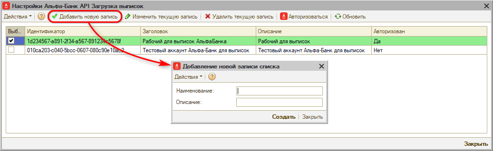
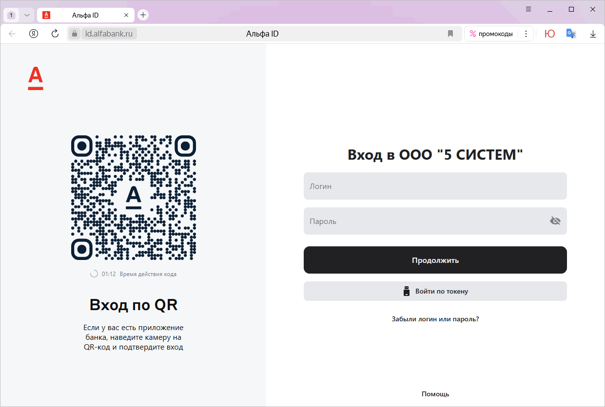

# Подключение загрузки выписок Альфа-Банка

<table><tr><td><b>Время чтения:</b> 5 мин.</td><td><b>Обновлено:</b> 19.03.2025</td></tr></table>

Источник: https://www.5systems.ru/help/podklyuchenie-zagruzki-vypisok-alfa-banka

## Содержание

1. [Введение](#введение)
2. [Настройка на стороне банка](#настройка-на-стороне-банка)
3. [Настройка в программе](#настройка-в-программе)
   - [1. Создание интеграции с банком](#1-создание-интеграции-с-банком)
   - [2. Параметры сервиса](#2-параметры-сервиса)
   - [3. Настройка подключения](#3-настройка-подключения)
   - [4. Авторизация](#4-авторизация)
   - [5. Тест подключения](#5-тест-подключения)
   - [6. Настройка регламентного задания](#6-настройка-регламентного-задания)
   - [7. Уведомление о новых платежах](#7-уведомление-о-новых-платежах)

> *Доступно начиная с релиза **2.8.2**.*

## Введение

В текущей статье представлено описание подключения и настройки интеграции для загрузки выписок через API Альфа-Банка. См. основную статью “[Автоматическая загрузка банковских выписок](../Автоматическая%20загрузка%20банковских%20выписок/avtomaticheskaya-zagruzka-bankovskikh-vypisok.md)”.

## Настройка на стороне банка

Для автоматической загрузки банковских выписок через API Альфа-Банка необходимо быть клиентом Альфа-Банка, оформить расчетно-кассовое обслуживание и подключить ЛК [Альфа-Бизнес Онлайн](https://alfabank.ru/sme/). Никаких настроек на стороне банка делать не требуется.

## Настройка в программе

### 1. Создание интеграции с банком

Описание общих настроек подключения загрузки выписок через API для всех банков см. в статье “[Автоматическая загрузка банковских выписок](../Автоматическая%20загрузка%20банковских%20выписок/avtomaticheskaya-zagruzka-bankovskikh-vypisok.md#настройка-в-программе)”.

При добавлении новой интеграции с Альфа-Банком для загрузки выписок следует ввести следующие реквизиты:

- *Наименование интеграции* – заполняется автоматически после выбора обработчика подключения, при необходимости можно изменить;
- *Вид интеграции* – выбрать “Альфа-Банк”;
- *Обработчик подключения* – выбрать обработчик “Альфа-Банк API Загрузка выписок”;
- Установить галочку *“Включено”;*
- *Записать* изменения.

### 2. Параметры сервиса

На вкладке *“Параметры сервиса”* необходимо задать параметр “Интеграция с API 5S AUTO” и сохранить изменения – см. в статье “[Автоматическая загрузка банковских выписок](../Автоматическая%20загрузка%20банковских%20выписок/avtomaticheskaya-zagruzka-bankovskikh-vypisok.md#3-параметры-сервиса)”.

### 3. Настройка подключения

На вкладке “Тест подключения” следует перейти к добавлению настройки подключения по кнопке *“Методы интеграции → Настройки”:*

Сначала необходимо добавить новую настройку подключения:

Для Альфа-Банка необходимо задать следующие параметры подключения:

- *Наименование* –  наименование интеграции с API Альфа-Банка;
- *Описание* – описание аккаунта.

### 4. Авторизация

Затем требуется пройти *авторизацию* – для этого следует нажать кнопку “Авторизоваться”, при этом открывается QR-код:

Необходимо перейти на страницу авторизации через сканирование QR-кода, либо нажать кнопку “Открыть ссылку в браузере”, либо скопировать ссылку нажатием кнопки “Скопировать” и открыть ее в браузере:

Требуется ввести учетные данные ЛК “Альфа-Бизнес”.

В результате устанавливается постоянное подключение к банку, после чего можно запрашивать банковские выписки в автоматическом режиме.

### 5. Тест подключения

После произведенных настроек следует сделать *тест подключения* – см. в статье “[Автоматическая загрузка банковских выписок](../Автоматическая%20загрузка%20банковских%20выписок/avtomaticheskaya-zagruzka-bankovskikh-vypisok.md#7-тест-подключения)”.

### 6. Настройка регламентного задания

Настройка регламентного задания позволяет:

- задать расчетные счета компании, по которым нужно загружать выписки;
- выбрать один из двух режимов загрузки;
- настроить расписание, по которому будет работать регламентное задание либо запустить вручную при необходимости.

Для настройки следует на вкладке “Тест подключения” перейти в *Методы интеграции → Настройки регламентного задания –* подробнее см. в статье “[Автоматическая загрузка банковских выписок](../Автоматическая%20загрузка%20банковских%20выписок/avtomaticheskaya-zagruzka-bankovskikh-vypisok.md#8-настройка-регламентного-задания)”.

### 7. Уведомление о новых платежах

При включении интеграции автоматически подключается уведомление о загрузке банковской выписки, которое будет приходить в программе автору документа-основания и менеджеру, указанному в документе.

Если не определен документ-основание, то уведомление о загрузке выписки без указания документа будет приходить пользователям со следующими должностями, указанными в сведениях адресации: Бухгалтер, Кассир, Управляющий директор и Финансовый директор.

Для пользователей следует настроить способы оповещения.

Подробнее см. в статье “[Автоматическая загрузка банковских выписок](../Автоматическая%20загрузка%20банковских%20выписок/avtomaticheskaya-zagruzka-bankovskikh-vypisok.md#9-уведомление-о-новых-платежах)”.

---

**Теги:** банковские выписки, альфа-банк, интеграция, подключение, api

