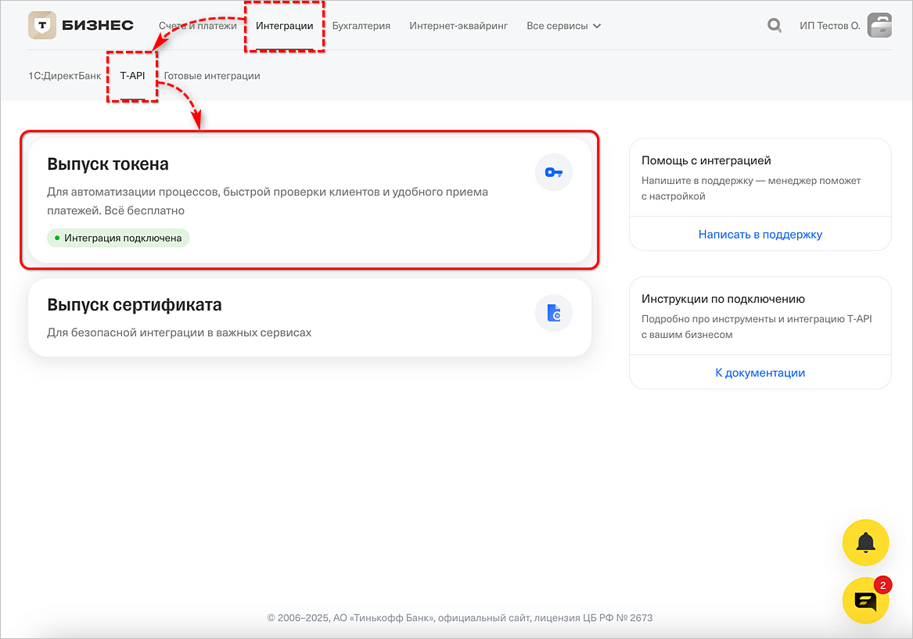
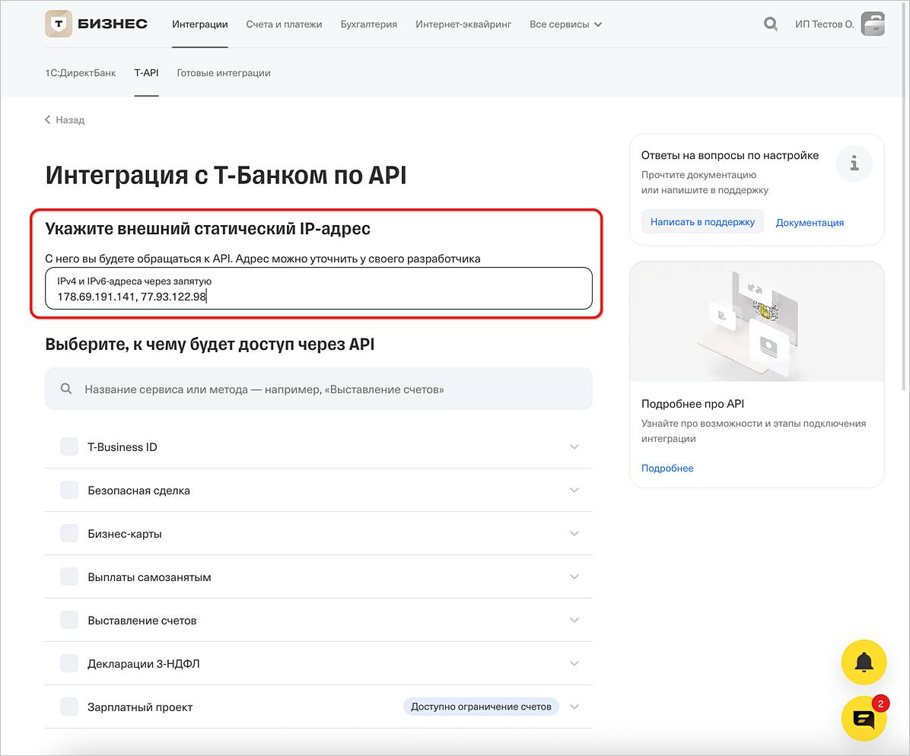
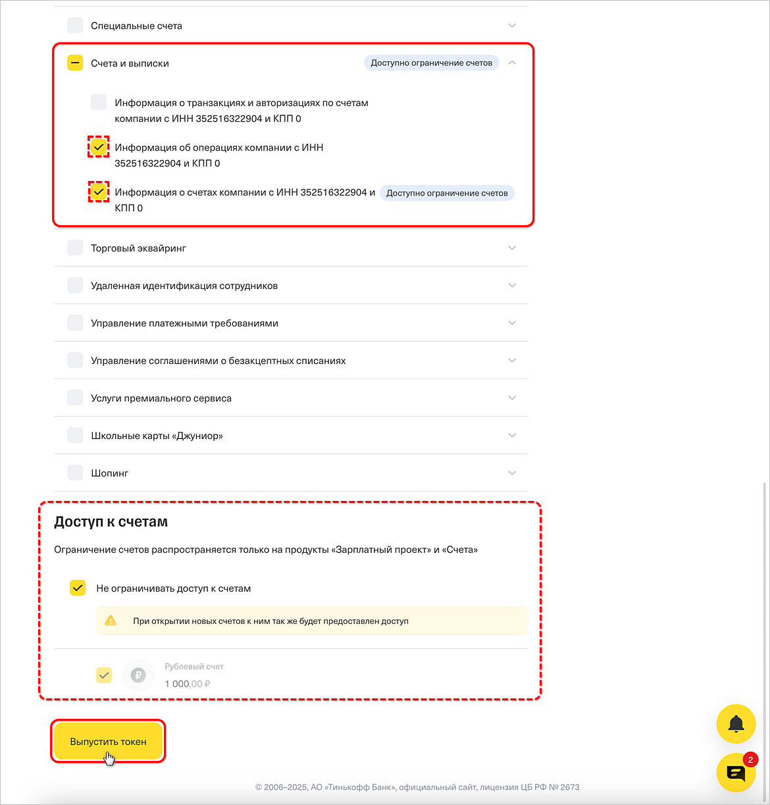
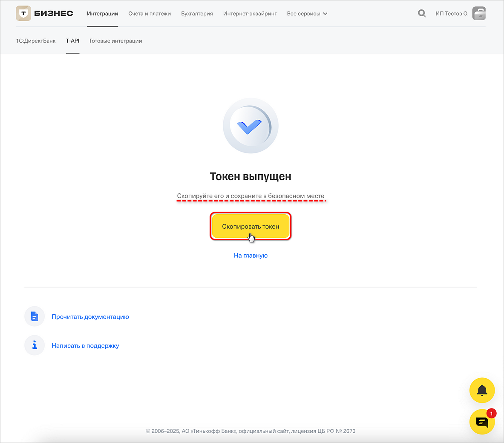
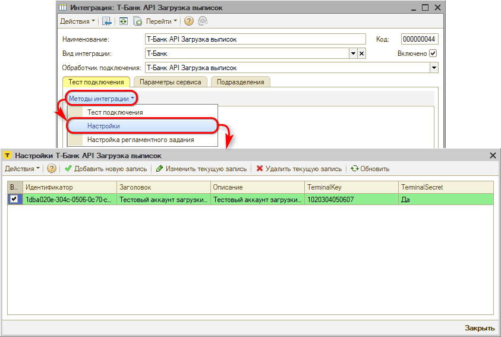
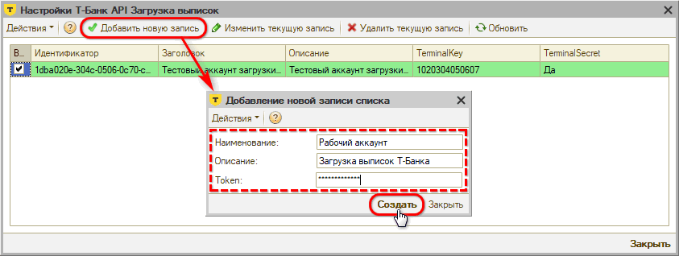

# Подключение загрузки выписок Т-Банка

<table><tr><td><b>Время чтения:</b> 6 мин.</td><td><b>Обновлено:</b> 29.07.2026</td></tr></table>

Источник: https://www.5systems.ru/help/podklyuchenie-zagruzki-vypisok-t-banka

## Содержание

1. [Введение](#введение)
2. [Настройка на стороне банка](#настройка-на-стороне-банка)
3. [Настройка в программе](#настройка-в-программе)
   - [1. Создание интеграции с банком](#1-создание-интеграции-с-банком)
   - [2. Параметры сервиса](#2-параметры-сервиса)
   - [3. Настройка подключения](#3-настройка-подключения)
   - [4. Тест подключения](#4-тест-подключения)
   - [5. Настройка регламентного задания](#5-настройка-регламентного-задания)
   - [6. Уведомление о новых платежах](#6-уведомление-о-новых-платежах)

*Доступно начиная с релиза 2.8.2.*

## Введение

В текущей статье представлено описание *подключения и настройки интеграции для загрузки выписок через API Т-Банка.* См. основную статью “[Автоматическая загрузка банковских выписок](../Автоматическая%20загрузка%20банковских%20выписок/avtomaticheskaya-zagruzka-bankovskikh-vypisok.md)”.

## Настройка на стороне банка

Для настройки автоматической загрузки банковских выписок через API Т-Банка (T‑API) компании необходимо быть клиентом Т-Банка и иметь доступ в личный кабинет [T‑Бизнеса](https://business.tbank.ru/account).

В ЛК следует в разделе “Интеграции → T-API” следует перейти к выпуску токена:

Требуется указать внешние IP-адреса для обращения к API – адреса см. в статье “[API 5S AUTO](https://www.5systems.ru/help/api-5s-auto#ipadresa)”:

В блоке *“Выберите, к чему будет доступ через API”* следует установить галочки только в одном блоке – *“Счета и выписки”,* отметить пункты *“Информация об операциях компании”* и *“Информация о счетах компании”.* Также есть возможность ограничить доступ к счетам:

Затем нужно нажать кнопку *“Выпустить токен”.*

Выпущенный токен необходимо скопировать, сохранить в безопасном месте и использовать в дальнейшем для настройки интеграции в программе – см. [*ниже*](#3-настройка-подключения)*:*

## Настройка в программе

### 1. Создание интеграции с банком

Описание общих настроек подключения загрузки выписок через API для всех банков см. в статье “[Автоматическая загрузка банковских выписок](../Автоматическая%20загрузка%20банковских%20выписок/avtomaticheskaya-zagruzka-bankovskikh-vypisok.md#настройка-в-программе)”.

При добавлении новой интеграции с Т-Банком для загрузки выписок следует ввести следующие реквизиты:

- *Наименование интеграции* – заполняется автоматически после выбора обработчика подключения, при необходимости можно изменить;
- *Вид интеграции* – выбрать “Т-Банк”;
- *Обработчик подключения* – выбрать обработчик “Т-Банк API Загрузка выписок”;
- Установить галочку *“Включено”;*
- *Записать* изменения.

### 2. Параметры сервиса

На вкладке *“Параметры сервиса”* необходимо задать параметр “Интеграция с API 5S AUTO” и сохранить изменения – см. в статье “[Автоматическая загрузка банковских выписок](../Автоматическая%20загрузка%20банковских%20выписок/avtomaticheskaya-zagruzka-bankovskikh-vypisok.md#3-параметры-сервиса)”.

### 3. Настройка подключения

На вкладке “Тест подключения” следует перейти к добавлению настройки подключения по кнопке *“Методы интеграции → Настройки”:*

Добавить новую запись списка:

Заполнить параметры:

- *Наименование* – наименование интеграции с API Т-Банка;
- *Описание* – описание аккаунта;
- *Token* – параметр следует получить при настройке сервиса на стороне банка – см. *[выше](#настройка-на-стороне-банка).*

### 4. Тест подключения

После произведенных настроек следует сделать *тест подключения* – см. в статье “[Автоматическая загрузка банковских выписок](../Автоматическая%20загрузка%20банковских%20выписок/avtomaticheskaya-zagruzka-bankovskikh-vypisok.md#7-тест-подключения)”.

### 5. Настройка регламентного задания

Настройка регламентного задания позволяет:

- задать расчетные счета компании, по которым нужно загружать выписки;
- выбрать один из двух режимов загрузки;
- настроить расписание, по которому будет работать регламентное задание либо запустить вручную при необходимости.

Для настройки следует на вкладке “Тест подключения” перейти в *Методы интеграции → Настройки регламентного задания –* подробнее см. в статье “[Автоматическая загрузка банковских выписок](../Автоматическая%20загрузка%20банковских%20выписок/avtomaticheskaya-zagruzka-bankovskikh-vypisok.md#8-настройка-регламентного-задания)”.

### 6. Уведомление о новых платежах

При включении интеграции автоматически подключается *уведомление* о загрузке банковской выписки, которое будет приходить в программе автору документа-основания и менеджеру, указанному в документе.

Если не определен документ-основание, то уведомление о загрузке выписки без указания документа будет приходить пользователям со следующими должностями, указанными в сведениях адресации: Бухгалтер, Кассир, Управляющий директор и Финансовый директор.

Для пользователей следует настроить способы оповещения.

Подробнее см. в статье “[Автоматическая загрузка банковских выписок](../Автоматическая%20загрузка%20банковских%20выписок/avtomaticheskaya-zagruzka-bankovskikh-vypisok.md#9-уведомление-о-новых-платежах)”.

---

**Теги:** банковские выписки, т-банк, интеграция, подключение, api

