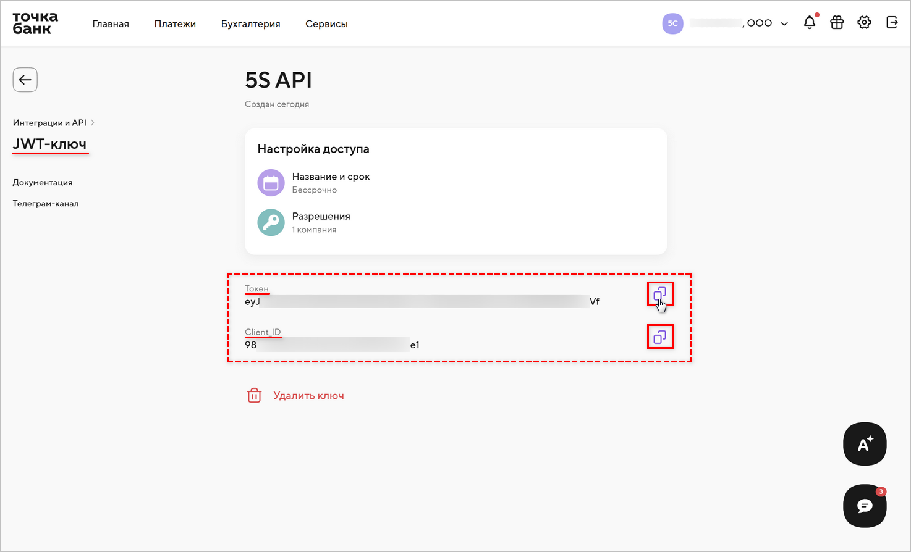
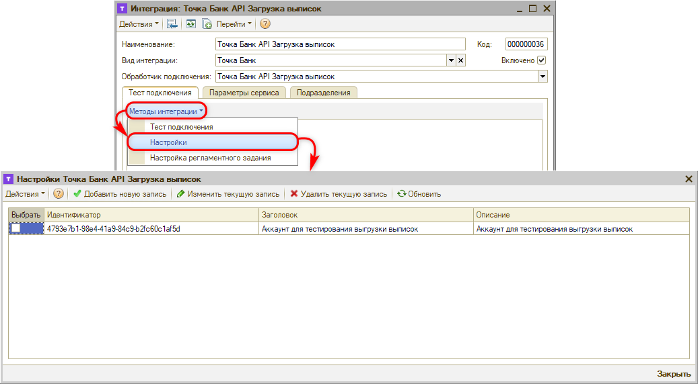
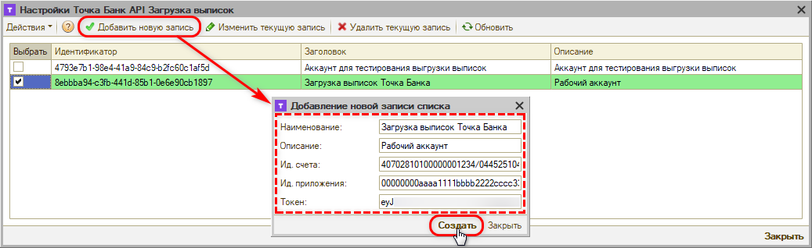

# Подключение загрузки выписок Точка Банка

<table><tr><td><b>Время чтения:</b> 6 мин.</td><td><b>Обновлено:</b> 18.09.2026</td></tr></table>

> *Комментарий: черновик.*

> *Актуально начиная с версии релиза 5S AUTO **2.8.5**.*

## Содержание

1. [Введение](#введение)
2. [Настройка на стороне банка](#настройка-на-стороне-банка)
3. [Настройка в программе](#настройка-в-программе)
   - [1. Создание интеграции с банком](#1-создание-интеграции-с-банком)
   - [2. Параметры сервиса](#2-параметры-сервиса)
   - [3. Настройка подключения](#3-настройка-подключения)
   - [4. Тест подключения](#4-тест-подключения)
   - [5. Настройка регламентного задания](#5-настройка-регламентного-задания)
   - [6. Уведомление о новых платежах](#6-уведомление-о-новых-платежах)

## Введение

В текущей статье представлено описание *подключения и настройки интеграции для загрузки выписок через API Точка Банка.* См. основную статью “[Автоматическая загрузка банковских выписок](../Автоматическая%20загрузка%20банковских%20выписок/avtomaticheskaya-zagruzka-bankovskikh-vypisok.md)”.

## Настройка на стороне банка

Для настройки автоматической загрузки банковских выписок через API Точка Банка компании необходимо быть клиентом Точка Банка и иметь доступ в интернет-банк: [https://i.tochka.com](https://i.tochka.com/).

Доступ к API дает *JWT-ключ* – токен, который создается в интернет-банке. Порядок создания ключа подробно описан в статье “[Подключение СБП Точка Банка](../../Система%20быстрых%20платежей/Подключение%20СБП%20Точка%20Банка/podklyuchenie-sbp-tochka-banka.md#шаг-1-создание-jwt-ключа)”, а также в документации банка: “[Авторизация по JWT-токену](https://developers.tochka.com/docs/tochka-api/algoritm-raboty-s-jwt-tokenom)”.

Кратко:

1. В интернет-банке нажмите кнопку настроек (шестеренка) в правом верхнем углу страницы и выберите пункт *“Интеграции”* (либо перейдите в *“Сервисы” → “Бизнес” → “Интеграции и API”*).
2. Нажмите *“Создать JWT-ключ”,* укажите *название* ключа и *срок доступа,* затем нажмите *“Продолжить”.*
3. На шаге *“Разрешения”* выберите компанию и в панели *“Доступы компании”* отметьте доступы, необходимые для загрузки выписок: *“Просмотр реквизитов”* (список счетов), *“Просмотр остатка по счёту”* и *“Получение выписок”.* Нажмите *“Подтвердить”* и *“Создать ключ”.*
4. Подтвердите создание ключа кодом из пуш-уведомления или смс.

*Примечание:* Если JWT-ключ уже создан для приема оплаты через СБП и при его создании было отмечено разрешение *“Получение выписок”,* создавать отдельный ключ не нужно – для загрузки выписок используется тот же токен. Если разрешения не было, ключ придется перевыпустить: при перевыпуске меняются и токен, и Client_ID, их нужно будет обновить во всех интеграциях с Точка Банком в программе.

Для дальнейшей [настройки подключения](#3-настройка-подключения) в программе потребуются следующие параметры:

- **Токен** – JWT-токен из [карточки ключа](#kartochka_klyucha) (либо по ссылке *“Скопировать ключ”* сразу после создания);
- **Client_ID** – идентификатор приложения из [карточки ключа](#kartochka_klyucha);
- **Номер расчетного счета** и **БИК банка** – см. реквизиты счета в интернет-банке (*“Моя компания” → “Реквизиты”*). БИК Точка Банка – 044525104.

Параметры *Токен* и *Client_ID* можно найти в карточке ключа в [разделе *“Интеграции и API”* → *“JWT-ключи”*](../../Система%20быстрых%20платежей/Подключение%20СБП%20Точка%20Банка/podklyuchenie-sbp-tochka-banka.md#шаг-1-создание-jwt-ключа):

## Настройка в программе

### 1. Создание интеграции с банком

Описание общих настроек подключения загрузки выписок через API для всех банков см. в статье “[Автоматическая загрузка банковских выписок](../Автоматическая%20загрузка%20банковских%20выписок/avtomaticheskaya-zagruzka-bankovskikh-vypisok.md#настройка-в-программе)”.

При добавлении новой интеграции с Точка Банком для загрузки выписок следует ввести следующие реквизиты:

- *Наименование интеграции* – заполняется автоматически после выбора обработчика подключения, при необходимости можно изменить;
- *Вид интеграции* – выбрать “Точка Банк”;
- *Обработчик подключения* – выбрать обработчик “Точка Банк API Загрузка выписок”;
- Установить галочку *“Включено”;*
- *Записать* изменения.

*Примечание:* Обработчик *“Точка Банк СБП”* предназначен для приема оплаты через СБП – см. статью “[Подключение СБП Точка Банка](../../Система%20быстрых%20платежей/Подключение%20СБП%20Точка%20Банка/podklyuchenie-sbp-tochka-banka.md)”. Для загрузки выписок создается отдельная интеграция с обработчиком *“Точка Банк API Загрузка выписок”.*

### 2. Параметры сервиса

На вкладке *“Параметры сервиса”* необходимо задать параметр “Интеграция с API 5S AUTO” и сохранить изменения – см. в статье “[Автоматическая загрузка банковских выписок](../Автоматическая%20загрузка%20банковских%20выписок/avtomaticheskaya-zagruzka-bankovskikh-vypisok.md#3-параметры-сервиса)”.

### 3. Настройка подключения

На вкладке “Тест подключения” следует перейти к добавлению настройки подключения по кнопке *“Методы интеграции → Настройки”:*

Добавить новую запись списка по кнопке *“Добавить новую запись”:*

Заполнить параметры и нажать кнопку *“Создать”:*

- *Наименование* – наименование аккаунта подключения к API Точка Банка;
- *Описание* – описание аккаунта;
- *Ид. счета* – номер расчетного счета и БИК банка через слеш, например `40702810100000001234/044525104`;
- *Ид. приложения* – *Client_ID* из карточки JWT-ключа;
- *Токен* – JWT-токен.

Значения параметров следует получить при настройке сервиса на стороне банка – см. *[выше](#настройка-на-стороне-банка).*

*Примечание:* Параметры те же, что в записи настроек интеграции “Точка Банк СБП”, за исключением *Ид. торг. точки* – для загрузки выписок идентификатор торговой точки не нужен. При этом для загрузки выписок и для приема оплаты через СБП должны быть созданы *разные записи* настроек подключения – каждая в своей интеграции: даже если используется один и тот же JWT-ключ, запись, созданная для интеграции “Точка Банк СБП”, для загрузки выписок не подходит.

*Примечание:* Отдельные действия по авторизации для Точка Банка не требуются: подключение работает по токену.

### 4. Тест подключения

После произведенных настроек следует сделать *тест подключения* – см. в статье “[Автоматическая загрузка банковских выписок](../Автоматическая%20загрузка%20банковских%20выписок/avtomaticheskaya-zagruzka-bankovskikh-vypisok.md#7-тест-подключения)”.

### 5. Настройка регламентного задания

Настройка регламентного задания позволяет:

- задать расчетные счета компании, по которым нужно загружать выписки;
- выбрать один из двух режимов загрузки;
- настроить расписание, по которому будет работать регламентное задание либо запустить вручную при необходимости.

Для настройки следует на вкладке “Тест подключения” перейти в *Методы интеграции → Настройки регламентного задания –* подробнее см. в статье “[Автоматическая загрузка банковских выписок](../Автоматическая%20загрузка%20банковских%20выписок/avtomaticheskaya-zagruzka-bankovskikh-vypisok.md#8-настройка-регламентного-задания)”.

### 6. Уведомление о новых платежах

При включении интеграции автоматически подключается *уведомление* о загрузке банковской выписки, которое будет приходить в программе автору документа-основания и менеджеру, указанному в документе.

Если не определен документ-основание, то уведомление о загрузке выписки без указания документа будет приходить пользователям со следующими должностями, указанными в сведениях адресации: Бухгалтер, Кассир, Управляющий директор и Финансовый директор.

Для пользователей следует настроить способы оповещения.

Подробнее см. в статье “[Автоматическая загрузка банковских выписок](../Автоматическая%20загрузка%20банковских%20выписок/avtomaticheskaya-zagruzka-bankovskikh-vypisok.md#9-уведомление-о-новых-платежах)”.

---

**Теги:** банковские выписки, точка банк, интеграция, подключение, api
