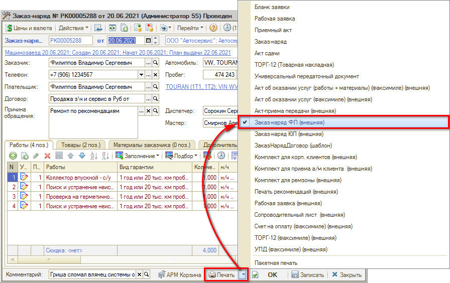
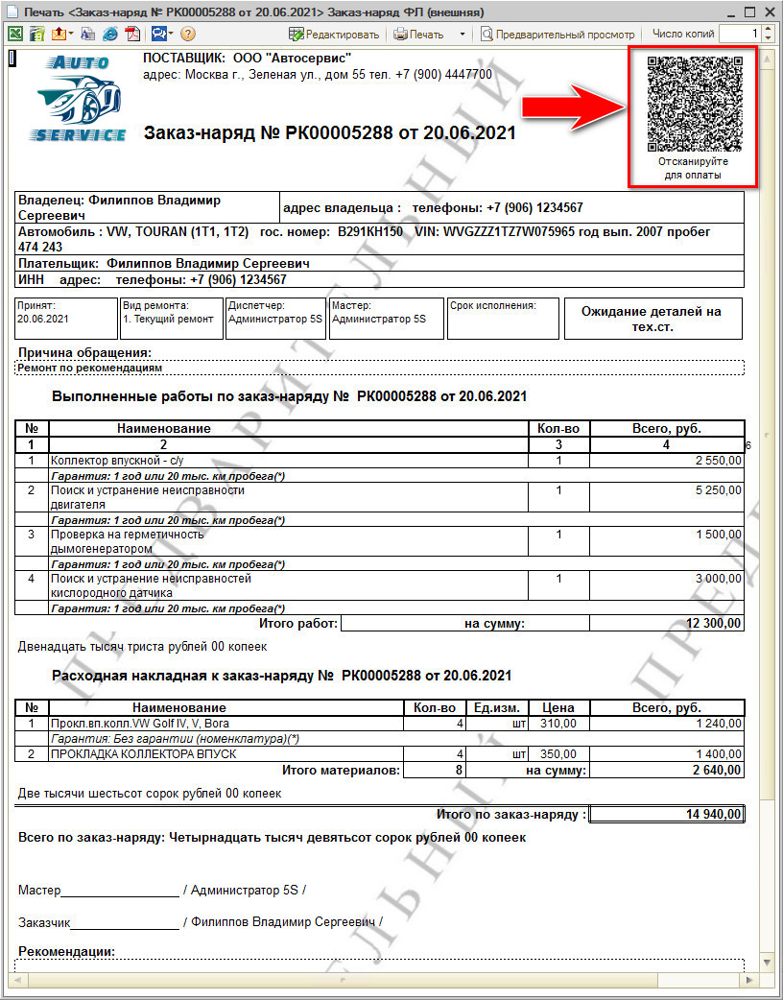
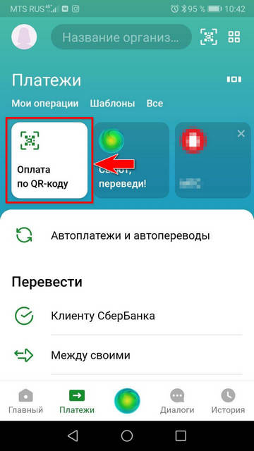
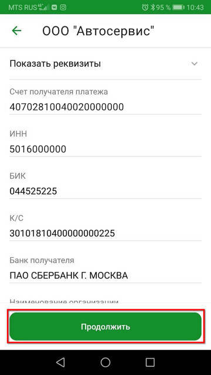
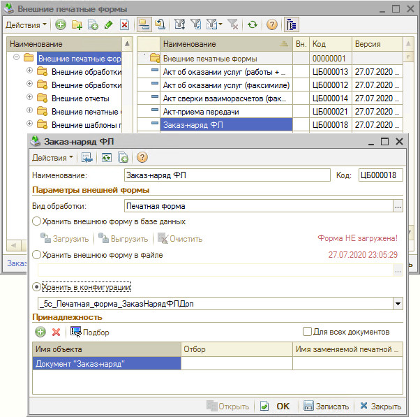
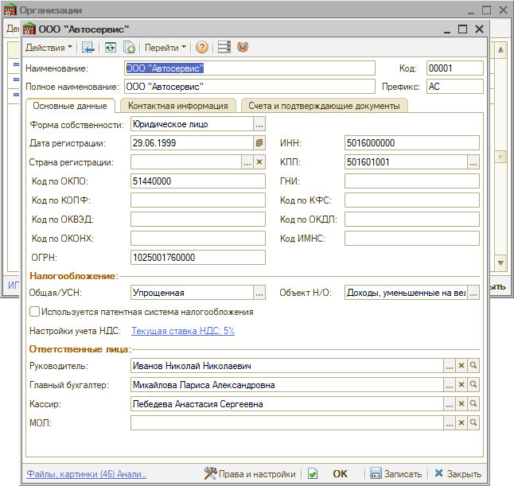
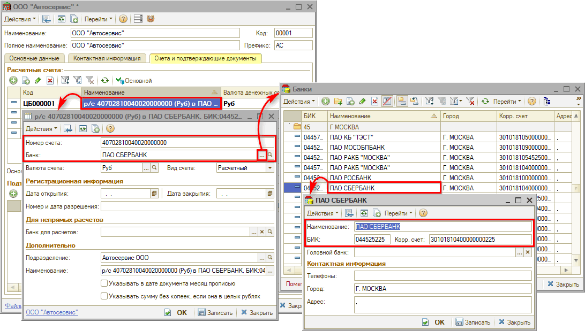
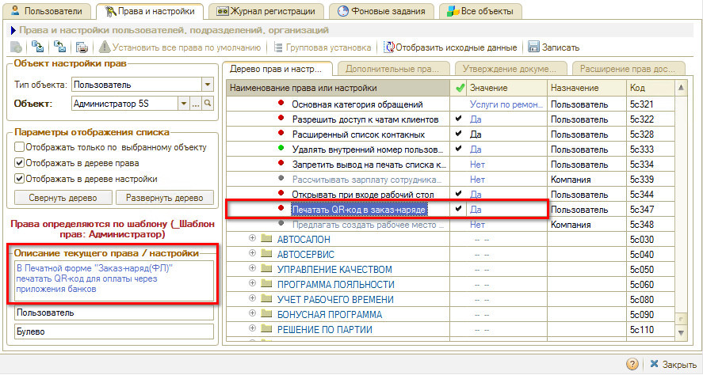

# Печать QR-кода для оплаты

<table><tr><td><b>Время чтения:</b> 9 мин.</td><td><b>Обновлено:</b> 25.04.2025</td></tr></table>

Источник: https://www.5systems.ru/help/pechat-qr-koda-dlya-oplaty

## Содержание

1. [Введение](#введение)
2. [Оплата с помощью QR-кода](#оплата-с-помощью-qr-кода)
   - [Печать QR-кода в заказ-наряде](#печать-qr-кода-в-заказ-наряде)
   - [Оплата по QR-коду через приложение банка](#оплата-по-qr-коду-через-приложение-банка)
   - [Контроль поступления оплаты](#контроль-поступления-оплаты)
3. [Настройки](#настройки)
   - [Настройка печатной формы](#настройка-печатной-формы)
   - [Настройка прав](#настройка-прав)

## Введение

**QR-код** (англ. Quick Response code – код быстрого реагирования; сокр. *QR code*) – тип матричных штрихкодов (или двумерных штрихкодов). Штрихкод – считываемая машиной оптическая метка, содержащая информацию об объекте, к которому она привязана.

QR-код состоит из чёрных квадратов, расположенных в квадратной сетке на белом фоне, которые могут считываться с помощью устройств обработки изображений, таких как камера.

В программе 5S AUTO реализована оплата заказ-наряда с помощью QR-кода. Функционал предусмотрен только для физических лиц.

## Оплата с помощью QR-кода

### Печать QR-кода в заказ-наряде

QR-код печатается в форме Заказ-наряда "Заказ-наряд ФЛ (внешняя)":

Открывается печатная форма заказ-наряда с QR-кодом для оплаты:

### Оплата по QR-коду через приложение банка

Если зайти в приложение банка (например, Сбербанк-онлайн) и отсканировать QR-код, то сразу выйдет предложение заплатить автосервису указанную сумму:

 &nbsp;&nbsp;&nbsp;&nbsp;&nbsp;&nbsp; 

Автоматически заполняются все параметры, остается только нажать кнопку "Продолжить" и два раза "Подтвердить".

### Контроль поступления оплаты

На данный момент контролировать поступление через программу не получится. Однако в данном направлении ведется работа.

## Настройки

### Настройка печатной формы

Для старых релизов 5S AUTO – внешняя обработка, которые могут предоставить специалисты техподдержки по запросу.

Для нового релиза – обработка встроена в конфигурацию:

В конфигурации добавлена общим макетом специальная компонента, которая работает с QR-кодами: она специальным образом кодирует его, чтобы понимали банки.

Для корректной работы функционала обязательно должны быть заполнены реквизиты организации (иначе QR-код не выведется): Дата регистрации, ИНН, ОГРН, КПП.

На вкладке "Счета и подтверждающие документы" обязательно должны быть заполнены расчетный счет и платежные реквизиты банка:

### Настройка прав

В новой конфигурации: если есть право «Печатать QR-код в заказ-наряде», то заказ-наряд будет выводиться на печать с QR-кодом. Если права нет, то по умолчанию печатается обычный штрих-код, который помогает искать документы в базе 1С.

Также см. статью "[Отражение оплаты через СБП](../../../Касса/Отражение%20оплаты%20через%20СБП/otrazhenie-oplaty-cherez-sbp.md)".

---

**Теги:** прием оплаты, платежные системы, qr-код, заказ-наряд, печатная форма

