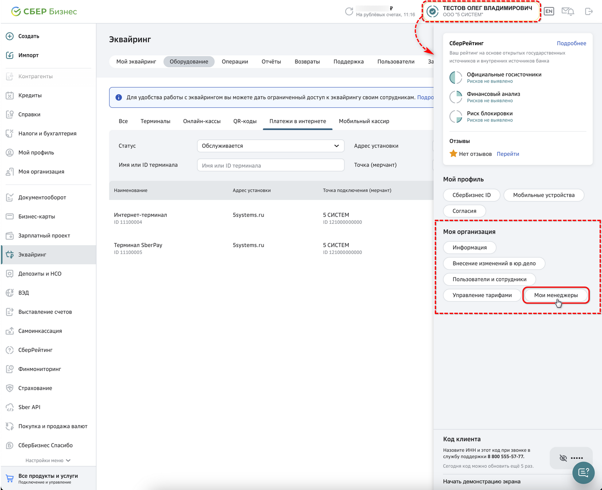
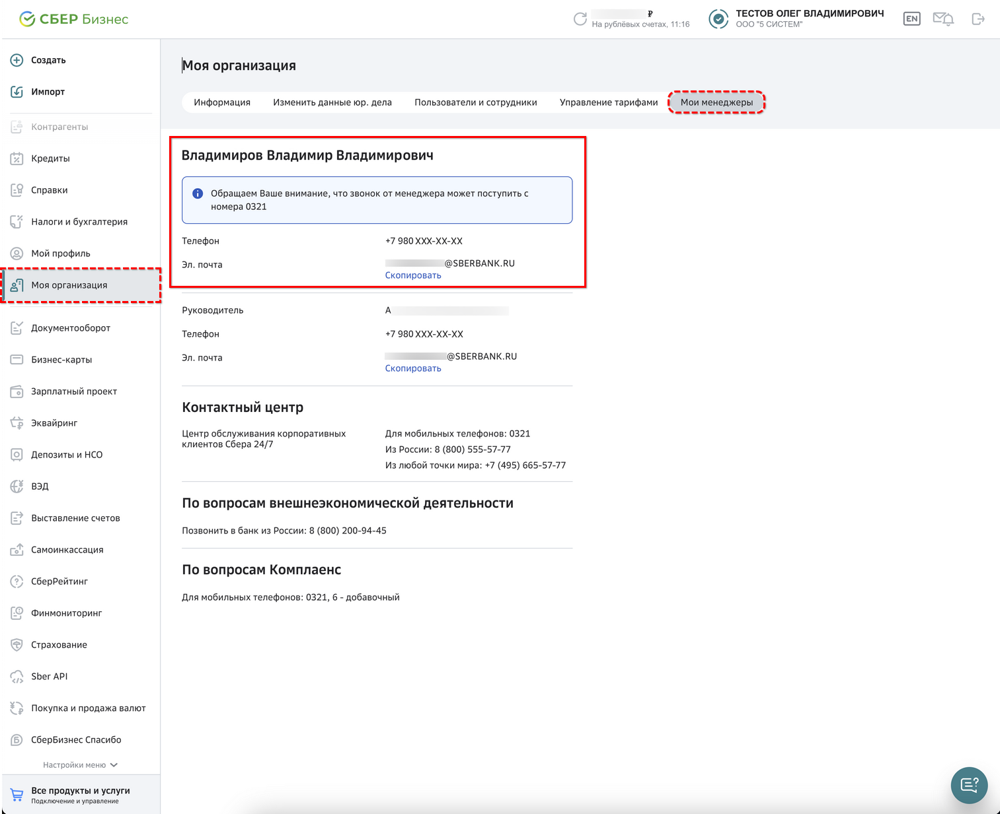
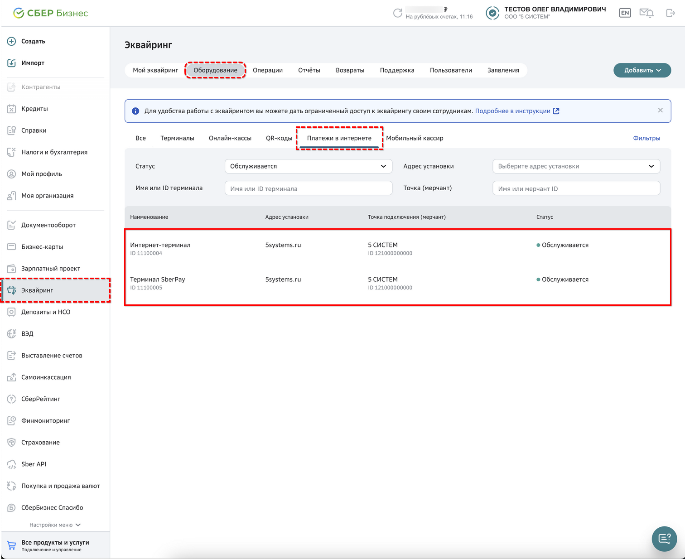
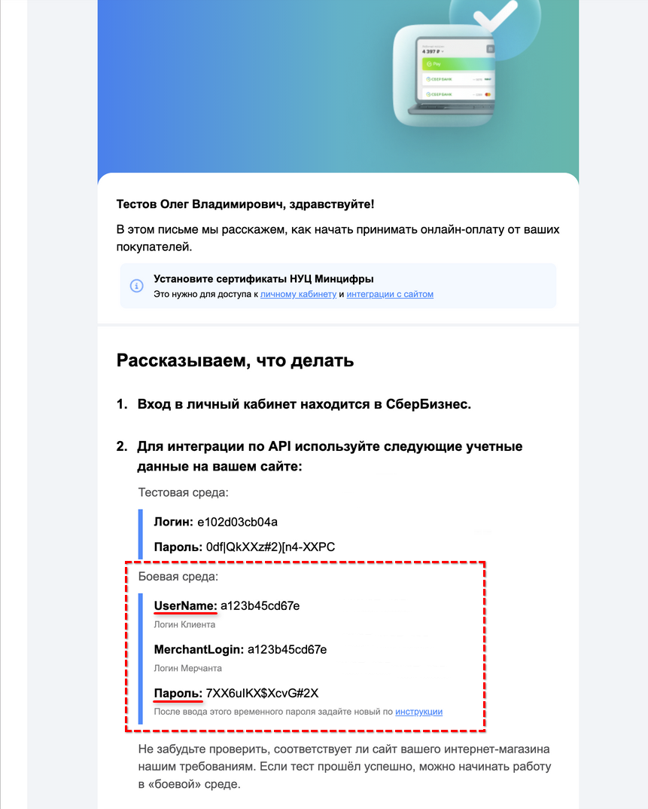
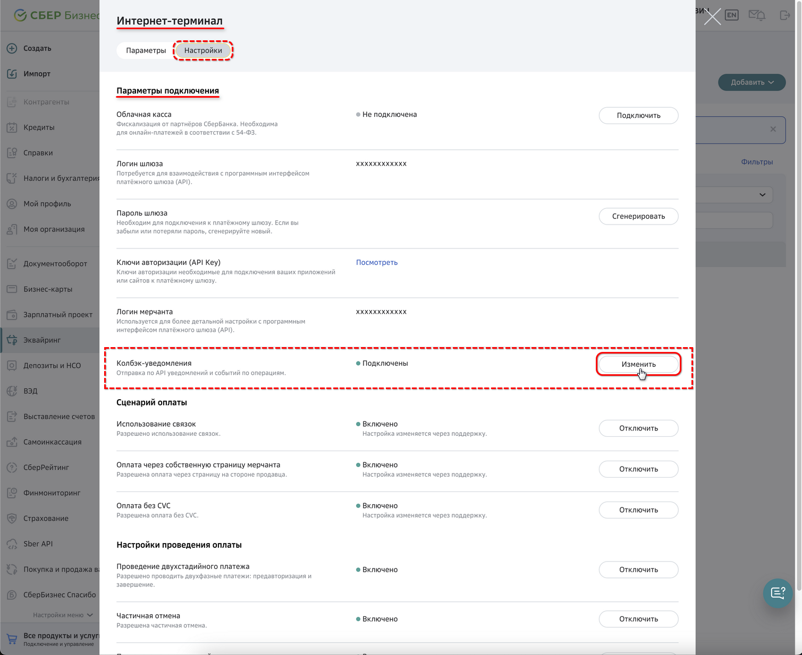
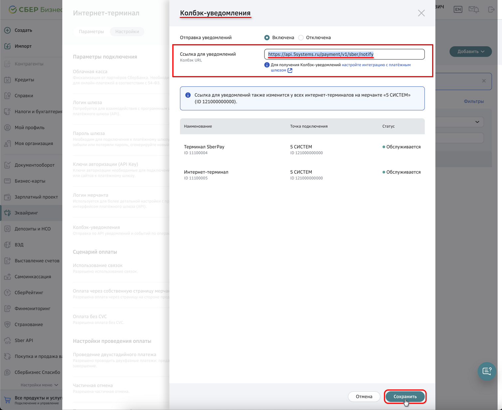
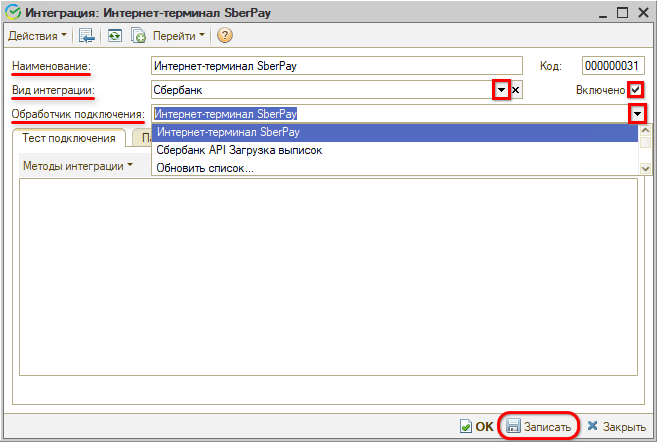
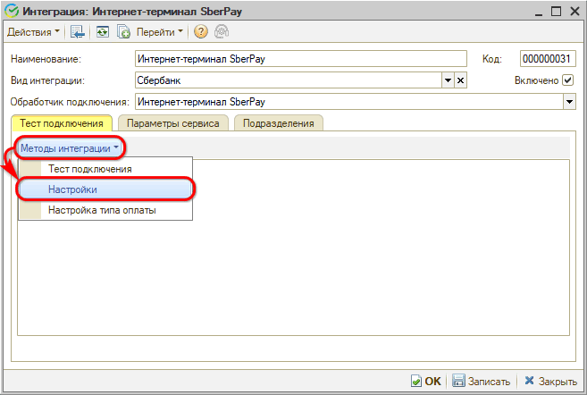
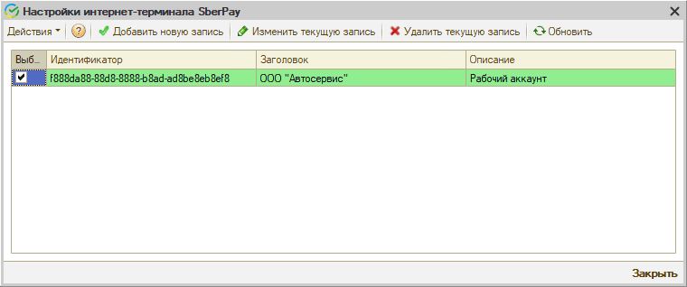
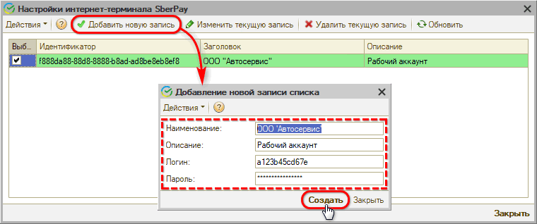

<a id="top"></a>

# Подключение SberPay QR

<table><tr><td><b>Время чтения:</b> 11 мин.</td><td><b>Обновлено:</b> 07.05.2026</td></tr></table>

<sub>Источник: https://www.5systems.ru/help/podklyuchenie-sberpay-qr</sub>

> *Функционал доступен начиная с релиза 2.7.2, обновление настроек – с релиза 2.8.2.*

## Содержание

1. [Введение](#введение)
2. [Настройка на стороне банка](#настройка-на-стороне-банка)
   - [Шаг 1. Подключение терминалов](#шаг-1-подключение-терминалов)
   - [Шаг 2. Сбор параметров для дальнейшей настройки](#шаг-2-сбор-параметров-для-дальнейшей-настройки)
   - [Шаг 3. Подключение уведомлений](#шаг-3-подключение-уведомлений)
3. [Настройка интеграции в программе](#настройка-интеграции-в-программе)
   - [1. Добавление интеграции](#1-добавление-интеграции)
   - [2. Общие настройки](#2-общие-настройки)
   - [3. Дополнительные настройки](#3-дополнительные-настройки)
      - [1) Переход к форме настроек](#1-переход-к-форме-настроек)
      - [2) Добавление новой записи](#2-добавление-новой-записи)
      - [3) Настройка типа оплаты](#3-настройка-типа-оплаты)
      - [4) Настройка уведомлений о смене статусов](#4-настройка-уведомлений-о-смене-статусов)

## Введение

В текущей статье представлено описание подключения и настройки интеграции для работы с API СБП Сбербанка.

Описание сервиса СБП, процесса приема оплаты в программе и предварительных настроек см. в статье [Работа с СБП](../Работа%20с%20СБП/rabota-s-sbp.md).

## Настройка на стороне банка

Требуется пройти несколько шагов:

### Шаг 1. Подключение терминалов

Первым делом необходимо обратиться к менеджеру Сбербанка, закрепленному за вашей компанией, для подключения интернет-терминала SberPay.

Для поиска своего менеджера следует в *Личном кабинете “СберБизнес”* кликнуть на наименование компании в верхнем правом углу страницы и на открывшейся панели в блоке “Моя организация” нажать кнопку *“Мои менеджеры”:*



Либо можно перейти в раздел *“Моя организация” → вкладка “Мои менеджеры”.*

Открывается страница "Мои менеджеры", где указаны контактные данные менеджеров, закрепленных за вашей организацией:



По указанным контактным данным следует связаться с менеджером, например, *написать запрос на электронную почту.* В качестве дополнительной информации рекомендуется сообщить, что вам требуется интеграция со шлюзом [https://ecomtest.sberbank.ru/doc#tag/basicServices/operation/register](https://ecomtest.sberbank.ru/doc#tag/basicServices/operation/register).

Все дальнейшие настройки для подключения приема оплаты через API Сбербанка производятся в *Личном кабинете “СберБизнес”.*

Менеджер подключает следующее оборудование: *“Интернет-терминал”* и *“Терминал SberPay”.* Эти два терминала обязательно должны будут появиться в разделе *“Эквайринг → Оборудование → вкладка “Платежи в интернете”:*



### Шаг 2. Сбор параметров для дальнейшей настройки

На почту владельца аккаунта СберБизнес должно прийти автоматическое письмо с параметрами для подключения API:



Требуется сохранить учетные данные, указанные в данном письме в блоке *“Боевая среда”:*

- *UserName (Логин Клиента);*
- *Пароль.*

Эти данные будут нужны для настройки интеграции в программе (см. *[ниже](#2-добавление-новой-записи)).*

### Шаг 3. Подключение уведомлений

Для подключения *уведомлений о поступлении платежей* необходимо перейти в настройки *Интернет-терминала* на вкладку *“Настройки”.* В блоке *“Параметры подключения”* в поле *“Колбэк-уведомления”* нажать кнопку *“Изменить”:*



В открывшемся разделе *“Колбэк-уведомления”* необходимо прописать следующую ссылку для уведомлений:

<table><tr><td>

```
https://api.5systems.ru/payment/v1/sber/notify
```

</td></tr></table>

и сохранить изменения:



После завершения настроек на стороне банка необходимо перейти к настройке интеграции в программе.

## Настройка интеграции в программе

### 1. Добавление интеграции

Описание общих настроек для платежных систем всех банков см. в статье “[Работа с СБП](../Работа%20с%20СБП/rabota-s-sbp.md#добавление-интеграции)”.

Для Сбербанка при добавлении новой интеграции следует ввести следующие реквизиты:



- *Наименование* – “Интернет-терминал SberPay” (заполняется автоматически при выборе обработчика);
- *Вид интеграции* – “Сбербанк”;
- *Обработчик подключения* – “Интернет-терминал SberPay”.

### 2. Общие настройки

Затем необходимо перейти на вкладку *“Параметры сервиса”* и заполнить *общие параметры* согласно инструкции в статье “[Работа с СБП](../Работа%20с%20СБП/rabota-s-sbp.md#param_serv)”.

### 3. Дополнительные настройки

#### 1) Переход к форме настроек

Далее необходимо перейти на вкладку *“Тест подключения”* в меню *“Методы интеграции → Настройки”:*



Данная форма настроек предназначена для добавления и редактирования информации в списке интеграций "Интернет-терминал SberPay":



**Столбцы таблицы:**

- *Идентификатор* – идентификатор интеграции с “Интернет-терминалом SberPay”;
- *Заголовок* – название организации;
- *Описание* – описание аккаунта.

#### 2) Добавление новой записи

Для добавления новой записи настроек следует нажать кнопку *“Добавить новую запись”,* заполнить параметры и нажать кнопку *“Создать”:*



Параметры *Логин* и *Пароль* следует получить при настройке сервиса на стороне банка – см. *[выше](#шаг-2-сбор-параметров-для-дальнейшей-настройки).*

Также есть возможность:

- *Изменить текущую запись* – изменить регистрационные данные при необходимости;
- *Удалить выбранную запись*.

Для осуществления указанных действий следует выделить галочкой выбранную запись и нажать соответствующую кнопку на верхней панели формы.

#### 3) Настройка типа оплаты

Далее следует настроить *тип оплаты* для пробития чеков в программе – см. в статье “[Работа с СБП](../Работа%20с%20СБП/rabota-s-sbp.md#настройка-типа-оплаты)”. Для Сбербанка должен быть настроен тип оплаты “СБП Сбербанк”.

Затем необходимо для созданного типа оплаты настроить *вид платежа для кассы* в настройке оборудования в параметре "Наименования видов платежей": см. в статье "[Отражение оплаты через СБП](../../../Касса/Отражение%20оплаты%20через%20СБП/otrazhenie-oplaty-cherez-sbp.md#2-настройка-подключения-касс)".

После настройки типа оплаты следует сделать *тест подключения* – см. в статье “[Работа с СБП](../Работа%20с%20СБП/rabota-s-sbp.md#тест-подключения)”.

#### 4) Настройка уведомлений о смене статусов

Необходимо активировать и настроить *уведомления* о смене статусов платежей – см. в статье “[Работа с СБП](../Работа%20с%20СБП/rabota-s-sbp.md#настройка-уведомлений-о-смене-статусов)”.

---

**Теги:** платежные системы, sberpay qr, сбербанк, сбп, подключение

<a href="#top"></a>
