# Подключение СБП T-Банка

<table><tr><td><b>Время чтения:</b> 11 мин.</td><td><b>Обновлено:</b> 19.05.2026</td></tr></table>

Источник: https://www.5systems.ru/help/podklyuchenie-sbp-t-banka

> *Актуально начиная с версии релиза 5S AUTO **2.7.2**.*

## Содержание

1. [Введение](#введение)
2. [Настройка на стороне банка](#настройка-на-стороне-банка)
3. [Настройка интеграции в программе](#настройка-интеграции-в-программе)
   - [1. Добавление интеграции](#1-добавление-интеграции)
   - [2. Общие настройки](#2-общие-настройки)
   - [3. Дополнительные настройки](#3-дополнительные-настройки)
      - [1) Переход к форме настроек](#1-переход-к-форме-настроек)
      - [2) Добавление новой записи](#2-добавление-новой-записи)
      - [3) Настройка типа оплаты](#3-настройка-типа-оплаты)
      - [4) Настройка уведомлений о смене статусов](#4-настройка-уведомлений-о-смене-статусов)

## Введение

В текущей статье представлено описание подключения и настройки интеграции для работы с *API СБП Т-Банка (Tinkoff).*

Описание *сервиса СБП,* процесса приема оплаты в программе и предварительных настроек см. в статье [Работа с СБП](../Работа%20с%20СБП/rabota-s-sbp.md).

## Настройка на стороне банка

Подробную инструкцию см. в документации на сайте банка: [https://www.tinkoff.ru/kassa/dev/payments/index.html#tag/Oplata-cherez-SBP/Podklyuchenie-SBP](https://www.tinkoff.ru/kassa/dev/payments/index.html#tag/Oplata-cherez-SBP/Podklyuchenie-SBP).

Для подключения необходимо подать заявку на подключение интернет-эквайринга и заполнить данные об организации и магазине: [https://www.tinkoff.ru/kassa/](https://www.tinkoff.ru/kassa/).

В личном кабинете в разделе *“Интернет-эквайринг → Магазины”* перейдите в карточку магазина:

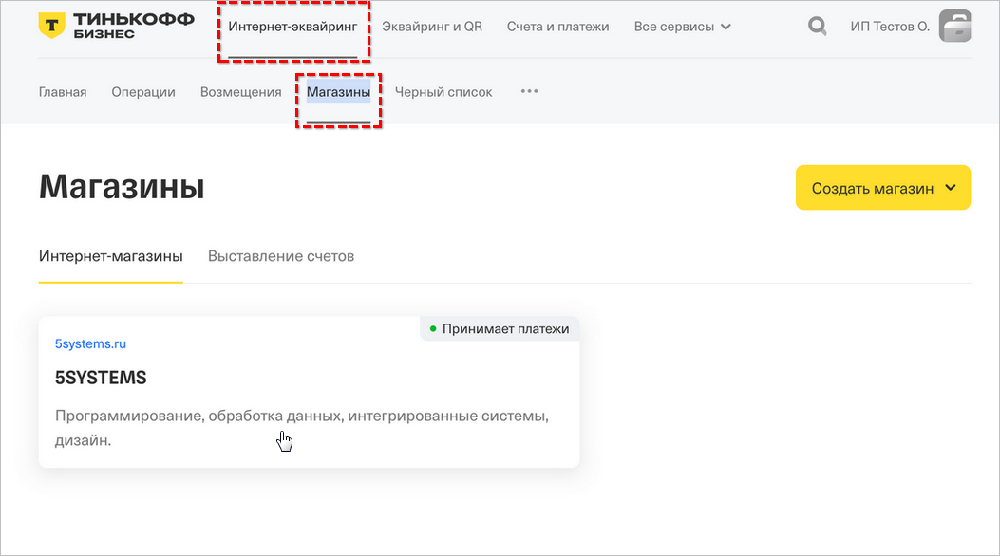

В карточке магазина на вкладке “Способы оплаты” перейдите в карточку “Система быстрых платежей”:

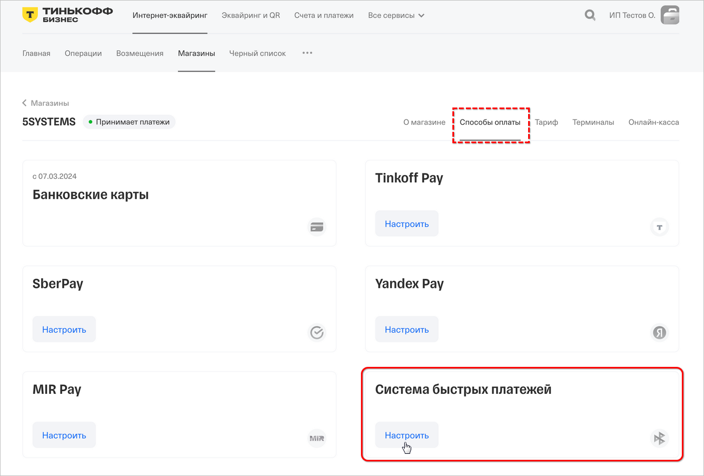

Включите *оплату с помощью системы быстрых платежей* на вкладках “Приложение” и “Своя платежная форма”:

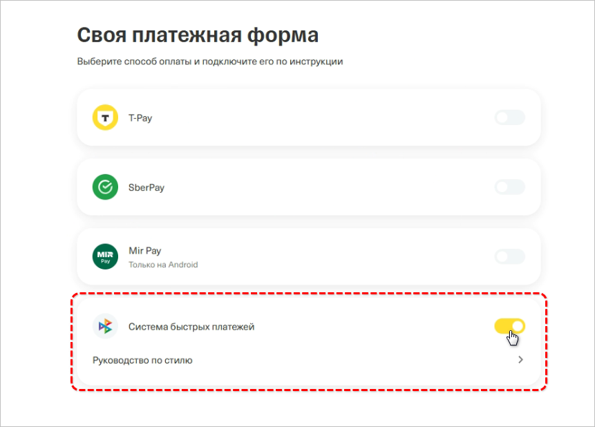

После этого следуйте инструкции, размещенной в данном разделе сайта.

После подключения данные вкладки будут отображаться следующим образом:

1) "Своя платежная форма":

   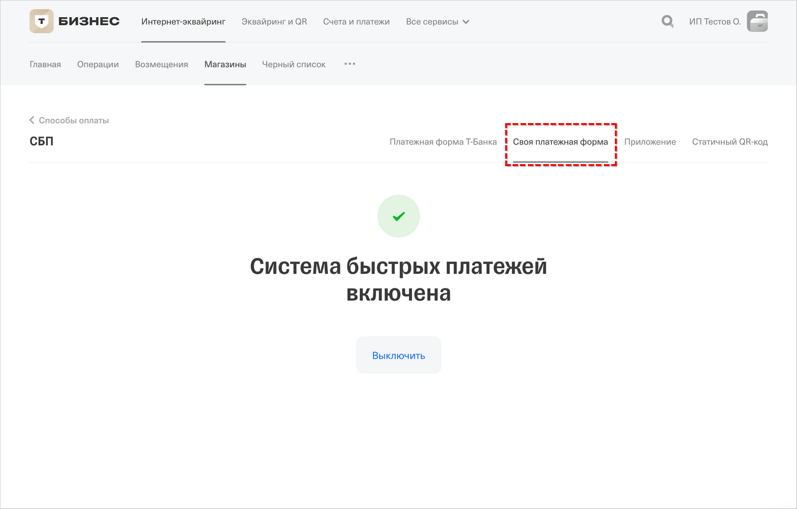

2) Вкладка "Приложение":

   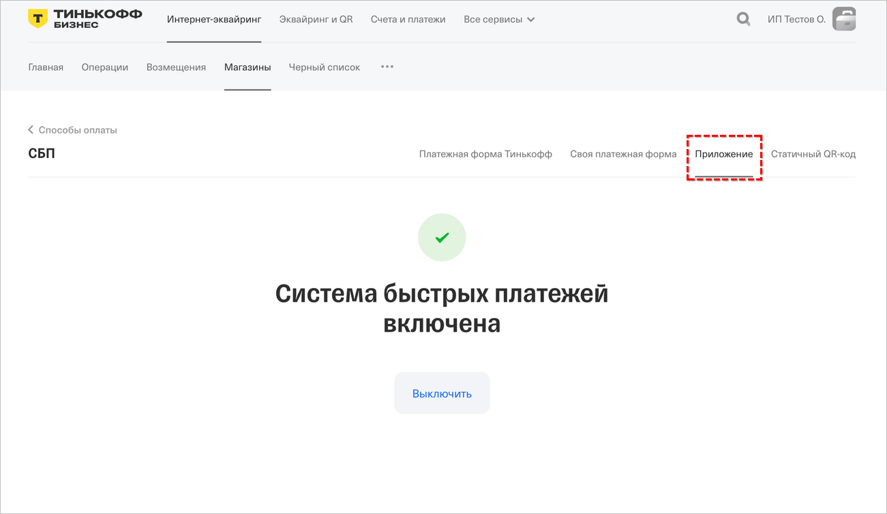

***После этого становится доступна интеграция по API.***

Далее следует в карточке магазина перейти на вкладку “Терминалы”:

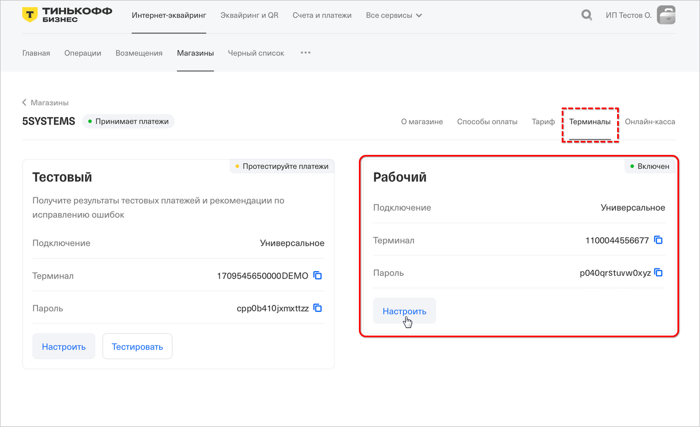

> [!CAUTION]
> ***Внимание!*** Первоначально будет доступен только тестовый терминал, но следует *пропустить данный этап* и перейти сразу к *подключению рабочего терминала* – активировать рабочий терминал нужно с помощью персонального менеджера банка.

Для [дальнейшей настройки](#3-дополнительные-настройки) подключения в программе следует сохранить значения следующих параметров:

- **Терминал** – значение параметра *TerminalKey* в настройках интеграции в программе;
- **Пароль** – значение параметра *TerminalSecret* в настройках интеграции в программе.

Нажатием кнопки “Настроить” в карточке рабочего терминала производится переход к настройкам терминала. Для подключения уведомлений от банка об оплате следует выбрать вариант уведомлений “По протоколу HTTP”, ввести адрес точки входа для приема уведомлений об оплате *“https://api.5systems.ru/payment/v1/tinkoff/notify”* и сохранить:

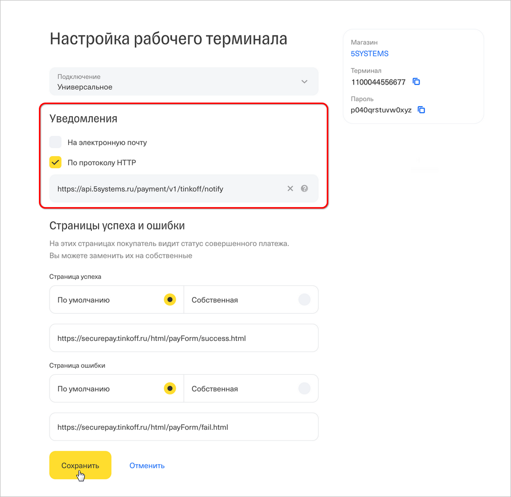

## Настройка интеграции в программе

### 1. Добавление интеграции

Описание общих настроек для платежных систем всех банков см. в статье “[Работа с СБП](../Работа%20с%20СБП/rabota-s-sbp.md#добавление-интеграции)”.

Для СБП *Т-Банка* при добавлении новой интеграции следует ввести следующие реквизиты:

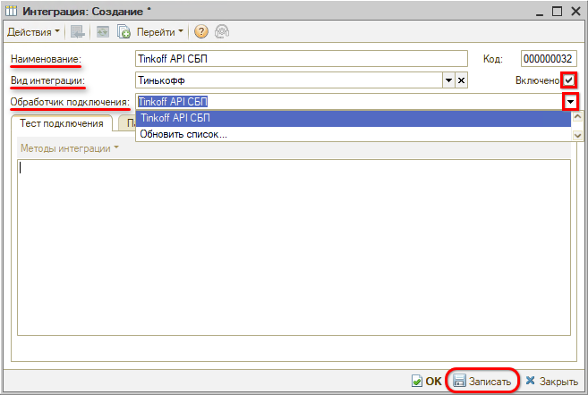

- *Наименование* – “Т-Банк API СБП”;
- *Вид интеграции* – “Т банк”;
- *Обработчик подключения* – “T-банк API СБП”.

### 2. Общие настройки

Затем необходимо перейти на вкладку *“Параметры сервиса”* и заполнить *общие параметры* согласно инструкции в статье “[Работа с СБП](../Работа%20с%20СБП/rabota-s-sbp.md#param_serv)”.

### 3. Дополнительные настройки

#### 1) Переход к форме настроек

Далее необходимо перейти на вкладку “Тест подключения” в меню *“Методы интеграции → Настройки”:*

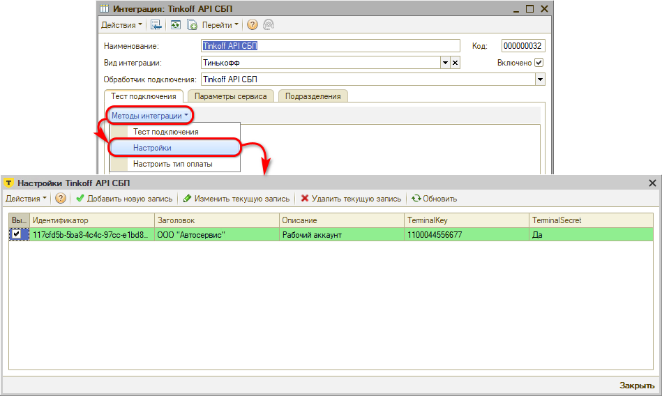

Данная форма настроек предназначена для добавления и редактирования информации в списке интеграций "T-Банк API СБП":

*Столбцы таблицы:*

- *Идентификатор* – идентификатор интеграции с “T-Банк API СБП”;
- *Заголовок* – название организации;
- *Описание* – описание аккаунта;
- *TerminalKey* – ID терминала из настроек подключения в ЛК банка (см. *[выше](#parametry_term)).*
- *TerminalSecret* – пароль терминала из настроек в ЛК банка (см. *[выше](#parametry_term)).*

#### 2) Добавление новой записи

Для *добавления новой записи настроек* следует нажать кнопку “*Добавить новую запись”,* заполнить параметры и нажать кнопку “Создать”:

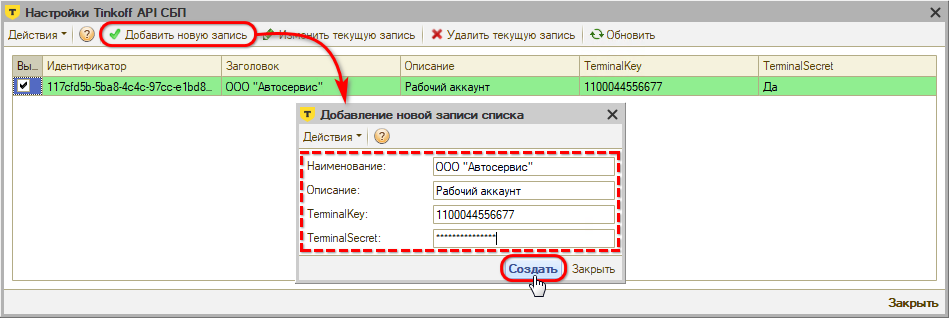

Параметры *TerminalKey* и *TerminalSecret* следует получить при настройке сервиса на стороне банка – см. *[выше](#parametry_term).*

Также есть возможность:

- *Изменить текущую запись* – изменить регистрационные данные при необходимости;
- *Удалить выбранную запись.*

Для осуществления указанных действий следует выделить галочкой выбранную запись и нажать соответствующую кнопку на верхней панели формы.

#### 3) Настройка типа оплаты

Далее следует настроить *тип оплаты* для пробития чеков в программе – см. в статье “[Работа с СБП](../Работа%20с%20СБП/rabota-s-sbp.md#настройка-типа-оплаты)”. Для T-Банка должен быть настроен тип оплаты *“СБП Т-Банк”:*

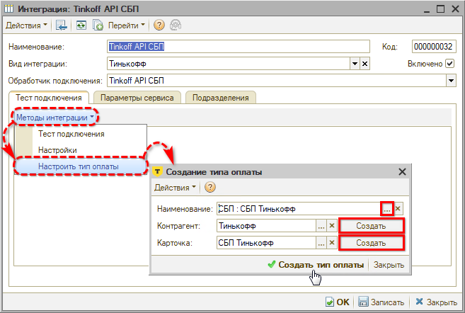

Затем необходимо для созданного типа оплаты настроить *вид платежа для кассы* в настройке оборудования в параметре "Наименования видов платежей": см. описание в статье "[Отражение оплаты через СБП](../../../Касса/Отражение%20оплаты%20через%20СБП/otrazhenie-oplaty-cherez-sbp.md#2-настройка-подключения-касс)".

После настройки типа оплаты следует сделать *тест подключения* – см. в статье “[Работа с СБП](../Работа%20с%20СБП/rabota-s-sbp.md#тест-подключения)”.

#### 4) Настройка уведомлений о смене статусов

Также необходимо активировать и настроить *уведомления* о смене статусов платежей – см. в статье “[Работа с СБП](../Работа%20с%20СБП/rabota-s-sbp.md#настройка-уведомлений-о-смене-статусов)”.

---

**Теги:** платежные системы, сбп, т-банк, подключение, интеграция
