

# Подключение СБП Альфа-Банка

<table><tr><td><b>Время чтения:</b> 11 мин.</td><td><b>Обновлено:</b> 07.02.2025</td></tr></table>

Источник: https://www.5systems.ru/help/podklyuchenie-sbp-alfa-banka

> *Функционал доступен начиная с релиза 2.8.2.*

## Содержание

1. [Введение](#введение)
2. [Настройка на стороне банка](#настройка-на-стороне-банка)
   - [Шаг 1. Заключение договора](#шаг-1-заключение-договора)
   - [Шаг 2. Получение Client ID и тестового сертификата](#шаг-2-получение-client-id-и-тестового-сертификата)
   - [Шаг 3. Тестирование интеграции](#шаг-3-тестирование-интеграции)
   - [Шаг 4. Получение доступа к пром-версии Alfa API](#шаг-4-получение-доступа-к-пром-версии-alfa-api)
   - [Шаг 5. Формирование запроса на сертификат](#шаг-5-формирование-запроса-на-сертификат)
   - [Шаг 6. Отправка запроса на сертификат](#шаг-6-отправка-запроса-на-сертификат)
   - [Шаг 7. Ожидание ответа на запрос](#шаг-7-ожидание-ответа-на-запрос)
   - [Шаг 8. Сборка контейнера pfx](#шаг-8-сборка-контейнера-pfx)
3. [Настройка интеграции в программе](#настройка-интеграции-в-программе)
   - [1. Добавление интеграции](#1-добавление-интеграции)
   - [2. Общие настройки](#2-общие-настройки)
   - [3. Дополнительные настройки](#3-дополнительные-настройки)
      - [1) Переход к форме настроек](#1-переход-к-форме-настроек)
      - [2) Добавление новой записи](#2-добавление-новой-записи)
      - [3) Загрузка сертификатов](#3-загрузка-сертификатов)
      - [4) Настройка типа оплаты](#4-настройка-типа-оплаты)
      - [5) Настройка уведомлений о смене статусов](#5-настройка-уведомлений-о-смене-статусов)

## Введение

В текущей статье представлено описание подключения и настройки интеграции для работы с *API СБП Альфа-Банка.*

Описание процесса приема оплаты через СБП в программе и предварительных настроек приведено в статье [Работа с СБП](../Работа%20с%20СБП/rabota-s-sbp.md).

## Настройка на стороне банка

Предварительно необходимо быть клиентом Альфа-Банка, оформить расчетно-кассовое обслуживание и подключить [Альфа-Бизнес Онлайн](https://alfabank.ru/sme/).

См. подробную [инструкцию о подключении Alfa API](https://developers.alfabank.ru/products/alfa-api/documentation/articles/connection/articles/instruction/instruction?navFilter=all) на сайте банка.

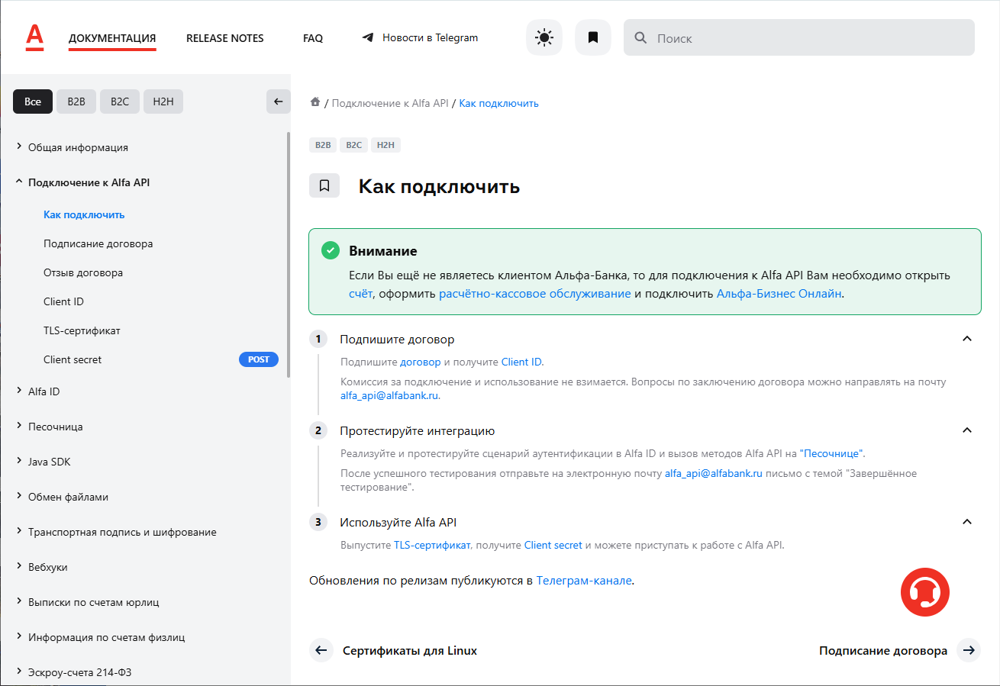

Инструкция требует наличия технических навыков, поэтому приводим описание основных шагов и нюансов, на которые стоит обратить внимание:

### Шаг 1. Заключение договора

Сперва необходимо подписать с банком ***Договор** **о присоединении к Alfa API**.*

#### Способ 1. Через ЛК

Подробную инструкцию о подписании договора, а также видеоинструкцию смотрите на сайте Альфа-Банка: [Подписание договора](https://developers.alfabank.ru/products/alfa-api/documentation/articles/connection/articles/onboarding/onboarding).

Для подписания договора необходимо выполнить следующие шаги:

1. Войти в ЛК "Альфа-Бизнес".
2. Перейти на страницу "Все сервисы и продукты" и выберите "Alfa API" в разделе "Обслуживание бизнеса".
3. На открывшемся лендинге нажать на кнопку "Подключить Alfa API".
4. Подписать договор, следуя инструкции.

#### Способ 2. Через email

В случае если не получается подписать договор указанным в видеоинструкции способом, необходимо:

1. Отправить запрос на подключение Alfa API на почту Альфа-Банка: [alfa_api@alfabank.ru](mailto:alfa_api@alfabank.ru).

   Пример заявки на подключение: 
   *“Прошу подключить Alfa API для ООО "Ромашка" ИНН 123456789.* 
   *Требуемые scopes: c2b-sbp”.*

2. Из ответного письма следует *скачать шаблон договора.* Также актуальные бланки можно скачать на [сайте](https://alfabank.ru/corporate/payservice/sbp/) в разделе “Документы и тарифы”.
3. Заполнить шаблон договора данными компании.
4. В ЛК Альфа-Бизнес нажать на значок с конвертом, затем кнопку “Создать письмо”:

   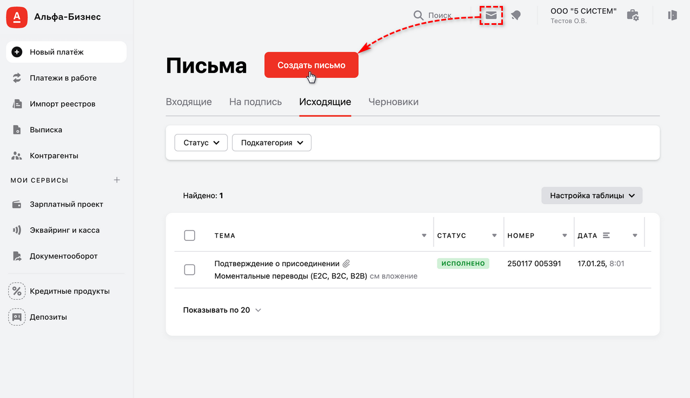

5. На форме создания нового письма заполнить следующие поля:
   - *Категория* – “Прочее”;
   - *Подкатегория* – “Моментальные переводы (E2C, B2C, B2B)”;
   - *Отделение банка* – заполняется автоматически;
   - *Тема* – “Соглашение о присоединении к Alfa API”;
   - *Прикрепить файл* – прикрепление во вложение к письму ранее заполненного файла договора о присоединении в формате “.docx”

   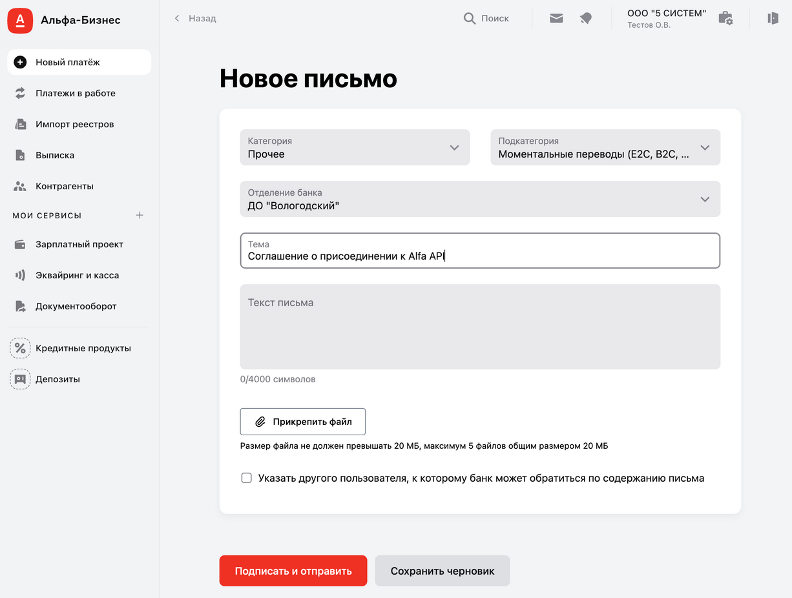

6. Нажать кнопку *“Подписать и отправить”.*
7. Уведомить специалистов банка по email об отправке договора.

### Шаг 2. Получение Client ID и тестового сертификата

После успешного подписания договора Вам на почту будет отправлено письмо с учетными данными ([client_id](https://developers.alfabank.ru/products/alfa-api/documentation/articles/connection/articles/clientid/clientid?navFilter=all), список разрешений (scope), тестовый сертификат) для доступа к "Песочнице".

### Шаг 3. Тестирование интеграции

Альфа-Банк выдает доступ к пром-версии API *только* после успешного *тестирования* всех запросов на Песочнице. Тестирование необходимо выполнить либо самостоятельно, либо привлечь специалистов компании 5SYSTEMS, т.к. для выполнения запросов требуется наличие технических навыков по работе с API.

Для самостоятельного тестирования см [документацию](https://developers.alfabank.ru/products/alfa-api/documentation/articles/sbp/articles/sbp-c2b/articles/cash-qrc-registration/v1/cash-qrc-registration?navFilter=b2c), а также коллекцию запросов postman:

- [файл](attachments/alfabank-sandbox-public-postman-collection.zip) (требуется распаковать);
- [публикация](https://s.5systems.ru/JjcQWHmK).

После завершения тестирования необходимо в продолжение переписки по заявке *сообщить* специалистам банка *о завершении тестирования.*

### Шаг 4. Получение доступа к пром-версии Alfa API

В ответ на сообщение о завершении тестирования Альфа-Банк присылает *доступ в пром-версию* с новым *Client ID.*

### Шаг 5. Формирование запроса на сертификат

Взаимодействие между компанией и банком реализовано с использованием двухстороннего TLS-соединения, для которого необходимо выпустить сертификат. Сертификат будет использоваться для формирования ссылки для платежей через СБП.

Действия по формированию запроса на сертификат также требуют особых технических навыков, и выполняются специалистами техподдержки 5SYSTEMS. Для технических специалистов, готовых сформировать запрос на сертификат самостоятельно, см.[ инструкцию на сайте банка](https://developers.alfabank.ru/products/alfa-api/documentation/articles/connection/articles/tls/tls).

На данном этапе сначала требуется сгенерировать закрытый ключ – его необходимо *хранить в секрете.* Далее на основе закрытого ключа необходимо сгенерировать *запрос на сертификат.*

Результатом действий на данном шаге будет сгенерированный файл – запрос на сертификат.

*Примечание:* Не потеряйте пароль, который был использован для генерации запроса - он потребуется на следующих шагах.

### Шаг 6. Отправка запроса на сертификат

Сформированный запрос на сертификат необходимо отправить специалистам банка на электронную почту [alfa_api@alfabank.ru](mailto:alfa_api@alfabank.ru).

Письмо должно быть направлено с электронной почты, указанной в Договоре. Файл запроса необходимо переименовать по названию организации на латинице.

*Примечание:* Сообщить о выполнении тестирования – см. [шаг 3](https://docs.google.com/document/d/1itQJhKYNRpy1TaT1W6zGpWmCxYKI0SyXjtuBMJWq_Ks/edit?tab=t.0#heading=h.6yte0txgsiv) – можно в этом же письме.

### Шаг 7. Ожидание ответа на запрос

Получите выпущенный сертификат, направленный специалистами Альфа-Банка с почтового адреса [alfa_api@alfabank.ru](mailto:alfa_api@alfabank.ru).

Срок действия сертификата – 375 дней. По истечении срока действия сертификата нужно выполнить его повторную генерацию.

### Шаг 8. Сборка контейнера pfx

Для дальнейшей работы необходимо собрать *pfx-контейнер.*

Сборка контейнера производится либо специалистами техподдержки 5SYSTEMS, либо техническими специалистами компании с помощью команды, указанной в [инструкции](https://developers.alfabank.ru/products/alfa-api/documentation/articles/connection/articles/tls/tls) банка.

Команда для сборки pfx-контейнера[\*](#snoska):

*openssl pkcs12 -password pass:PASSWORD -export -certpbe PBE-SHA1-3DES -keypbe PBE-SHA1-3DES -macalg sha1 -out certificate.p12 -inkey Company.key -in Company.cer -certfile apica_2022_chain.cer*

где:

- *PASSWORD* – ***пароль**,* который будет использоваться для сертификата;
- *certificate.p12* – имя и расширение ***сертификата**,* который будет создан и нужен для интеграции;
- *Company.key* – путь до файла ключа, который был создан перед отправкой запроса на сертификат Альфа-Банку;
- *Company.cer* – путь до файла сертификата, выданного специалистами Альфа-Банка в ответ на отправленный им запрос на сертификат;
- *apica_2022_chain.cer* – путь до второго файла сертификата, выданного специалистами банка в ответ на отправленный им запрос на сертификат.

*\*Примечание:* Тестировалось на версии OpenSSL 3.4.0

Созданные *сертификат* и *пароль* нужно будет указать в настройках интеграции с API Альфа-Банка в программе – см. *далее.*

## Настройка интеграции в программе

### 1. Добавление интеграции

Описание общих настроек для платежных систем всех банков см. в статье “[Работа с СБП](../Работа%20с%20СБП/rabota-s-sbp.md#добавление-интеграции)”.

Для Альфа-Банка при добавлении новой интеграции следует ввести следующие реквизиты:

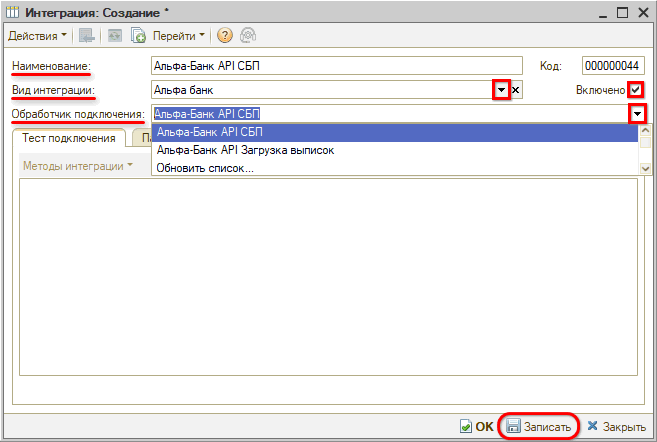

- *Наименование* – Альфа-Банк API СБП;
- *Вид интеграции* – Альфа-Банк;
- *Обработчик подключения* – Альфа-Банк API СБП.

### 2. Общие настройки

Затем необходимо перейти на вкладку “Параметры сервиса” и заполнить общие параметры согласно инструкции в статье “[Работа с СБП](../Работа%20с%20СБП/rabota-s-sbp.md#param_serv)”.

### 3. Дополнительные настройки

#### 1) Переход к форме настроек

Далее необходимо перейти на вкладку “Тест подключения” в меню *“Методы интеграции → Настройки”:*

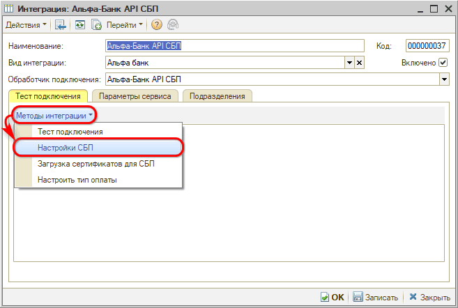

Данная форма настроек предназначена для добавления и редактирования информации в списке интеграций "Альфа-Банк API СБП":

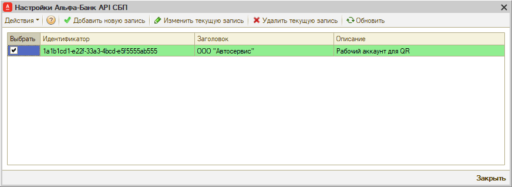

**Столбцы таблицы:**

- *Идентификатор* – идентификатор интеграции с “Альфа-Банк API СБП”;
- *Заголовок* – название организации;
- *Описание* – описание аккаунта.

#### 2) Добавление новой записи

Для добавления новой записи настроек следует нажать кнопку *“Добавить новую запись”,* заполнить параметры и нажать кнопку *“Создать”:*

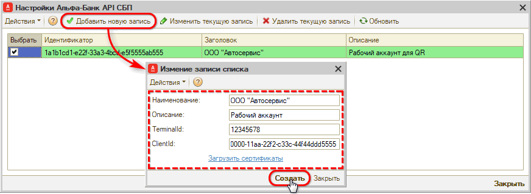

- *TerminalId* – идентификатор оборудования, который можно найти в ЛК в разделе “Оборудование”;
- *ClientId* – должен быть получен от менеджера банка на этапе настройки на стороне банка – см. *[выше](#шаг-4-получение-доступа-к-пром-версии-alfa-api).*

Также есть возможность:

- *Изменить текущую запись* – изменить регистрационные данные при необходимости;
- *Удалить выбранную запись.*

Для осуществления указанных действий следует выделить галочкой выбранную запись и нажать соответствующую кнопку на верхней панели формы.

#### 3) Загрузка сертификатов

Для интеграции с платежной системой Альфа-Банка необходимо загрузить файл ***сертификата*** с расширением *.p12* и указать ***пароль**,* полученные на последнем шаге настройки на стороне банка – см. *[выше](#шаг-8-сборка-контейнера-pfx).* Для этого следует при создании новой настройки нажать ссылку *“Загрузить сертификаты”* либо перейти в настройках интеграции *“Методы интеграции → Загрузка сертификатов”:*

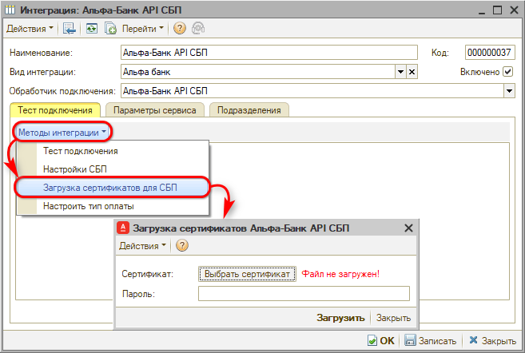

После выбора файла сертификата и ввода пароля следует нажать кнопку "Загрузить" – после этого должно появиться сообщение программы об успешной загрузке:

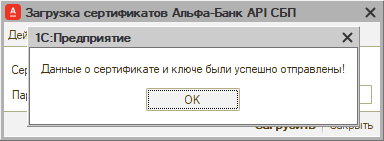

После загрузки сертификатов форма должна отображаться следующим образом:

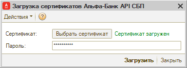

#### 4) Настройка типа оплаты

Далее следует настроить тип оплаты для пробития чеков в программе – см. в статье “[Работа с СБП](../Работа%20с%20СБП/rabota-s-sbp.md#настройка-типа-оплаты)”. Для Альфа-Банка должен быть настроен тип оплаты “СБП Альфа-Банк”:

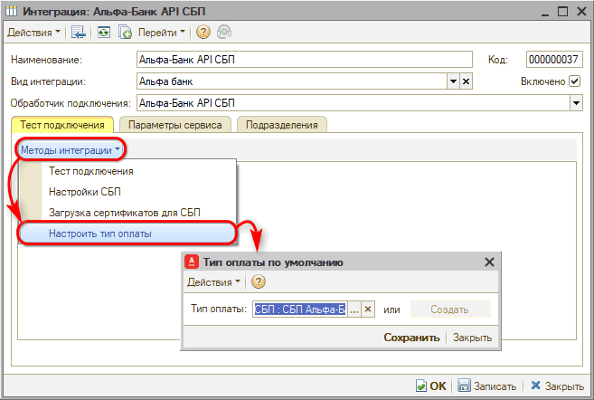

Затем необходимо для созданного типа оплаты настроить *вид платежа для кассы* в настройке оборудования в параметре "Наименования видов платежей": см. в статье "[Отражение оплаты через СБП](../../../Касса/Отражение%20оплаты%20через%20СБП/otrazhenie-oplaty-cherez-sbp.md#2-настройка-подключения-касс)".

После настройки типа оплаты следует сделать тест подключения – см. в статье “[Работа с СБП](../Работа%20с%20СБП/rabota-s-sbp.md#тест-подключения)”.

#### 5) Настройка уведомлений о смене статусов

Также необходимо активировать и настроить уведомления о смене статусов платежей – см. в статье “[Работа с СБП](../Работа%20с%20СБП/rabota-s-sbp.md#настройка-уведомлений-о-смене-статусов)”.

---

**Теги:** платежные системы, сбп, альфа-банк, подключение, интеграция

