# Подключение СБП Точка Банка

<table><tr><td><b>Время чтения:</b> 11 мин.</td><td><b>Создано:</b> 17.09.2026</td></tr></table>

> *Комментарий: черновик от 17.09.2026. Скриншоты банка обезличены 17.09.2026 прямо в папке статьи (в «Скрины для статей» лежат исходники без правок — при обновлении не затирать). Осталось на скринах: 04 — название и ИНН компании в списке под затемнением; 12 — настоящий Merchant ID в шапке под «Офис» и улица в адресе; на 01, 09, 10, 11, 12 — последние цифры счета **5606. Впереди обводка и стрелки (Катя). При пуше в master дополнить статью «Работа с СБП»: списки этапов настройки (Этап 1, Этап 3 п. 2) и сноску про реализованные банки.*

> *Актуально начиная с версии релиза 5S AUTO **2.8.5**.*

## Содержание

1. [Введение](#введение)
2. [Настройка на стороне банка](#настройка-на-стороне-банка)
   - [Шаг 1. Создание JWT-ключа](#шаг-1-создание-jwt-ключа)
   - [Шаг 2. Регистрация торговой точки в СБП](#шаг-2-регистрация-торговой-точки-в-сбп)
   - [Шаг 3. Сбор параметров для дальнейшей настройки](#шаг-3-сбор-параметров-для-дальнейшей-настройки)
3. [Настройка интеграции в программе](#настройка-интеграции-в-программе)
   - [1. Добавление интеграции](#1-добавление-интеграции)
   - [2. Общие настройки](#2-общие-настройки)
   - [3. Дополнительные настройки](#3-дополнительные-настройки)
      - [1) Переход к форме настроек](#1-переход-к-форме-настроек)
      - [2) Добавление новой записи](#2-добавление-новой-записи)
      - [3) Настройка типа оплаты](#3-настройка-типа-оплаты)
      - [4) Настройка уведомлений о смене статусов](#4-настройка-уведомлений-о-смене-статусов)

## Введение

В текущей статье представлено описание подключения и настройки интеграции для работы с *API СБП Точка Банка.*

Описание *сервиса СБП,* процесса приема оплаты в программе и предварительных настроек см. в статье [Работа с СБП](../Работа%20с%20СБП/rabota-s-sbp.md).

## Настройка на стороне банка

Все настройки на стороне банка выполняются в интернет-банке Точки: [https://i.tochka.com](https://i.tochka.com/). Подробную инструкцию см. в документации API на сайте банка: [https://developers.tochka.com/docs/tochka-api/](https://developers.tochka.com/docs/tochka-api/), раздел “[Авторизация по JWT-токену](https://developers.tochka.com/docs/tochka-api/algoritm-raboty-s-jwt-tokenom)”.

Интеграция с API Точка Банка работает по *JWT-ключу* – токену, который создается в интернет-банке и дает программе доступ к методам API. Для приема оплаты через СБП у организации также должна быть зарегистрирована в СБП *торговая точка.*

### Шаг 1. Создание JWT-ключа

В интернет-банке перейдите в раздел *“Сервисы” → “Интеграции и API”.* Этот же раздел доступен из меню компании в правом верхнем углу страницы – пункт *“Интеграции”:*

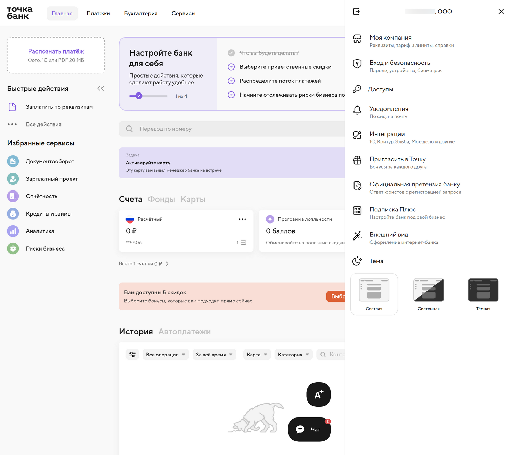

На странице *“Интеграции и API”* нажмите кнопку *“Создать JWT-ключ”:*

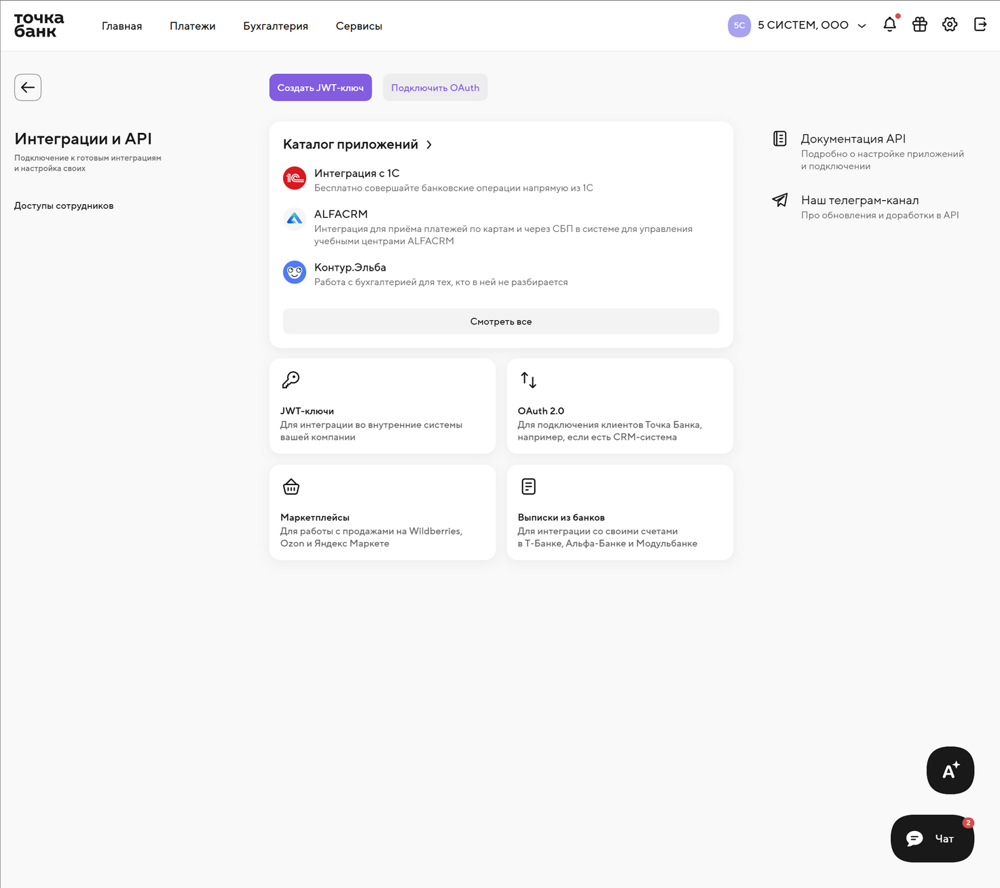

Укажите *название* ключа (например, “5S API”) и *срок доступа,* затем нажмите *“Продолжить”:*

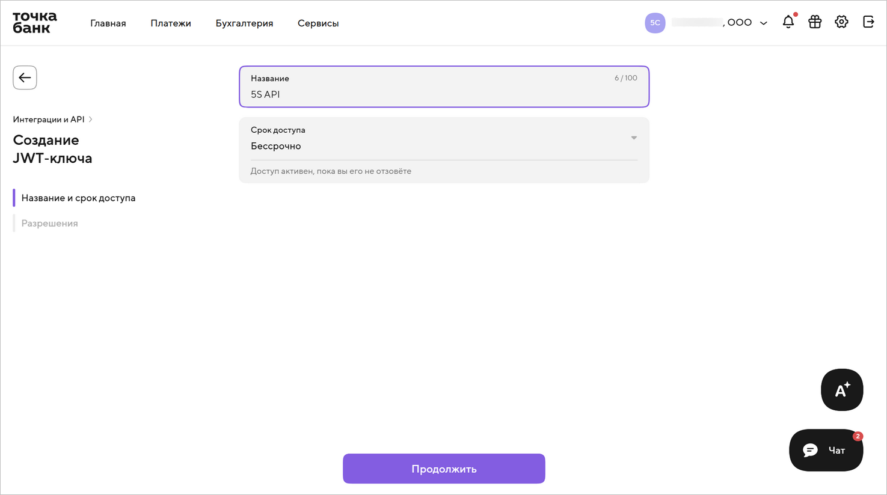

*Примечание:* При сроке доступа “Бессрочно” ключ действует, пока вы его не отзовете. Если задать ограниченный срок, ключ нужно будет перевыпустить до его истечения – при перевыпуске меняются и токен, и Client_ID, их придется обновить в настройках интеграции в программе (см. *[ниже](#2-добавление-новой-записи)).*

На шаге *“Разрешения”* выберите компанию – откроется панель *“Доступы компании”,* в которой отметьте следующие доступы: *“Подписание платежей”, “Просмотр реквизитов”, “Настройка оплаты через СБП”, “Просмотр остатка по счёту”, “Получение выписок”, “Создание платёжных ссылок”, “Создание и получение вебхуков”.* Затем нажмите *“Подтвердить”* и *“Создать ключ”:*

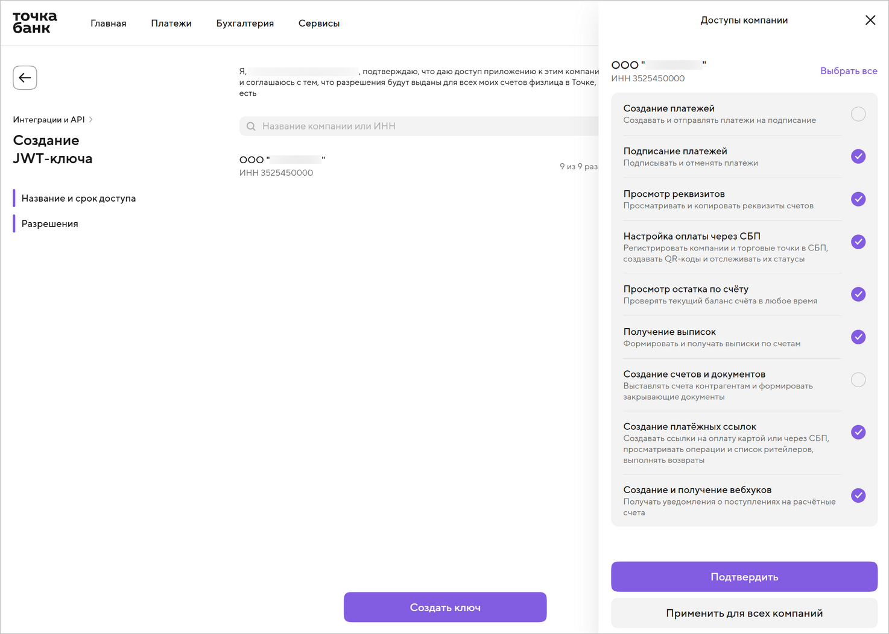

*Примечание:* Разрешение *“Создание и получение вебхуков”* обязательно – по нему банк отправляет в программу уведомления о поступлении оплаты (см. *[ниже](#4-настройка-уведомлений-о-смене-статусов)).*

Подтвердите создание ключа кодом из пуш-уведомления или смс – ключ готов. Скопируйте его сразу по ссылке *“Скопировать ключ”* либо позже в разделе *“JWT-ключи”:*

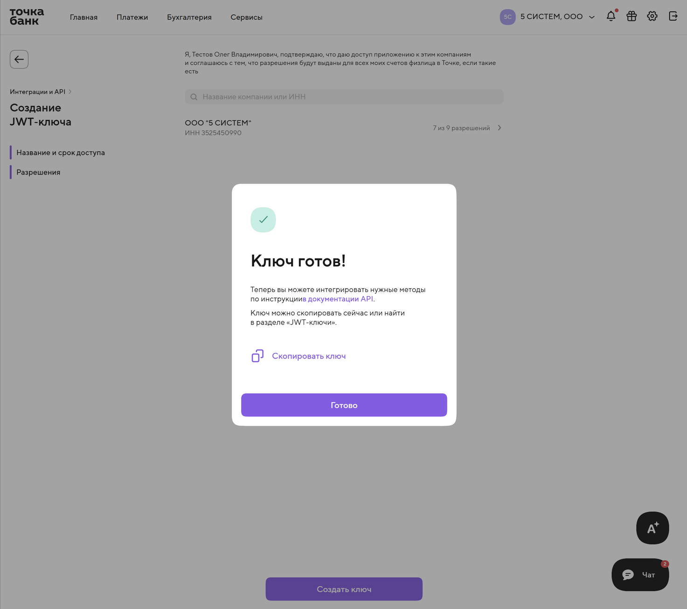

В карточке ключа в разделе *“JWT-ключи”* отображаются *Токен* и *Client_ID* – оба значения понадобятся для настройки интеграции в программе:

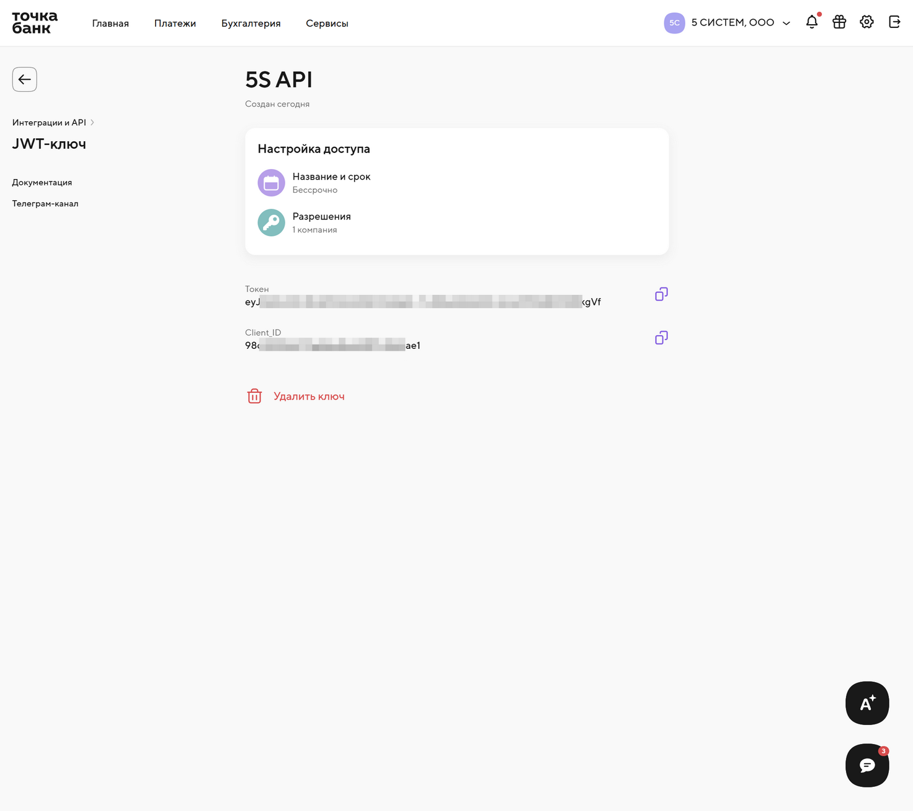

### Шаг 2. Регистрация торговой точки в СБП

В интернет-банке перейдите в раздел *“Сервисы” → “QR-платежи”:*

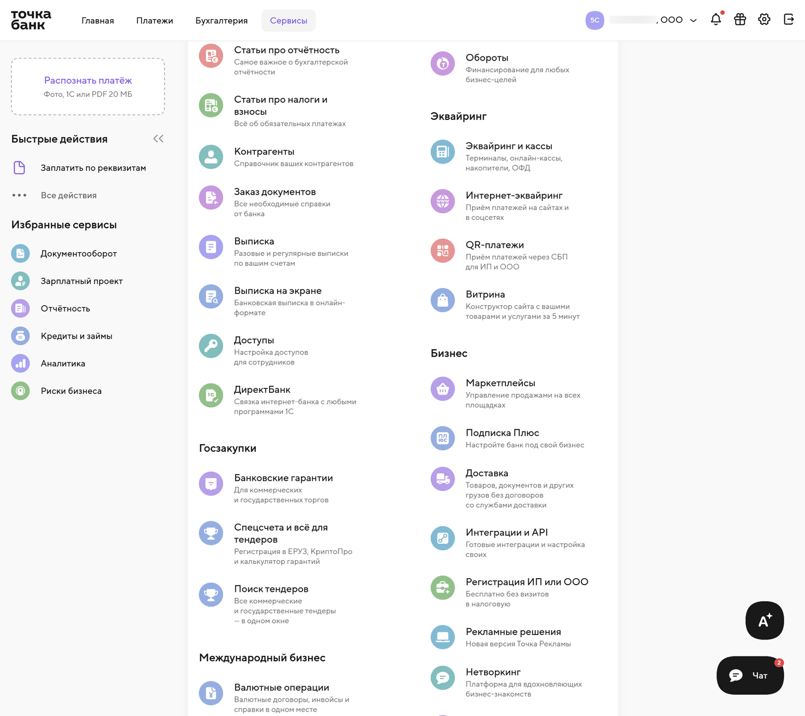

В блоке *“QR-коды торговых точек”* нажмите *“Добавить точку”:*

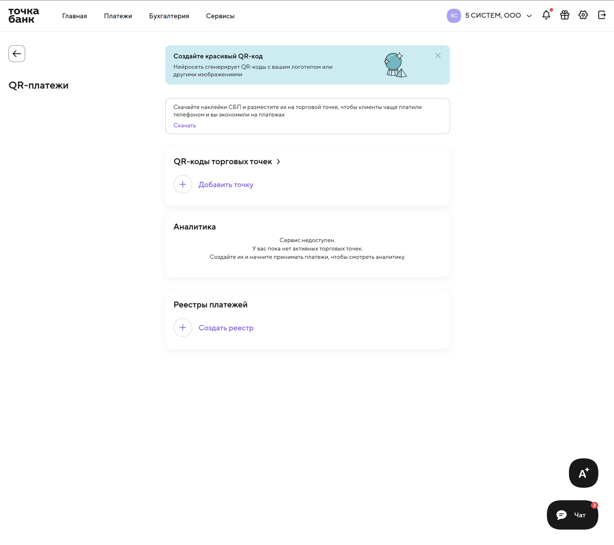

Заполните общую информацию о торговой точке: *название* (его увидят покупатели при оплате), *адрес,* *вид деятельности* (от него зависит комиссия), способ *приема платежей* (“Дистанционно” или “Очно” – на усмотрение компании; если платежи принимаются и очно, и дистанционно, банк рекомендует создать отдельную торговую точку для каждого варианта), *счет для зачислений* и при необходимости *почту для уведомлений.* Нажмите *“Продолжить”:*

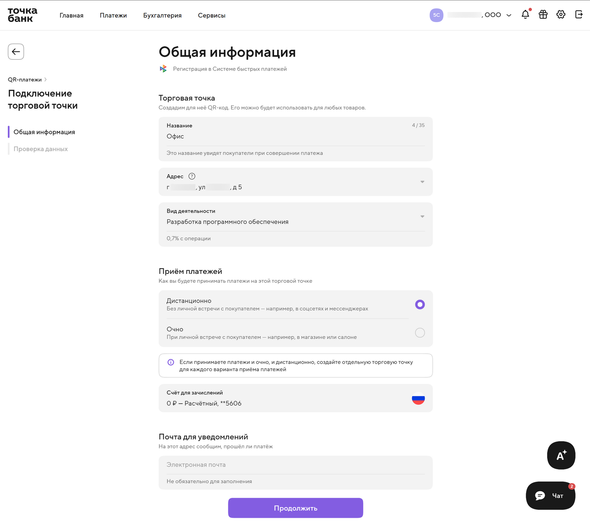

> *Комментарий: уточнить, какой способ приема платежей («Дистанционно» или «Очно») нужно выбирать для работы с 5S AUTO и влияет ли выбор на интеграцию; пока написано «на усмотрение компании».*

Проверьте данные, отметьте соглашения и нажмите *“Подключить QR-платежи”:*

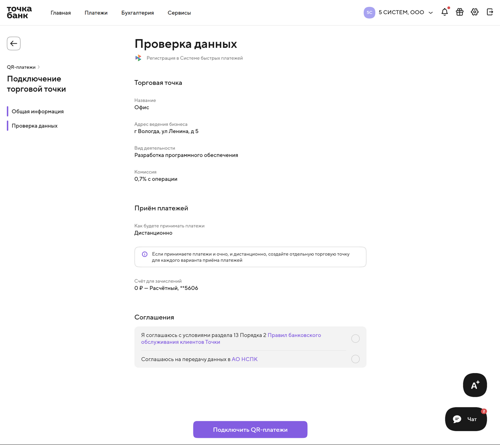

Заявка рассматривается банком, обычно около 10 минут, о результате банк сообщает в чат интернет-банка. После одобрения торговая точка регистрируется в СБП, и у нее появляется QR-код:

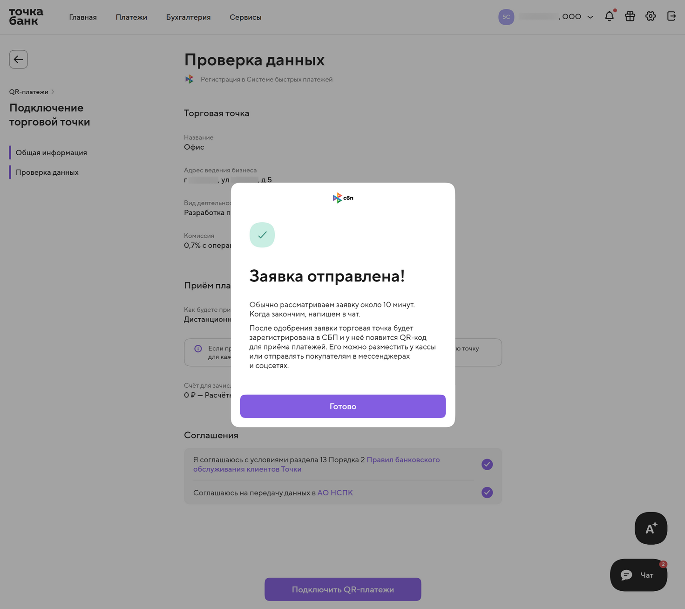

Откройте карточку торговой точки и нажмите *“Идентификаторы для интеграции”* – сохраните значение *Merchant ID* (идентификатор торговой точки: начинается с букв MA или MB, далее 10 цифр):

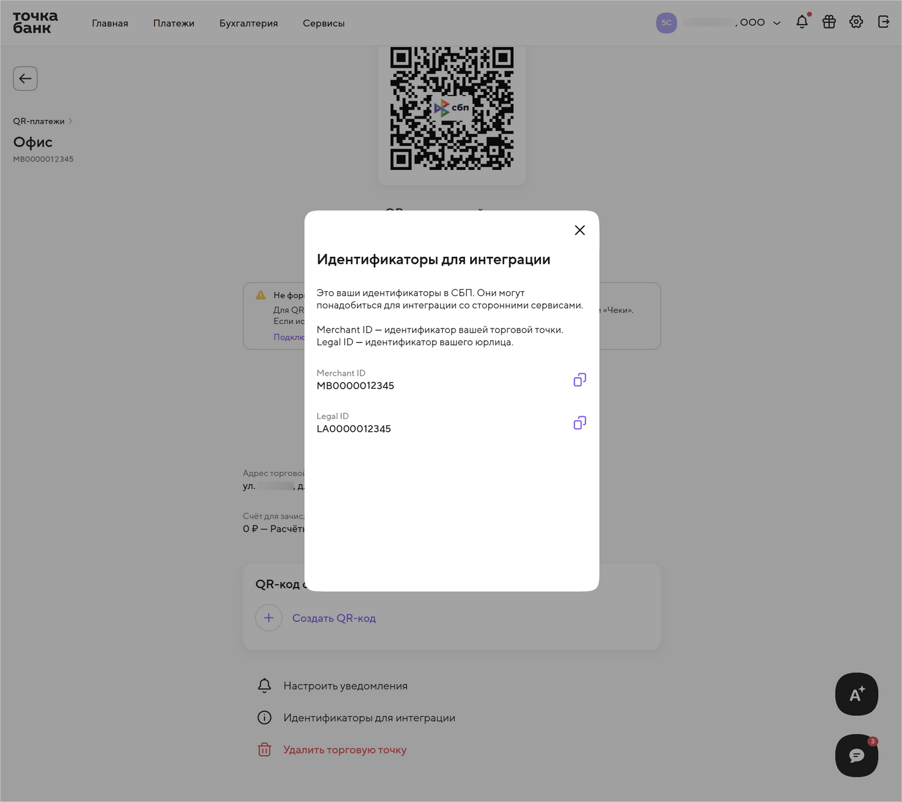

### Шаг 3. Сбор параметров для дальнейшей настройки

Для [дальнейшей настройки](#3-дополнительные-настройки) подключения в программе потребуются следующие параметры:

- **Токен** – JWT-токен из [карточки ключа](#kartochka_klyucha);
- **Client_ID** – идентификатор приложения из [карточки ключа](#kartochka_klyucha);
- **Merchant ID** – идентификатор торговой точки (см. *[выше](#identifikatory));*
- **Номер расчетного счета** для зачисления платежей и **БИК банка** – см. реквизиты счета в интернет-банке (*“Моя компания” → “Реквизиты”*). БИК Точка Банка – 044525104.

После завершения настроек на стороне банка необходимо перейти к настройке интеграции в программе.

## Настройка интеграции в программе

### 1. Добавление интеграции

Описание общих настроек для платежных систем всех банков см. в статье “[Работа с СБП](../Работа%20с%20СБП/rabota-s-sbp.md#добавление-интеграции)”.

Для СБП *Точка Банка* при добавлении новой интеграции следует ввести следующие реквизиты:

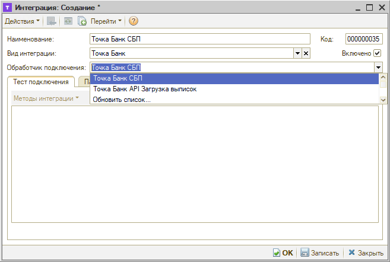

- *Наименование* – “Точка Банк СБП”;
- *Вид интеграции* – “Точка Банк”;
- *Обработчик подключения* – “Точка Банк СБП”.

*Примечание:* Обработчик *“Точка Банк API Загрузка выписок”* предназначен для загрузки банковских выписок и к приему оплаты через СБП не относится.

### 2. Общие настройки

Затем необходимо перейти на вкладку *“Параметры сервиса”* и заполнить *общие параметры* согласно инструкции в статье “[Работа с СБП](../Работа%20с%20СБП/rabota-s-sbp.md#param_serv)”.

### 3. Дополнительные настройки

#### 1) Переход к форме настроек

Далее необходимо перейти на вкладку “Тест подключения” в меню *“Методы интеграции → Настройки”:*

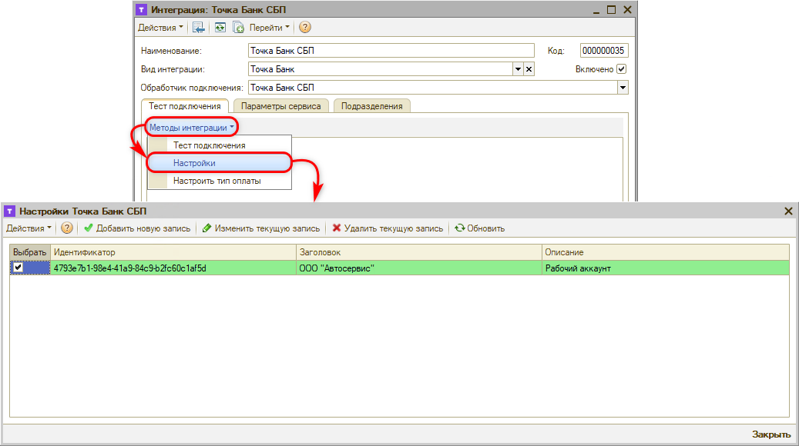

Данная форма настроек предназначена для добавления и редактирования информации в списке интеграций “Точка Банк СБП”.

*Столбцы таблицы:*

- *Идентификатор* – идентификатор интеграции с “Точка Банк СБП”;
- *Заголовок* – название организации;
- *Описание* – описание аккаунта.

#### 2) Добавление новой записи

Для *добавления новой записи настроек* следует нажать кнопку *“Добавить новую запись”,* заполнить параметры и нажать кнопку *“Создать”:*

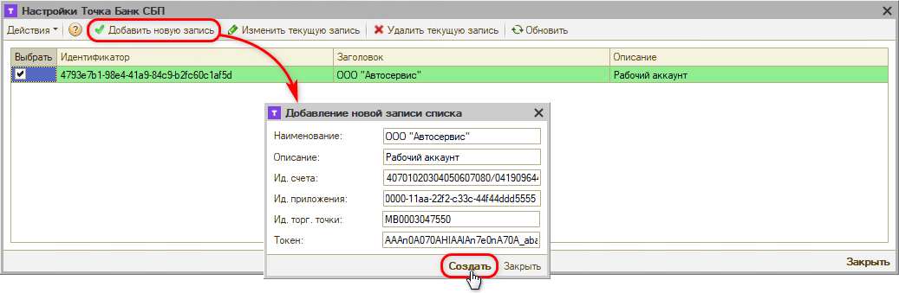

- *Наименование* – название организации;
- *Описание* – описание аккаунта;
- *Ид. счета* – номер расчетного счета и БИК банка через слеш, например `40702810100000001234/044525104`;
- *Ид. приложения* – *Client_ID* из карточки JWT-ключа;
- *Ид. торг. точки* – *Merchant ID* торговой точки;
- *Токен* – JWT-токен.

Значения параметров следует получить при настройке сервиса на стороне банка – см. *[выше](#parametry_tochka).*

*Примечание:* При перевыпуске JWT-ключа в интернет-банке меняются и токен, и Client_ID – их нужно обновить в этой записи.

Также есть возможность:

- *Изменить текущую запись* – изменить регистрационные данные при необходимости;
- *Удалить выбранную запись.*

Для осуществления указанных действий следует выделить галочкой выбранную запись и нажать соответствующую кнопку на верхней панели формы.

#### 3) Настройка типа оплаты

Далее следует настроить *тип оплаты* для пробития чеков в программе – см. в статье “[Работа с СБП](../Работа%20с%20СБП/rabota-s-sbp.md#настройка-типа-оплаты)”. Для Точка Банка должен быть настроен тип оплаты *“СБП Точка Банк”:*

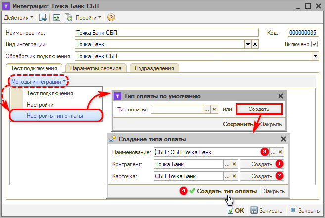

Затем необходимо для созданного типа оплаты настроить *вид платежа для кассы* в настройке оборудования в параметре "Наименования видов платежей": см. описание в статье "[Отражение оплаты через СБП](../../../Касса/Отражение%20оплаты%20через%20СБП/otrazhenie-oplaty-cherez-sbp.md#2-настройка-подключения-касс)".

После настройки типа оплаты следует сделать *тест подключения* – см. в статье “[Работа с СБП](../Работа%20с%20СБП/rabota-s-sbp.md#тест-подключения)”.

#### 4) Настройка уведомлений о смене статусов

Также необходимо активировать и настроить *уведомления* о смене статусов платежей – см. в статье “[Работа с СБП](../Работа%20с%20СБП/rabota-s-sbp.md#настройка-уведомлений-о-смене-статусов)”.

*Примечание:* Адрес для отправки уведомлений об оплате на стороне банка указывать не нужно – уведомления подключаются автоматически, если у JWT-ключа есть разрешение *“Создание и получение вебхуков”* (см. *[выше](#шаг-1-создание-jwt-ключа)).*

---

**Теги:** платежные системы, сбп, точка банк, подключение, интеграция
