

# Работа с СБП

<table><tr><td><b>Время чтения:</b> 24 мин.</td><td><b>Обновлено:</b> 07.05.2026</td></tr></table>

Источник: https://www.5systems.ru/help/rabota-s-sbp

> *Функционал доступен начиная с релиза 2.7.2, обновление настроек – с релиза 2.8.2.*

## Содержание

1. [Введение](#введение)
2. [Платежная ссылка для предоплаты](#платежная-ссылка-для-предоплаты)
   - [Формирование ссылки](#формирование-ссылки)
   - [Действия с платежной ссылкой](#действия-с-платежной-ссылкой)
   - [Уведомление](#уведомление)
3. [Прием оплаты на кассе](#прием-оплаты-на-кассе)
   - [Процесс приема оплаты](#процесс-приема-оплаты)
   - [Прием платежа по разным типам оплаты](#прием-платежа-по-разным-типам-оплаты)
   - [Статический QR-код](#статический-qr-код)
   - [Возврат оплаты по СБП](#возврат-оплаты-по-сбп)
4. [Регистр сведений “Статусы платежных ссылок”](#регистр-сведений-статусы-платежных-ссылок)
5. [Настройки](#настройки)
   - [Добавление интеграции](#добавление-интеграции)
   - [Дополнительные настройки](#дополнительные-настройки)
   - [Настройка типа оплаты](#настройка-типа-оплаты)
   - [Тест подключения](#тест-подключения)
   - [Настройка уведомлений о смене статусов](#настройка-уведомлений-о-смене-статусов)
   - [Платежная система по умолчанию](#платежная-система-по-умолчанию)

Также см. статьи: [Отражение оплаты через СБП](../../../Касса/Отражение%20оплаты%20через%20СБП/otrazhenie-oplaty-cherez-sbp.md), [Печать QR-кода для оплаты](../Печать%20QR-кода%20для%20оплаты/pechat-qr-koda-dlya-oplaty.md).

## Введение

***Система быстрых платежей (СБП)*** — система Банка России, позволяющая гражданам переводить средства по идентификатору (номеру телефона) получателя, даже если стороны перевода имеют счета в разных кредитных организациях. СБП позволяет совершать мгновенные платежи в режиме 24/7 за товары и услуги, в том числе с использованием QR-кода. См. описание на сайте Банка России по [ссылке](https://www.cbr.ru/PSystem/sfp/#:~:text=%D0%A1%D0%B8%D1%81%D1%82%D0%B5%D0%BC%D0%B0%20%D0%B1%D1%8B%D1%81%D1%82%D1%80%D1%8B%D1%85%20%D0%BF%D0%BB%D0%B0%D1%82%D0%B5%D0%B6%D0%B5%D0%B9%20(%D0%A1%D0%91%D0%9F)%20%E2%80%94,%D0%B1%D0%BE%D0%BB%D0%B5%D0%B5%20200%20%D0%B1%D0%B0%D0%BD%D0%BA%D0%BE%D0%B2%2C%20%D0%B2%D0%BA%D0%BB%D1%8E%D1%87%D0%B0%D1%8F%20%D0%BA%D1%80%D1%83%D0%BF%D0%BD%D0%B5%D0%B9%D1%88%D0%B8%D0%B5.).

В 5S AUTO на настоящее время реализована возможность подключить прием платежей через следующие платежные системы:

- *SberPay QR* – см. статью “[Подключение SberPay QR](../Подключение%20SberPay%20QR/podklyuchenie-sberpay-qr.md)”;
- *Т-Банк (Tinkoff)* – см. статью “[Подключение СБП Т-Банка](../Подключение%20СБП%20T-Банка/podklyuchenie-sbp-t-banka.md)”;
- *Альфа-Банк* – см. статью “[Подключение СБП Альфа-Банка](../Подключение%20СБП%20Альфа-Банка/podklyuchenie-sbp-alfa-banka.md)” (начиная с релиза 2.8.2).

В текущей статье представлено описание работы интеграции *на примере* СБП Сбербанка.

Основное преимущество использования СБП – низкая комиссия за прием безналичной оплаты – максимум 0,7% от суммы платежа, т.е. намного ниже, чем за эквайринг (подробнее см. на [сайте сервиса](https://sbp.nspk.ru/business/)). Деньги, переведенные через СБП, поступают на счет моментально, оплата может производиться круглосуточно.

Для принятия оплаты по СБП компании необходимо обратиться в банк – участник СБП, поддерживающий оплату по QR-коду, и заключить договор на прием платежей через СБП. Затем произвести все необходимые настройки на стороне банка и в программе.

Клиенту для оплаты по СБП достаточно иметь смартфон с мобильным приложением любого банка – участника СБП. Для приема предоплаты клиенту отправляется *платежная ссылка,* для окончательного расчета используется *оплата по QR-коду.*

Клиент переходит по ссылке в мессенджере или сканирует QR-код камерой смартфона, выбирает необходимый банк из открывшегося списка приложений, автоматически переходит в приложение своего банка, проверяет данные платежа и подтверждает его.

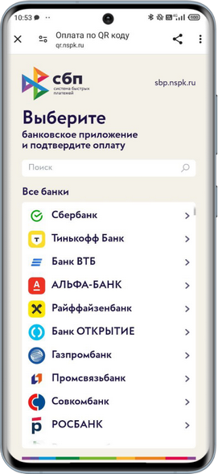 &nbsp;&nbsp;&nbsp;&nbsp;&nbsp;&nbsp; 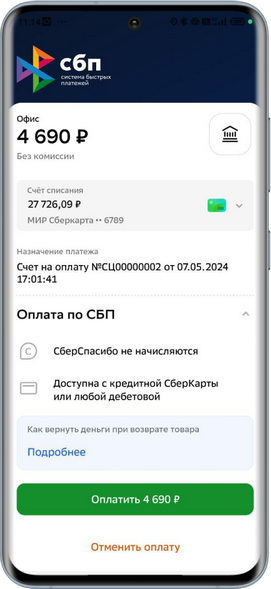

Демонстрацию процесса оплаты смотрите на [сайте сервиса](https://sbp.nspk.ru/business).

Для оплаты по СБП могут использоваться *QR-коды двух видов* – динамические либо статические:

- *статический QR-код* печатается на наклейке и вывешивается рядом с кассой – в нем зашифрованы реквизиты компании, при сканировании кода клиентом производится переадресация на другую ссылку, в которой зашифрованы индивидуальные данные для каждой оплаты;
- *динамический QR-код* генерируется каждый раз уникальный на основании конкретного документа и единоразово выводится на экран монитора для сканирования клиентом.

О том, что платеж прошел успешно, клиент и компания получают *уведомление.* Клиенту уведомление приходит в приложении банка. Компании [уведомление](#уведомление) приходит в программе в виде push-сообщения с информацией об оплате документа, смене статуса и необходимости пробить чек.

Принятую по СБП оплату требуется отразить у себя в учете особым порядком, а также *необходимо пробить чек* клиенту в соответствии с требованиями ФЗ-54. Подробнее см. в статье “[Отражение оплаты через СБП](../../../Касса/Отражение%20оплаты%20через%20СБП/otrazhenie-oplaty-cherez-sbp.md)”. Чеки можно пробивать по уже существующей кассе, предварительно настроив отдельный вид оплаты, либо подключить облачную кассу – для этого не обязательно иметь кассовый аппарат.

## Платежная ссылка для предоплаты

Для приема предоплаты от клиента по СБП – например, когда требуется заказать необходимые для ремонта запчасти – следует *отправить* ему *платежную ссылку.* Для этого необходимо на основании Заказ-наряда создать документ “Счет на оплату” и *сформировать* в нем *ссылку для отправки клиенту.* Также ссылку можно сформировать в документе *[Заказ покупателя](../../../Работа%20с%20заказами/Работа%20с%20заказами%20покупателя/rabota-s-zakazami-pokupatelya.md).*

### Формирование ссылки

Кнопка для формирования ссылки появляется в документе, если организация в счете на оплату совпадает с организацией, указанной в [настройках](#param_serv) интеграции. Перед формированием ссылки необходимо записать счет на оплату. Затем нажать на кнопку *"Сформировать платежную ссылку":*

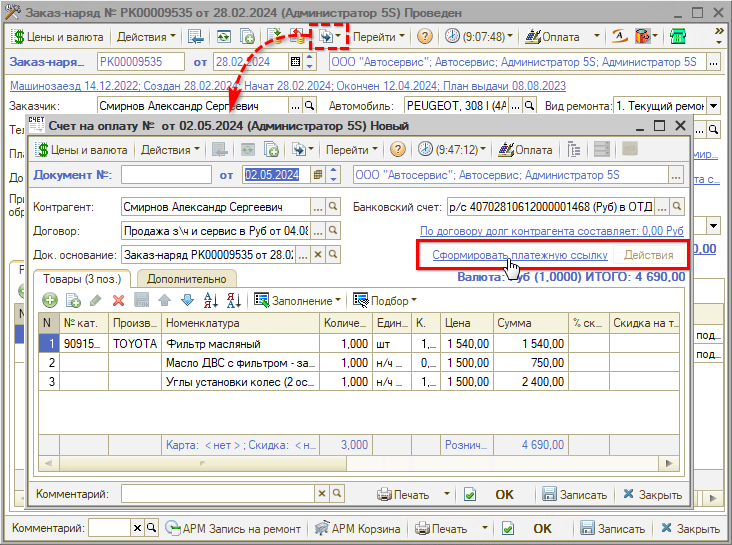

Сформированная платежная ссылка имеет следующий вид:

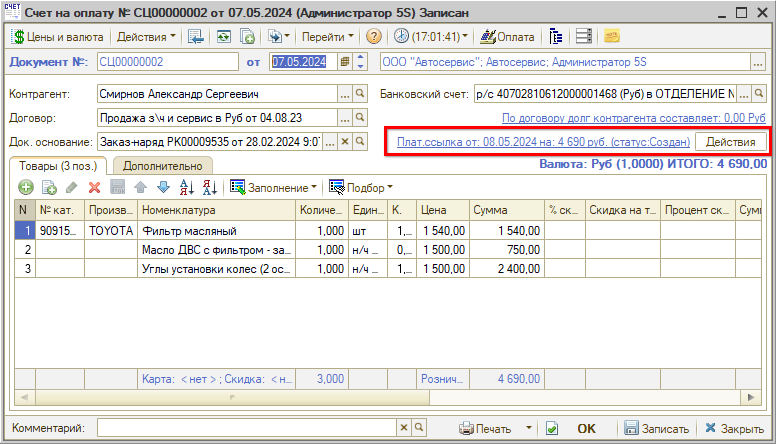

В скобках отображается *статус* платежной ссылки. При смене статуса выходит уведомление в программе – см. *[ниже](#уведомление).* Также статусы можно проверить в регистре “Статусы платежных ссылок” – см. *[ниже](#регистр-сведений-статусы-платежных-ссылок).*

При клике на ссылку открывается QR-код для сканирования:

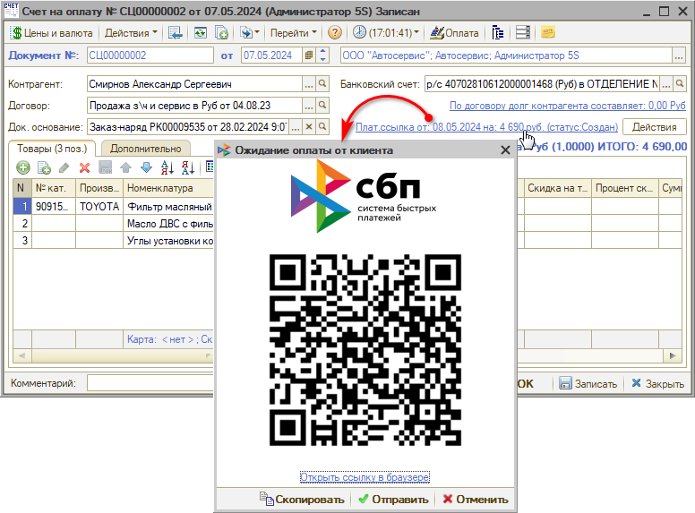

### Действия с платежной ссылкой

В окне "Ожидание оплаты от клиента" под QR-кодом расположены кнопки действий: "Открыть ссылку в браузере", "Скопировать", "Отправить" и "Отменить".

1. Есть возможность *открыть ссылку в браузере* для сканирования клиентом:

   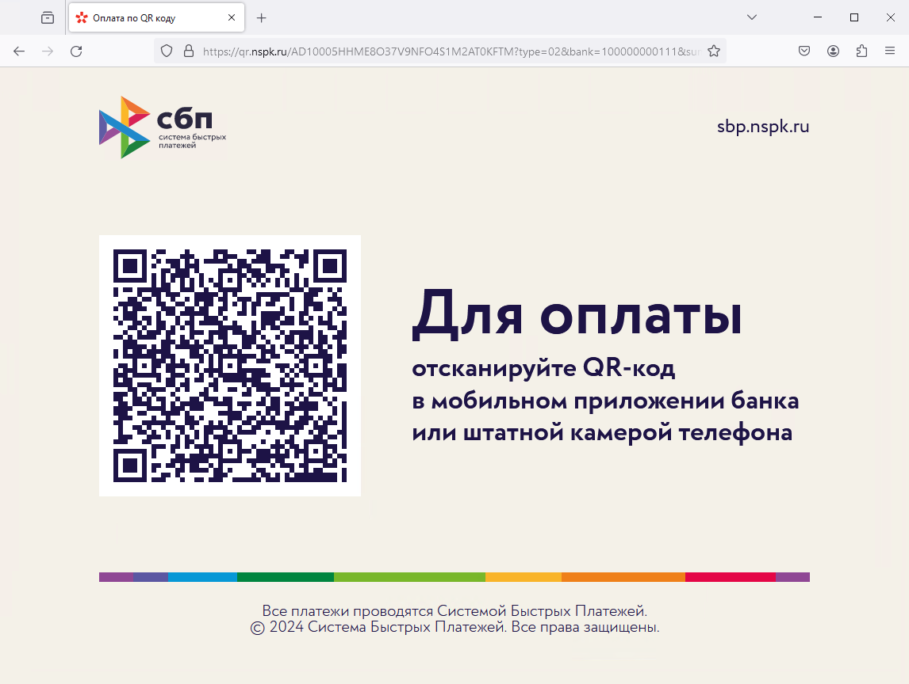

2. Также можно *скопировать* QR-код в буфер обмена нажатием на кнопку “Скопировать” и отправить его любым удобным способом.

3. Нажатием на кнопку *“Отправить”* открывается [лента событий](../../../Работа%20с%20клиентами/Лента%20событий/lenta-sobytiy.md) для отправки ссылки клиенту в мессенджер:

   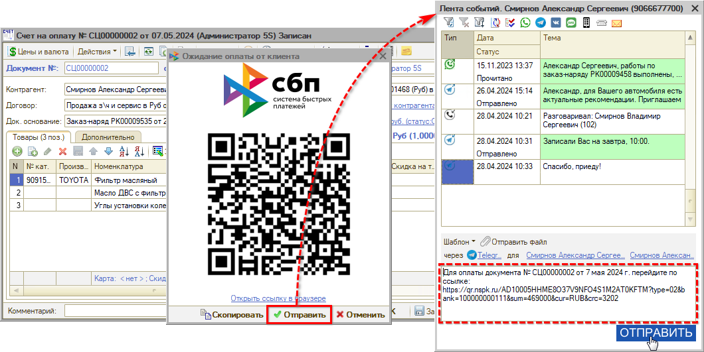

4. Есть возможность *отменить* ссылку, чтобы ссылка стала недействительной, и клиент не смог по ней оплатить – например, если отправили ссылку с неправильной суммой на оплату. Для этого следует нажать кнопку “Отменить” и подтвердить удаление:

   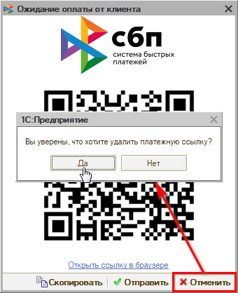

При этом статус платежной ссылки изменяется на “Отменен”. Затем следует сформировать правильную ссылку и отправить ее клиенту.

Также перейти к действиям со ссылкой можно нажатием на *кнопку “Действия”:*

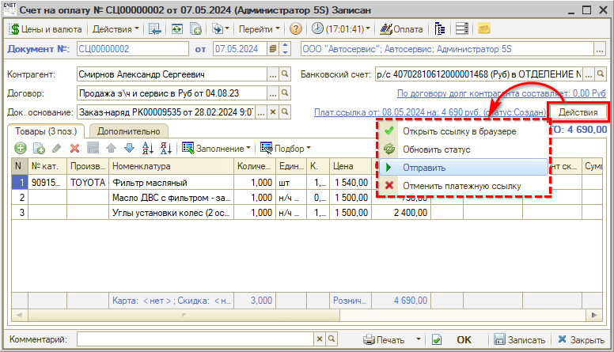

Через меню действий также можно *открыть ссылку в браузере, отправить* или *отменить* ссылку. Помимо этого есть возможность *обновить статус* платежной ссылки.

### Уведомление

При поступлении платежа автоматически создается непроведенный чек на оплату в программе, задача на пробитие чека и выходит *уведомление* с информацией об оплате, смене статуса документа и необходимости пробить чек:

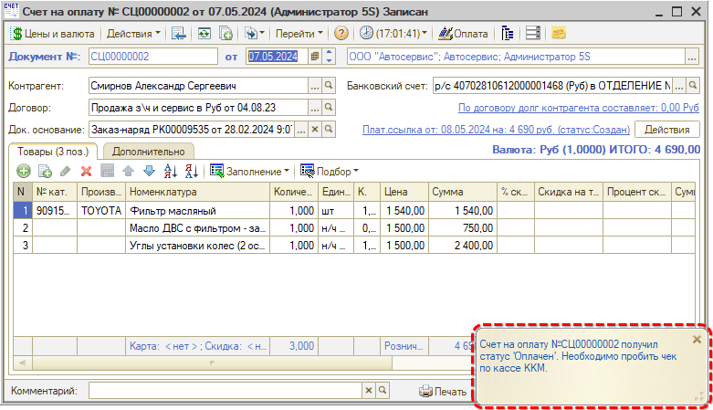

Уведомление должно быть предварительно [настроено](#настройка-уведомлений-о-смене-статусов) в программе, а также подключено на стороне банка с использованием веб-хука.

Также, при условии подключенной интеграции, при поступлении платежа в программу создается строка банковской выписки – см. статью "[Автоматическая загрузка банковских выписок](../../Банковские%20выписки/Автоматическая%20загрузка%20банковских%20выписок/avtomaticheskaya-zagruzka-bankovskikh-vypisok.md)".

При клике на текст уведомления открывается чек на оплату – следует проверить данные, провести документ, пробить кассовый чек и отправить его клиенту по номеру телефона либо по электронной почте.

## Прием оплаты на кассе

### Процесс приема оплаты

О работе с формой приема оплаты подробнее см. статью "[Упрощенный Фронт кассира](../../../Касса/Упрощенный%20Фронт%20кассира/uproschennyy-front-kassira.md)".

Для приема оплаты через СБП необходимо выбрать данный тип оплаты:

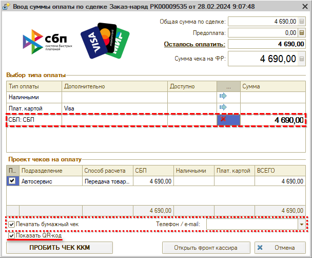

При этом становится активным параметр “Показать QR-код”[\*](#snoska-1). 
*\*При условии настроенной интеграции.*

*Важно!* При приеме оплаты необходимо предоставить клиенту кассовый чек: для этого на данном этапе в случае отправки чека в электронном виде следует ввести телефон или e-mail клиента *либо —* если есть возможность выдать чек клиенту — проверить наличие галочки "Печатать бумажный чек".

При нажатии на кнопку “Пробить чек ККМ” открывается QR-код:

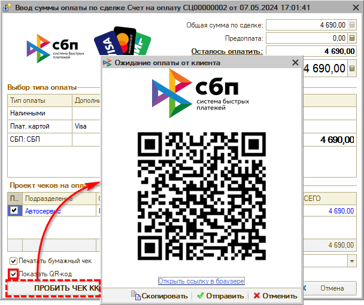

Клиент сканирует QR-код, переходит в приложение банка и оплачивает документ. При необходимости платежная ссылка также может быть отправлена клиенту в мессенджер.

После поступления оплаты автоматически формируется документ “Чек на оплату” – проконтролировать это можно через “Дерево документов”:

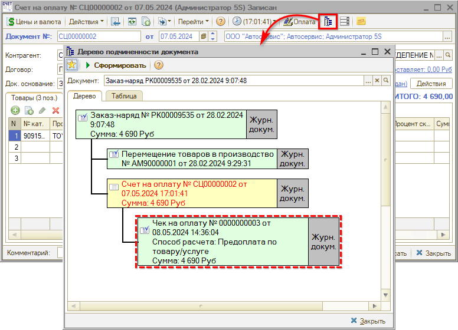

В Чеке на оплату отображается *Тип оплаты* – платежная система, через которую совершена оплата, а также *карточка банка* согласно настроенной интеграции. В *Комментарии* содержится указание, что документ создан автоматически по СБП, также подтягивается идентификатор операции:

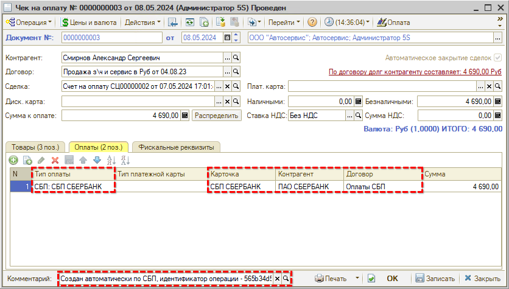

На вкладке “Фискальные реквизиты” можно также проверить номер чека и другие данные.

*Важно!* Распечатанный *кассовый чек* необходимо выдать клиенту — если он не был отправлен в электронном виде (см. [выше](#chek)).

Также есть возможность принимать оплату по QR-коду при использовании *стандартного Фронта кассира* — см. в статье "[Порядок работы с кассами ККМ](../../../Касса/Порядок%20работы%20с%20кассами%20ККМ/poryadok-raboty-s-kassami-kkm.md#прием-оплаты-по-сбп)".

### Прием платежа по разным типам оплаты

Есть возможность принять платеж с использованием разных типов оплаты – например, если клиент вносит часть суммы наличными средствами, а остальное оплачивает по СБП.

В данном случае следует распределить сумму на Фронте кассира по типам оплаты и нажать кнопку “Пробить чек ККМ” – подробнее см. в статье “[Упрощенный Фронт кассира](../../../Касса/Упрощенный%20Фронт%20кассира/uproschennyy-front-kassira.md#2-распределение-по-типам-оплаты)”. При этом перед выводом QR-кода сначала откроется окно “Оплата покупки”:

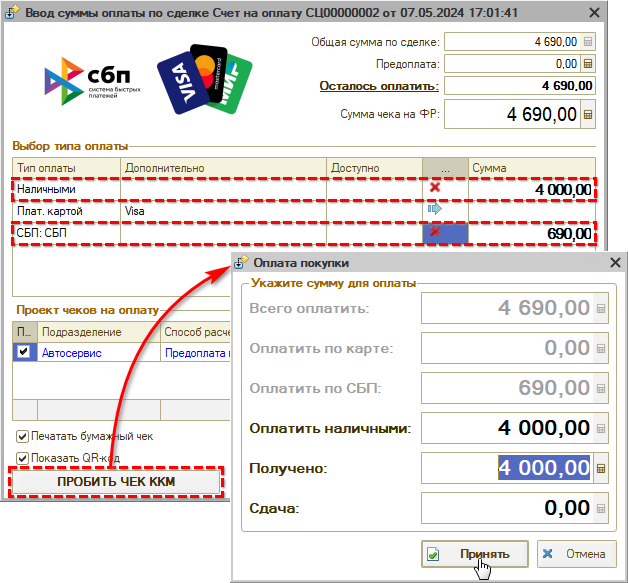

При нажатии кнопки “Принять” открывается окно с QR-кодом. Дальнейшие действия по приему оплаты по СБП аналогичны описанным [выше](#qr_kod).

### Статический QR-код

В случае использования статического QR-кода отличие работы функционала в том, что формируется не новый QR-код для каждого приема оплаты, а новая ссылка для переадресации по одному и тому же QR-коду.

Ссылка изменяется при открытии формы приема платежа после нажатия кнопки “Оплата” в документе.

При принятии оплаты по статическому QR-коду открывается окно ожидания оплаты клиента:

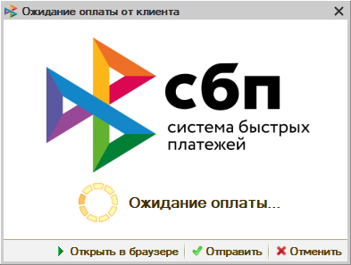

Также есть возможность [отправить](#otprav) платежную ссылку клиенту в мессенджер.

### Возврат оплаты по СБП

*Начиная с релиза 2.8.2.*

Как сделать возврат в программе, см. в статьях: [Порядок работы с кассами ККМ](../../../Касса/Порядок%20работы%20с%20кассами%20ККМ/poryadok-raboty-s-kassami-kkm.md#возврат) и [Упрощенный Фронт кассира](../../../Касса/Упрощенный%20Фронт%20кассира/uproschennyy-front-kassira.md#2-возврат-по-чеку-на-оплату).

Для возврата клиенту оплаты, сделанной через СБП, следует перейти в документ "Чек на оплату" и нажать кнопку "Пробить чек на возврат".

При этом *деньги клиенту возвращаются автоматически,* и выходит соответствующее предупреждение программы:

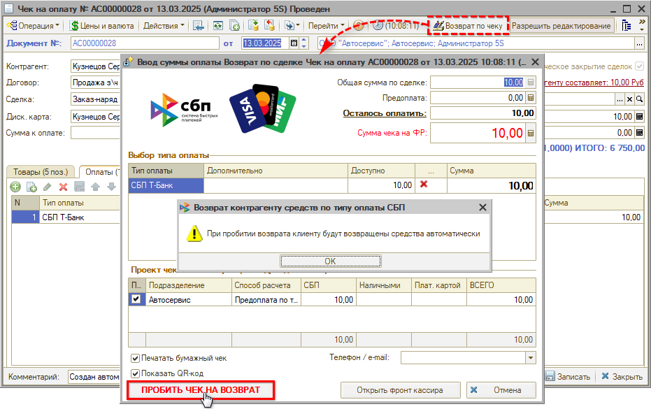

## Регистр сведений “Статусы платежных ссылок”

Перейти в регистр “Статусы платежных ссылок” можно из документа “Счет на оплату” по кнопке “Перейти”:

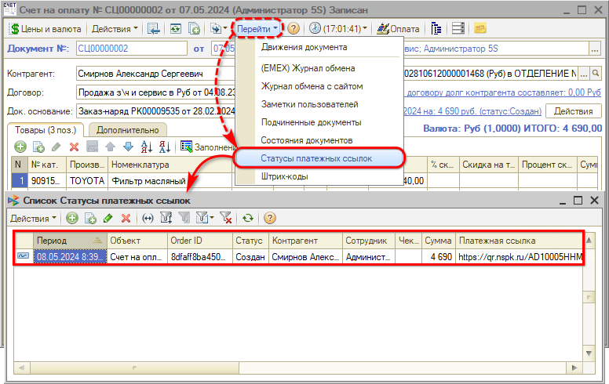

В регистре хранятся отправленные ссылки на QR-коды и их статусы.

*Возможные статусы платежных ссылок:*

- *Создан* — статус после формирования платежной ссылки;
- *Оплачен* – статус после оплаты документа клиентом;
- *Отменен* – статус в случае отмены платежной ссылки.

Регистр открывается в контексте текущего документа – для просмотра всего списка следует нажать кнопку снятия фильтра на верхней панели:

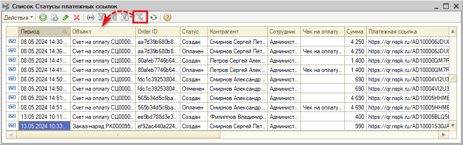

## Настройки

***Этапы настройки интеграции с сервисом:***

**Этап 1.** Настройка на стороне сервиса СБП выбранного банка – см. в статьях:

- [Подключение SberPay QR](../Подключение%20SberPay%20QR/podklyuchenie-sberpay-qr.md#настройка-на-стороне-банка);
- [Подключение СБП T-Банка](../Подключение%20СБП%20T-Банка/podklyuchenie-sbp-t-banka.md#настройка-на-стороне-банка);
- [Подключение СБП Альфа-Банка](../Подключение%20СБП%20Альфа-Банка/podklyuchenie-sbp-alfa-banka.md#настройка-на-стороне-банка).

**Этап 2.** Предварительная настройка интеграции с [API 5S AUTO](https://5systems.ru/help/api-5s-auto) – если она не будет настроена, то прием оплаты по СБП будет работать по стандартному алгоритму, который описан в статье “[Отражение оплаты через СПБ](../../../Касса/Отражение%20оплаты%20через%20СБП/otrazhenie-oplaty-cherez-sbp.md)”.

**Этап 3.** Настройка интеграции в программе.

1. Добавление новой интеграции и настройка *общих* параметров для платежных систем всех банков – см. *[ниже](#добавление-интеграции).*
2. Настройка дополнительных параметров для каждой конкретной платежной системы – см. в статьях:
   - [Подключение SberPay QR](../Подключение%20SberPay%20QR/podklyuchenie-sberpay-qr.md#3-дополнительные-настройки);
   - [Подключение СБП T-Банка](../Подключение%20СБП%20T-Банка/podklyuchenie-sbp-t-banka.md#3-дополнительные-настройки);
   - [Подключение СБП Альфа-Банка](../Подключение%20СБП%20Альфа-Банка/podklyuchenie-sbp-alfa-banka.md#3-дополнительные-настройки).
3. Настройка уведомлений о смене статусов платежных ссылок – см. *[ниже](#настройка-уведомлений-о-смене-статусов).*

### Добавление интеграции

Необходимо перейти в справочник “Интеграции” и создать в нем новый элемент:

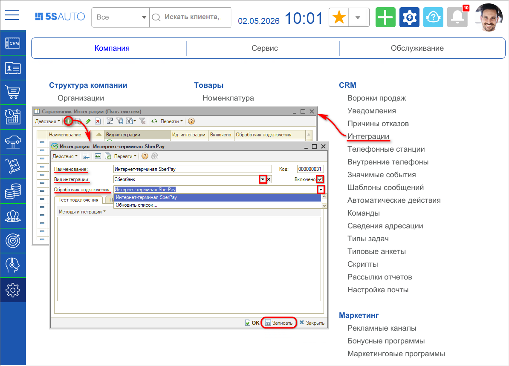

Требуется заполнить ***реквизиты***:

- *Наименование* интеграции заполняется автоматически после выбора обработчика подключения, при необходимости можно изменить;
- *Вид интеграции* – выбрать нужную платежную систему (банк);
- *Обработчик подключения* – выбрать соответствующий обработчик;
- Установить галочку *“Включено”* и записать изменения.

На вкладке ***“Параметры сервиса”*** необходимо заполнить следующие значения:

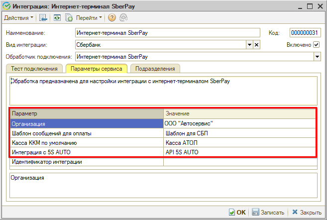

- *Организация* – наименование организации, по которой будут формироваться платежные документы;
- *Шаблон сообщений для оплаты* – следует выбрать преднастроенный шаблон сообщений для отправки ссылки на QR-код из счета на оплату, при необходимости его можно изменить;
- *Касса ККМ по умолчанию* – выбрать кассу ККМ для пробития чеков;
- *Интеграция с 5S AUTO* – выбрать интеграцию с [API 5S AUTO](https://www.5systems.ru/help/api-5s-auto).

### Дополнительные настройки

Далее следует ввести специфичные для каждой платежной системы *параметры* – их набор различается у разных банков, подробнее см. описание в *[статьях](../):*

### Настройка типа оплаты

На вкладке “Тест подключения” следует перейти по кнопке *“Методы интеграции → Настроить тип оплаты”* и выбрать предварительно настроенный тип оплаты *“СБП <название банка>”:*

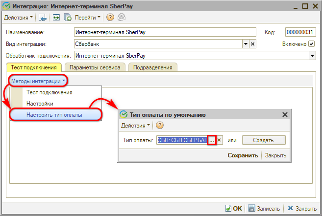

В случае если нет подходящего для выбора типа оплаты, следует перейти к созданию нового типа оплаты нажатием на кнопку “Создать”.

*Важно!* Настройки создаваемого типа оплаты должны соответствовать описанным в статье “[Отражение оплаты через СБП](../../../Касса/Отражение%20оплаты%20через%20СБП/otrazhenie-oplaty-cherez-sbp.md)”. А также для автоматического создания типа оплаты должны быть корректно настроены организация и [подразделения](../../../Структура%20компании/Справочник%20Подразделения%20компании/spravochnik-podrazdeleniya-kompanii.md) компании.

При создании нового типа оплаты необходимо заполнить следующие параметры:

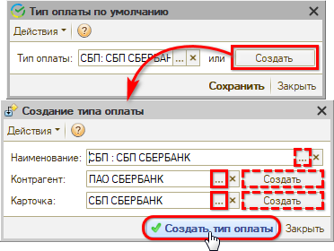

- *Наименование* – после заполнения контрагента и карточки при нажатии на кнопку выбора в данной строке будет автоматически сформировано наименование вида *“СБП: <наименование карточки>”*.
- *Контрагент* – требуется выбрать банк из справочника контрагентов либо создать контрагента для Сбербанка при необходимости. Данный контрагент будет подтягиваться в Чек на оплату. Подробнее см. в статье “[Отражение оплаты через СБП](../../../Касса/Отражение%20оплаты%20через%20СБП/otrazhenie-oplaty-cherez-sbp.md#1-создание-типа-оплаты-сбп)”. 
  При автоматическом создании необходимо будет проверить и дозаполнить карточку контрагента. Также при создании карточки автоматически создается договор взаиморасчетов между подразделением организации, указанной в параметрах сервиса, и банком. При необходимости его можно создать вручную, а также скорректировать автоматически созданный договор.
- *Карточка* – после заполнения контрагента необходимо выбрать из справочника существующую карточку для типа оплаты либо создать новую. Подробнее см. в статье “[Отражение оплаты через СБП](../../../Касса/Отражение%20оплаты%20через%20СБП/otrazhenie-oplaty-cherez-sbp.md#1-создание-типа-оплаты-сбп)”.

После заполнения параметров необходимо нажать кнопку “Создать тип оплаты”. При этом подключение автоматически тестируется – выводится сообщение “Метод выполнен успешно”.

*Важно!* Указанный в интеграции тип оплаты необходимо также указать в оборудовании – см. в статье “[Отражение оплаты через СБП](../../../Касса/Отражение%20оплаты%20через%20СБП/otrazhenie-oplaty-cherez-sbp.md#2-настройка-подключения-касс)”, – иначе не будут пробиваться чеки.

### Тест подключения

После создания типа оплаты подключение автоматически тестируется – должно появиться сообщение *“Метод выполнен успешно”.*

Проверить успешность подключения также можно по кнопке *“Методы интеграции → Тест подключения”:*

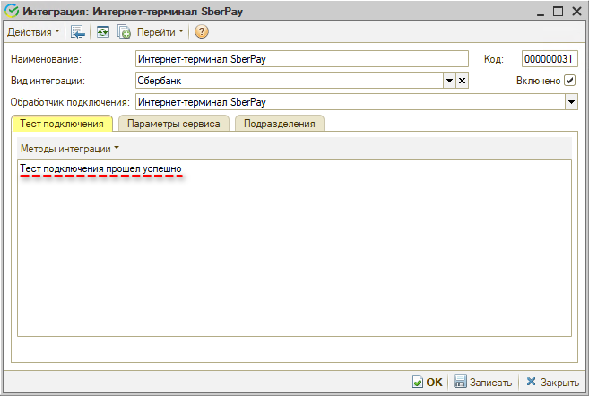

### Настройка уведомлений о смене статусов

После настройки всех параметров следует активировать и настроить *уведомления о смене статусов* платежных ссылок – настроить способ оповещения, установить галочку “Используется” и *записать:*

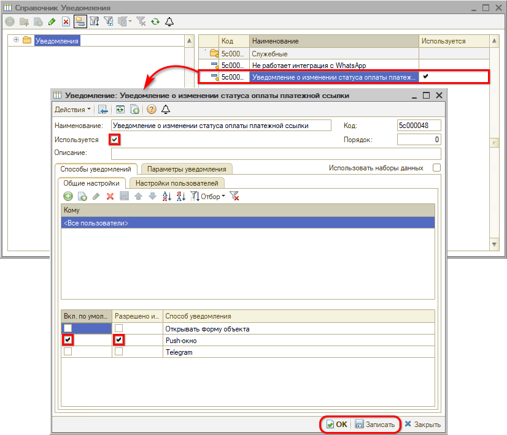

Уведомления об оплате будут приходить пользователю указанным способом, например, в виде push-окна в программе – см. [выше](#уведомление).

*Примечание:* Уведомление об оплате необходимо предварительно подключить на [этапе](#etapy) настройки на стороне банка с использованием веб-хука.

### Платежная система по умолчанию

В случае настроенной интеграции с двумя и более банками для приема оплаты по СБП следует установить приоритетную платежную систему через *[Права и настройки](https://5systems.ru/help/ustanovka-prav-i-nastroek-polzovatelya).* Настройка "Платежная система по умолчанию" устанавливается на организацию.

При включении данной настройки, при наличии двух и более настроенных интеграций с платежными системами, по умолчанию будет установлено значение "Сбербанк". При необходимости можно выбрать другой банк в качестве приоритетного[\*](#snoska-2):

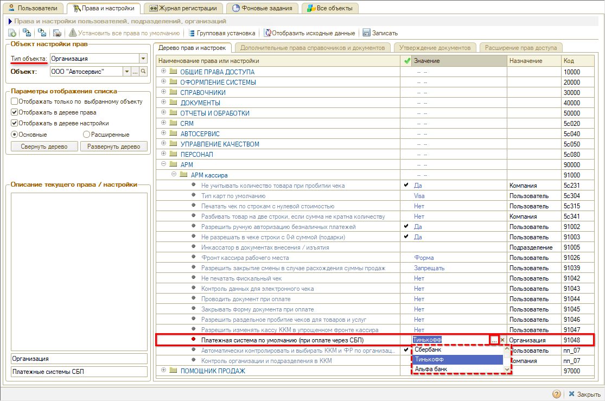

*\*На настоящее время реализована интеграция с платежными системами банков "Сбербанк" и "Т-Банк (Тинькофф)".*

Для настройки разных платежных систем по умолчанию для разных организаций можно использовать групповую установку прав:

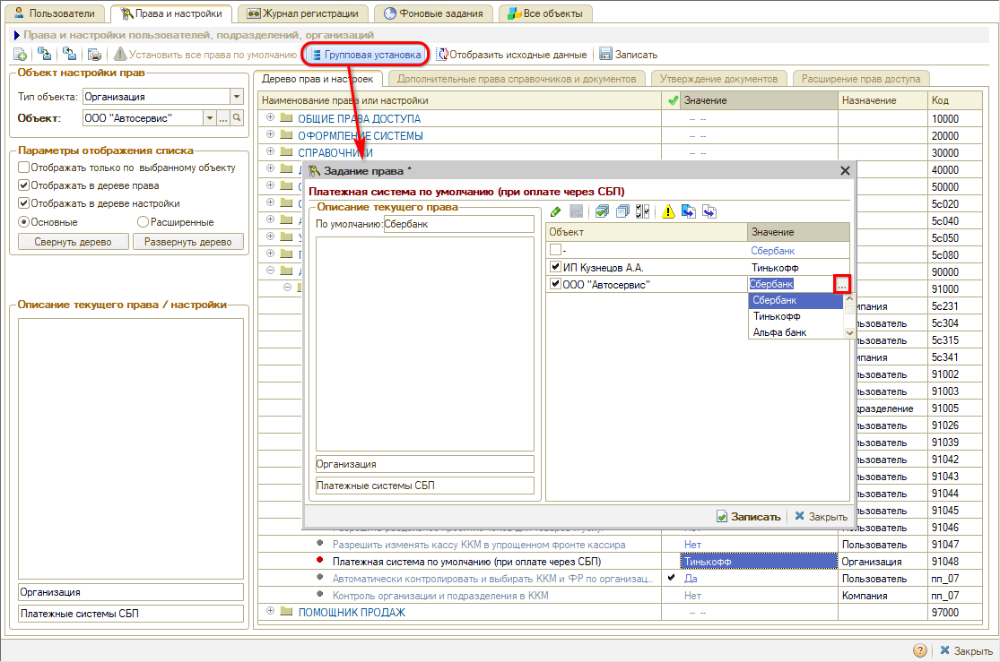

*Примечание:* В случае если настроена интеграция только с одной платежной системой, то по умолчанию будет работать данная интеграция. Если не настроено ни одной интеграции с платежными системами, система будет работать по стандартному алгоритму, который описан в статье “[Отражение оплаты через СПБ](../../../Касса/Отражение%20оплаты%20через%20СБП/otrazhenie-oplaty-cherez-sbp.md)”.

---

**Теги:** прием оплаты, платежные системы, сбп, платежная ссылка, qr-код

