

# Настройка бонусной системы

<table><tr><td><b>Время чтения:</b> 18 мин.</td><td><b>Обновлено:</b> 17.06.2026</td></tr></table>

Источник: https://www.5systems.ru/help/nastroyka-bonusnoy-sistemy

## Содержание

1. [Введение](#введение)
2. [Настройка бонусной программы](#настройка-бонусной-программы)
   - [Справочник "Бонусные программы"](#справочник-бонусные-программы)
   - [Описание параметров](#описание-параметров)
3. [Мастер настроек бонусных программ](#мастер-настроек-бонусных-программ)
   - [Регламентные задания](#регламентные-задания)
   - [Рассылка об активации бонусов](#рассылка-об-активации-бонусов)
   - [Предупреждение о сгорании бонусов](#предупреждение-о-сгорании-бонусов)
4. [Права и настройки бонусной системы](#права-и-настройки-бонусной-системы)
5. [Фоновые задания](#фоновые-задания)

## Введение

Функционал бонусных программ позволяет:

- привязывать дисконтные карты клиентам, действующие в рамках определенной бонусной программы;
- начислять бонусы за товар или работу, реализованные через Заказ-наряд;
- предупреждать клиента по SMS или электронной почте о сгорании бонусов;
- использовать начисленные бонусы клиентом при следующей покупке;
- производить гибкие настройки бонусных программ (автоматическая смена бонусной программы в зависимости от суммы накоплений клиентом, предложение работ в подарок, начисление бонусов через внешние события, например, День рождения);
- отправлять сообщения об активации и сгорании бонусов через мессенджеры, например, [MAX](../../Сообщения/Интеграция%20с%20мессенджером%20MAX/integraciya-s-messendzherom-max.md).

В рамках данной статьи рассматривается настройка бонусной системы 5S AUTO.

## Настройка бонусной программы

### Справочник "Бонусные программы"

Для настройки бонусной программы перейдите к карточке справочника ***"Бонусные программы"*** *(Маркетинг → Программа лояльности → Бонусная программа → Бонусные программы* или через типовое меню: *Справочники → Бонусные программы → Бонусные программы):*

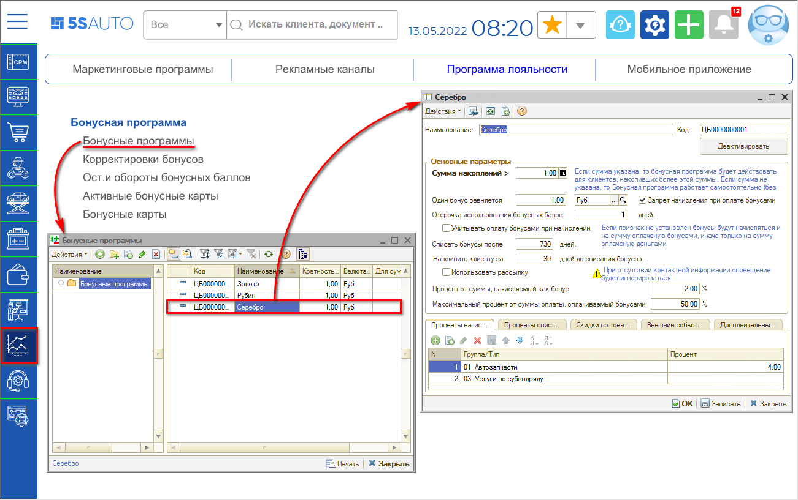

Какие параметры что означают см. раздел [*Описание параметров*](#описание-параметров).

Бонусная программа начинает действовать сразу после ее активации (кнопка "*Активировать"* в верхней части карточки, повторное нажатие на кнопку остановит действие программы). Дата активации заносится в регистр сведений "Активные бонусные программы" *(Сервис → Все операции → Регистр сведений),* ее можно изменить. Ранее указанной даты бонусы по программе начисляться не будут:

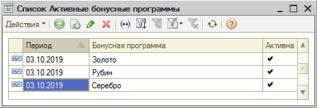

Бонусная программа указывается в дисконтной карте контрагента *(Маркетинг → Программа лояльности → Бонусная программа → Бонусные карты* или в типовом меню: *Справочники → Розница и оборудование → Карточки),* таким образом в системе одновременно может действовать несколько бонусных программ, однако к дисконтной карте привязывается только одна:

### Описание параметров

<table><tr><th>Параметр</th><th>Описание</th></tr><tr><td colspan="2"><b><i>Основные параметры</i></b></td></tr><tr><td><b>Сумма накоплений &gt;</b></td><td>Сумма, накопленная за определенный период с совершенных сделок по клиенту. В зависимости от суммы накоплений за период бонусная программа автоматически меняется у дисконтной карты. Если установить значение равное нулю, то сумма накоплений на бонусную программу влиять не будет. Автоматическая смена бонусной программы у дисконтной карты происходит, если настроено регламентное задание "Обновление бонусной программы" (см. <i><a href="#регламентные-задания">Регламентные задания</a>).</i> Период накоплений устанавливается отдельно. Для этого нужно перейти в меню программы: <i>Администрирование → Сервис → Начальная настройка → Настройка констант</i> или через типовое меню: <i>Сервис → Настройка параметров</i>:   Можно установить значение параметра системы "Период накопленных скидок" как "Не используется" или "Неограниченно", тогда период при расчете суммы накоплений не будет учитываться.</td></tr><tr><td><b>Один бонус равняется...</b></td><td>Номинал одного бонуса в определенной валюте</td></tr><tr><td><b>Запрет начисления при оплате бонусами</b></td><td>Если флаг не установлен, бонусы будут начисляться в том числе и на сделку, часть которой клиент оплачивает с помощью накопленных ранее бонусов</td></tr><tr><td><b>Отсрочка использования бонусных баллов</b></td><td>Минимальное количество дней, которое должно пройти между сделкой и моментом активации бонусов (в данном примере клиент может воспользоваться накопленными бонусами спустя день после сделки). Если установлено значение 0, клиент может использовать начисленные бонусы в тот же день для оплаты новой сделки</td></tr><tr><td><b>Списать бонусы после...</b></td><td>Срок действия бонусов, отсчитывается от дня закрытия заказ-наряда. По истечении указанных дней бонусы, начисленные за сделку, списываются</td></tr><tr><td><b>Напомнить клиенту за...</b></td><td>За сколько дней до списания бонусов клиенту будет отправляться оповещение</td></tr><tr><td><b>Использовать рассылку</b></td><td>При установке флага автоматически отправляются оповещения через мессенджеры при активации бонусов и за несколько дней до их списания (должны быть настроены регламентные задания "Активация бонусных баллов" и "Оповещение о бонусных баллах", см. <i><a href="#регламентные-задания">Регламентные задания</a>).</i> Сообщения отправляются на мобильный номер из карточки справочника контрагента</td></tr><tr><td><b>Процент от суммы, начисляемый как бонус...</b></td><td>Процент от конечной стоимости каждого товара и автоработы, за который будут начисляться бонусы. Если 1 бонус равен 1 руб. и учитывается только 2% от стоимости реализованного товара или работы, то за покупку в 1000 руб. на дисконтную карту будет начислено 20 бонусов. Процент может варьировать в зависимости от товара или типа/группы товаров, автоработы/группы авторабот. Подобные варианты указываются ниже в табличной части "Проценты начислений". В примере карточки бонусной программы выше бонусы по умолчанию начисляются на 2% от стоимости для всех групп товаров, кроме "!Новые группы" (4%), "Автозапчасти" (4%), "СУБПОДРЯД" (0%).</td></tr><tr><td><b>Максимальный процент от суммы оплаты, оплачиваемый бонусами</b></td><td>Максимальный процент от суммы сделки, который клиент может оплатить с помощью бонусов. В примере карточки бонусной программы выше бонусами нельзя оплатить больше 50% конечной суммы заказ-наряда.</td></tr><tr><td colspan="2"><b><i>Вкладка "Проценты начислений"</i></b></td></tr><tr><td><b>Табличная часть "Проценты начислений"</b></td><td>Указывается товар или тип/группа товаров, авторабота/группа авторабот, процент начислений на который отличается от параметра "Процент от суммы, начисляемый как бонус"</td></tr><tr><td colspan="2"><b><i>Вкладка "Проценты списания"</i></b></td></tr><tr><td><b>Табличная часть "Проценты списания"</b></td><td>Максимальный процент от суммы строки, который клиент может оплатить с помощью бонусов. В примере карточки бонусной программы выше показано, что автоработы из группы "Автозапчасти", "Автомойка", "СУБПОДРЯД" нельзя оплатить бонусами в заказ-наряде:   Табличная часть «Проценты списания» ссылается на справочники «Автоработы», «Номенклатура», «Типы номенклатуры». Аналитика расчета - процент. Тип значения: «Число». Процент для группы.</td></tr><tr><td colspan="2"><b><i>Вкладка "Скидки по товарам/услугам"</i></b></td></tr><tr><td><b>Табличная часть "Скидки по товарам/услугам"</b></td><td><b><i>Описание столбцов таблицы:</i></b>  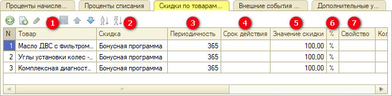  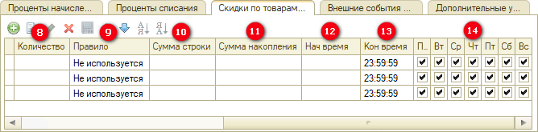 <b><i>1. Товар</i></b> – <i>Номенклатура,</i> <i>Авторабота</i> либо <i>Тип номенклатуры</i>, на которые в рамках бонусной программы предоставляется скидка. Значение выбирается из соответствующих справочников:  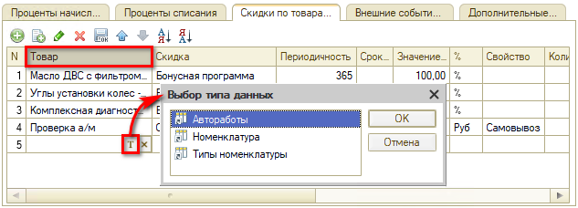 <b><i>2.</i></b> <b><i>Скидка</i></b> – выбирается элемент справочника “Типы скидок и наценок”, в котором обязательно должен быть <i>вид начисления “На строку”</i> и галочка <i>“Скидка по бонусной программе”:</i>  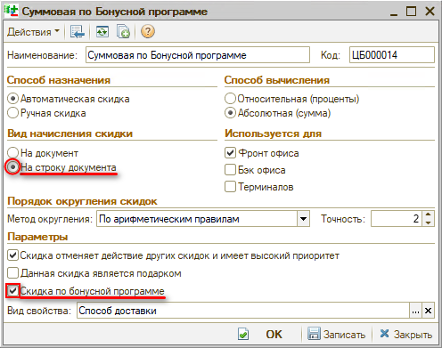 <b><i>3.</i></b> <b><i>Периодичность</i></b> – период, в течение которого предоставляется скидка на товар или работу. По истечении указанного периода начисляется ещё одна скидка по принципу накопления, т.е. для выбора скидки по бонусной программе в Заказ-наряде добавится ещё одна строка с такой же скидкой:  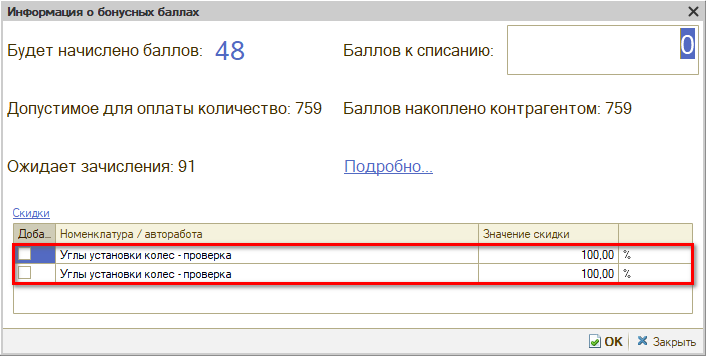 <b><i>4. Срок действия</i></b> – устанавливается дата, до которой предоставляется скидка, например, для акций:  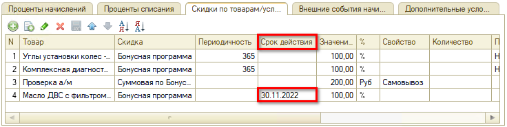 <b><i>5</i></b> и <b><i>6.</i></b> <b><i>Значение скидки</i></b> и <b><i>%</i></b> – размер предоставляемой скидки и единицы измерения. Скидка может предоставляться в процентах или в рублях – это зависит от установленного способа вычисления, указанного в типе скидки:  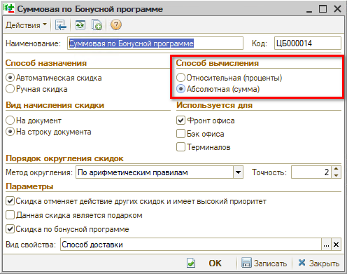 При установке скидки в 100% товар/работа предоставляется в подарок:  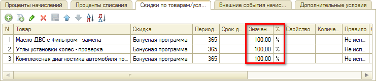 <b><i>7.</i></b> <b><i>Свойство</i></b> – возможность выбора значения активируется, если в карточке скидки установлен <i>Вид свойства:</i>  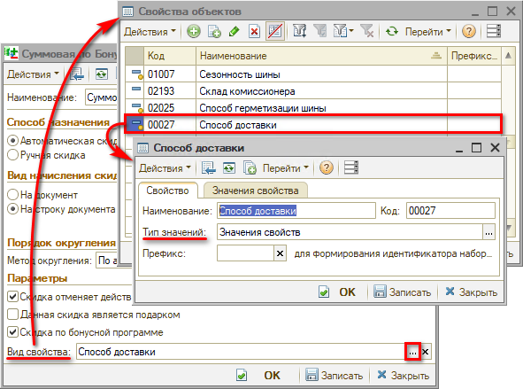 Для выбора будут доступны варианты значений, привязанные к свойству объекта:  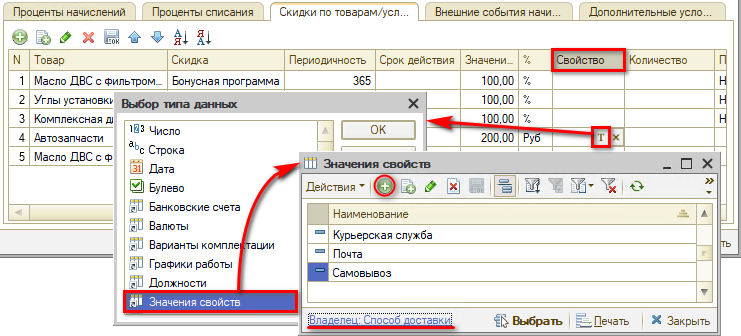 <b><i>8.</i></b> <b><i>Количество</i></b> – количество товара или работ, от которого будет назначаться скидка:  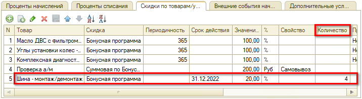 <b><i>9</i></b> и <b><i>10.</i></b> <b><i>Правило</i></b> и <b><i>Сумма строки</i></b> – можно установить правило, при котором будет начисляться скидка, например, если стоимость товара или работ больше определенной суммы:  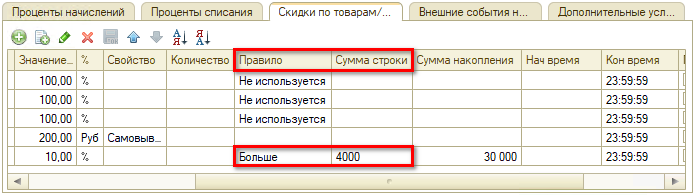 <b><i>11.</i></b> <b><i>Сумма накопления</i></b> – сумма накоплений на дисконтной карте, от которой начинает предоставляться скидка. <b><i>12</i></b>-<b><i>14.</i></b> <b><i>Нач время</i></b>, <b><i>Кон время</i></b> и <b><i>Дни недели</i></b> – задаются дни недели и время дня, в которые будет работать скидка, например “Счастливые часы” в утреннее время по будням:  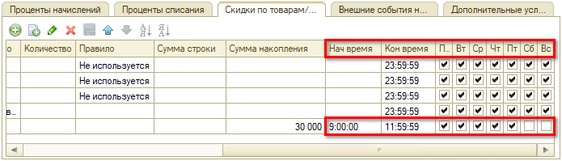 Для реализации скидок по бонусной программе должно быть настроено регламентное задание "Обновление бонусной программы" (см. ниже <i><a href="#регламентные-задания">Регламентные задания</a>).</i></td></tr><tr><td colspan="2"><b><i>Вкладка "Внешние события начисления"</i></b></td></tr><tr><td><b>Табличная часть "Внешние события начисления"</b></td><td>Внешние события: день рождения клиента, регистрация в мобильном приложении или на сайте, - при возникновении которых начисляются бонусные баллы:  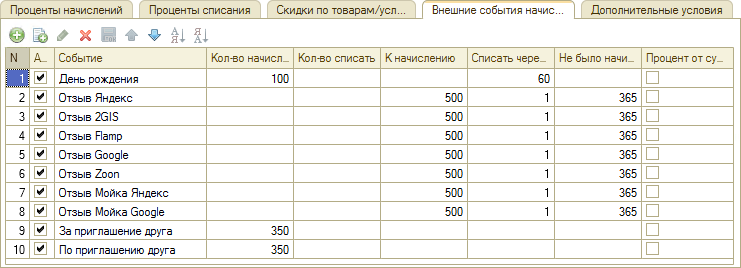 Настройка внешних событий происходит через справочник "Автоматические действия". Чтобы настроить внешние события начисления обратитесь в техническую поддержку компании "5 СИСТЕМ".</td></tr><tr><td colspan="2"><b><i>Вкладка "Дополнительные условия"</i></b></td></tr><tr><td><b>Табличная часть "Дополнительные условия"</b></td><td>Настройка условий, при которых будет производиться начисление или списание бонусных баллов:  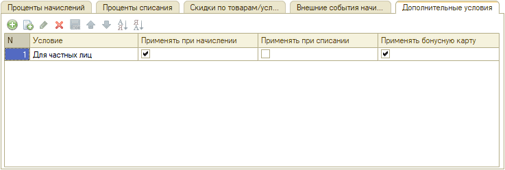 Например, на приведенном скриншоте задано <i>условие начисления бонусных баллов</i> только для частных лиц. Есть возможность настроить условия начисления или списания по конкретному подразделению или цеху. Признак <i>"Применять бонусную карту"</i> активирует проверку условия применения бонусных скидок (заданных на вкладке "Скидки по товарам/услугам"), например, на приведенном скриншоте – только для частных лиц. Условие представляет собой выбранное из справочника действие, которые описаны на языке 1С. Чтобы настроить дополнительные условия обратитесь в техническую поддержку компании "5 CИСТЕМ".</td></tr></table>

## Мастер настроек бонусных программ

С помощью [*Мастера настройки системы*](https://5systems.ru/help/master-nastroyki-sistemy) удобно настраивать регламентные задания по бонусной системе и автоматические действия по рассылке сообщений. Все настройки, относящиеся к бонусной системе, расположены на вкладке "Бонусная программа":

Из *Мастера настройки системы* можно открыть справочник "Бонусные программы", нажав кнопку-ссылку "Бонусные программы".

### Регламентные задания

Раздел позволяет перейти к подключению/отключению регламентных заданий, влияющих на работу бонусной системы:

1. *Активация бонусных баллов* - активирует начисленные за сделку бонусы спустя тот период времени, который был указан в параметрах бонусной программы (см. *[Настройка бонусной программы](#справочник-бонусные-программы)).* Если в параметрах бонусной программы установлен флаг "Использовать рассылку", то отправляется также сообщение клиенту согласно настройкам в блоке *Рассылка об активации бонусов*.
2. *Списание просроченных бонусных баллов* - списывает неиспользованные клиентами бонусы через указанное в параметрах (см. *[Настройка бонусной программы](#справочник-бонусные-программы))* количество дней после сделки.
3. *Оповещение о бонусных баллах* - списывает неиспользованные клиентами бонусы через указанное в параметрах количество дней после сделки (см. *[Настройка бонусной программы](#справочник-бонусные-программы)).* Если в параметрах бонусной программы установлен флаг *"Использовать рассылку",* то отправляется также сообщение клиенту согласно настройкам в блоке *Предупреждение о сгорании бонусов*.
4. *Обновление бонусной программы* - изменяет бонусную программу по дисконтной карте клиента в зависимости от суммы накоплений, указанной в карточке бонусной программы (см. *[Настройка бонусной программы](#справочник-бонусные-программы)).* Создает документ "Назначение товарных скидок" (*Документы → Ценообразование),* если в карточке бонусной программы заданы скидки на товары/работы.

Для активации и списания бонусов используется документ *"Корректировка бонусов"* (меню программы: *Маркетинг → Программа лояльности → Бонусная программа → Корректировки бонусов* или через типовое меню: *Документы → Бонусные программы → Корректировка бонусов).* При исполнении регламентных заданий Активация бонусных баллов и Списание просроченных бонусных баллов документ "Корректировка бонусов" создается автоматически.

Для перехода к настройке регламентного задания, нажмите ссылку с его наименованием:

Для активации регламентного задания необходимо, чтобы у него стоял флаг "*Использование"* и было настроено расписание. Пример см. в [*Мастер настройки системы → Регламентные задания*](https://5systems.ru/help/master-nastroyki-sistemy).

### Рассылка об активации бонусов

Настройка автоматического действия по отправке сообщения клиенту об активации начисленных ему бонусов. Отправка сообщения осуществляется, если включено регламентное задание "Активация бонусных баллов" (см. *[Регламентные задания](#регламентные-задания))* и в параметрах бонусной программы установлен флаг "Использовать рассылку" (см. *[Настройка бонусной программы](#справочник-бонусные-программы)).*

Для настройки установите каналы доставки сообщения (мессенджеры), куда будет отправляться сообщение клиенту:

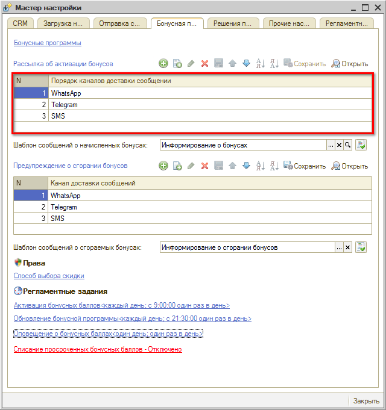

***Обратите внимание!*** Для отправки сообщений через мессенджеры, необходимо, чтобы была настроена интеграция с ними. Проверить наличие настроенной интеграции можно на вкладке "Отправка сообщений" Мастера настройки сообщений. См. [*Мастер настройки системы → Каналы доставки*](https://5systems.ru/help/master-nastroyki-sistemy).

Если указано несколько мессенджеров, то логика отправки сообщений следующая:

1. Система пытается отправить сообщение на канал доставки №1. 
   \- Если сообщение отправлено и клиент прочитал его, то на другие каналы сообщение не отправляется.
2. Если сообщение не отправлено или клиент не прочитал его в течение 10 минут, то Система отправляет сообщение на канал доставки №2. 
   \- Если сообщение отправлено и клиент прочитал его, то на другие каналы сообщение не отправляется.
3. Если сообщение не отправлено или клиент не прочитал его в течение 10 минут, то Система отправляет сообщение на канал доставки №3.

При необходимости измените текст преднастроенного шаблона сообщения:

Измененный шаблон можно протестировать, нажав кнопку  "Проверить шаблон сообщения" рядом с параметром "Шаблон сообщений о начисленных бонусах" (см. [*Мастер настройки системы → Проверка шаблона сообщения*](https://5systems.ru/help/master-nastroyki-sistemy)*).*

После внесения изменений в настройку блока "Рассылка об активации бонусов" не забудьте нажать кнопку "Сохранить":

### Предупреждение о сгорании бонусов

Настройка автоматического действия по отправке сообщения клиенту о скором сгорании его бонусов. Отправка сообщения осуществляется, если включено регламентное задание "Оповещение о бонусных баллах" (см. *[Регламентные задания](#регламентные-задания))* и в параметрах бонусной программы установлен флаг "Использовать рассылку" (см. *[Настройка бонусной программы](#справочник-бонусные-программы)).*

Настройка производится по аналогии с настройкой блока *Рассылка об активации бонусов*.

## Права и настройки бонусной системы

Для работы бонусной системы предусмотрены *[права и настройки](https://5systems.ru/help/ustanovka-prav-i-nastroek-polzovatelya)* (*Администрирование → Сервис → Пользователи и права → Установка прав и настроек* или в типовом меню: *Сервис → Установка прав и настроек):*

1. *Автоматически создавать дисконтную карточку клиенту* - если установлено значение "Да", то при начислении бонусов, но отсутствии у контрагента дисконтной/бонусной карты в программе, дисконтная/бонусная карта будет создаваться автоматически:  
   
2. *Автоматически использовать бонусные карты контрагентов* - если установлено значение "Да", то в документы "Заказ-наряд" и "Реализация товаров" будет автоматически подставляться дисконтная/бонусная карта контрагента, если она у него есть:  
   

## Фоновые задания

В системе существуют фоновые задания, непосредственно связанные с бонусной системой - перечислены в разделе [*Регламентные задания*](#регламентные-задания). Запуск фоновых заданий происходит по ссылке меню программы: Сервис → Установка прав и настроек, вкладка "Фоновые задания".

Настроить и активировать регламентные задания можно через редактирование регламентного задания на вкладке "Фоновые задания" (альтернативный способ настройки через [*Мастера настройки системы*](https://5systems.ru/help/master-nastroyki-sistemy)*).* Если фонового задания по умолчанию нет в списке регламентных заданий, его необходимо создать по кнопке "Добавить".

---

**Теги:** бонусная система, настройка, правила начисления, бонусные программы, проценты, сгорание бонусов

