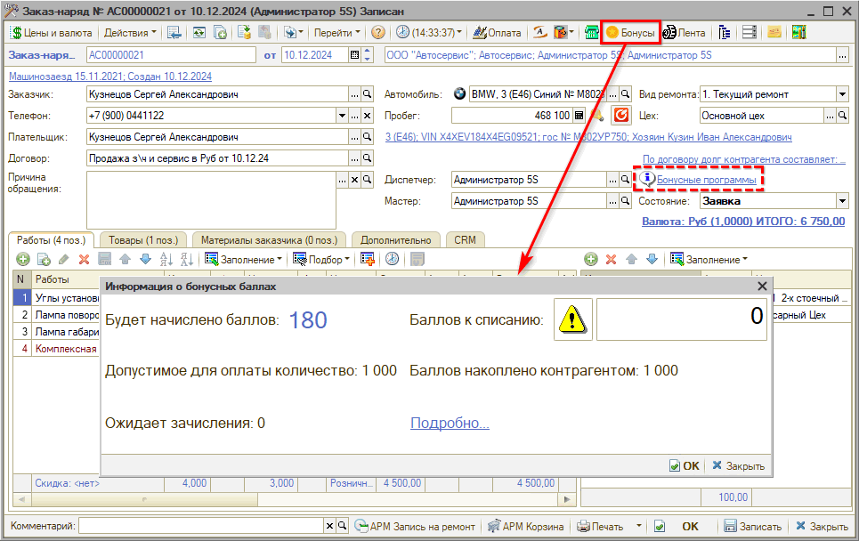
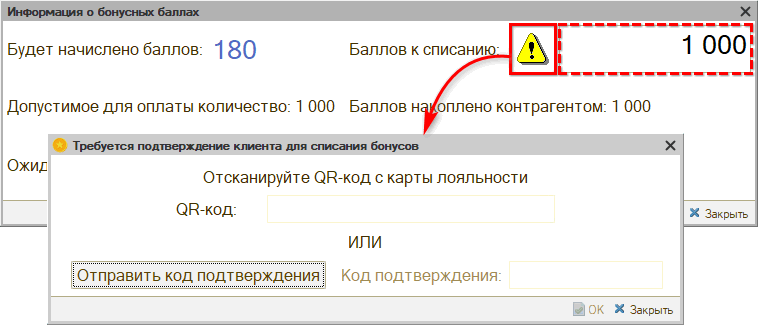
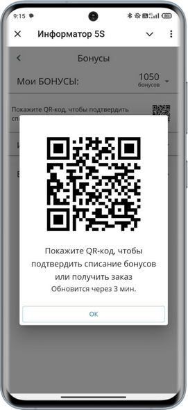
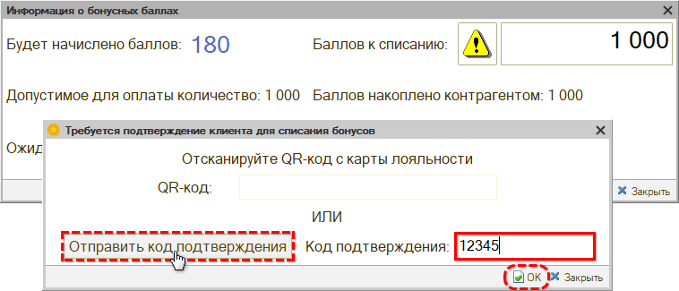
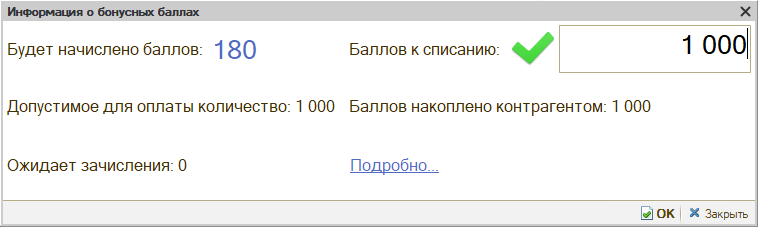
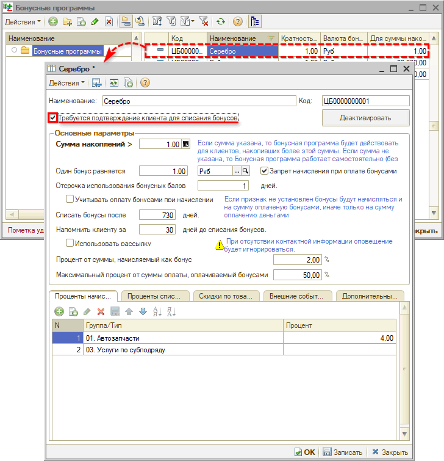
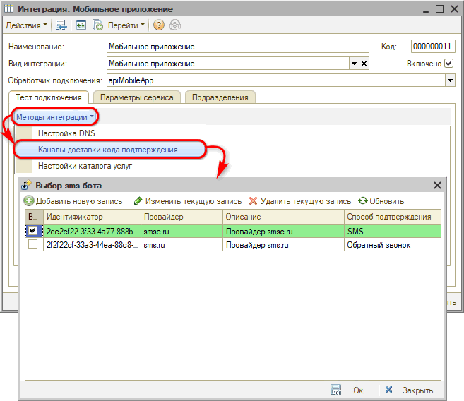

# Подтверждение списания бонусов

<table><tr><td><b>Время чтения:</b> 5 мин.</td><td><b>Обновлено:</b> 17.12.2024</td></tr></table>

Источник: https://www.5systems.ru/help/podtverzhdenie-spisaniya-bonusov

> *Актуально для релиза 2.8.1.*

## Содержание

1. [Введение](#введение)
2. [Процесс списания бонусов](#процесс-списания-бонусов)
   - [1. Сканирование QR-кода клиента в 5S LINK](#1-сканирование-qr-кода-клиента-в-5s-link)
   - [2. Подтверждение по коду из SMS](#2-подтверждение-по-коду-из-sms)
3. [Настройки](#настройки)
   - [1. Настройка в бонусной программе](#1-настройка-в-бонусной-программе)
   - [2. Настройка канала отправки сообщения](#2-настройка-канала-отправки-сообщения)
   - [3. Настройка для сканирования QR-кода клиента](#3-настройка-для-сканирования-qr-кода-клиента)

## Введение

Для контроля операций с бонусными баллами создан механизм *подтверждения списания.* Каждое списании бонусов клиент должен подтвердить по QR-коду из мобильного приложения 5S LINK либо по коду из SMS.

Также см. статьи: *[Работа с бонусами клиентов](https://www.5systems.ru/help/rabota-s-bonusami-klientov), [Настройка бонусной системы](https://www.5systems.ru/help/nastroyka-bonusnoy-sistemy), [Настройка интеграции с 5S LINK v2](https://www.5systems.ru/help/nastroyka-prilozheniya-5s-link-v2) и [Подключение сканера штрихкодов](https://www.5systems.ru/help/podklyuchenie-skanera-shtrikhkodov).*

## Процесс списания бонусов

Для списания бонусов при приеме оплаты от клиента следует в документе "Заказ-наряд" или “Реализация товаров” нажать кнопку *“Бонусы”* на верхней панели или ссылку "Бонусные программы":

В открывшемся окне “Информация о бонусных баллах” необходимо ввести количество бонусов к списанию и нажать кнопку со значком

. Открывается окно *“Требуется подтверждение клиента для списания бонусов”:*

***Два способа подтверждения:***

**1.** Путем сканирования QR-кода клиента из мобильного приложения 5S LINK

**2.** По коду из SMS

### 1. Сканирование QR-кода клиента в 5S LINK

В мобильном приложении 5S LINK у клиента отображается информация по бонусным баллам и QR-код клиента, который можно открыть для сканирования:

Для считывания QR-кода требуется, чтобы у пользователя был подключен и настроен сканер с поддержкой двумерных штрих-кодов.

Считывание необходимо производить из открытой формы *подтверждения списания бонусов.* При считывании сканером QR-кода клиента окно подтверждения автоматически закрывается, на форме “Информация о бонусных баллах” значок

сменяется зеленой галочкой

– см. *[ниже](#rezult).*

### 2. Подтверждение по коду из SMS

Следует нажать кнопку “Отправить код подтверждения”. Клиенту придет SMS с кодом, который необходимо ввести в поле “Код подтверждения” и нажать “ОК”:

*В результате подтверждения* любым из способов на форме работы с бонусами вместо кнопки со значком предупреждения

появляется зеленая галочка

, которая означает, что можно списать бонусы:

## Настройки

### 1. Настройка в бонусной программе

Для включения механизма подтверждения списания бонусов необходимо в карточке бонусной программы установить флаг “Требуется подтверждение клиента для списания бонусов”:

Настройку необходимо произвести в карточках всех используемых бонусных программ.

### 2. Настройка канала отправки сообщения

Для подтверждения списания бонусов через отправку кода по SMS должна быть подключена интеграция с сервисом sms.ru или smsc.ru в интеграции с Мобильным приложением:

Подробнее см. в статье *[Настройка интеграции с 5S LINK v2](https://www.5systems.ru/help/nastroyka-prilozheniya-5s-link-v2#sms).*

### 3. Настройка для сканирования QR-кода клиента

У пользователей, принимающих оплату от клиентов, должен быть подключен сканер штрихкодов – см. статью *"[Подключение сканера штрихкодов](https://www.5systems.ru/help/podklyuchenie-skanera-shtrikhkodov)".*

Также клиент должен быть зарегистрирован в мобильном приложении. Проверить регистрацию можно в карточке [контрагента](https://www.5systems.ru/help/kontragenty-i-kontakty-0#vklcrm) на вкладке *CRM → Внешние пользователи,* а также в карточке справочника *“Внешние пользователи”* на вкладке “Контрагенты” должно быть установлено соответствие с контрагентом и активирован признак “Основной” – подробнее см. *[статью](https://www.5systems.ru/help/vneshnie-polzovateli).*

---

**Теги:** бонусы, списание бонусов, подтверждение, код подтверждения, sms

