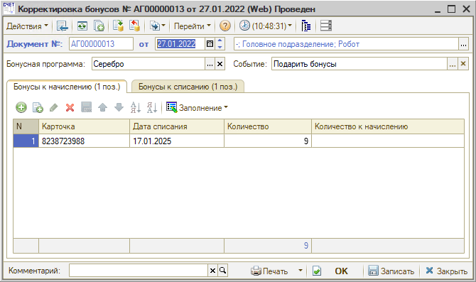
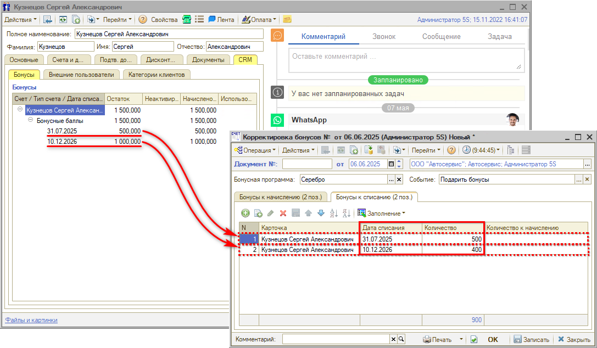
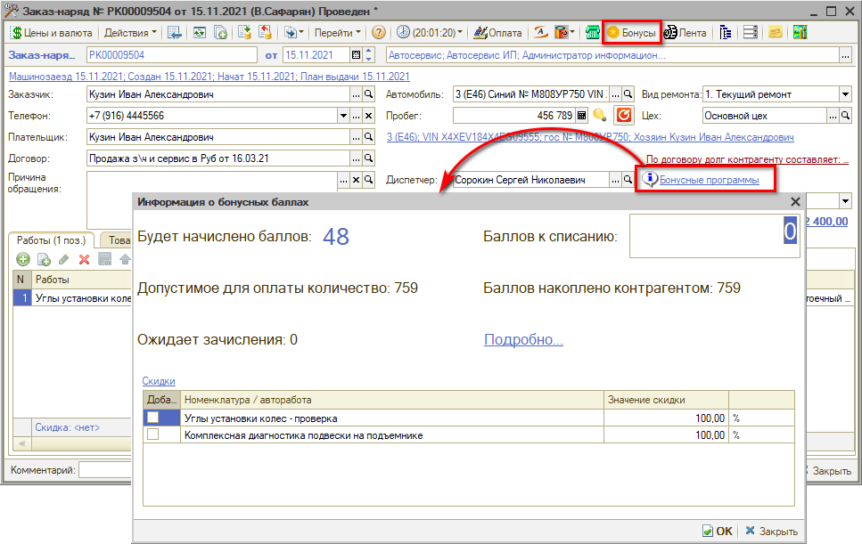
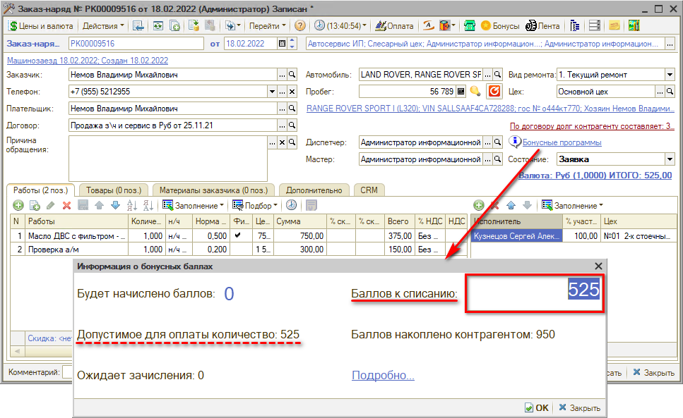
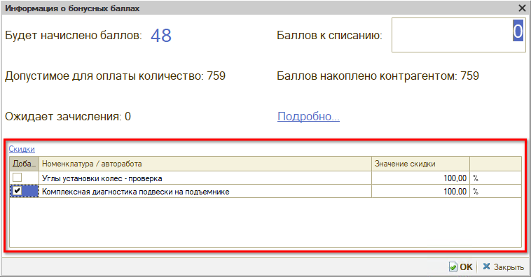
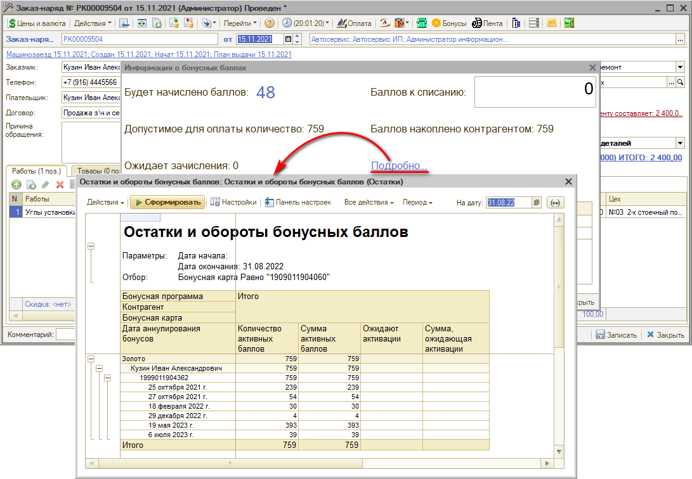

# Работа с бонусами клиентов

<table><tr><td><b>Время чтения:</b> 17 мин.</td><td><b>Обновлено:</b> 06.06.2025</td></tr></table>

Источник: https://www.5systems.ru/help/rabota-s-bonusami-klientov

## Содержание

1. [Введение](#введение)
2. [Активация и списание бонусов вручную](#активация-и-списание-бонусов-вручную)
3. [Начисление бонусов](#начисление-бонусов)
4. [Оплата бонусами](#оплата-бонусами)
   - [Списание бонусов при продаже](#списание-бонусов-при-продаже)
   - [Продажа товаров/работ со скидкой по бонусной программе](#продажа-товаровработ-со-скидкой-по-бонусной-программе)
5. [Отчеты](#отчеты)

## Введение

Функционал бонусных программ позволяет:

- привязывать дисконтные карты клиентам, действующие в рамках определенной бонусной программы;
- начислять бонусы за товар или работу, реализованные через Заказ-наряд;
- предупреждать клиента по SMS или электронной почте о сгорании бонусов;
- использовать начисленные бонусы клиентом при следующей покупке.
- производить гибкие настройки бонусных программ (автоматическая смена бонусной программы в зависимости от суммы накоплений клиентом, предложение работ в подарок, начисление бонусов через внешние события, например, День рождения);
- отправлять сообщения об активации и сгорании бонусов через мессенджеры: MAX, ВКонтакте, Telegram и т.д.

В рамках данной статьи рассматривается активация/списание бонусов вручную, начисление и оплата бонусами товаров и работ в Заказ-наряде.

## Активация и списание бонусов вручную

Для активации начисленных клиенту бонусов используется документ *"Корректировка бонусов"* (*Маркетинг → Программа лояльности → Бонусная программа → Корректировки бонусов).*

Документы "Корректировка бонусов" могут создаваться оператором вручную каждый день – как правило, на следующий день после начисления. Однако рекомендуется настроить регламентные задания "Активация бонусных баллов" и "Списание просроченных бонусных баллов", которые будут создавать и проводить документы в фоновом режиме (см. [*Настройка бонусной системы*](../Настройка%20бонусной%20системы/nastroyka-bonusnoy-sistemy.md#регламентные-задания)*).*

Документ "Корректировка бонусов" заполняется по кнопке *Заполнение → Заполнить бонусами к активации*. На вкладке "Бонусы к начислению" указывается поступление бонусов (на примере: +9 активных бонуса), на вкладке "Бонусы к списанию" – их списание (-9 начисленных бонусов):

Списание просроченных бонусов также делается документом "Корректировка бонусов", в этом случае необходимо перейти на вкладку "Бонусы к списанию" и нажать на кнопку *Заполнение → Заполнить просроченными бонусами*. Одновременно одним и тем же документом и активировать новые бонусы, и списывать просроченные не рекомендуется.

При списании бонусов вручную в колонке "Дата списания" необходимо указывать дату, в которую данное количество бонусов должно было списаться. В случае если требуется списать большее количество бонусов, чем доступно на определенную дату, требуется разбить количество бонусов на разные строки и указать в каждой из них нужную дату. Даты списания бонусов можно увидеть в карточке клиента на вкладке *CRM → Бонусы.*

*Пример:* Требуется списать 900 бонусов (например, передать их другому клиенту-родственнику). В первую строку Корректировки бонусов добавлено 500 бонусов с более ранней датой списания, во вторую строку – остальные 400 бонусов с более поздней датой списания:

На основании документа "Корректировка бонусов" можно ввести документы "SMS" и "Электронное сообщение" и вручную разослать клиентам оповещения об активации или, наоборот, списании бонусных баллов.

## Начисление бонусов

В зависимости от права бонусной системы "Автоматически создавать дисконтную карточку клиенту" (см. [*Настройка бонусной системы → Права и настройки бонусной системы*](../Настройка%20бонусной%20системы/nastroyka-bonusnoy-sistemy.md#права-и-настройки-бонусной-системы)*)* баллы начисляются только в тех заказ-нарядах, в которых указана дисконтная карта клиента с активной бонусной программой, ИЛИ начисляются всегда и при этом дисконтная карта создается автоматически.

Если право "Автоматически создавать дисконтную карточку клиенту" = "Нет", то дисконтная карта в заказ-наряде либо указывается вручную (на вкладке "Дополнительно" или в форме, которая открывается по кнопке "Цены и валюта"), либо ставится автоматически при сканировании дисконтной карты, либо, если право "Автоматически использовать бонусные карты контрагентов" = "Да" (см. [*Настройка бонусной системы → Права и настройки бонусной системы*](../Настройка%20бонусной%20системы/nastroyka-bonusnoy-sistemy.md#права-и-настройки-бонусной-системы)*),* автоматически подтягивается по контрагенту.

Если в Заказ-наряд выбрана дисконтная карта с бонусной программой, то на верхней панели активна кнопка *"Бонусы",* а также над полем состояния Заказ-наряда отображается ссылка *"Бонусные программы"*​​​​​​. При нажатии на кнопку или ссылку открывается форма *"Информация о бонусных баллах":*

На форме "Информация о бонусных баллах" отображаются данные:

- *Будет начислено баллов…* – сколько баллов будет начислено на дисконтную карту клиента после закрытия заказ-наряда.
- *Допустимое для оплаты количество…* – максимальное количество бонусов, которое можно потратить на данную сделку.
- *Ожидает зачисления…* – по условиям ранее сделанных *настроек*, клиент не может использовать начисленные ему баллы сразу после заключения сделки. В данном примере нет ожидающих зачисления бонусов.
- *Баллов к списанию…* – строка заполняется вручную, когда клиент хочет потратить накопленные им баллы на заказ-наряд. см. [*Оплата бонусами*](#оплата-бонусами).
- *Баллов накоплено контрагентом…* – количество активных баллов на дисконтной карте клиента.
- *По ссылке "Подробно…"* в отдельном окне открывается и формируется отчет "Остатки и обороты бонусных баллов". Отчет выводит данные отдельно по начисленным и активированным бонусам.

## Оплата бонусами

### Списание бонусов при продаже

Клиент может использовать бонусы для оплаты любой последующей сделки при условии, что эти бонусы были активированы и не были просрочены. Для этого в документе "Заказ-наряд" необходимо нажать на ссылку "Бонусные программы" и ввести количество используемых бонусов:

Бонусы будут переведены в указанный ранее номинал в [*настройках*](../Настройка%20бонусной%20системы/nastroyka-bonusnoy-sistemy.md), получившаяся сумма будет распределена по суммам товаров и работ; итог будет отображаться в колонке "Сумма скидки бонусами":

Информация по начисленным и списанным бонусам выводится в печатной форме "Заказ-наряд".

### Продажа товаров/работ со скидкой по бонусной программе

Если в рамках бонусной программы настроены скидки на товары/работы (см. [*вкладку "Скидки по товарам/услугам" в настройках бонусной системы*](https://5systems.ru/help/nastroyka-bonusnoy-sistemy#skidki)*),* то в окне "Информация о бонусных баллах" они отобразятся для выбора в документ:

Для выбора доступны те товары/работы со скидкой, которые клиент еще не использовал.

Выбранные товары или работы отобразятся на соответствующей вкладке в Заказ-наряде с примененной скидкой.

## Отчеты

Для отображения информации по бонусам используется отчет "Остатки и обороты бонусных баллов". В данном отчете показывается количество начисленных и активированных баллов по всем бонусным программам, в том числе прекратившим своё действие (если они действовали в указанный период времени). Настройки отчета стандартные. Отдельно можно вывести информацию по клиенту и документам движения.

Отчет также можно открыть из заказ-наряда по ссылке "Подробно…" в окне "Информация о бонусных баллах". В этом случае в отчете устанавливается отбор по дисконтной карте клиента:

---

**Теги:** бонусы, бонусная система, начисление бонусов, списание бонусов, бонусный счет, клиент

