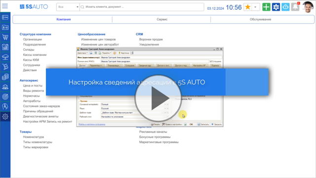
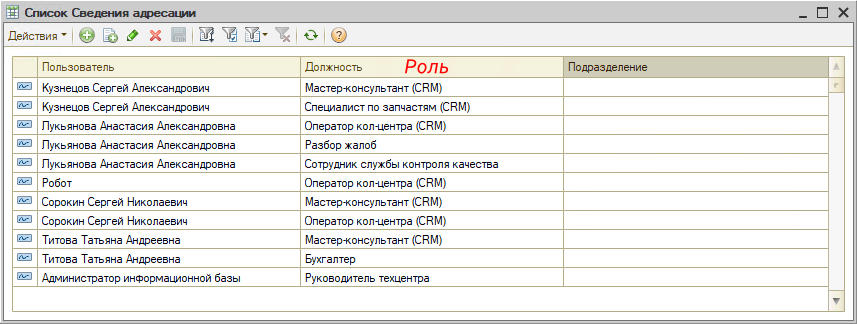
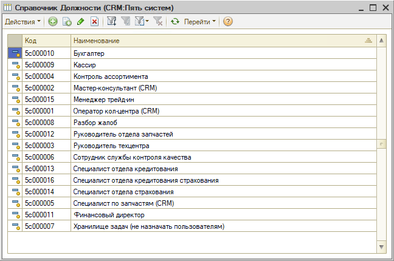

# Адресация задач в CRM по исполнителям

<table><tr><td><b>Время чтения:</b> 3 мин.</td><td><b>Обновлено:</b> 04.09.2026</td></tr></table>

Источник: https://www.5systems.ru/help/adresaciya-zadach-v-crm-po-ispolnitelyam

## Содержание

1. [Введение](#введение)
2. [Настройка сведений адресации](#настройка-сведений-адресации)
3. [Описание должностей CRM](#описание-должностей-crm)

## Введение

Для работы со Сделками и задачами выделены специальные роли для сотрудников. В зависимости от роли сотруднику адресуются определенные типы задач для исполнения.

Настройка ролей происходит в регистре сведений *Сведения адресации* путем назначения должности CRM пользователю, под которым работает сотрудник.

## Настройка сведений адресации

Регистр *"Сведения адресации"* можно открыть через меню интерфейса *Администрирование → Компания → CRM → Сведения адресации* или через стандартное меню *CRM → Все операции → Регистры сведений → Сведения адресации:*

Один сотрудник может исполнять несколько ролей, а на одну роль может быть назначено несколько сотрудников в рамках одного и того же подразделения или без учета подразделения - в рамках всей компании.

Если не указан определенный сотрудник в качестве исполнителя задачи, то задача адресуется на должность и подразделение, которые определены в регистре сведений *Сведения адресации*.

## Описание должностей CRM

| **Должность** | **Описание** |
| --- | --- |
| **Мастер-консультант (CRM)** | Назначается специалистам автосервиса, которые работают с клиентами |
| **Оператор кол-центра (CRM)** | Назначается сотрудникам, которые занимаются обработкой заявок клиентов (входящих обращений) без назначенного исполнителя: пропущенный звонок, заявка с сайта, входящий звонок |
| **Разбор жалоб** | Назначается сотрудникам, которые занимаются задачами по разбору жалоб |
| **Сотрудник службы контроля качества** | Назначается сотрудникам, которые занимаются задачами для опроса клиентов о качестве обслуживания |
| **Специалист по запчастям (CRM)** | Назначается сотрудникам, которые занимаются задачами на подбор запчастей |
| **Управляющий директор** | На данный момент не используется при адресации Пользователи с данной должностью видят все записи в [Журнале передачи смен](https://5systems.ru/help/peredacha-smen) |
| **Хранилище задач (не назначать пользователям)** | Служебная запись, не подлежит назначению на пользователя |

Отдельный блок ролей предусмотрен для работы с функционалом *"[Контроль неликвидов](https://5systems.ru/taxonomy/term/227)":* см. описание ролей в [статье](https://5systems.ru/help/nastroyka-prav-dostupa-k-kontrolyu-nelikvidov#rolinelikv).

---

**Теги:** задачи, адресация задач, исполнители, CRM, роли, правила адресации

