

# Работа с задачами

<table><tr><td><b>Время чтения:</b> 41 мин.</td><td><b>Обновлено:</b> 24.06.2022</td></tr></table>

Источник: https://www.5systems.ru/help/rabota-s-zadachami

## Содержание

1. [Работа с типами задач бизнес-процесса «Контакт с клиентом»](#работа-с-типами-задач-бизнес-процесса-контакт-с-клиентом)
   - [Укажите результат обращения (Идентификация клиента)](#укажите-результат-обращения-идентификация-клиента)
   - [Обработайте пропущенный звонок (Пропущенный звонок)](#обработайте-пропущенный-звонок-пропущенный-звонок)
   - [Продолжение переговоров, укажите результат обращения (Продолжение переговоров)](#продолжение-переговоров-укажите-результат-обращения-продолжение-переговоров)
   - [Задача отложена, укажите результат обращения (Задача отложена)](#задача-отложена-укажите-результат-обращения-задача-отложена)
   - [Перезвоните клиенту, укажите результат обращения (Перезвонить клиенту)](#перезвоните-клиенту-укажите-результат-обращения-перезвонить-клиенту)
   - [Задача перенаправлена, укажите результат обращения (Перенаправить задачу на другого пользователя)](#задача-перенаправлена-укажите-результат-обращения-перенаправить-задачу-на-другого-пользователя)
2. [Работа с типами задач бизнес-процесса «Обращение в СТО»](#работа-с-типами-задач-бизнес-процесса-обращение-в-сто)
   - [Категория «Услуги по ремонту»](#категория-услуги-по-ремонту)
   - [Примите автомобиль клиента (Приемка автомобиля)](#примите-автомобиль-клиента-приемка-автомобиля)
      - [Продолжение переговоров, примите автомобиль клиента (Продолжение переговоров)](#продолжение-переговоров-примите-автомобиль-клиента-продолжение-переговоров)
      - [Задача отложена, примите автомобиль клиента (Задача отложена)](#задача-отложена-примите-автомобиль-клиента-задача-отложена)
      - [Перезвоните клиенту, примите автомобиль клиента (Перезвонить клиенту)](#перезвоните-клиенту-примите-автомобиль-клиента-перезвонить-клиенту)
      - [Задача перенаправлена, примите автомобиль клиента (Перенаправить задачу на другого пользователя)](#задача-перенаправлена-примите-автомобиль-клиента-перенаправить-задачу-на-другого-пользователя)
      - [Оформите продажу](#оформите-продажу)
      - [Пригласите клиента на ТО](#пригласите-клиента-на-то)
      - [Пригласите клиента по рекомендациям](#пригласите-клиента-по-рекомендациям)
      - [Создана проценка, продолжите работу](#создана-проценка-продолжите-работу)
   - [Категория «Запасные части»](#категория-запасные-части)
3. [Бизнес-процесс «Продажа запчастей»](#бизнес-процесс-продажа-запчастей)
   - [Оформите продажу, укажите результат (Указать результат)](#оформите-продажу-укажите-результат-указать-результат)
   - [Указать результат](#указать-результат)
   - [Продолжение звонка](#продолжение-звонка)
   - [Продолжение переговоров, укажите результат (Продолжение переговоров)](#продолжение-переговоров-укажите-результат-продолжение-переговоров)
   - [Задача отложена, оформите продажу (Задача отложена)](#задача-отложена-оформите-продажу-задача-отложена)
   - [Задача отложена, зарезервируйте товар (Задача отложена)](#задача-отложена-зарезервируйте-товар-задача-отложена)
   - [Перезвоните клиенту, оформите продажу (Перезвонить клиенту)](#перезвоните-клиенту-оформите-продажу-перезвонить-клиенту)
   - [Перезвоните клиенту, зарезервируйте товар (Перезвонить клиенту)](#перезвоните-клиенту-зарезервируйте-товар-перезвонить-клиенту)
   - [Задача перенаправлена, оформите продажу (Перенаправить)](#задача-перенаправлена-оформите-продажу-перенаправить)
   - [Задача перенаправлена, установите резерв (Перенаправить)](#задача-перенаправлена-установите-резерв-перенаправить)
4. [Прочие типы задач](#прочие-типы-задач)
   - [Выполнить опрос по качеству](#выполнить-опрос-по-качеству)
   - [Обработайте жалобу клиента (Зарегистрирована жалоба клиента)](#обработайте-жалобу-клиента-зарегистрирована-жалоба-клиента)
   - [Дайте объяснительную по нарушению](#дайте-объяснительную-по-нарушению)
   - [Подберите запчасти](#подберите-запчасти)
   - [Произвольная задача](#произвольная-задача)
5. [Задачи Робота регламентных операций](#задачи-робота-регламентных-операций)
   - [Товары не поставлены вовремя, согласуйте новые сроки](#товары-не-поставлены-вовремя-согласуйте-новые-сроки)
   - [Все товары в наличии, пригласите клиента](#все-товары-в-наличии-пригласите-клиента)
   - [Товары заказа есть на складе, установите резерв](#товары-заказа-есть-на-складе-установите-резерв)

*Статья редактируется*

Все возможные типы задач представлены в справочнике «Типы задач исполнителя» (CRM → Справочники → Типы задач исполнителя). По типу задач можно указать отображаемое имя в поле «Наим. задачи» и *настроить оповещение (см. [Напоминания по задачам](../../Работа%20с%20клиентами/Напоминания%20по%20задачам/napominaniya-po-zadacham.md))*. Рассмотрим работу с основными типами задач.

*Примечание:* В данной статье названия задач даются в следующем виде → *<Заголовок задачи в открывающейся форме задачи (Название задачи в справочнике «Типы задач исполнителя»)>.*

## Работа с типами задач бизнес-процесса «Контакт с клиентом»

Схема переходов по типам задач бизнес-процесса «Контакт с клиентом»:

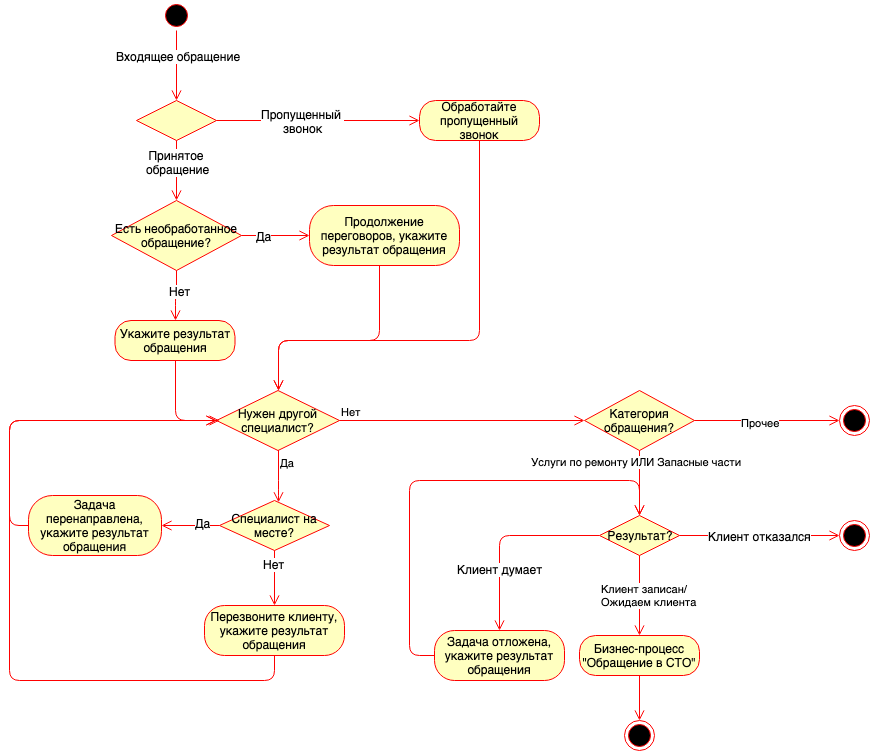

### Укажите результат обращения (Идентификация клиента)

*Идентификация клиента (Контакт с клиентом) – «Укажите результат обращения»*

**Варианты инициации:**

Задача создается при приеме входящего *обращения любого из видов* (см. [*Работа с входящими обращениями*](https://5systems.ru/help/rabota-s-vkhodyaschimi-obrascheniyami)), кроме вида «Пропущенный звонок», если нет ранее открытого обращения. Также создается при перенаправлении другим специалистом.

**Адресация:**

Задача адресуется сотрудникам, которым *назначена должность* (см. *[Адресация задач в CRM по исполнителям](../Адресация%20задач%20в%20CRM%20по%20исполнителям/adresaciya-zadach-v-crm-po-ispolnitelyam.md))* «Оператор кол-центра (CRM)».

**Срок исполнения:**

Срок исполнения задачи равен дате и времени обращения клиента, т.е. задача сразу отображается просроченной (красной) в АРМ Рабочий стол. При перенаправлении или откладывании задачи новые дата и время задаются вручную.

**Варианты завершения:**

Общий алгоритм обработки задачи см. в [*Работа с входящими обращениями → Обработка входящего обращения*](https://5systems.ru/help/rabota-s-vkhodyaschimi-obrascheniyami).

Рассмотрим подробнее работу с целевыми обращениями (см. [*Категории обращения*](https://5systems.ru/help/kategorii-obrascheniya)): Услуги по ремонту и Запасные части.

**А) Услуги по ремонту:**

Если клиент в процессе обращения уточнял информацию по ремонту автомобиля, то в задаче помимо идентификации клиента:

- кратко описываются потребности клиента в поле «Комментарий со слов клиента»,
- указываются типы работ, необходимые для ремонта, в поле «Описание работ».
- фиксируется один из результатов обращения:
  1. *Клиент записан* – произведена запись клиента на ремонт. Т.е. произведена проценка и создана Запись на ремонт (см. *варианты действий* далее).
  2. *Отложить задачу* – клиент еще не записался и не отказался, необходимо связаться с ним позже и уточнить результат. При выборе этого варианта указывается дата и время исполнения задачи (можно отложить для самого себя). Текущую задачу нужно «Выполнить, закрыть», при этом создастся новая аналогичная задача *Задача отложена, укажите результат обращения (Задача отложена)*. 
     *См. [видеоинструкцию](https://youtu.be/svPG0xeQ0X0):*

     [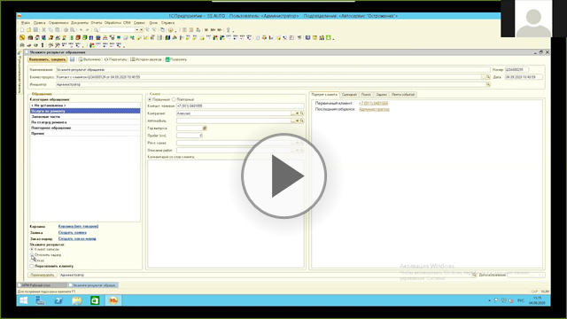](https://youtu.be/svPG0xeQ0X0)

  3. Если у вас нет возможности исполнить задачу, то необходимо перенаправить задачу на другого специалиста (или своего сменщика) (см. [*Работа с входящими обращениями → Перенаправление обращения на другого специалиста*](https://5systems.ru/help/rabota-s-vkhodyaschimi-obrascheniyami)). В результате исполнения задачи создается новая задача *Задача перенаправлена, укажите результат обращения (Перенаправить задачу на другого пользователя)* или *Перезвоните клиенту, укажите результат обращения (Перезвонить клиенту)*, если при перенаправлении установлен флажок «Перезвонить клиенту». Можно воспользоваться кнопкой внизу «Перенаправить» – когда нужно моментально перенаправить задачу вместе со звонком.
  4. *Отказ* – клиент не заинтересован в услугах по ремонту. Обязательно указывается причина отказа, т.к. это будет влиять на аналитику (*примеч.: не рекомендуется выбирать причину «Другое», чтобы не портить отчетность*).

Для уточнения в процессе обработки обращения стоимости работ и запчастей создайте Корзину по кнопке-ссылке «Корзина (Нет товаров)»:

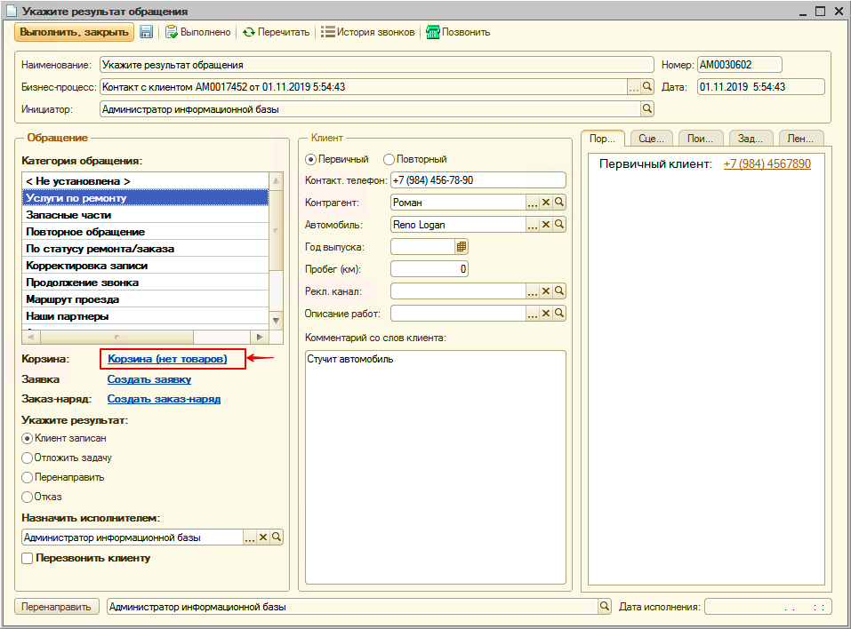

Как подобрать и создать Заказ покупателя в АРМ Корзина см. [*Работа в АРМ Корзина*](../../Проценка%20запчастей%20и%20работ/Работа%20в%20АРМ%20Корзина/rabota-v-arm-korzina.md). После сохранения Корзины, ссылка на нее отобразится в задаче. В случае согласия клиента на ремонт из «Корзины» перейдите к «Записи на ремонт».

Если нужен простой ремонт, не требующий калькуляции (или услуги автомойки или шиномонтажа), можно сразу создать «Заявку на ремонт» по кнопке-ссылке «Создать заявку → План ремонта»:

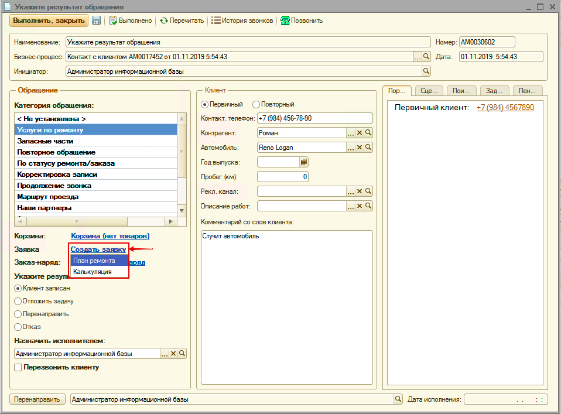

Или создать «Калькуляцию», а из «Калькуляции» создать «Запись на ремонт». Ссылка на созданную «Запись на ремонт» отобразится в задаче.

При создании «Записи на ремонт» задача автоматически исполнится с результатом «Клиент записан» и создастся задача *Примите автомобиль клиента (Приемка автомобиля)* в рамках бизнес-процесса «Обращение в СТО».

Если клиент сразу приехал в СТО и есть возможность принять автомобиль клиента, то создайте документ «Заказ-наряд» из обращения по кнопке-ссылке «Создать заказ-наряд»:

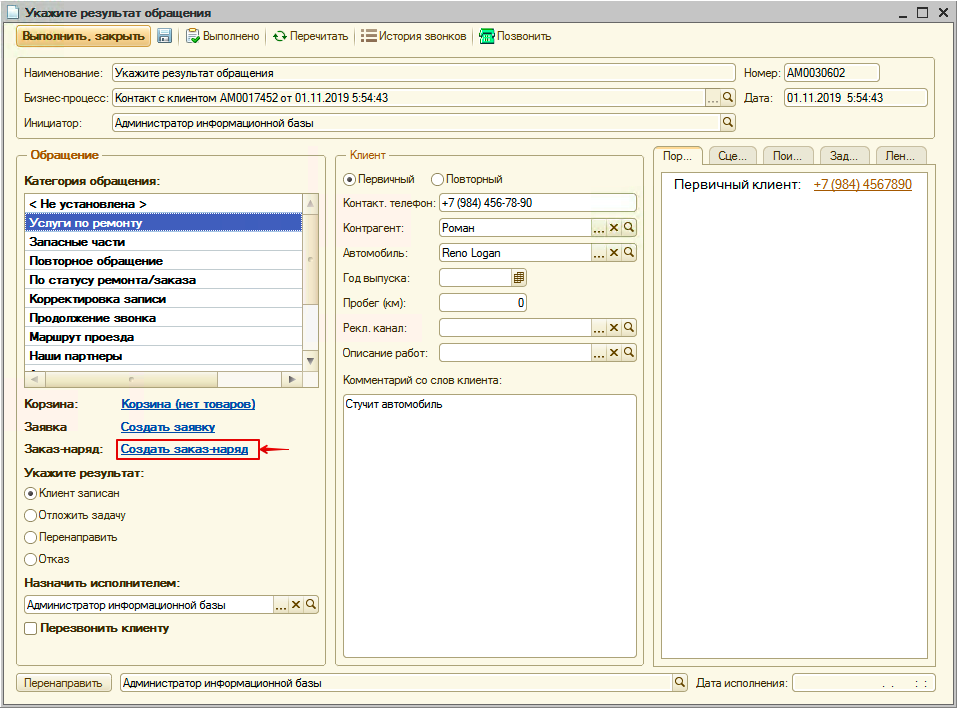

После записи Заказ-наряда, ссылка на него отобразится в задаче. 
При создании Заказ-наряда задача автоматически исполнится с результатом «Клиент записан», создастся и автоматически исполнится задача *Примите автомобиль клиента (Приемка автомобиля)* с результатом «Клиент заехал» в рамках бизнес-процесса «Обращение в СТО».

Пример работы с задачей см. [*Примеры работы с входящим обращением → Задача по услугам по ремонту*](https://5systems.ru/help/primery-raboty-s-vkhodyaschim-obrascheniem).

**Б) Запасные части:**

Если клиент заинтересован только в приобретении запасных частей, то в задаче помимо идентификации клиента:

- кратко описываются потребности клиента в поле «Комментарий со слов клиента»,
- фиксируется один из результатов обращения (*обратите внимание: при выборе другой категории обращения нижняя часть поля «Обращение» меняется*):  
  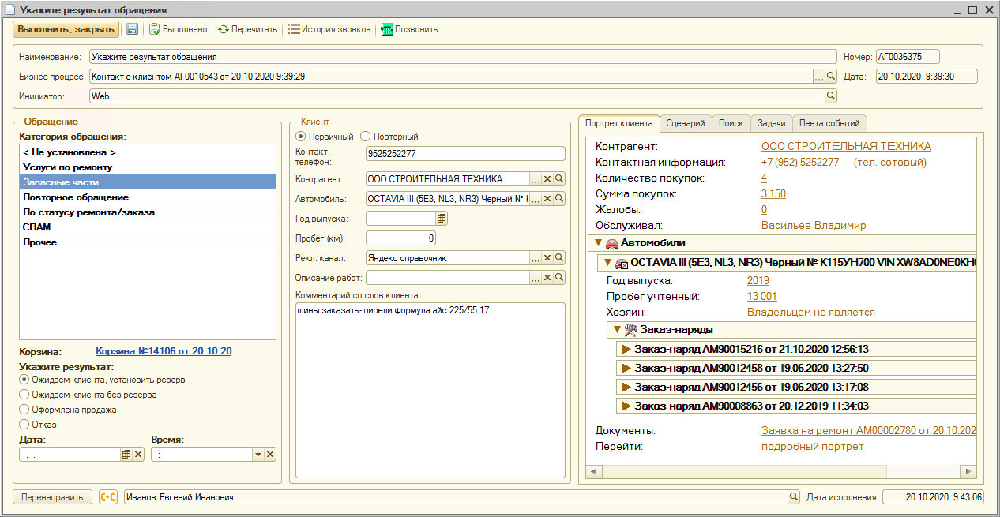
  1. *Ожидаем клиента, установить резерв* – создан документ «Заказ покупателя». Для оформления заказа покупателя предварительно создается Корзина по кнопке-ссылке «Корзина (Нет товаров)». Как подобрать и создать Заказ покупателя в АРМ Корзина см. *[Работа в АРМ Корзина](../../Проценка%20запчастей%20и%20работ/Работа%20в%20АРМ%20Корзина/rabota-v-arm-korzina.md)*. После сохранения Корзины, ссылка на нее отобразится в задаче.
  2. *Ожидаем клиента без резерва* – клиент еще не согласился приобрести запчасти и не отказался. В этом случае необходимо продолжать работать с ним и уточнить его решение. По задаче проставляется исполнитель и дата исполнения.
  3. *Оформлена продажа* – создан документ «Реализация товаров» из АРМ Корзина или на основании документа «Заказ покупателя». Работа с обращением клиента завершается.
  4. *Отказ* – клиент не заинтересован в приобретении запчастей. Обязательно указывается причина отказа (это будет влиять на аналитику). Работа с обращением клиента завершается.

При выборе результата «Ожидаем клиента, установить резерв» или «Ожидаем клиента без резерва» создастся задача *Оформите продажу, укажите результат (Указать результат)* в рамках бизнес-процесса «Обращение в СТО».

Если у вас нет возможности исполнить задачу, то необходимо перенаправить задачу на другого специалиста (см. [*Работа с входящими обращениями → Перенаправление обращения на другого специалиста*](https://5systems.ru/help/rabota-s-vkhodyaschimi-obrascheniyami)). В результате исполнения задачи, создается новая задача *Задача перенаправлена, укажите результат обращения (Перенаправить задачу на другого пользователя)* или *Перезвоните клиенту, укажите результат обращения (Перезвонить клиенту)*, если при перенаправлении установлен флажок «Перезвонить клиенту».

### Обработайте пропущенный звонок (Пропущенный звонок)

*Пропущенный звонок (Контакт с клиентом) – «Обработайте пропущенный звонок»*

**Варианты инициации:**

Принцип создания задачи (см. [*Работа с входящими обращениями → Пропущенный звонок*](https://5systems.ru/help/rabota-s-vkhodyaschimi-obrascheniyami)):

Телефония отслеживает все пропущенные звонки. Как только выявляется пропущенный звонок, в CRM-модуле создается бизнес-процесс «Контакт с клиентом» с видом обращения «Пропущенный звонок», а у операторов выходит напоминание о новой задаче «Обработайте пропущенный звонок».

**Адресация:**

Задача адресуется сотрудникам, которым [*назначена должность*](../Адресация%20задач%20в%20CRM%20по%20исполнителям/adresaciya-zadach-v-crm-po-ispolnitelyam.md) «Оператор кол-центра (CRM)».

**Срок исполнения:**

Сроком исполнения задачи являются текущие дата и время, когда задача сформировалась. Таким образом, задача сразу становится просроченной и отображается в АРМ Рабочий стол красным цветом.

**Варианты завершения:**

Требуется определить причину потери звонка (отображается в задаче) и позвонить клиенту, нажав на кнопку .

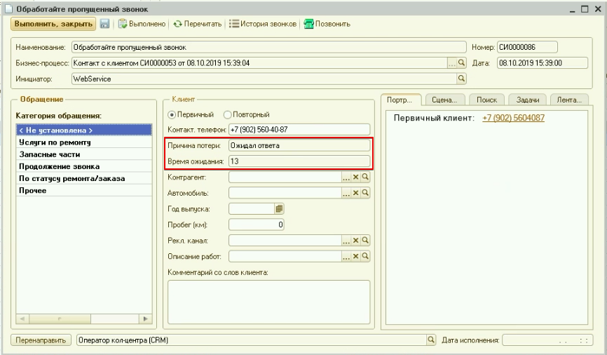

При установке контакта с клиентом обработка задачи аналогична обработке задачи *Укажите результат обращения (Идентификация клиента)* (см. пункт *«Варианты завершения»*).

### Продолжение переговоров, укажите результат обращения (Продолжение переговоров)

*Продолжение переговоров (Контакт с клиентом) – «Продолжение переговоров, укажите результат обращения»*

**Варианты инициации:**

Задача создается автоматически при повторном обращении клиента, если с клиентом уже ведутся переговоры - обращение было создано, но клиент еще не записан , и еще не отказался. Помимо данной задачи создается и автоматически обрабатывается обращение в категории «Продолжение звонка» для фиксации факта нового контакта с клиентом.

**Адресация:**

Задача адресуется сотрудникам, которым [*назначена должность*](../Адресация%20задач%20в%20CRM%20по%20исполнителям/adresaciya-zadach-v-crm-po-ispolnitelyam.md) «Мастер-консультант (CRM)».

**Варианты завершения:**

Обработка задачи «Продолжение переговоров, укажите результат обращения (Продолжение переговоров)» аналогична обработке задачи *Укажите результат обращения (Идентификация клиента)*

### Задача отложена, укажите результат обращения (Задача отложена)

*Задача отложена (Контакт с клиентом) – «Задача отложена, укажите результат обращения»*

Задача создается, если в рамках первичной обработки обращения от клиента, клиент еще не принял решение по ремонту. Для обработки задачи необходимо связаться с клиентом и зафиксировать результат по аналогии с задачей *Укажите результат обращения (Идентификация клиента)*.

Срок исполнения равен дате и времени, заданным при выборе результата «Отложить задачу» на предыдущем этапе работы.

### Перезвоните клиенту, укажите результат обращения (Перезвонить клиенту)

*Перезвонить клиенту (Контакт с клиентом) – «Перезвоните клиенту, укажите результат обращения»*

Задача создается, если в рамках первичной обработки обращения от клиента задача была перенаправлена на другого специалиста и установлен флажок «Перезвонить клиенту». Для обработки задачи необходимо связаться с клиентом, уточнить потребности клиента и зафиксировать результат по аналогии с задачей *Укажите результат обращения (Идентификация клиента)*.

### Задача перенаправлена, укажите результат обращения (Перенаправить задачу на другого пользователя)

*Перенаправить задачу на другого пользователя (Контакт с клиентом) – «Задача перенаправлена, укажите результат обращения»*

Задача создается, если в рамках первичной обработки обращения от клиента задача была перенаправлена на другого специалиста. Для обработки задачи необходимо уточнить потребности клиента и зафиксировать результат по аналогии с задачей *Укажите результат обращения (Идентификация клиента)*.

## Работа с типами задач бизнес-процесса «Обращение в СТО»

### Категория «Услуги по ремонту»

Схема перехода по типам задач в категории «Услуги по ремонту»:

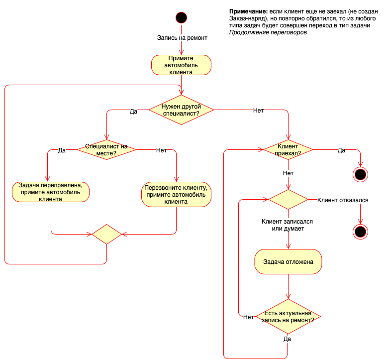

### Примите автомобиль клиента (Приемка автомобиля)

*Приемка автомобиля (Обращение в СТО) — «Примите автомобиль клиента»*

**Варианты инициации:**

Задача создается автоматически в случае записи клиента на ремонт при:

1. исполнении бизнес-процесса «Контакт с клиентом»,
2. при приглашении клиента на ТО.

Все предыдущие задачи по бизнес-процессу после создания Записи на ремонт завершаются.

**Адресация:**

Задача [*адресуется на должность*](../Адресация%20задач%20в%20CRM%20по%20исполнителям/adresaciya-zadach-v-crm-po-ispolnitelyam.md) мастера-консультанта.

**Срок исполнения:**

Срок исполнения задачи равен дате и времени, на которые записан клиент.

**Варианты завершения:**

Когда подошло время записи (время исполнения задачи равно времени записи), откройте задачу на исполнение:

1. Если автомобиль отдали в ремонт, то в задаче необходимо создать документ «Заказ-наряд»:  
   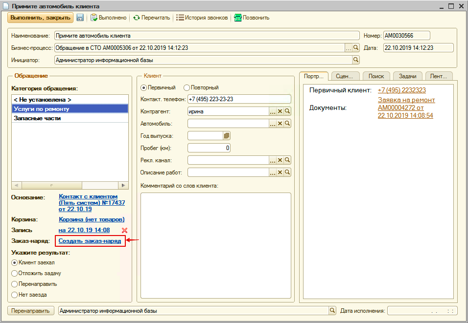  
   В этом случае автоматически установится результат «Клиент заехал» и исполнится задача.
2. Если клиент не приехал (задача станет красной), то созвонитесь с ним и выполните одно из следующих действий:
   - 1\. перенесите время записи - в этом случае создастся новая задача *Задача отложена, примите автомобиль клиента (Задача отложена)* с датой исполнения равной дате записи на ремонт.
   - 2\. выясните причину отказа от ремонта и установите результат обращения «Нет заезда» - в этом случае завершится работа с клиентом.

При переносе времени записи клиентом измените запись на ремонт - в этом случае создастся новая задача *Задача отложена, примите автомобиль клиента (Задача отложена)* с датой исполнения равной дате записи на ремонт.

Для перенаправления задачи другому специалисту см. [*Работа с входящими обращениями → Перенаправление обращения на другого специалиста*](https://5systems.ru/help/rabota-s-vkhodyaschimi-obrascheniyami).

#### Продолжение переговоров, примите автомобиль клиента (Продолжение переговоров)

*Продолжение переговоров (Обращение в СТО) – «Продолжение переговоров, примите автомобиль клиента»*

Задача создается автоматически при повторном обращении клиента, если с клиентом уже ведутся переговоры или есть запись на ремонт, но клиент еще не заехал в СТО (нет Заказ-наряда). Помимо данной задачи создается и автоматически обрабатывается обращение в категории «Продолжение звонка» и бизнес-процессе «Контакт с клиентом» для фиксации факта нового контакта с клиентом.

Обработка задачи «Продолжение переговоров, примите автомобиль клиента (Продолжение переговоров)» аналогична обработке задачи *Примите автомобиль клиента (Приемка автомобиля)*.

#### Задача отложена, примите автомобиль клиента (Задача отложена)

*Задача отложена (Обращение в СТО, приемка) – «Задача отложена, примите автомобиль клиента»*

Задача создается, если клиент записался на ремонт на другое время. Задача обрабатывается по аналогии с задачей *Примите автомобиль клиента (Приемка автомобиля)*.

#### Перезвоните клиенту, примите автомобиль клиента (Перезвонить клиенту)

*Перезвонить клиенту (Обращение в СТО, приемка) – «Перезвоните клиенту, примите автомобиль клиента»*

Задача создается, если задача бизнес-процесса «Обращение в СТО» была перенаправлена на другого специалиста и установлен флажок «Перезвонить клиенту». Задача обрабатывается по аналогии с задачей *Примите автомобиль клиента (Приемка автомобиля)*.

#### Задача перенаправлена, примите автомобиль клиента (Перенаправить задачу на другого пользователя)

*Перенаправить задачу на другого пользователя (Обращение в СТО, приемка) – «Задача перенаправлена, примите автомобиль клиента»*

Задача создается, если задача бизнес-процесса «Обращение в СТО» была перенаправлена на другого специалиста. Задача обрабатывается по аналогии с задачей *Примите автомобиль клиента (Приемка автомобиля)*.

#### Оформите продажу

*Оформите продажу (Обращение в СТО)*

#### Пригласите клиента на ТО

*Пригласите клиента на ТО (Обращение в СТО)*

См. статью [*Приглашения на ТО*](../../CRM/Приглашения%20на%20ТО/priglasheniya-na-to.md).

Формируется на основании авторабот, для которых указано, что они выполняются регулярно в определенный период времени или в зависимости от пробега.

Можно из задачи позвонить клиенту . Проверить в Ленте событий: возможно клиент уже ответил на автоматическое сообщение в WhatsApp с приглашением на ТО (ответ отразится в комментарии в задаче).

Дальнейшие действия – выбрать категорию обращения «Услуги по ремонту», перейти в Корзину, добавить все необходимое и записать на ремонт. Также задача может быть отложена или перенаправлена. При отказе от ТО выбрать результат «Нет заезда» и указать причину из справочника «Причины отказа от обслуживания».

#### Пригласите клиента по рекомендациям

*Пригласите клиента по рекомендациям (Обращение в СТО)*

См. [*Работа с рекомендациями → Приглашение по рекомендациям*](../../Автосервис/Работа%20с%20рекомендациями/rabota-s-rekomendaciyami.md).

Сообщения уходят клиентам через два дня после выполнения Заказ-наряда. Если клиент что-то отвечает на сообщение, сразу выходит задача, в комментарии отражается ответ клиента. Если клиент не отвечает, задача создается на следующий день.

Дальнейшие действия аналогичны задаче «Пригласите клиента на ТО». В Корзину добавляются автоработы, сохраненные в качестве рекомендаций.

#### Создана проценка, продолжите работу

*Создана проценка, продолжите работу (Обращение в СТО)*

**Варианты инициации:**

Задача создается при переходе в Корзину в рамках процесса «Обращение в СТО».

**Адресация:**

Задача адресуется на должность оператора кол-центра, как и исходная для нее задача «Укажите результат обращения».

**Срок исполнения:**

**Варианты завершения:**

Задача отрабатывается автоматически при создании Заявки на ремонт (Корзина при этом автоматически удаляется). Либо можно ее перенаправить на другого специалиста (например, если с Корзиной работает специалист по запчастям, а Запись на ремонт производит мастер-консультант).

### Категория «Запасные части»

## Бизнес-процесс «Продажа запчастей»

### Оформите продажу, укажите результат (Указать результат)

*Указать результат (Продажа запчастей, оформление продажи) – «Оформите продажу, укажите результат»*

**Варианты инициации:**

При проведении документа «Заказ покупателя», не связанного с Заказ-нарядом, автоматически создается задача «Укажите результат продажи». Сделка с клиентом дублируется в виде задачи.

**Адресация:**

Задача адресуется на менеджера, указанного в документе.

**Срок исполнения:**

Срок исполнения равен сроку поставки товара.

**Варианты завершения:**

### Указать результат

*Указать результат (Продажа запчастей, резервирование заказа)*

### Продолжение звонка

*Продолжение звонка (Продажа запчастей)*

### Продолжение переговоров, укажите результат (Продолжение переговоров)

*Продолжение переговоров (Продажа запчастей) – «Продолжение переговоров, укажите результат»*

### Задача отложена, оформите продажу (Задача отложена)

*Задача отложена (Продажа запчастей, оформление продажи) – «Задача отложена, оформите продажу»*

### Задача отложена, зарезервируйте товар (Задача отложена)

*Задача отложена (Продажа запчастей, резервирование заказа) – «Задача отложена, зарезервируйте товар»*

### Перезвоните клиенту, оформите продажу (Перезвонить клиенту)

*Перезвонить клиенту (Продажа запчастей, оформление продажи) – «Перезвоните клиенту, оформите продажу»*

### Перезвоните клиенту, зарезервируйте товар (Перезвонить клиенту)

*Перезвонить клиенту (Продажа запчастей, резервирование заказа) – «Перезвоните клиенту, зарезервируйте товар»*

### Задача перенаправлена, оформите продажу (Перенаправить)

*Перенаправить (Продажа запчастей, оформление продажи) – «Задача перенаправлена, оформите продажу»*

### Задача перенаправлена, установите резерв (Перенаправить)

*Перенаправить (Продажа запчастей, резервирование заказа) – «Задача перенаправлена, установите резерв»*

## Прочие типы задач

### Выполнить опрос по качеству

См. статью [*Опрос клиента о качестве обслуживания*](../../Управление%20качеством%20обслуживания/Опрос%20клиента%20о%20качестве%20обслуживания/opros-klienta-o-kachestve-obsluzhivaniya.md).

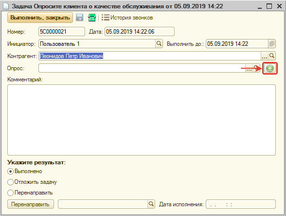

Адресуется на должность «Сотрудник службы контроля качества».

Для исполнения задачи необходимо:

1. Открыть форму задачи.
2. Связаться с клиентом.
3. Создать документ «Опрос».
4. Заполнить анкету ответами клиента и записать изменения.
5. Задачу «Выполнить, закрыть».

### Обработайте жалобу клиента (Зарегистрирована жалоба клиента)

*Зарегистрирована жалоба клиента – «Обработайте жалобу клиента»*

Механизм описан в статье [*Обработка жалоб от клиентов*](../../Управление%20качеством%20обслуживания/Обработка%20жалоб%20от%20клиентов/obrabotka-zhalob-ot-klientov.md).

Жалобы клиента возникают из опроса по качеству при указании причины недовольства клиента, либо создаются сотрудниками вручную.

Задача адресуется сотруднику, который работал с клиентом.

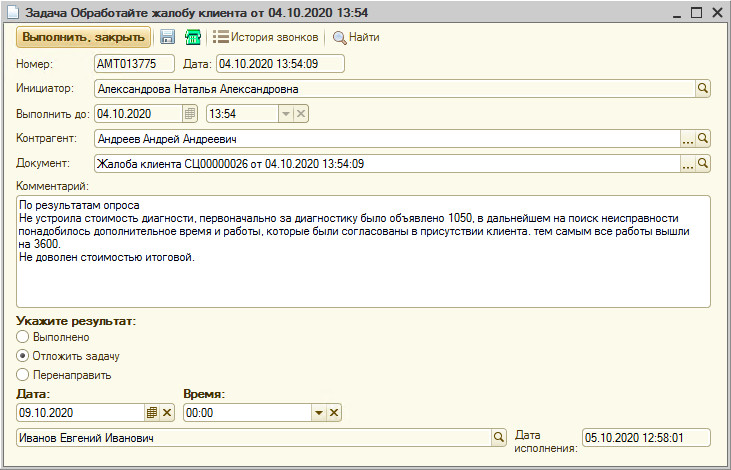

Из задачи необходимо перейти в документ «Жалоба клиента».

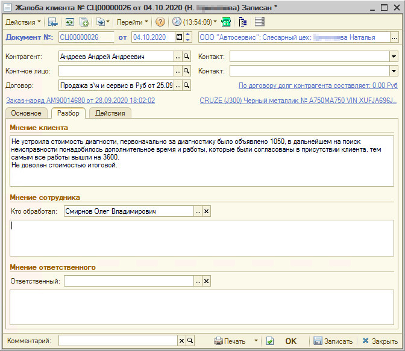

Подгружается суть проблемы.

Вкладка «Разбор», в поле «Мнение сотрудника» ввести свое мнение, во вкладке «Основное» выбрать состояние жалобы «Разобрана», нажать «ОК», задачу «Выполнить, закрыть».

### Дайте объяснительную по нарушению

Если у сотрудника отобразилась такая задача, – значит, на него было создано нарушение. Нарушение создается по результатам постсервисного опроса, на основании жалобы автоматически, либо создается вручную руководителем.

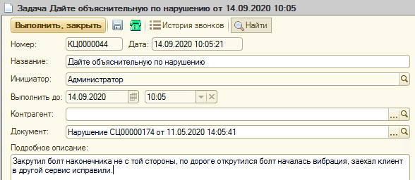

Подробное описание подгружается, если оно заполнено в нарушении. Нажатием на лупу  перейти в документ «Нарушение».

[ 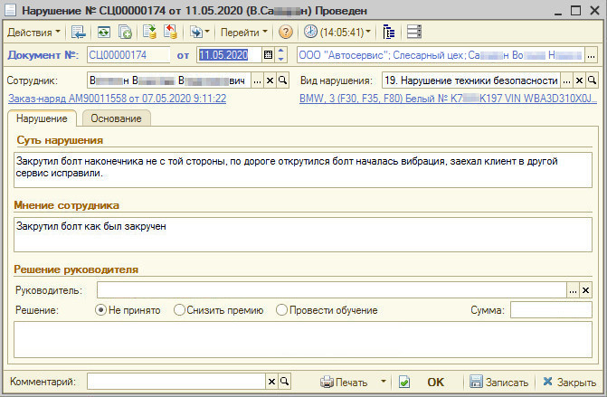](https://wiki.5-systems.ru/w/index.php/%D0%A4%D0%B0%D0%B9%D0%BB:%D0%9D%D0%B0%D1%80%D1%83%D1%88%D0%B5%D0%BD%D0%B8%D0%B51.jpg)

Заполнить свое мнение в поле «Мнение сотрудника», записать нарушение, в задаче заполнить Результат. Можно отложить задачу.

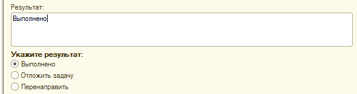

Нажать «Выполнить, закрыть»  .

### Подберите запчасти

См. статью [Задача на подбор запчастей](../../Склад%20и%20запчасти/Задача%20на%20подбор%20запчастей/zadacha-na-podbor-zapchastey.md).

На основании Заказ-наряда можно создать Задачу по подбору запчастей на специалиста по подбору запчастей.

Данная функция нужна, когда в процессе ремонта есть необходимость установить новые запчасти на автомобиль, а подбором запчастей занимаются отдельные специалисты, или подбор запчастей осуществляется перед заездом автомобиля.

Также задача создается автоматически, когда мастер в АРМ «Запись на ремонт» записывает клиента и указывает, что к подобранной автоработе требуются запчасти.

Обработка задачи происходит через CRM модуль с использованием инструмента «АРМ Корзина».

Для исполнения задачи специалист по запчастям должен:

1. Открыть задачу.
2. Перейти в Корзину, нажав на кнопку-ссылку «Нет товаров».
3. Подобрать товары в Корзине и сохранить изменения.
4. Добавить товары, подобранные в Корзине, в документ-основание задачи (Заказ-наряд или Заявка на ремонт).
5. Закрыть Корзину.
6. Вернуться к задаче и выполнить ее.

### Произвольная задача

Можно создать произвольную задачу на любого сотрудника, например, создать поручение по определенному документу. Для этого нужно в АРМ Рабочий стол нажать кнопку «Добавить» , написать название задачи, установить пользователя, которому поручается выполнение, по умолчанию ставятся текущие дата и время – можно задать нужный срок выполнения, при необходимости выбираются контрагент/документ (например, заказ-наряд), по которым нужно выполнить эту задачу, и заполняется подробное описание. Нажать «Записать, закрыть».

Для исполнения задачи требуется открыть ее, изучить, провалиться в документ (если есть), написать результат, нажать «Выполнить, закрыть».

*Пример:* Можно создать задачу для своего сменщика при использовании механизма [передачи смен](../../Автосервис/Передача%20смен/peredacha-smen.md).

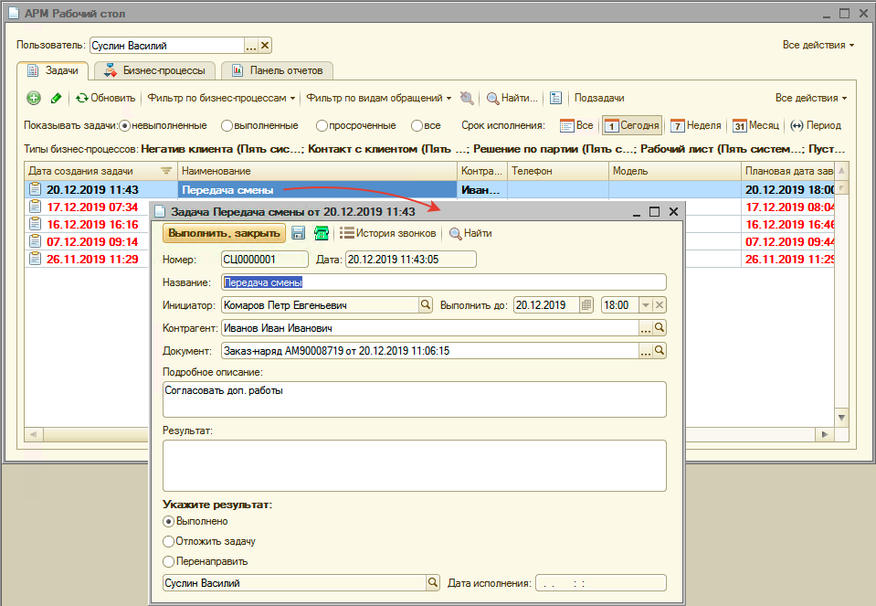

## Задачи Робота регламентных операций

### Товары не поставлены вовремя, согласуйте новые сроки

См. [*Информирование клиента о состоянии заказа покупателя → Товары не поставлены вовремя, согласуйте новые сроки*](../../Работа%20с%20клиентами/Информирование%20клиента%20о%20состоянии%20заказа%20покупателя/informirovanie-klienta-o-sostoyanii-zakaza-pokupatelya.md).

Когда запчасть не поступает вовремя (срок поставки в Заказе покупателя), формируется задача «Товары не поставлены вовремя, согласуйте новые сроки поставки». Для исполнения задачи необходимо: согласовать с поставщиком новый срок поставки (установить в Заказе покупателя), предупредить клиента  , указать новые сроки в записи на ремонт.

### Все товары в наличии, пригласите клиента

См. [*Информирование клиента о состоянии заказа покупателя → Все товары в наличии пригласите клиента*](../../Работа%20с%20клиентами/Информирование%20клиента%20о%20состоянии%20заказа%20покупателя/informirovanie-klienta-o-sostoyanii-zakaza-pokupatelya.md).

Создается, когда все товары, которые были в Заказе покупателя, поступили на склад, - если не записали клиента, а ждали поступления запчастей, чтобы его записать (если Бизнес-процесс построен таким образом). Из задачи можно сразу позвонить клиенту  и согласовать время записи. Если запись уже оформлена, и приглашение не требуется, задача создается для контроля, чтобы знать, что запчасти поступили и все готово к ремонту. Можно ввести результат «ок» и нажать «Выполнить, закрыть».

### Товары заказа есть на складе, установите резерв

См. [*Информирование клиента о состоянии заказа покупателя → Товары заказа есть на складе, установите резерв*](../../Работа%20с%20клиентами/Информирование%20клиента%20о%20состоянии%20заказа%20покупателя/informirovanie-klienta-o-sostoyanii-zakaza-pokupatelya.md).

Когда заказанная для клиента запчасть поступает вовремя, создается задача «Товары заказа есть на складе, установите резерв» (носит информационный характер: резерв формируется автоматически). Для исполнения задачи требуется: убедиться, что товары есть на складе, в результате указать «ок», нажать «Выполнить, закрыть».

---

**Теги:** задачи, типы задач, исполнители, напоминания, crm

