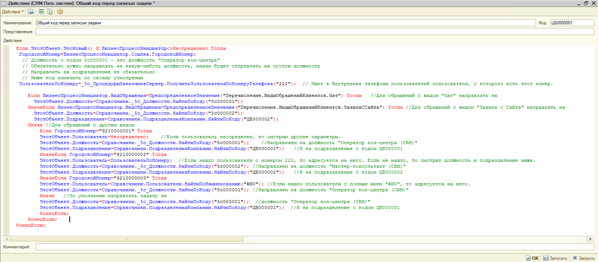

# Тонкая настройка адресации задач в CRM

<table><tr><td><b>Время чтения:</b> 7 мин.</td><td><b>Обновлено:</b> 15.06.2022</td></tr></table>

Источник: https://www.5systems.ru/help/tonkaya-nastroyka-adresacii-zadach-v-crm

## Содержание

1. [Введение](#введение)
2. [Использование](#использование)

## Введение

В программе 5S AUTO реализован механизм тонкой настройки адресации задач.

Типовой адресации в большинстве случаев достаточно, поэтому не следует использовать данную настройку без крайней необходимости

## Использование

Данный механизм работает на следующие задачи:

- Первичное обращение;
- Продолжение переговоров;
- Продолжение переговоров по обращению в автосервис.

В справочник *CRM → Все операции → Справочники → Действия* добавляется действие с наименованием *"Общий код перед записью задачи"*.

В это действие можно прописать адресацию задач по признакам:

1. По виду обращения;
2. По внутренним номерам;
3. По источнику;
4. По городским номерам.

На скриншоте ниже представлен пример, в котором задействованы самые распространенные случаи. Можно использовать их не все, а только самое необходимое.

Код для добавления в Действие:

<table><tr><td>Если ЭтотОбъект.ЭтоНовый() &nbsp;&nbsp;&nbsp;&nbsp;&nbsp;И БизнесПроцессИнициатор&lt;&gt;Неопределено Тогда &nbsp;&nbsp;ГородскойНомер=БизнесПроцессИнициатор.Ссылка.ГородскойНомер; &nbsp;&nbsp;ПользовательПоНомеру=_5с_ПроцедурыЗаказчикаСервер.ПолучитьПользователяПоНомеруТелефона("222"); &nbsp;Если БизнесПроцессИнициатор.ВидОбращения=ПредопределенноеЗначение("Перечисление.ВидыОбращенийКлиентов.Чат") Тогда &nbsp;&nbsp;&nbsp;ЭтотОбъект.Должность=Справочники._5с_Должности.НайтиПоКоду("5с000001"); &nbsp;ИначеЕсли БизнесПроцессИнициатор.ВидОбращения=ПредопределенноеЗначение("Перечисление.ВидыОбращенийКлиентов.ЗаявкаССайта") Тогда &nbsp;&nbsp;&nbsp;&nbsp;&nbsp;&nbsp;ЭтотОбъект.Должность=Справочники._5с_Должности.НайтиПоКоду("5с000002"); &nbsp;&nbsp;&nbsp;&nbsp;&nbsp;&nbsp;ЭтотОбъект.Подразделение=Справочники.ПодразделенияКомпании.НайтиПоКоду("ЦБ000002"); &nbsp;Иначе &nbsp;&nbsp;&nbsp;&nbsp;Если ГородскойНомер="9210000001" Тогда &nbsp;&nbsp;&nbsp;&nbsp;&nbsp;&nbsp;ЭтотОбъект.Пользователь=Неопределено; &nbsp;&nbsp;&nbsp;&nbsp;&nbsp;&nbsp;ЭтотОбъект.Должность=Справочники._5с_Должности.НайтиПоКоду("5с000001"); &nbsp;&nbsp;&nbsp;&nbsp;&nbsp;&nbsp;ЭтотОбъект.Подразделение=Справочники.ПодразделенияКомпании.НайтиПоКоду("ЦБ000001"); &nbsp;&nbsp;&nbsp;&nbsp;ИначеЕсли ГородскойНомер="9210000002" Тогда &nbsp;&nbsp;&nbsp;&nbsp;&nbsp;&nbsp;ЭтотОбъект.Пользователь=ПользовательПоНомеру; &nbsp;&nbsp;&nbsp;&nbsp;&nbsp;&nbsp;ЭтотОбъект.Должность=Справочники._5с_Должности.НайтиПоКоду("5с000002"); &nbsp;&nbsp;&nbsp;&nbsp;&nbsp;&nbsp;ЭтотОбъект.Подразделение=Справочники.ПодразделенияКомпании.НайтиПоКоду("ЦБ000002"); &nbsp;&nbsp;&nbsp;&nbsp;ИначеЕсли ГородскойНомер="9210000003" Тогда &nbsp;&nbsp;&nbsp;&nbsp;&nbsp;&nbsp;ЭтотОбъект.Пользователь=Справочники.Пользователи.НайтиПоНаименованию("ФИО"); &nbsp;&nbsp;&nbsp;&nbsp;&nbsp;&nbsp;ЭтотОбъект.Должность=Справочники._5с_Должности.НайтиПоКоду("5с000001"); &nbsp;&nbsp;&nbsp;&nbsp;Иначе &nbsp;&nbsp;&nbsp;&nbsp;&nbsp;&nbsp;ЭтотОбъект.Должность=Справочники._5с_Должности.НайтиПоКоду("5с000001"); &nbsp;&nbsp;&nbsp;&nbsp;&nbsp;&nbsp;ЭтотОбъект.Подразделение=Справочники.ПодразделенияКомпании.НайтиПоКоду("ЦБ000001"); &nbsp;&nbsp;&nbsp;&nbsp;КонецЕсли; &nbsp;&nbsp;КонецЕсли; &nbsp;&nbsp; КонецЕсли;</td></tr></table>

---

**Теги:** задачи, адресация задач, тонкая настройка, CRM, правила, исполнители

