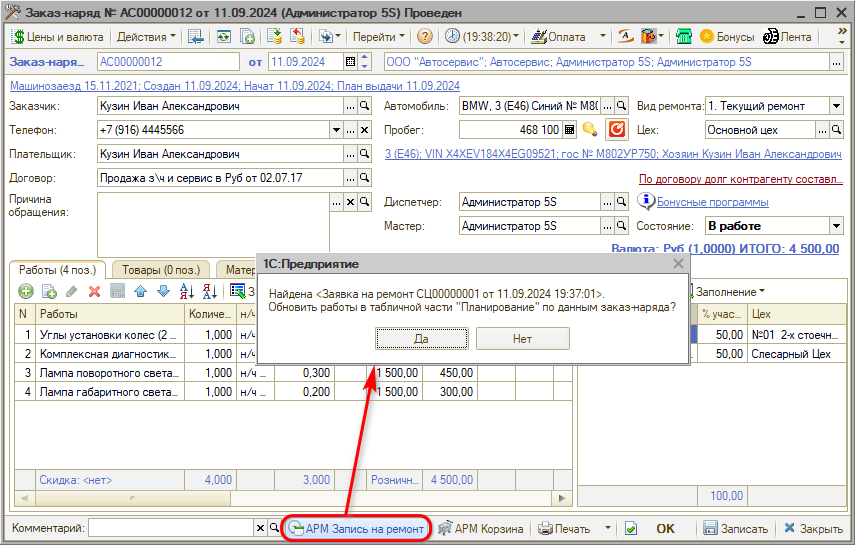
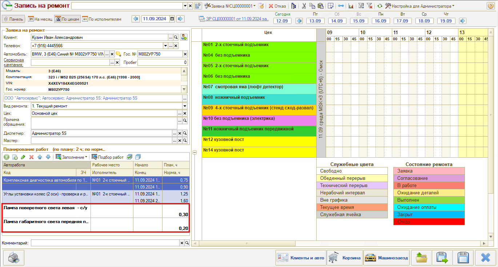
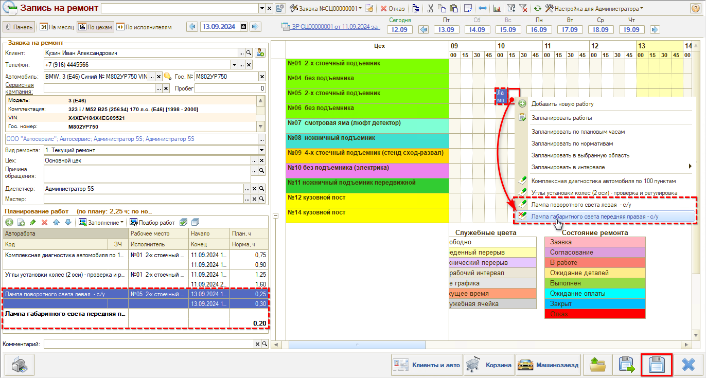

# Как записать клиента из Заказ-наряда

<table><tr><td><b>Время чтения:</b> 2 мин.</td><td><b>Обновлено:</b> 01.09.2026</td></tr></table>

Источник: https://www.5systems.ru/help/kak-zapisat-klienta-iz-zakaz-naryada

Время просмотра — 0:44 мин.

Есть возможность добавить дополнительные работы в планировщик при наличии уже созданного Заказ-наряда. Например, в случае если во время диагностики автомобиля выявлена неисправность, и требуется повторно записать клиента.

Для перехода в планировщик следует нажать в заказ-наряде кнопку **«АРМ Запись на ремонт»**, и в сообщении программы «Обновить работы в табличной части "Планирование" по данным заказ-наряда?» выбрать вариант **«Да»**:

Новые работы добавляются в таблицу **«Планирование работ»**:

Необходимо запланировать дату и время, выбрать пост, произвести запись и сохранить изменения:

---

**Теги:** запись на ремонт, заказ-наряд, планирование работ, диагностика

