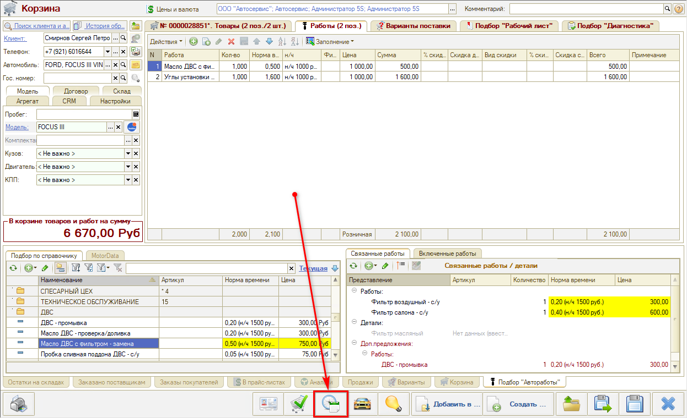
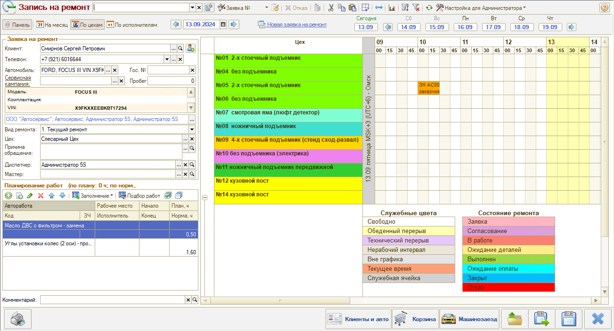
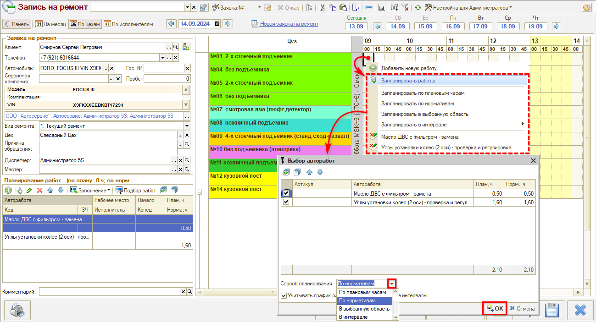
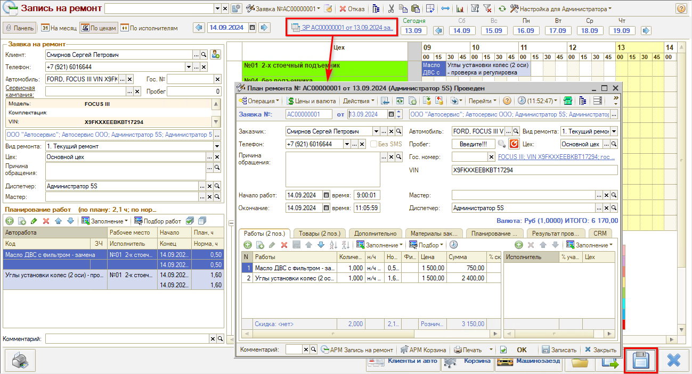

# Как записать клиента из Корзины

<table><tr><td><b>Время чтения:</b> 2 мин.</td><td><b>Обновлено:</b> 01.09.2026</td></tr></table>

Источник: https://www.5systems.ru/help/kak-zapisat-klienta-iz-korziny

Время просмотра — 1:05 мин.

После подбора товаров и работ в [Корзине](../../Проценка%20запчастей%20и%20работ/Работа%20в%20АРМ%20Корзина/rabota-v-arm-korzina.md) можно записывать клиента на ремонт. Перейти в АРМ «Запись на ремонт» прямо из Корзины можно по специальной кнопке:

Следует подтвердить создание заявки и копирование работ — нажать **«Да»** во всплывающих окнах.

Открывается АРМ «Запись на ремонт» в контексте Корзины — подгружаются данные по клиенту и автомобилю и параметры заявки — вид ремонта, цех, причина обращения и др., подобранные в Корзине автоработы автоматически подтягиваются в таблицу **«Планирование работ»**:

Далее необходимо выбрать день, пост и время и запланировать работы, также можно выбрать способ планирования:

Заявку на ремонт следует сохранить. Работы и товары записались в документ Заявка на ремонт:

---

**Теги:** запись на ремонт, корзина, заявка на ремонт, планирование работ, автоработы

